# 📚 Azure Data Engineering Q&A  Synapse + ADLS + Data Factory  Full Reference

```mermaid
flowchart LR
    %% ===== Styles =====
    classDef src fill:#d0f0fd,stroke:#007acc,stroke-width:2px,color:#000,font-weight:bold
    classDef lake fill:#fde2d0,stroke:#cc5200,stroke-width:2px,color:#000,font-weight:bold
    classDef etl fill:#e6d0fd,stroke:#7e3ff2,stroke-width:2px,color:#000,font-weight:bold
    classDef wh fill:#fff3bf,stroke:#d48806,stroke-width:2px,color:#000,font-weight:bold
    classDef srv fill:#d9f7be,stroke:#389e0d,stroke-width:2px,color:#000,font-weight:bold

    %% ===== Layers =====
    subgraph Source["📥 Data Sources"]
        DB[SQL Server or MySQL]:::src
        CSV[ADLS CSV or Parquet Files]:::src
    end

    subgraph Lake["🪣 Data Lake ADLS Gen2"]
        RAW[Raw Zone]:::lake
        STG[Staging Zone]:::lake
        CUR[Curated Zone]:::lake
    end

    subgraph ETL["⚙️ Processing"]
        ADF[Azure Data Factory and Synapse Pipelines]:::etl
        DBX[Azure Databricks Batch Spark]:::etl
        SVS[Synapse Serverless SQL on ADLS]:::etl
    end

    subgraph Warehouse["🏛️ Synapse Dedicated SQL Pool"]
        FACT[Fact Orders]:::wh
        DIMC[Dim Customers]:::wh
        DIMP[Dim Products]:::wh
        AGG[Sales Aggregates]:::wh
    end

    subgraph Serving["📊 Analytics"]
        PBI[Power BI]:::srv
    end

    %% ===== Flows =====
    DB --> RAW
    CSV --> RAW
    RAW --> ADF --> STG
    STG --> DBX --> CUR
    CUR --> SVS
    CUR --> FACT
    CUR --> DIMC
    CUR --> DIMP
    FACT --> AGG
    FACT --> PBI
    DIMC --> PBI
    AGG --> PBI
```

* [1. Synapse Analytics  Core Data Warehouse ](#1-synapse-analytics--core-data-warehouse-)

  * [Q1. What is Synapse](#q1-what-is-synapse)
  * [Q2. Synapse Architecture](#q2-synapse-architecture)
  * [Q3. Distribution and Partitioning](#q3-distribution-and-partitioning)
  * [Q4. Compute and DWU Scaling](#q4-compute-and-dwu-scaling)
  * [Q5. Serverless SQL vs Dedicated SQL](#q5-serverless-sql-vs-dedicated-sql)
  * [Q6. External vs Native Tables](#q6-external-vs-native-tables)
  * [Q7. Result Set Cache and Materialized Views](#q7-result-set-cache-and-materialized-views)
  * [Q8. Query Optimization](#q8-query-optimization)
  * [Q9. Common Pitfalls](#q9-common-pitfalls)
  * [Q10. Synapse vs BigQuery one liners](#q10-synapse-vs-bigquery-one-liners)

* [2. Cost and Security](#2-cost-and-security)

  * [Q11. Pricing Models](#q11-pricing-models)
  * [Q12. Cost Saving Patterns](#q12-cost-saving-patterns)
  * [Q13. Security and Networking](#q13-security-and-networking)

* [3. Data Modeling and ETL](#3-data-modeling-and-etl)

  * [Q14. Star Schema and Naming](#q14-star-schema-and-naming)
  * [Q15. Slowly Changing Dimensions](#q15-slowly-changing-dimensions)
  * [Q16. Schema Evolution](#q16-schema-evolution)
  * [Q17. Batch Loading Patterns](#q17-batch-loading-patterns)

* [4. Data Factory and Databricks  ETL Layer ](#4-data-factory-and-databricks--etl-layer-)

  * [Q18. What is Data Factory](#q18-what-is-data-factory)
  * [Q19. ADF vs Databricks](#q19-adf-vs-databricks)
  * [Q20. Mapping Data Flows](#q20-mapping-data-flows)
  * [Q21. Orchestration and Monitoring](#q21-orchestration-and-monitoring)
  * [Q22. Performance and Cost Tuning](#q22-performance-and-cost-tuning)
  * [Q23. Pitfalls](#q23-pitfalls)

* [5. Integration and Real time  brief ](#5-integration-and-real-time--brief-)

  * [Q24. Event Hubs Basics](#q24-event-hubs-basics)
  * [Q25. Event Hubs to Databricks to Synapse](#q25-event-hubs-to-databricks-to-synapse)
  * [Q26. Batch ETL Blueprint ADLS to Synapse](#q26-batch-etl-blueprint-adls-to-synapse)
  * [Q27. Migration from Hadoop](#q27-migration-from-hadoop)
  * [Q28. E commerce Analytics reference](#q28-e-commerce-analytics-reference)

* [6. Purview and Governance](#6-purview-and-governance)

  * [Q29. What is Microsoft Purview](#q29-what-is-microsoft-purview)
  * [Q30. Catalog Lineage Policies](#q30-catalog-lineage-policies)

* [✅ Final Summary](#-final-summary)

## 🎯 Goal

For a **Data Engineer role focusing on Azure Data Warehouse and ETL**.

* Deep focus on **<mark>Synapse Analytics</mark>** core warehouse
* Solid understanding of **<mark>ADLS Gen2</mark>**, **<mark>Data Factory</mark>**, **<mark>Azure Databricks</mark>**
* Cover **Batch ETL pipelines** and essential **real time ingestion** briefly

## 1. Synapse Analytics  Core Data Warehouse

### Q1. What is Synapse

* **Azure Synapse Analytics** is a **<mark>cloud MPP data warehouse</mark>** that unifies **<mark>Dedicated SQL</mark>** compute, **<mark>Serverless SQL</mark>** on lake, and **<mark>Spark</mark>** with built in **<mark>orchestration</mark>** and **<mark>security</mark>**.

### Q2. Synapse Architecture

* **Storage**: **<mark>ADLS Gen2</mark>** lake with **parquet orc delta**.
* **Compute**: **<mark>Dedicated SQL pool</mark>** MPP for warehousing, **<mark>Serverless SQL</mark>** for on demand queries on lake, **<mark>Spark</mark>** for transforms.
* **Integration**: **<mark>Synapse Pipelines</mark>** same engine as ADF, **<mark>Linked Services</mark>**.
* **Serving**: **<mark>Power BI</mark>** tight integration.

### Q3. Distribution and Partitioning

* **Distribution** spreads rows across MPP nodes: **<mark>Hash</mark>**, **<mark>Round robin</mark>**, **<mark>Replicated</mark>**.
* **Partitioning** splits a table by a logical column such as **<mark>date</mark>** or **<mark>int range</mark>**.

### Q4. Compute and DWU Scaling

* **<mark>DWU</mark>** controls dedicated pool compute. Scale **up** for heavy loads, **down** after. **Pause** to stop charges.

### Q5. Serverless SQL vs Dedicated SQL

* **Serverless SQL**: **<mark>pay per TB scanned</mark>** on ADLS data, great for ad hoc and ELT on lake.
* **Dedicated SQL**: **<mark>provisioned MPP</mark>** best for steady workloads and BI serving.

### Q6. External vs Native Tables

* **External** on ADLS via serverless or dedicated with external objects. Flexible, cheaper scans, slower joins.
* **Native** in dedicated pool columnstore. Fastest for star schema joins and aggregates.

### Q7. Result Set Cache and Materialized Views

* **Result cache** accelerates repeated queries until data changes.
* **Materialized view** pre computes aggregations with automatic refresh.

### Q8. Query Optimization

* Choose **<mark>hash distribution</mark>** on join key for big facts.
* **<mark>Replicate</mark>** small dimensions to avoid data movement.
* Filter by **<mark>partition</mark>** column. Avoid `SELECT *`. Keep columns narrow.

### Q9. Common Pitfalls

* Round robin for large fact leads to **data movement**.
* Skewed hash key leads to **long tails**.
* No partition filter leads to **high cost** and slow scans.

### Q10. Synapse vs BigQuery one liners

* **Synapse** = **<mark>DWU based MPP</mark>** with **<mark>distribution choices</mark>** and tight **<mark>Power BI</mark>**.
* **BigQuery** = **<mark>serverless</mark>** slots with **<mark>partition and clustering</mark>**.

## 2. Cost and Security

### Q11. Pricing Models

* **Dedicated SQL**: **<mark>DWU hours</mark>**. Can **pause**.
* **Serverless SQL**: **<mark>per TB scanned</mark>**.
* **ADLS storage**: hot cool archive tiers.

### Q12. Cost Saving Patterns

* Pause dedicated pools when idle.
* Store data in **<mark>parquet</mark>** and query via **<mark>serverless</mark>** for ad hoc.
* Partition big tables. Avoid wide scans. Track with **<mark>Cost Management</mark>**.

### Q13. Security and Networking

* **<mark>Azure AD</mark>** auth, **<mark>RBAC</mark>**, **<mark>SQL permissions</mark>**.
* **<mark>Private Endpoints</mark>**, **<mark>Managed VNET</mark>**, **<mark>Firewall rules</mark>**.
* **<mark>TDE</mark>** at rest, **<mark>CMEK</mark>** with Key Vault, **<mark>Column level security</mark>**, **<mark>Row level security</mark>**.
* **<mark>Purview</mark>** for catalog and lineage.

## 3. Data Modeling and ETL

### Q14. Star Schema and Naming

* **Fact** tables hold events at lowest grain.
* **Dimension** tables hold descriptive attributes.
* Naming example: `dw.fact_orders`, `dw.dim_customers`, `dw.dim_products`.

### Q15. Slowly Changing Dimensions

* **Type 1** overwrite columns.
* **Type 2** add a new row with `valid_from  valid_to  is_current`.
* **Type 3** add a new column to track previous value.

### Q16. Schema Evolution

* Prefer **<mark>parquet</mark>** in lake. Additive changes are easy. For breaking changes create new table plus view.

### Q17. Batch Loading Patterns

* **ADF Copy** from sources to ADLS.
* Curate with **Databricks Spark** or **Serverless SQL**.
* Load to **Dedicated SQL** with `COPY INTO` or PolyBase pattern.

## 4. Data Factory and Databricks  ETL Layer

### Q18. What is Data Factory

* **ADF** is **<mark>managed orchestration</mark>** with **<mark>Copy Activity</mark>** and **<mark>Mapping Data Flows</mark>** on serverless Spark.

### Q19. ADF vs Databricks

* **ADF** low code for movement and simple transforms.
* **Databricks** code first **<mark>Spark</mark>** for heavy ETL and Delta Lake medallion.

### Q20. Mapping Data Flows

* Drag and drop joins, derive, aggregate. Runs on managed Spark behind the scenes.

### Q21. Orchestration and Monitoring

* Pipelines with triggers schedule and event.
* Integration Runtimes for network and compute.
* Monitor with ADF Monitor and Azure Monitor logs.

### Q22. Performance and Cost Tuning

* Partitioned reads and writes. Leverage parquet. Use staged copy and temp storage. Right size IR and cluster configs.

### Q23. Pitfalls

* Row by row transforms instead of set based.
* No parallelism on large copy jobs.
* Large upserts without partition pruning.

## 5. Integration and Real time  brief

### Q24. Event Hubs Basics

* **Event Hubs** is **<mark>stream ingestion</mark>** similar to Kafka. Producers write to partitions. Consumers read with checkpoints.

### Q25. Event Hubs to Databricks to Synapse

* Real time path: **Event Hubs → Databricks Structured Streaming → Synapse** as micro batch.
* Simpler path: **Event Hubs → Stream Analytics → ADLS or Synapse**.

### Q26. Batch ETL Blueprint ADLS to Synapse

### Q27. Migration from Hadoop

* HDFS to **ADLS**. Hive and Spark to **Databricks**. Impala and Presto workloads to **Synapse or Serverless**. Re point BI to **Power BI**.

### Q28. E commerce Analytics reference

* **Fact Orders** hash by `customer_id`. **Dim Customers** replicated. **Dim Products** replicated.
* **Materialized views** or **CTAS** for sales aggregates. Power BI direct query or import.

## 6. Purview and Governance

### Q29. What is Microsoft Purview

* Unified **<mark>data catalog</mark>** with **<mark>classification</mark>**, **<mark>lineage</mark>**, and **<mark>access policy</mark>** across Azure and beyond.

### Q30. Catalog Lineage Policies

* Scan Synapse and ADLS. Auto classify PII. Capture ADF and Databricks lineage. Enforce column level masking and RBAC policies.

# ✅ Final Summary

* **Synapse Analytics** delivers **<mark>MPP warehousing</mark>** with **<mark>Dedicated SQL</mark>** and **<mark>Serverless SQL</mark>**, integrated with **<mark>ADLS Gen2</mark>** and **<mark>Power BI</mark>**.
* **Data Factory** handles **<mark>orchestration and copy</mark>**, **Mapping Data Flows** for visual Spark transforms.
* **Azure Databricks** provides **<mark>Spark</mark>** heavy transforms and Delta Lake medallion layers.
* **Best practice path**: ADLS **raw → staging → curated**  then Synapse **star schema** with **hash distributed fact** and **replicated dims**. Use **serverless** for ad hoc on lake, **dedicated** for BI.
* **Security and governance** with **<mark>Azure AD</mark>**, **<mark>Private Endpoints</mark>**, **<mark>Key Vault CMEK</mark>**, and **<mark>Purview</mark>** for catalog and lineage.
