# 📚 Azure Data Engineering Q&A (Synapse + ADLS + Data Factory)

* [1. Synapse Analytics (Core Data Warehouse)](#1-synapse-analytics-core-data-warehouse)

  * [Q1. What is Synapse?](#q1-what-is-synapse)
  * [Q2. Synapse Architecture](#q2-synapse-architecture)
  * [Q3. Storage & Data Modeling](#q3-storage--data-modeling)
  * [Q4. Compute & DWU](#q4-compute--dwu)
  * [Q5. Distribution vs Partitioning](#q5-distribution-vs-partitioning)
  * [Q6. Serverless vs Dedicated SQL](#q6-serverless-vs-dedicated-sql)
  * [Q7. Caching & Result-set](#q7-caching--result-set)
  * [Q8. Materialized Views vs CTAS](#q8-materialized-views-vs-ctas)
  * [Q9. Query Optimization Tips](#q9-query-optimization-tips)
  * [Q10. Common Pitfalls](#q10-common-pitfalls)

* [2. Cost & Security](#2-cost--security)

  * [Q11. Pricing Models](#q11-pricing-models)
  * [Q12. Cost-saving Techniques](#q12-cost-saving-techniques)
  * [Q13. Security & Governance](#q13-security--governance)

* [3. Data Modeling & ETL](#3-data-modeling--etl)

  * [Q14. Schema Evolution](#q14-schema-evolution)
  * [Q15. Slowly Changing Dimensions](#q15-slowly-changing-dimensions)
  * [Q16. CDC](#q16-cdc)
  * [Q17. Batch Loading](#q17-batch-loading)

* [4. Data Factory / Databricks (ETL Layer)](#4-data-factory--databricks-etl-layer)

  * [Q18. What is Data Factory?](#q18-what-is-data-factory)
  * [Q19. ADF vs Databricks](#q19-adf-vs-databricks)
  * [Q20. Mapping Data Flows](#q20-mapping-data-flows)
  * [Q21. Orchestration & Monitoring](#q21-orchestration--monitoring)
  * [Q22. Performance & Cost](#q22-performance--cost)
  * [Q23. Common Pitfalls](#q23-common-pitfalls)

* [5. Integration & Real-time (Brief)](#5-integration--real-time-brief)

  * [Q24. Event Hubs Basics](#q24-event-hubs-basics)
  * [Q25. Event Hubs → ADF/Databricks → Synapse](#q25-event-hubs--adfdatabricks--synapse)
  * [Q26. Batch ETL Pipeline (ADLS → Synapse)](#q26-batch-etl-pipeline-adls--synapse)
  * [Q27. Migration from Hadoop](#q27-migration-from-hadoop)
  * [Q28. E-commerce Analytics](#q28-e-commerce-analytics)

* [6. Purview & Data Governance](#6-purview--data-governance)

  * [Q29. What is Microsoft Purview?](#q29-what-is-microsoft-purview)
  * [Q30. Catalog, Lineage, Policies](#q30-catalog-lineage-policies)

* [✅ Final Summary](#-final-summary)

---

## 🎯 Goal

For a **Data Engineer role focusing on Azure Data Warehouse & ETL**.

* Deep focus on **<mark>Synapse Analytics</mark>** (core warehouse)
* Solid understanding of **<mark>ETL with Data Factory</mark>** and **<mark>Azure Databricks</mark>**
* Cover **Batch ETL Pipelines & Integration Scenarios** with **<mark>ADLS</mark>** and **<mark>Power BI</mark>**

---

## 1. Synapse Analytics (Core Data Warehouse)

### Q1. What is Synapse?

```mermaid
flowchart TB
    classDef storage fill:#eaf4ff,stroke:#2980b9,stroke-width:1.5px,color:#000
    classDef compute fill:#f0fff0,stroke:#27ae60,stroke-width:1.5px,color:#000
    classDef dwu fill:#fff0f6,stroke:#c2185b,stroke-width:1.5px,color:#000
    classDef cache fill:#fdf5e6,stroke:#8e44ad,stroke-width:1.5px,color:#000

    subgraph SYN["🏛️ Synapse Analytics"]
      S[💾 Storage<br/>ADLS Gen2 + Columnar]:::storage
      C[⚡ Compute<br/>MPP SQL + Spark]:::compute
      D[📐 DWU / cDWU<br/>Scale up/down]:::dwu
      R[🧠 Caching & Result-set]:::cache
      S --- C
      C --- D
      D --- R
    end
```

* **Azure Synapse Analytics** is Microsoft’s **<mark>cloud data warehouse</mark>** combining **<mark>SQL MPP</mark>**, **<mark>Spark</mark>**, and **<mark>Data Explorer</mark>** with integrated **<mark>orchestration</mark>** and **<mark>security</mark>**.

✅ Synapse vs Hive vs SparkSQL

| Feature    | Synapse (Dedicated SQL)           | Hive               | SparkSQL              |
| ---------- | --------------------------------- | ------------------ | --------------------- |
| Type       | Managed **<mark>MPP DW</mark>**   | Hadoop SQL Engine  | Distributed SQL       |
| Storage    | Columnar on **<mark>ADLS</mark>** | HDFS               | HDFS/S3/ADLS          |
| Latency    | Fast                              | Slow               | Fast                  |
| Deployment | Fully managed                     | Self-hosted Hadoop | Self-hosted Spark/DBX |

### Q2. Synapse Architecture

* **Storage**: **<mark>ADLS Gen2</mark>** (lake) with parquet/orc.
* **Compute**: **<mark>Dedicated SQL pool</mark>** (MPP), **<mark>Serverless SQL</mark>** (on-demand), **<mark>Spark</mark>**.
* **Integration**: **<mark>Synapse Pipelines</mark>** (ADF engine), **<mark>Linked Services</mark>**.
* **Serving**: **<mark>Power BI</mark>** integration.

### Q3. Storage & Data Modeling

* **Partitioning**: **<mark>partitioned parquet</mark>** in ADLS; table partitioning by **date/int** in Dedicated SQL.
* **Distribution** (table-level): **<mark>Hash</mark>**, **<mark>Round-robin</mark>**, **<mark>Replicated</mark>**.
* **Schema**: **<mark>Star schema</mark>** (fact + dimension) recommended.

### Q4. Compute & DWU

* **DWU (Data Warehouse Unit)** controls **<mark>compute</mark>**; scale **up/down** for performance/cost.
* **Pause/Resume** Dedicated SQL pool to save cost.

### Q5. Distribution vs Partitioning

* **Distribution** = how rows are spread across MPP nodes (**<mark>Hash/Round-robin/Replicated</mark>**).
* **Partitioning** = logical splits within a table (e.g., **<mark>date</mark>**).
* Best practice: **hash-distribute** large fact by **join key**; **replicate** small dims.

### Q6. Serverless vs Dedicated SQL

* **Serverless SQL**: **<mark>pay-per-TB</mark>** scanned, queries external data on ADLS.
* **Dedicated SQL**: **<mark>provisioned MPP</mark>** with DWUs; best for **consistent, heavy** workloads.

### Q7. Caching & Result-set

* **Result-set cache** & **materialized views** can speed up repeated queries.
* **Result cache** is invalidated on data changes.

### Q8. Materialized Views vs CTAS

* **Materialized view**: precomputed, auto maintenance; great for **frequent aggregates**.
* **CTAS** (`CREATE TABLE AS SELECT`): snapshot tables for **ELT** steps & performance isolation.

### Q9. Query Optimization Tips

* Choose correct **<mark>distribution</mark>**.
* Use **<mark>partition elimination</mark>** by filtering on partition columns.
* Avoid `SELECT *`; use **<mark>Columnstore</mark>**-friendly patterns.
* Analyze plans; fix **data skew**.

### Q10. Common Pitfalls

* Using **round-robin** for large facts → **data movement** on joins.
* Not filtering partitions → **high cost/slow**.
* Skewed hash keys → **long tails**.

---

## 2. Cost & Security

### Q11. Pricing Models

* **Dedicated SQL**: pay per **<mark>DWU-hours</mark>**; **pause** to stop charges.
* **Serverless SQL**: pay per **<mark>TB scanned</mark>**.
* **Storage**: ADLS **hot/cool/archive** tiers.

### Q12. Cost-saving Techniques

* **Pause** dedicated pools when idle.
* Push **ELT** to serverless on ADLS for ad-hoc.
* Use **partitioned parquet**; avoid wide scans.
* Monitor with **<mark>Azure Monitor</mark>** / **<mark>Cost Management</mark>**.

### Q13. Security & Governance

* **<mark>Azure AD</mark>** auth, **<mark>RBAC</mark>** at resource level, **<mark>SQL permissions</mark>** inside Synapse.
* **<mark>Managed VNET</mark>**, **<mark>Private Endpoints</mark>**.
* **<mark>TDE</mark>** (Transparent Data Encryption), **<mark>CMEK</mark>** via Key Vault.
* **<mark>Microsoft Purview</mark>** for catalog, classification, lineage.

---

## 3. Data Modeling & ETL

### Q14. Schema Evolution

* Append-friendly formats (**parquet**).
* Changes via **new tables + views** to preserve contracts.

### Q15. Slowly Changing Dimensions

* **Type 1** overwrite; **Type 2** add row with `valid_from/valid_to`; **Type 3** new column.
* Implement via **Synapse SQL** or **Databricks**.

### Q16. CDC

* **Azure Data Factory** + **Change Tracking/Change Data Capture** from SQL/Oracle.
* Write deltas to **ADLS parquet**; merge into **Synapse**.

### Q17. Batch Loading

* **Copy Activity** (ADF) → ADLS parquet → **PolyBase/Copy into** to Synapse.
* Prefer **parquet** for compression & schema.

---

## 4. Data Factory / Databricks (ETL Layer)

### Q18. What is Data Factory?

* **Azure Data Factory** = **<mark>managed orchestration</mark>** with **<mark>Copy Activity</mark>** and **<mark>Mapping Data Flows</mark>** (visual Spark).

### Q19. ADF vs Databricks

* **ADF**: low-code **<mark>orchestration + data movement</mark>**, simple transforms.
* **Databricks**: code-first **<mark>Spark</mark>** for heavy transforms, Delta Lake, notebooks.

### Q20. Mapping Data Flows

* Serverless Spark under the hood; drag-and-drop joins, derive, aggregate.
* Good for teams without deep Spark skills.

### Q21. Orchestration & Monitoring

* **Pipelines**, **Triggers** (schedule/event), **Integration Runtimes**.
* Monitor with **<mark>ADF Monitor</mark>** and **<mark>Azure Monitor</mark>** logs.

### Q22. Performance & Cost

* Right-size **IR**; use **staged copy** to **<mark>blob staging</mark>**.
* Partitioned reads/writes; batch in **parquet**.

### Q23. Common Pitfalls

* Overusing row-by-row transforms instead of **set-based**.
* Not leveraging **parallelism**/partitions.
* Large upserts without **partition pruning**.

---

## 5. Integration & Real-time (Brief)

### Q24. Event Hubs Basics

* **Azure Event Hubs** = **<mark>stream ingestion</mark>** (Kafka-like).
* Producers → **Partitions** → Consumers (Databricks/Stream Analytics).

### Q25. Event Hubs → ADF/Databricks → Synapse

* Real-time: **Event Hubs → Databricks Structured Streaming → Synapse** (micro-batch).
* Or **Event Hubs → Stream Analytics → Synapse/ADLS** (simpler SQL).

### Q26. Batch ETL Pipeline (ADLS → Synapse)

* **Source**: ADLS **raw** CSV/parquet.
* **Process**: ADF Copy / Data Flows / Databricks to **staging/curated**.
* **Load**: `COPY INTO` / PolyBase to **Synapse** star schema → **Power BI**.

### Q27. Migration from Hadoop

* **HDFS → ADLS**; **Hive/Spark → Databricks**; **Impala/Presto → Synapse/Serverless**; BI → **Power BI**.

### Q28. E-commerce Analytics

* **Fact\_Orders** (hash by `customer_id`), **Dim\_Customers** (replicated), **Dim\_Products** (replicated).
* **Aggregations** with **materialized views** or **CTAS**; **Power BI** direct query/import.

---

## 6. Purview & Data Governance

### Q29. What is Microsoft Purview?

* Unified **<mark>data catalog</mark>**, **<mark>classification</mark>**, **<mark>lineage</mark>**, **<mark>policy</mark>** for Azure & beyond.

### Q30. Catalog, Lineage, Policies

* **Scan** Synapse/ADLS/SQL; **classify PII**; **lineage** from ADF pipelines; enforce **access policies**.

---

# ✅ Final Summary

* **Synapse Analytics** → Azure **<mark>MPP data warehouse</mark>** (Dedicated/Serverless SQL) tightly integrated with **<mark>ADLS</mark>** and **<mark>Power BI</mark>**.
* **Azure Data Factory** → **<mark>orchestration + data movement</mark>** (Copy, Mapping Data Flows).
* **Azure Databricks** → **<mark>Spark</mark>**-based heavy transforms, Delta/medallion.
* **Security & Governance** → **<mark>Azure AD</mark>**, **<mark>Key Vault (CMEK)</mark>**, **<mark>Private Endpoints</mark>**, **<mark>Purview</mark>**.
* **Design** → ADLS **raw → staging → curated**; Synapse **star schema** (hash-distributed fact, replicated dims); **Power BI** serving.

