# 📦 Azure Data Engineering Overview

In modern data architecture, Azure provides a comprehensive set of tools to support the full data lifecycle — from ingestion and storage to processing and orchestration. 

[Microsoft Certified: Azure Data Engineer Associate (DP-203)](https://learn.microsoft.com/en-us/certifications/azure-data-engineer/)

| Exam - Domain | Weight | Key Services & Topics |
| :--- | --- | --- |
| **Data Ingestion** | 20% | Batch vs. streaming; Azure Data Factory; Event Hubs; Data Share |
| **Data Storage** | 20% | Data lake vs. data warehouse; Azure Data Lake Storage (ADLS); Synapse; Cosmos DB; Azure SQL |
| **Data Processing & ETL** | 30% | Data Factory pipelines; Synapse Spark; Azure Functions; Azure Databricks; HDInsight |
| **Analytics & Machine Learning** | 15% | Synapse SQL; Power BI; Azure Machine Learning |
| **Security, Monitoring & Optimization** | 15% | RBAC & Managed Identity; Key Vault; Azure Monitor; Cost Management |

---

## 1. ADLS = Azure Data Lake Storage

- Containers (like buckets)
- Blobs (objects/files)

  

---

## 2. Azure Data Factory

Azure Data Factory is a **serverless data integration service** designed to help you **discover, prepare, move, and integrate data** from various sources for analytics and application development. It's primarily used for building **data warehouses**, **data lakes**, and **data pipelines**.

- **Fully-managed ETL/ELT service**
- Designed to make it easy to **load and transform data**
- **Visual interface**: Easily create pipelines without code
- **Integrations**: ADLS, Synapse, Azure SQL, Cosmos DB

  

| Component | Description |
| --- | --- |
| **Microsoft Purview** | Central **metadata**, lineage, governance. |
| **Integration Runtime** | Compute used by pipelines. |
| **Mapping Data Flows** | Visual Spark-based transformations. |
| **ADF Studio** | Web UI for pipelines and monitoring. |

---

## 3. Querying with Synapse SQL

Azure Synapse provides **serverless + dedicated** SQL pools for analytics. 

  

| Topic | Key Point | Why It Matters for the Exam |
| --- | --- | --- |
| **1. Querying Data** | SQL on ADLS (serverless) | Query Parquet/CSV directly |
|  | Partitioning & File Layout | Reduce data scanned and cost |
| **2. Federated Queries** | Azure SQL, Cosmos DB | Unified analytics via linked services |
| **3. Performance & Cost** | Dedicated DWU vs. serverless | Workload isolation, elasticity |
| **4. Governance** | Purview | Catalog, PII classification, RBAC |

---

## 4. Databricks & Synapse Spark

### Azure Databricks
- Collaborative Spark for **advanced ETL/ML**  
- Batch + Structured Streaming  

### Synapse Spark Pools
- Integrated Spark in Synapse  
- No separate cluster management  

---

## 5. Serverless Compute with Azure Functions

Use cases： 

---

## 6. Data Streaming

- Event Hubs (Kafka-compatible)  
- Stream Analytics (SQL on streams)  
- Functions for lightweight transforms  
- Databricks Structured Streaming  

---

## 7. Storage with ADLS

- Partitioning  
- Tiers (Hot/Cool/Archive) & Lifecycle  
- Blob snapshots (versioning)  
- Encryption with Key Vault  
- RBAC + ACLs  
- Event Grid notifications  

---

## 8. Other Storage Services

- Managed Disks  
- Azure Files  
- Backup & Site Recovery  

---

## 9. Azure Cosmos DB

- Serverless NoSQL multi-model  
- Global distribution, low latency  
- Change Feed for event-driven pipelines  

---

## 10. Synapse Data Warehouse

Azure Synapse is a fully managed **MPP** data warehouse. 

  

✅ Synapse vs Hive vs SparkSQL

| Feature | Synapse | Hive | SparkSQL |
|--------|----------|------|----------|
| Type | Managed MPP Data Warehouse | Hadoop SQL Engine | In-memory distributed SQL |
| Storage | Internal columnar store | HDFS | HDFS/S3/ADLS |
| Latency | Fast | Slow | Fast |
| Deployment | Fully managed | Self-hosted Hadoop | Self-hosted Spark |

```mermaid
flowchart TB
    %% ===== Color classes =====
    classDef core fill:#ffe5e5,stroke:#cc0000,stroke-width:2px,color:#000;
    classDef ops fill:#fff2cc,stroke:#aa7a00,stroke-width:2px,color:#000;
    classDef features fill:#e6ffe6,stroke:#1b7f1b,stroke-width:2px,color:#000;
    classDef bg_clients fill:#e6f3ff,stroke:none;
    classDef bg_cluster fill:#fff8f0,stroke:none;
    classDef bg_ops fill:#f4e6ff,stroke:none;
    classDef bg_features fill:#f0fff4,stroke:none;

    %% ===== Clients =====
    subgraph C["Clients & Connectivity"]
        BI["🧑‍💻 Power BI / SQL tools"]
        ODBC["🔌 ODBC / JDBC"]
    end
    class C bg_clients

    %% ===== Synapse Cluster =====
    subgraph SYN["Azure Synapse Dedicated Pool"]
        L["🧠 Control Node<br>(Parsing/Planning<br>Aggregation)"]
        CN1["🧩 Compute Node 1<br>(Columnar storage<br>Execution)"]
        CN2["🧩 Compute Node 2<br>(Columnar storage<br>Execution)"]
        CN3["🧩 Compute Node 3<br>(Columnar storage<br>Execution)"]
    end
    class SYN bg_cluster

    %% ===== Features =====
    subgraph F["Key Features"]
        F1["📦 Columnar storage"]
        F2["⚡ MPP execution"]
    end
    class F bg_features

    %% ===== Ops =====
    subgraph G["Security & Operations"]
        SEC["🔐 RBAC / VNet / Key Vault / TLS"]
        BAK["🧷 Geo-backups & DR"]
        SHARE["🔁 Linked Services / External Tables"]
    end
    class G bg_ops

    BI --> ODBC --> SYN
    L --> CN1
    L --> CN2
    L --> CN3

    SEC --- SYN
    BAK --- SYN
    SHARE --- L

    class BI,ODBC,L,CN1,CN2,CN3 core
    class SEC,BAK,SHARE ops
    class F1,F2 features
```

---

## 11. Other Database Services

---

## 12. Compute Services

