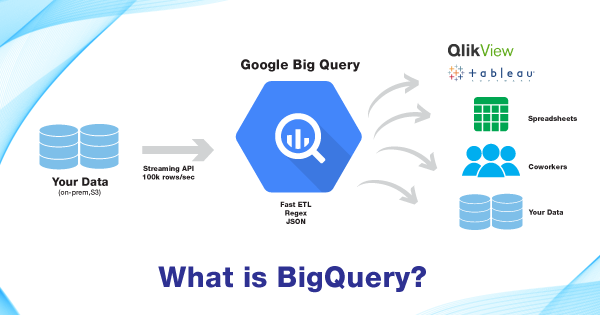

# 📦 GCP Data Engineering Overview

In modern data architecture, GCP provides a comprehensive set of tools to support the full data lifecycle — from ingestion and storage to processing and orchestration.  

[Google Cloud Certified: Professional Data Engineer](https://cloud.google.com/certification/data-engineer)

| Exam - Domain | Weight | Key Services & Topics |
| :--- | --- | --- |
| **Data Ingestion** | 20% | Batch vs. streaming; Datastream; Pub/Sub; Data Fusion |
| **Data Storage** | 20% | Data lake vs. data warehouse; Cloud Storage; BigQuery; Firestore; Cloud SQL |
| **Data Processing & ETL** | 30% | Dataflow; Dataproc; Cloud Functions; Composer; Spark on GKE |
| **Analytics & Machine Learning** | 15% | BigQuery SQL; Looker; Vertex AI |
| **Security, Monitoring & Optimization** | 15% | IAM; CMEK/KMS; Cloud Logging & Monitoring; Dataplex & Data Catalog |

---

## 1. GCS = Google Cloud Storage

- Buckets (like S3 containers)
- Objects (files/blobs)

  

---

## 2. Data Fusion

Cloud Data Fusion is a **serverless data integration service** designed to help you **discover, prepare, move, and integrate data**. It's primarily used for **pipelines** feeding **data warehouses** and **data lakes**.

- **Fully-managed ETL/ELT service**
- **Visual drag-and-drop UI**
- **Integrations**: GCS, BigQuery, Cloud SQL, Pub/Sub

  

| Component | Description |
| --- | --- |
| **Cloud Data Catalog** | Metadata, schemas, governance. |
| **Wrangler** | UI for data exploration and transformation. |
| **Pipelines** | Batch or streaming jobs, run on Dataflow/Spark. |

---

## 3. Querying with BigQuery

BigQuery is a **serverless, petabyte-scale data warehouse** with SQL interface.  

  

| Topic | Key Point | Why It Matters |
| --- | --- | --- |
| **1. Querying Data** | SQL on GCS or native tables | No infrastructure to manage |
|  | Partitioning & Clustering | Reduce cost and latency |
| **2. External Tables** | Query data in GCS directly | Avoids ETL for raw files |
| **3. Performance & Cost** | Storage cheap, compute billed per TB scanned | Partitioned + columnar files lower cost |
| **4. ML Integration** | BigQuery ML | Train models directly in SQL |
| **5. Governance** | Dataplex & IAM | Centralized metadata and fine-grained access |

---

## 4. Dataflow & Dataproc

### Cloud Dataflow
- Serverless Apache Beam pipelines  
- Batch + Streaming (unified model)  
- Auto-scaling  

### Dataproc
- Managed Hadoop/Spark/Flink  
- Flexible for lift-and-shift workloads  
- Pay per VM  

---

## 5. Serverless Compute with Cloud Functions

Use cases： 

---

## 6. Data Streaming

- **Pub/Sub** (Kafka-like pub-sub messaging)  
- **Dataflow Streaming** (real-time ETL with Beam/Flink)  
- **Cloud Functions** for lightweight transforms  
- **Dataproc + Spark Streaming** for advanced scenarios  

---

## 7. Storage with GCS

- Partitioning (prefix/structured paths)  
- Storage classes (Standard / Nearline / Coldline / Archive)  
- Object Versioning  
- CMEK encryption with Cloud KMS  
- IAM & ACLs  
- Event Notifications (to Pub/Sub)  

---

## 8. Other Storage Services

- **Persistent Disks**  
- **Filestore (NFS)**  
- **Backup & DR**  

---

## 9. Firestore / Bigtable / Cloud SQL

- Firestore = NoSQL document DB  
- Bigtable = Wide-column DB (low latency, high throughput)  
- Cloud SQL = Managed MySQL/Postgres/SQL Server  
- AlloyDB = Advanced PostgreSQL-compatible  

---

## 10. BigQuery Data Warehouse

BigQuery is a fully managed **MPP** analytics warehouse.  

  

✅ BigQuery vs Hive vs SparkSQL

| Feature | BigQuery | Hive | SparkSQL |
|--------|----------|------|----------|
| Type | Managed MPP Data Warehouse | Hadoop SQL Engine | In-memory distributed SQL |
| Storage | Columnar + GCS | HDFS | HDFS/S3/GCS |
| Latency | Fast | Slow | Fast |
| Deployment | Fully managed | Self-hosted Hadoop | Self-hosted Spark |

```mermaid
flowchart TB
    %% ===== Color classes =====
    classDef core fill:#ffe5e5,stroke:#cc0000,stroke-width:2px,color:#000;
    classDef ops fill:#fff2cc,stroke:#aa7a00,stroke-width:2px,color:#000;
    classDef features fill:#e6ffe6,stroke:#1b7f1b,stroke-width:2px,color:#000;
    classDef bg_clients fill:#e6f3ff,stroke:none;
    classDef bg_cluster fill:#fff8f0,stroke:none;
    classDef bg_ops fill:#f4e6ff,stroke:none;
    classDef bg_features fill:#f0fff4,stroke:none;

    %% ===== Clients =====
    subgraph C["Clients & Connectivity"]
        BI["🧑‍💻 Looker / BI Tools / SQL clients"]
        ODBC["🔌 ODBC / JDBC"]
    end
    class C bg_clients

    %% ===== BigQuery Cluster =====
    subgraph BQ["BigQuery Engine"]
        L["🧠 Control Plane<br>(Job orchestration, query planner)"]
        W1["🧩 Worker Node 1<br>(Dremel slot execution)"]
        W2["🧩 Worker Node 2<br>(Dremel slot execution)"]
        W3["🧩 Worker Node 3<br>(Dremel slot execution)"]
    end
    class BQ bg_cluster

    %% ===== Features =====
    subgraph F["Key Features"]
        F1["📦 Columnar storage (Colossus)"]
        F2["⚡ Serverless MPP"]
    end
    class F bg_features

    %% ===== Ops =====
    subgraph G["Security & Operations"]
        SEC["🔐 IAM / VPC-SC / CMEK (KMS)"]
        BAK["🧷 Automated backup & DR"]
        SHARE["🔁 External tables / Data sharing"]
    end
    class G bg_ops

    BI --> ODBC --> BQ
    L --> W1
    L --> W2
    L --> W3

    SEC --- BQ
    BAK --- BQ
    SHARE --- L

    class BI,ODBC,L,W1,W2,W3 core
    class SEC,BAK,SHARE ops
    class F1,F2 features
```

---

## 11. Other Database Services

---

## 12. Compute Services

