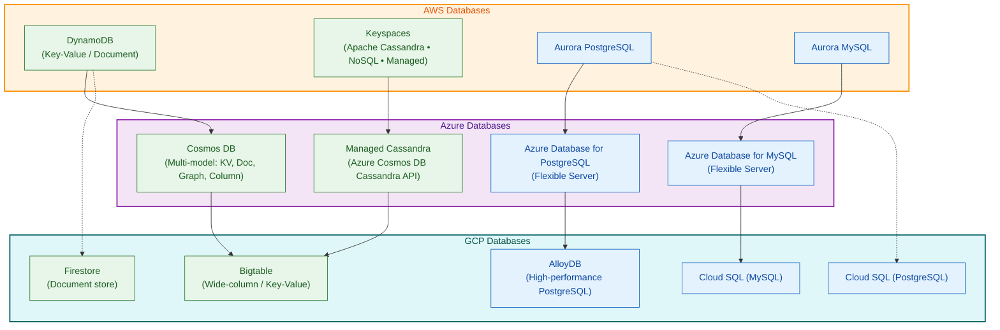
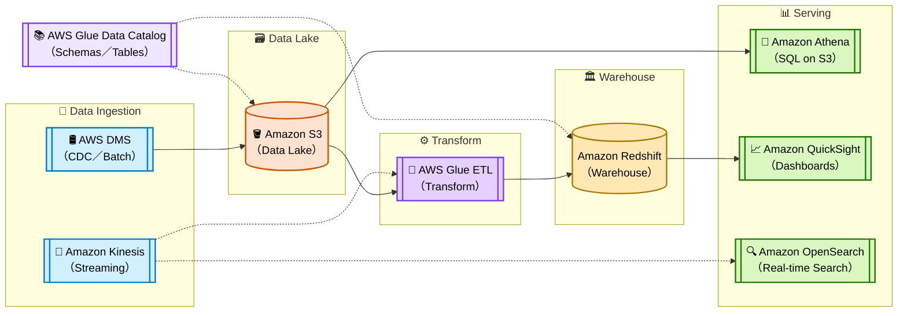
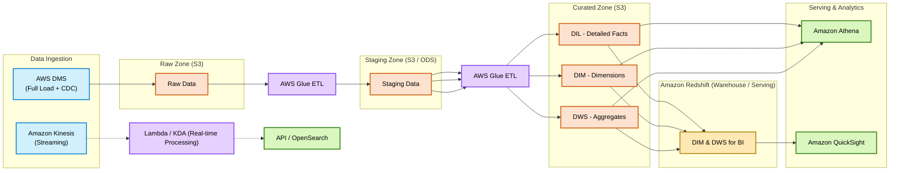
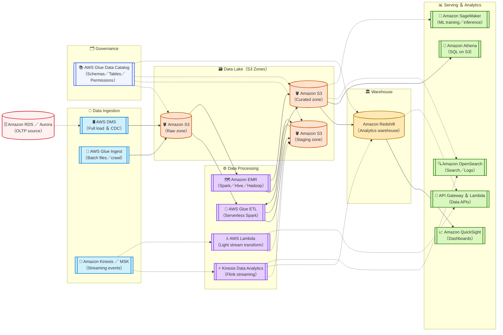

# 📦 AWS Data Engineering Overview

> 📚 Motivation: In life you can choose who you want to be; be very careful with that choice.

🌅 [**AWS Certified Data Engineer – Associate（DEA-C01）**](https://www.udemy.com/course/aws-certified-data-engineer-associate-dea-c01/?couponCode=ST16MT230625B)

## ✅ Cloud Data Platform Comparison

| **Layer**        | AWS                           | Azure                              | GCP                               | Traditional          |
|------------------|-------------------------------|------------------------------------|-----------------------------------|----------------------|
| **Storage Layer**   (for Data Lake)    | Amazon S3                     | Azure Data Lake Storage (ADLS)     | Google Cloud Storage (GCS)        | HDFS (cloudified)    |
| **Batch ETL**    | <mark>**AWS Glue Studio**</mark> Visual pipeline design <mark>**AWS Glue Jobs**</mark> Serverless Spark ETL <mark>**Amazon EMR**</mark> Managed Hadoop/Spark for large-scale jobs | <mark>**Azure Data Factory (ADF)**</mark> Orchestration & visual pipelines <mark>**Mapping Data Flows**</mark> Spark-based serverless ETL <mark>**HDInsight / Databricks**</mark> Managed Hadoop/Spark clusters | <mark>**Cloud Data Fusion**</mark> Visual pipeline orchestration <mark>**Dataflow**</mark> Serverless batch ETL (Apache Beam) <mark>**Dataproc**</mark> Managed Spark clusters | <mark>**Apache Spark / Hadoop**</mark> Self-managed, on-premise |
| **Data Warehouse** | Amazon Redshift             | Azure Synapse Analytics            | BigQuery                          | Hive / Impala  |
| **Streaming ETL**| Kinesis / MSK / KDA           | Event Hubs / Stream Analytics      | Pub/Sub + Dataflow (streaming)    | Flink / Storm        |

## Database, AWS vs Azure vs GCP

## Preface

In modern data architecture, AWS provides a comprehensive set of tools to support the full data lifecycle — from ingestion and storage to processing and orchestration. 

> Solid line → main path (core data flow), Dashed line → optional/supplementary path; CDC: Data Capture

### simple version :

### middle version :

### detailed version :

1. **Raw Zone (S3)**  
   - Exact copy of source data, no changes.  
   - For audit and reprocessing.  

2. **Staging Zone (S3) → ODS**  
   - Lightly cleaned, standardized format.  
   - Temporary storage before main ETL.  

3. **Curated Zone (S3 / Redshift)**  
   - **DIL**: detailed, cleaned facts.  
   - **DIM**: dimensions for joins.  
   - **DWS**: aggregated, business-ready tables.  
   - Stored in S3 for Athena or in Redshift for faster analytics and BI serving.  

4. **Redshift**  
   - Stores DIM and DWS for high-performance queries.  
   - Acts as the serving layer for dashboards, APIs, and analytics.  
