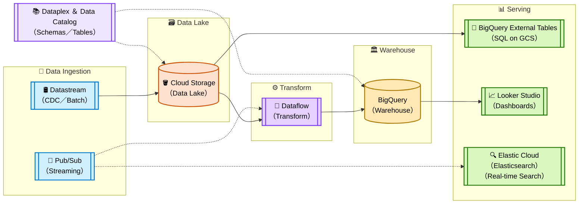
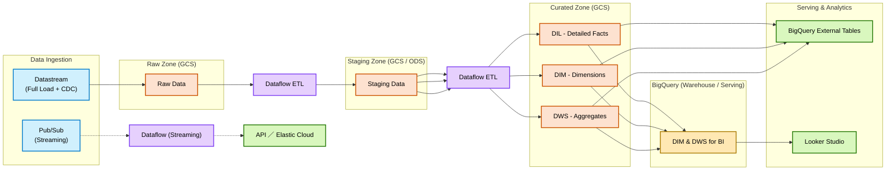
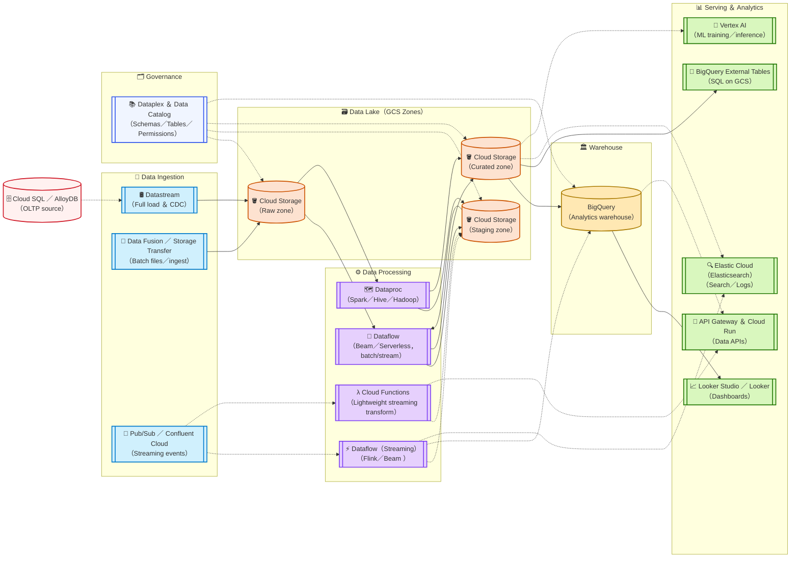

# 📦 GCP Data Engineering Overview

> 📚 Motivation: In life you can choose who you want to be; be very careful with that choice.

🌅 [**GCP Data Engineer – Equivalent**](https://cloud.google.com/certification)

- Google Cloud Storage (GCS)

## Preface

In modern data architecture, GCP provides a comprehensive set of tools to support the full data lifecycle — from ingestion and storage to processing and orchestration. 

> Solid line → main path (core data flow), Dashed line → optional/supplementary path; CDC: Change Data Capture

---

### Simple version :

### Middle version :

### Detailed version :

