# 📦 GCP Data Engineering Overview

> 📚 Motivation: In life you can choose who you want to be; be very careful with that choice.

🌅 [**GCP Data Engineer – Equivalent**](https://cloud.google.com/certification)

- Google Cloud Storage (GCS)

## Preface

In modern data architecture, GCP provides a comprehensive set of tools to support the full data lifecycle — from ingestion and storage to processing and orchestration. 

> Solid line → main path (core data flow), Dashed line → optional/supplementary path; CDC: Change Data Capture

---

### Simple version :

```mermaid
flowchart LR
    %% ===== Layers =====
    subgraph L1[🔁 Data Ingestion]
        DS[[🛢️ Datastream<br>（CDC／Batch）]]:::ing
        PS[[📡 Pub/Sub<br>（Streaming）]]:::ing
    end

    subgraph L2[🗃️ Data Lake]
        GCS[(🪣 Cloud Storage<br>（Data Lake）)]:::stor
    end

    subgraph L3[⚙️ Transform]
        DF[[🧪 Dataflow<br>（Transform）]]:::proc
    end

    subgraph L4[🏛️ Warehouse]
        BQ[(BigQuery<br>（Warehouse）)]:::wh
    end

    subgraph L5[📊 Serving]
        BQX[[🔎 BigQuery External Tables<br>（SQL on GCS）]]:::srv
        LS[[📈 Looker Studio<br>（Dashboards）]]:::srv
        ES[[🔍 Elastic Cloud（Elasticsearch）<br>（Real-time Search）]]:::srv
    end

    %% ===== Governance =====
    DPX[[📚 Dataplex ＆ Data Catalog<br>（Schemas／Tables）]]:::gov

    %% ===== Core paths =====
    DS --> GCS
    GCS --> DF
    DF --> BQ
    GCS --> BQX
    BQ --> LS

    %% ===== Streaming (optional) =====
    PS -.-> DF
    PS -.-> ES

    %% ===== Governance wiring =====
    DPX -.-> GCS
    DPX -.-> BQ

    %% ===== Styles =====
    classDef ing  fill:#d0f0fd,stroke:#007acc,stroke-width:2px,color:#000;
    classDef stor fill:#fde2d0,stroke:#cc5200,stroke-width:2px,color:#000;
    classDef proc fill:#e6d0fd,stroke:#7e3ff2,stroke-width:2px,color:#000;
    classDef wh   fill:#ffe8b3,stroke:#aa7a00,stroke-width:2px,color:#000;
    classDef srv  fill:#d9f7be,stroke:#237804,stroke-width:2px,color:#000;
    classDef gov  fill:#efe6ff,stroke:#7e3ff2,stroke-width:2px,color:#000;
```

### Middle version :

### Detailed version :

```mermaid
flowchart LR
    %% ===== L1: Ingestion =====
    subgraph L1[🔁 Data Ingestion]
        DS[[🛢️ Datastream<br>（Full load ＆ CDC）]]:::ing
        DFUS[[🧪 Data Fusion ／ Storage Transfer<br>（Batch files／ingest）]]:::ing
        PS[[📡 Pub/Sub ／ Confluent Cloud<br>（Streaming events）]]:::ing
    end

    %% ===== L2: Processing =====
    subgraph L2[⚙️ Data Processing]
        DF[[🧪 Dataflow<br>（Beam／Serverless，batch/stream）]]:::proc
        DP[[🗺️ Dataproc<br>（Spark／Hive／Hadoop）]]:::proc
        CFX[[⚡ Dataflow（Streaming）<br>（Flink／Beam ）]]:::proc
        CFN[[λ Cloud Functions<br>（Lightweight streaming transform）]]:::proc
    end

    %% ===== L3: Lake Storage Zones =====
    subgraph L3[🗃️ Data Lake（GCS Zones）]
        RAW[(🪣 Cloud Storage<br>（Raw zone）)]:::stor
        STG[(🪣 Cloud Storage<br>（Staging zone）)]:::stor
        CUR[(🪣 Cloud Storage<br>（Curated zone）)]:::stor
    end

    %% ===== L3.5: Warehouse =====
    subgraph L35[🏛️ Warehouse]
        BQ[(BigQuery<br>（Analytics warehouse）)]:::wh
    end

    %% ===== L4: Serving ＆ Analytics =====
    subgraph L4[📊 Serving ＆ Analytics]
        BQX[[🔎 BigQuery External Tables<br>（SQL on GCS）]]:::srv
        LS[[📈 Looker Studio ／ Looker<br>（Dashboards）]]:::srv
        API[[🔌 API Gateway ＆ Cloud Run<br>（Data APIs）]]:::srv
        ES[[🔍 Elastic Cloud（Elasticsearch）<br>（Search／Logs）]]:::srv
        VAI[[🤖 Vertex AI<br>（ML training／inference）]]:::srv
    end

    %% ===== Governance（Metadata ＆ Access Control） =====
    subgraph GOV[🗂️ Governance]
        DPX[[📚 Dataplex ＆ Data Catalog<br>（Schemas／Tables／Permissions）]]:::gov
    end

    %% ===== Batch core =====
    DS --> RAW
    DFUS --> RAW
    RAW --> DF
    RAW --> DP
    DF --> STG
    DP --> STG
    STG --> DF
    DF --> CUR
    DP --> CUR
    CUR --> BQ

    %% ===== Streaming core =====
    PS -.-> CFX
    PS -.-> CFN
    CFX -.-> STG
    CFN -.-> STG
    CFX -.-> BQ

    %% ===== Serving =====
    CUR --> BQX
    BQ --> LS
    CUR -.-> ES
    BQ -.-> API
    CUR -.-> VAI

    %% ===== Streaming → Serving direct（for real-time use cases） =====
    CFX -.-> ES
    CFN -.-> API

    %% ===== Governance wiring（dashed） =====
    DPX -.-> RAW
    DPX -.-> STG
    DPX -.-> CUR
    DPX -.-> BQ

    %% ===== Optional source hint =====
    SQL[(🗄️ Cloud SQL ／ AlloyDB<br>（OLTP source）)]:::src
    SQL -.-> DS

    %% ===== Styles =====
    classDef ing  fill:#d0f0fd,stroke:#007acc,stroke-width:2px,rx:10,ry:10;
    classDef proc fill:#e6d0fd,stroke:#7e3ff2,stroke-width:2px,rx:10,ry:10;
    classDef stor fill:#fde2d0,stroke:#cc5200,stroke-width:2px,rx:10,ry:10;
    classDef wh   fill:#ffe8b3,stroke:#aa7a00,stroke-width:2px,rx:10,ry:10;
    classDef srv  fill:#d9f7be,stroke:#237804,stroke-width:2px,rx:10,ry:10;
    classDef gov  fill:#f0f5ff,stroke:#2f54eb,stroke-width:2px,rx:10,ry:10;
    classDef src  fill:#fff1f0,stroke:#cf1322,stroke-width:2px,rx:10,ry:10;
```

