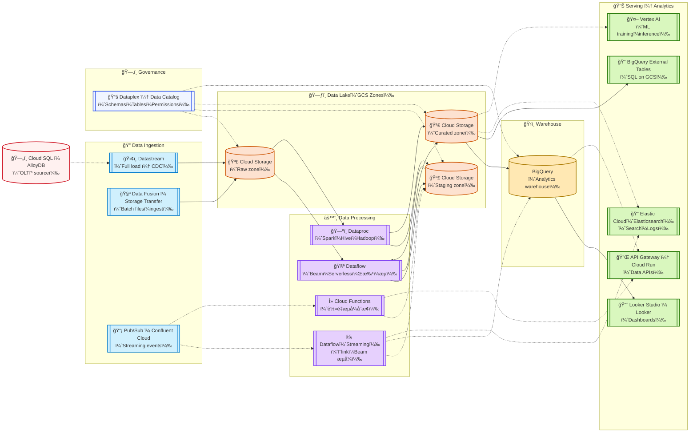

```mermaid
flowchart LR
    %% ===== L1: Ingestion =====
    subgraph L1[🔠Data Ingestion]
        DS[[ğŸ›¢ï¸ Datastream<br>（Full load ＆ CDC）]]:::ing
        DFUS[[🧪 Data Fusion ï¼ Storage Transfer<br>（Batch filesï¼ingest）]]:::ing
        PS[[📡 Pub/Sub ï¼ Confluent Cloud<br>（Streaming events）]]:::ing
    end

    %% ===== L2: Processing =====
    subgraph L2[âš™ï¸ Data Processing]
        DF[[🧪 Dataflow<br>（Beamï¼Serverless，批ï¼æµï¼‰]]:::proc
        DP[[ğŸ—ºï¸ Dataproc<br>（Sparkï¼Hiveï¼Hadoop）]]:::proc
        CFX[[âš¡ Dataflow（Streaming）<br>（Flinkï¼Beam æµå¼ï¼‰]]:::proc
        CFN[[λ Cloud Functions<br>（轻é‡æµå¼å˜æ¢ï¼‰]]:::proc
    end

    %% ===== L3: Lake Storage Zones =====
    subgraph L3[ğŸ—ƒï¸ Data Lake（GCS Zones）]
        RAW[(🪣 Cloud Storage<br>（Raw zone）)]:::stor
        STG[(🪣 Cloud Storage<br>（Staging zone）)]:::stor
        CUR[(🪣 Cloud Storage<br>（Curated zone）)]:::stor
    end

    %% ===== L3.5: Warehouse =====
    subgraph L35[ğŸ›ï¸ Warehouse]
        BQ[(BigQuery<br>（Analytics warehouse）)]:::wh
    end

    %% ===== L4: Serving ＆ Analytics =====
    subgraph L4[📊 Serving ＆ Analytics]
        BQX[[🔠BigQuery External Tables<br>（SQL on GCS）]]:::srv
        LS[[📈 Looker Studio ï¼ Looker<br>（Dashboards）]]:::srv
        API[[🔌 API Gateway ＆ Cloud Run<br>（Data APIs）]]:::srv
        ES[[🔠Elastic Cloud（Elasticsearch）<br>（Searchï¼Logs）]]:::srv
        VAI[[🤖 Vertex AI<br>（ML trainingï¼inference）]]:::srv
    end

    %% ===== Governance（Metadata ＆ Access Control） =====
    subgraph GOV[ğŸ—‚ï¸ Governance]
        DPX[[📚 Dataplex ＆ Data Catalog<br>（Schemasï¼Tablesï¼Permissions）]]:::gov
    end

    %% ===== Batch core =====
    DS --> RAW
    DFUS --> RAW
    RAW --> DF
    RAW --> DP
    DF --> STG
    DP --> STG
    STG --> DF
    DF --> CUR
    DP --> CUR
    CUR --> BQ

    %% ===== Streaming core =====
    PS -.-> CFX
    PS -.-> CFN
    CFX -.-> STG
    CFN -.-> STG
    CFX -.-> BQ

    %% ===== Serving =====
    CUR --> BQX
    BQ --> LS
    CUR -.-> ES
    BQ -.-> API
    CUR -.-> VAI

    %% ===== Streaming → Serving direct（for real-time use cases） =====
    CFX -.-> ES
    CFN -.-> API

    %% ===== Governance wiring（dashed） =====
    DPX -.-> RAW
    DPX -.-> STG
    DPX -.-> CUR
    DPX -.-> BQ

    %% ===== Optional source hint =====
    SQL[(ğŸ—„ï¸ Cloud SQL ï¼ AlloyDB<br>（OLTP source）)]:::src
    SQL -.-> DS

    %% ===== Styles =====
    classDef ing  fill:#d0f0fd,stroke:#007acc,stroke-width:2px,rx:10,ry:10;
    classDef proc fill:#e6d0fd,stroke:#7e3ff2,stroke-width:2px,rx:10,ry:10;
    classDef stor fill:#fde2d0,stroke:#cc5200,stroke-width:2px,rx:10,ry:10;
    classDef wh   fill:#ffe8b3,stroke:#aa7a00,stroke-width:2px,rx:10,ry:10;
    classDef srv  fill:#d9f7be,stroke:#237804,stroke-width:2px,rx:10,ry:10;
    classDef gov  fill:#f0f5ff,stroke:#2f54eb,stroke-width:2px,rx:10,ry:10;
    classDef src  fill:#fff1f0,stroke:#cf1322,stroke-width:2px,rx:10,ry:10;

```