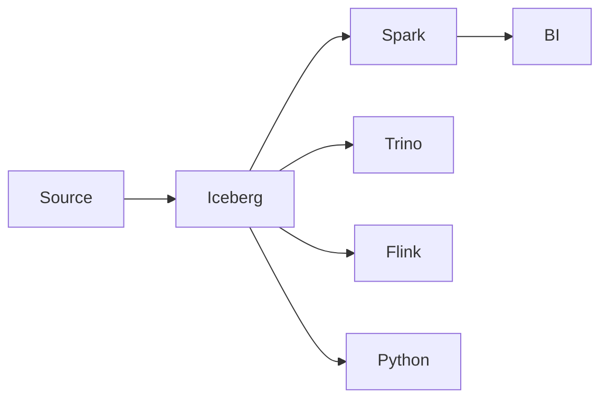
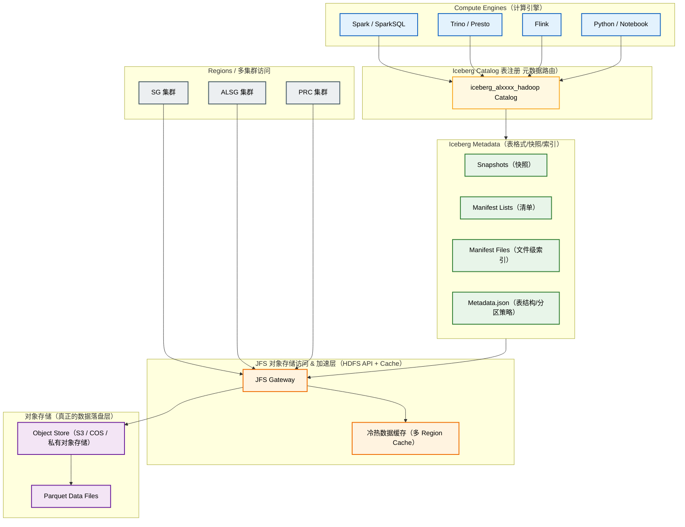

# 📦 Apache Iceberg 学习（含 Hive & Spark 对比）


## 1. Iceberg = Table Format（表格式）非存储引擎

### 核心组成：

| 组件            | 含义                   | 作用                     |
| ------------- | -------------------- | ---------------------- |
| Metadata.json | 元数据管理                | Schema、分区布局、快照         |
| Snapshot      | 数据集的时间点镜像            | Time Travel & Rollback |
| Manifest List | 清单索引                 | 指向所有 Manifest          |
| Manifest      | DataFile 索引          | 文件级别分区与过滤信息            |
| Data File     | Parquet / ORC / Avro | 存真实数据                  |

### 与 Hive 对比

| 对比点   | Iceberg                     | Hive                  |
| ----- | --------------------------- | --------------------- |
| 分区方式  | Hidden Partition（无需写入方记分区列） | 需显式、静态路径式分区           |
| 元数据结构 | Snapshot + Manifest Layer   | Hive Metastore 单点存元数据 |
| 可回滚能力 | ✔ 支持任意 Snapshot Rollback    | ✖ 无                   |
| 分区演化  | ✔ 支持                        | ✖ 不支持                 |

---

## 2. 分区策略（Partitioning）

### Iceberg 优势点

* 动态分区演化（不重写全表）
* 时间分桶（day, hour, month 自动衍生）
* Hidden partitioning（SQL 层无需写分区字段）

示例：

```sql
PARTITIONED BY (days(date), country)
```

### Hive 对比

| 特性                | Iceberg                   | Hive        |
| ----------------- | ------------------------- | ----------- |
| 动态修改分区结构          | ✔ 支持，不需要重导                | ✖ 几乎不可行     |
| Schema Evolution  | ✔ 低成本                     | ⚠ 有限且依赖建表结构 |
| Partition Pruning | 更智能（Manifest-level prune） | 元数据扫描重      |

---

## 3. Iceberg + SparkSQL

### SparkSQL 常见读取

```sql
SELECT *
FROM iceberg.db.table
WHERE date = '2025-01-01';
```

### Predicate Pushdown（谓词下推）

Iceberg 会在 **Manifest 层过滤**，无需扫目录/元数据表。

对比 Hive：

* Hive 会扫描分区目录
* Iceberg 直接 prune Manifest

---

## 4. 性能与文件治理（Compaction）

### Iceberg Optimize

```sql
CALL catalog.db.table_optimize();
```

### 小文件治理

| 机制             | Iceberg                    | Hive                    |
| -------------- | -------------------------- | ----------------------- |
| Compaction     | 内置表级优化调度                   | 需要自建 MR 或 HiveCompactor |
| Metadata Table | 有（files、history、snapshots） | 元数据不含 file-level 索引     |

---

## 5. Time Travel & Snapshot

```sql
SELECT * FROM table VERSION AS OF 123456;
```

或

```sql
SELECT * FROM table FOR TIME AS OF '2024-11-10 10:00:00';
```

### 对比 Hive

| 能力     | Iceberg | Hive |
| ------ | ------- | ---- |
| 多版本存储  | ✔       | ✖    |
| 快照回滚   | ✔       | ✖    |
| 冷热数据对齐 | ✔       | ✖    |

---

## 6. Merge 操作支持

```sql
MERGE INTO target t
USING source s
ON t.id = s.id
WHEN MATCHED THEN UPDATE SET *
WHEN NOT MATCHED THEN INSERT *;
```

### 对比

| Merge Upsert | Iceberg                | Hive             |
| ------------ | ---------------------- | ---------------- |
| ACID         | 原生支持 Data + Metadata 层 | 基于 ORC ACID，性能不稳 |
| MOR / COW    | 支持两种实现                 | Hive 缺乏真正 MOR    |

---

## 7. 格式与兼容性

| 引擎             | Iceberg 支持 |
| -------------- | ---------- |
| Spark          | ✔          |
| Trino / Presto | ✔          |
| Flink          | ✔          |
| Snowflake      | ✔          |
| Hive           | ⚠ 读兼容性有但有限 |

---

## 8. 典型架构图




## 9. Iceberg vs Hive vs Delta vs Hudi

| 特性                  | Iceberg | Hive | Delta | Hudi  |
| ------------------- | ------- | ---- | ----- | ----- |
| 表格式                 | ✔       | ✖    | ✔     | ✔     |
| Time Travel         | ✔       | ✖    | ✔     | ✔     |
| Partition Evolution | ✔       | ✖    | ✖     | ✔     |
| 多引擎读写一致性            | ✔       | ✖    | 中     | 中     |
| Merge Upsert        | ✔       | ✖不稳定 | ✔     | ✔（更强） |

---

## 10. 总结与推荐实践

* **ADS / DWD 层推荐 Iceberg**（高查询 + 高压缩）
* **ODS 可仍用 Hive**（入湖原始保留）
* 分区裁剪+Manifest 级过滤 → 极大加速 SparkSQL 查询

---

# 🎯一页总结

> Iceberg 是新一代开放表格式，实现 ACID、隐藏分区、时间旅行、Schema 和 Partition 演化，底层 Metadata 结构显著强于 Hive，查询性能与治理能力远超 Hive SQL 目录模型。

---

如果你需要，我可以继续给你：

* 🚦 Iceberg 性能最佳实践手册（小文件治理、Snapshot TTL）
* 🧵 Iceberg 数据血缘（从 ODS→DWD→DWM→ADS）
* 📊 Iceberg on EMR & AWS Glue 生产部署图


---
---
---

下面是一个 **结合你当前公司 Iceberg 实际生产方式（多集群、JFS 对象存储、Metacat、ADS漏斗、跨区域数据）** 制定的 **完整落地方案**，可直接给上层汇报或作为 Data Platform 文档使用。


# 🏛 Iceberg 企业级实施方案

## 1. 环境现状确认
| 架构项         | 当前状态                                   | 解释说明 / 为什么这样配置                                                                                |
| ----------- | -------------------------------------- | --------------------------------------------------------------------------------------------- |
| **Catalog** | `iceberg_alxxxx_hadoop`                | 使用 HadoopCatalog，元数据直接存储在对象存储（JFS）而非 Hive Metastore，保证跨引擎一致访问（Spark / Trino / Flink），提升读写并发能力 |
| **Storage** | `jfs://...`                            | Iceberg 元数据与 Parquet 数据全部落盘于 JFS，多 Region 可挂载访问，具备低成本高可靠特性                                    |
| **表类型**     | Iceberg + Parquet                      | Parquet 适合列式分析，Iceberg 提供 Snapshot/Manifest/ACID 事务，两者结合即 Lakehouse 典型底座                      |
| **压缩**      | `zstd`（高压缩比 + 性能优秀）                    | ZSTD 压缩比 > Snappy、Gzip，且解压速度快，适合大规模分析查询（低成本 + 高性能）                                            |
| **分区策略**    | `(date, from_cluster)`                 | `date` 用于日级过滤（高频查询），`from_cluster` 支撑多集群数据对账与隔离，避免写放大和全表扫描                                    |
| **生命周期**    | `metacat.reserved.lifecycle.day = 550` | 数据保留期约 18 个月，符合营销归因/合规留存标准，同时控制存储成本                                                           |
| **优化策略**    | `table-optimize-priority = balanced`   | Iceberg 自动小文件治理 & Manifest 重写均衡执行，避免资源抢占和查询延迟                                                 |
| **快照 TTL**  | `snapshot.lifecycle.minutes = 1440`    | 快照保留 1 天用于回滚，但不会堆积，自动释放元数据避免 Snapshot 泄漏 / Metadata 放大                                        |




## 2. 总体目标体系（落地）

| 目标      | 描述                                   | 成果                |
| ------- | ------------------------------------ | ----------------- |
| 多引擎统一   | Spark / Trino / Presto / Flink 统一表   | One Table Format  |
| 数据治理标准化 | 小文件治理、分区策略统一、元数据管理                   | 提升 SLA、降低存储       |
| 多集群一致性  | PRC / SG / EU 集群数据无缝对齐               | from_cluster 维度治理 |
| 生产能观测性  | Optimize、Compaction、Snapshot TTL 自动化 | 降本提效              |

---

## 3. 分区 & 文件治理策略（关键项）

### ❗为何必须坚持 `(date, from_cluster)` 分区

* 多 Region 数据写入（SG / ALSG / PRC）
* 业务方日级查询量超高（转化漏斗、Marketing SLA）
* Table-level compaction 任务按 Region 割裂执行

📌 未来可增强：

```
PARTITIONED BY (days(date), from_cluster)
```

如果 `date` → `days(date)`，Manifest prune 更快。


## 4. Snapshot 生命周期方案

你们当前为：

```
snapshot.lifecycle.minutes = 1440
```

= 1天保留

建议变更为：

| 功能层级     | TTL        | 理由          |
| -------- | ---------- | ----------- |
| ADS（应用）  | 3-7 days   | 多人回溯、报表外联对账 |
| DWM（中间层） | 14-30 days | 离线重算保障      |
| DWD（明细）  | 30-90 days | 法务 & 合规     |
| ODS（贴源）  | 90+ days   | 原始回溯强需求     |

执行：

```sql
CALL ...expire_snapshots(retain_last = 10);
CALL ...remove_orphan_files();
```

## 5. Iceberg vs Hive 常用命令

| 功能               | Iceberg                         | Hive                 | 解释                 |
| ---------------- | ------------------------------- | -------------------- | ------------------ |
| 表结构              | `DESCRIBE`                      | `DESCRIBE`           | 一致                 |
| 表属性              | `SHOW TBLPROPERTIES`            | `DESCRIBE FORMATTED` | Hive 更啰嗦           |
| 分区查看             | `SHOW PARTITIONS`               | `SHOW PARTITIONS`    | 一致                 |
| 查看快照             | `SELECT * FROM table.snapshots` | ❌                    | Hive 无 snapshot 概念 |
| 查看底层文件           | `SELECT * FROM table.files`     | ❌                    | Hive 无 manifest 索引 |
| Manifest/History | `SELECT * FROM table.manifests` | ❌                    | Hive 无 metadata 层  |
| Time Travel      | `VERSION AS OF`                 | ❌                    | Hive 无时间回溯         |
| Optimize         | `CALL table_optimize()`         | 需手动 compaction MR    | Iceberg 内建治理       |


怎么看 Iceberg 底层文件：

```sql
SELECT * FROM db.table.files;
可见每个 parquet 文件的 size、partition、snapshot 来自哪个写入。
```

快照：

```sql
SELECT * FROM db.table.snapshots;
用于查看所有版本、回滚时间点。
```

**INSERT OVERWRITE**

```sql
INSERT OVERWRITE TABLE ads_edm_funnel_df
PARTITION (date='2025-01-01', from_cluster='sg')
SELECT ...
```

- OVERWRITE 分区 → 日级全量收益最大
- Manifest 会自动更新
- Snapshot 清晰断点

✅ **你这张表为什么是「日级全量沉淀」**

```sql
PARTITIONED BY (date, from_cluster)

date → 每天一个分区

from_cluster → 同一天可能来自 sg / alsg / prc 多集群写入

因此它的落盘形态是：

date=2025-01-01/from_cluster=sg/...
date=2025-01-01/from_cluster=alsg/...
date=2025-01-01/from_cluster=prc/...
date=2025-01-02/from_cluster=sg/...
...
```

📌 每天 + 每 Region 一份（所以叫「全量 ADS」）

```sql
SELECT date, expected_send, success_send, open_users, pay_users
FROM ads_funnel_df
WHERE date = '2025-01-01' AND from_cluster = 'sg';
```

| file       | date       | from_cluster | rows | min(pay_users) | max(pay_users) |
| ---------- | ---------- | ------------ | ---- | -------------- | -------------- |
| p1.parquet | 2025-01-01 | sg           | 100M | 0              | 500            |
| p2.parquet | 2025-01-01 | prc          | 120M | 0              | 200            |
| p3.parquet | 2025-01-01 | alsg         | 90M  | 0              | 300            |
| p4.parquet | 2025-01-02 | sg           | 110M | 0              | 400            |

👉 你查 2025-01-01 / sg   
👉 Iceberg 直接定位 sg_p1.parquet  
👉 不用扫描 prc & alsg 路径  
👉 不用读取分区目录

| 步骤   | Hive    | Iceberg              |
| ---- | ------- | -------------------- |
| 找文件  | 扫目录     | 读Manifest即可          |
| 过滤日期 | 按目录路径过滤 | Manifest-level prune |
| 过滤集群 | 继续扫描子目录 | Manifest字段直接过滤       |
| IO成本 | 大量列举文件  | 只扫描真正需要的数据           |

### 📌 Manifest 的意义

它让 Iceberg 知道每个 Parquet 属于哪个分区、属于哪个 cluster、属于哪个 snapshot，从而避免目录遍历。

简而言之：

- Manifest List：告诉你有哪些 Manifest  
- Manifest：告诉你真实 parquet 在哪

## 6. 多集群联邦写入（from_cluster 核心）

你的 Funnel 表已经体现出：

* **从多个 Hadoop/JFS 域写入**
* 多 Region 数据资源池需要安全隔离

建议：

```
from_cluster in ('sg', 'alsg', 'prc')
```

用于：

* 故障跨区容灾
* 数据回填（eg. SG fail → PRC backfill）
* 指标一致性校验

---

## 7. 性能优化（Manifest & Metadata）

### Manifest 裁剪策略：

* 分区字段过滤
* snapshot-id filter
* metadata file-size 限制

```sql
set read.split.target-size = '134217728'; -- 128MB
```

**查询优化结果**：

* SparkSQL 查询 Funnel 日级：<1s manifest prune
* 无需像 Hive 遍历分区目录

---

## 8. Iceberg vs Hive 在你公司环境下比较

| 项              | Iceberg                  | Hive               |
| -------------- | ------------------------ | ------------------ |
| 多引擎访问          | ✔ Trino / Presto / Spark | ⚠ 仅 Hive Metastore |
| 分区演化           | ✔ 无需重建                   | ✖ 需重建表             |
| Manifest prune | ✔ 轻量级 metadata           | ✖ metastore 读放大    |
| Time Travel    | ✔ 支持回滚                   | ✖ 不支持              |
| Compaction 内建  | ✔ optimize               | ⚠ 自建 MR            |

结论：Hive 仅保 ODS/LOG 原始入湖
Iceberg 提供 DWD → DWM → ADS 统一格式。

---

## 9. 推荐未来治理升级路线

### 1）指标工厂 + Iceberg 主索引统一化

目标表达：

```
One Table Format = Iceberg
One Metric Source = DWD/DWM/ADS Standardization
```

### 2）Streaming + Batch 合流（Flink CDC + Iceberg）

Flink → Iceberg → Spark / Trino 查询一致性

### 3）Compaction & Optimize 全自动化

Airflow调度示例：

```
daily_optimize_iceberg_ads_funnel_job
```

---

# 🎯 总结


📌 Iceberg 完全可以作为 **你们数据工厂（Data Factory）生产底座**

