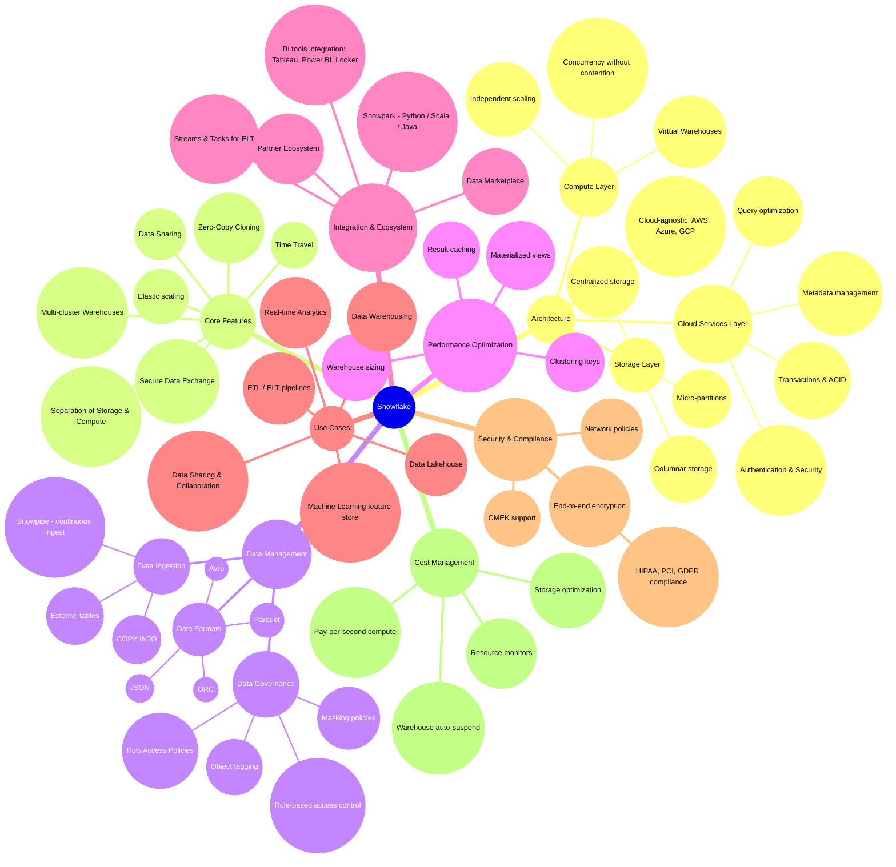
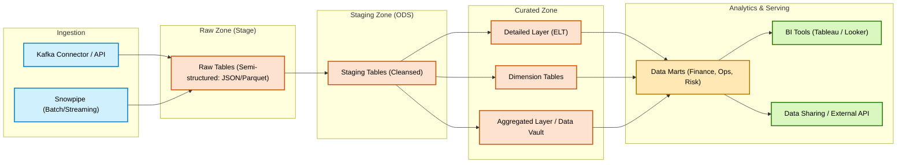

# ❄️ Snowflake – Data Engineering 



## ❄️ Snowflake vs 🌐 GCP – Data Engineering Mapping

| **Layer**                 | **GCP Service**                                                                          | **Snowflake Equivalent**                                                    | **Notes**                                                                   |
| ------------------------- | ---------------------------------------------------------------------------------------- | --------------------------------------------------------------------------- | --------------------------------------------------------------------------- |
| **Ingestion (Batch/CDC)** | Datastream (CDC from OLTP → GCS / BigQuery)                                              | **Snowpipe + Streams**                                                      | Snowpipe handles continuous file ingest; Streams track CDC changes.         |
| **Ingestion (Streaming)** | Pub/Sub (event streaming)                                                                | **Kafka Connector → Snowpipe Streaming**                                    | Pub/Sub replaced by Kafka/Confluent; ingested via Snowpipe Streaming.       |
| **Batch ETL / ELT**       | Dataflow (Beam, batch ETL) <br> Dataproc (Spark/Hadoop) <br> Data Fusion (GUI pipelines) | **ELT SQL in Snowflake + Tasks + dbt / Fivetran / Airbyte**                 | Snowflake favors in-database ELT rather than external Spark jobs.           |
| **Data Lake (Storage)**   | Cloud Storage (Raw / Staging / Curated Zones)                                            | **Snowflake Internal Micro-partition Storage** (on S3/ADLS/GCS, abstracted) | Users don’t manage storage directly; fully managed by Snowflake.            |
| **Warehouse**             | BigQuery (serverless DWH)                                                                | **Snowflake Warehouse (virtual compute + storage separation)**              | Core analytical engine.                                                     |
| **Analytics / Serving**   | BigQuery BI Engine, Looker Studio, BigQuery External Tables                              | **Data Marts in Snowflake + Tableau / PowerBI / Looker**                    | BI tools connect directly to Snowflake.                                     |
| **Real-time Search**      | Elastic (optional in GCP flows)                                                          | **Snowflake External Functions / Data Sharing**                             | Snowflake integrates with Elastic or APIs for search if needed.             |
| **Orchestration**         | Cloud Composer (Airflow)                                                                 | **Snowflake Tasks + Streams + dbt Cloud Orchestration**                     | Composer replaced by native Tasks or external orchestrators (dbt, Airflow). |
| **Machine Learning**      | Vertex AI (training & inference)                                                         | **Snowpark + UDFs / Stored Procedures**                                     | Snowpark runs Python/Java/Scala; ML can be embedded or pushed to external.  |
| **Governance**            | Dataplex + Data Catalog                                                                  | **Snowflake Governance (Masking, Row/Column Policies, Tags, Lineage)**      | Built-in fine-grained access + lineage capabilities.                        |

---

👉 This way, you can show **conceptual parity**:

* **Datastream → Snowpipe**
* **Dataflow → ELT SQL + Tasks**
* **BigQuery → Snowflake Warehouse**
* **Dataplex → Snowflake Governance**

---


## 🌱 Snowflake – Simple Version

```mermaid
flowchart LR
    subgraph L1[🔁 Data Ingestion]
        KAFKA[[📡 Kafka / Confluent<br>(Streaming Ingest)]]:::ing
        PIPE[[⛓️ Snowpipe<br>(Batch / Auto-Ingest)]]:::ing
    end

    subgraph L2[🗃️ Storage & Raw Zone]
        RAW[(❄️ Snowflake Internal Storage<br>(Raw Stage))]:::stor
    end

    subgraph L3[⚙️ Processing]
        STG[(Staging Tables)]:::proc
        STREAMS[[🔀 Streams & Tasks<br>(CDC / ELT Automation)]]:::proc
    end

    subgraph L4[🏛️ Warehouse & Modeling]
        CORE[(Core Tables: DIM / FACT)]:::wh
        MART[(Data Marts: BI / Analytics)]:::wh
    end

    subgraph L5[📊 Serving]
        BI[[📈 Tableau / Looker / PowerBI]]:::srv
        API[[🔌 Data Sharing / SQL API]]:::srv
    end

    KAFKA --> RAW
    PIPE --> RAW
    RAW --> STG
    STG --> STREAMS --> CORE --> MART --> BI
    CORE --> API

    %% Styles
    classDef ing  fill:#d0f0fd,stroke:#007acc,stroke-width:2px,color:#000;
    classDef stor fill:#fde2d0,stroke:#cc5200,stroke-width:2px,color:#000;
    classDef proc fill:#e6d0fd,stroke:#7e3ff2,stroke-width:2px,color:#000;
    classDef wh   fill:#ffe8b3,stroke:#aa7a00,stroke-width:2px,color:#000;
    classDef srv  fill:#d9f7be,stroke:#237804,stroke-width:2px,color:#000;
```

---

## 🌿 Snowflake – Middle Version



---

## 🌳 Snowflake – Detailed Version

```mermaid
flowchart LR
    %% === Ingestion Sources ===
    subgraph ING["🔁 Ingestion"]
        KAFKA[[📡 Kafka / Confluent<br>(Streaming Events)]]:::ing
        PIPE[[⛓️ Snowpipe<br>(Batch / Auto-Ingest from S3/GCS/ADLS)]]:::ing
        ETL[[⚙️ dbt Cloud / Fivetran / Airbyte<br>(ELT Orchestration)]]:::ing
    end

    %% === Storage / Zones ===
    subgraph STGZ["🗃️ Snowflake Zones"]
        RAW[(Raw Zone - Semi Structured)]:::stor
        ODS[(Staging / ODS Zone)]:::stor
        CUR[(Curated Zone - DIM / FACT / Vault)]:::stor
    end

    %% === Processing ===
    subgraph PROC["⚙️ Processing"]
        STREAMS[[🔀 Streams<br>(CDC tracking)]]:::proc
        TASKS[[⏰ Tasks<br>(Scheduling & Automation)]]:::proc
        PROC_ELT[[🧪 ELT SQL / dbt Transformations]]:::proc
    end

    %% === Warehouse & Serving ===
    subgraph WH["🏛️ Snowflake Warehouse"]
        CORE[(Core Models - Star Schema)]:::wh
        MART[(Data Marts - Domain-specific)]:::wh
    end

    subgraph SRV["📊 Serving & ML"]
        BI[[📈 Tableau / PowerBI / Looker]]:::srv
        API[[🔌 External API / Secure Data Sharing]]:::srv
        AI[[🤖 Snowpark + ML / Python / Java UDF]]:::srv
    end

    %% === Governance ===
    subgraph GOV["🗂️ Governance"]
        POLICIES[[🔒 Row/Column Masking<br>Access Policies]]:::gov
        TAGS[[🏷️ Tags & Lineage<br>(Data Governance)]]:::gov
    end

    %% === Flows ===
    KAFKA --> RAW
    PIPE --> RAW
    ETL --> RAW

    RAW --> ODS
    ODS --> CUR
    CUR --> CORE
    CORE --> MART
    MART --> BI
    MART --> API
    MART --> AI

    STREAMS -.-> ODS
    TASKS -.-> CUR
    PROC_ELT -.-> CUR

    POLICIES -.-> CUR
    TAGS -.-> CUR
    POLICIES -.-> MART
    TAGS -.-> MART

    %% Styles
    classDef ing  fill:#d0f0fd,stroke:#007acc,stroke-width:2px,rx:10,ry:10;
    classDef proc fill:#e6d0fd,stroke:#7e3ff2,stroke-width:2px,rx:10,ry:10;
    classDef stor fill:#fde2d0,stroke:#cc5200,stroke-width:2px,rx:10,ry:10;
    classDef wh   fill:#ffe8b3,stroke:#aa7a00,stroke-width:2px,rx:10,ry:10;
    classDef srv  fill:#d9f7be,stroke:#237804,stroke-width:2px,rx:10,ry:10;
    classDef gov  fill:#f0f5ff,stroke:#2f54eb,stroke-width:2px,rx:10,ry:10;
```

---


