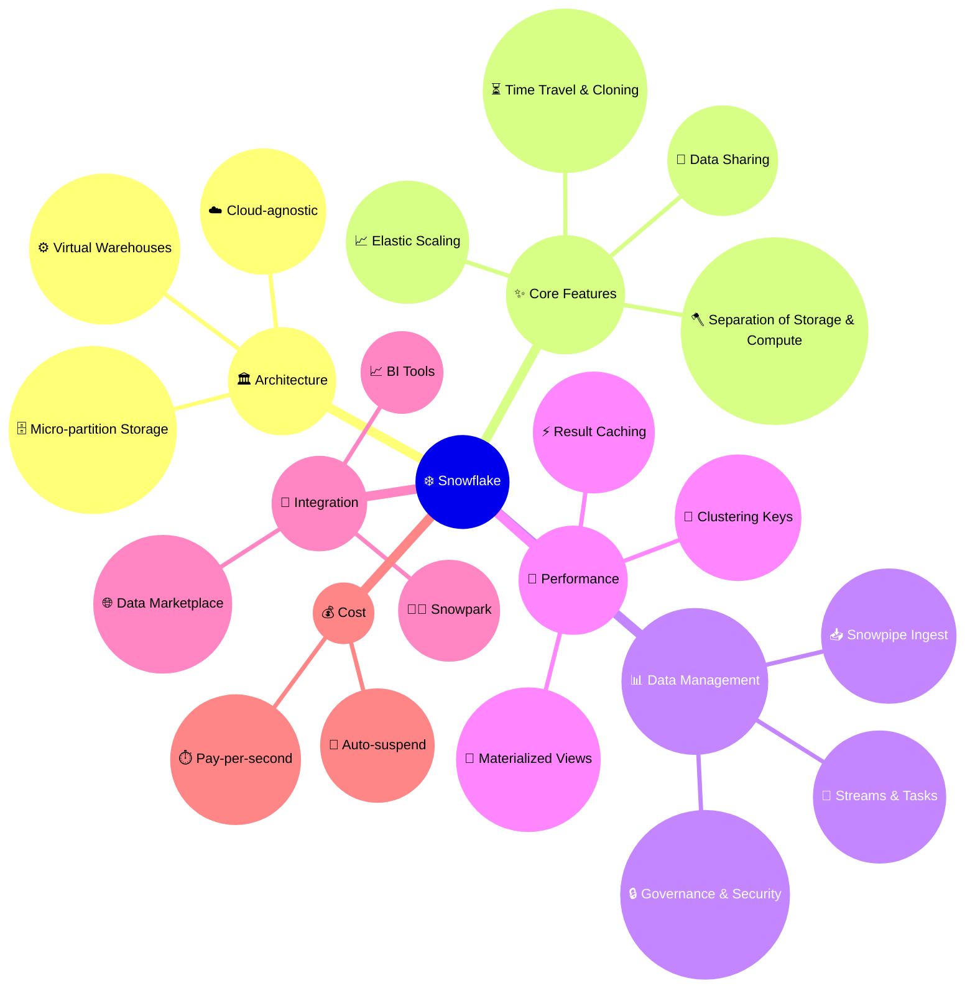
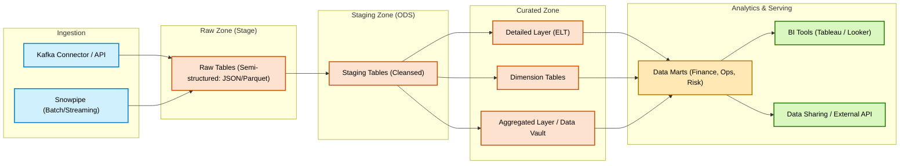

# ❄️ Snowflake – Data Engineering 

## ❄️ Snowflake vs 🌐 GCP vs ☁️ AWS – Data Engineering

| **Layer**               | **Snowflake**                                                                 | **GCP**                                                                 | **AWS**                                                                 |
|--------------------------|-------------------------------------------------------------------------------|-------------------------------------------------------------------------|-------------------------------------------------------------------------|
| **Storage (Data Lake)** | <mark>Internal Storage (Micro-partitions)</mark> <br> (abstracted, built on S3/ADLS/GCS, fully managed) | <mark>Cloud Storage (GCS)</mark> <br> (object storage, raw/staging/curated zones) | <mark>Amazon S3</mark> <br> (object storage, foundation for Lake)        |
| **Batch ETL / ELT**     | <mark>Snowpipe</mark> (continuous ingest) <br> <mark>Streams + Tasks</mark> (ELT automation) <br> <mark>SQL/dbt</mark> (in-warehouse transformations) | <mark>Dataflow</mark> (Beam, serverless) <br> <mark>Dataproc</mark> (Spark/Hadoop) <br> <mark>Data Fusion</mark> (visual pipelines) | <mark>AWS Glue</mark> (serverless ETL, Spark) <br> <mark>EMR</mark> (Hadoop/Spark cluster) |
| **Streaming ETL**       | <mark>Snowpipe Streaming</mark> + Kafka Connector                             | <mark>Pub/Sub</mark> + Dataflow (streaming)                             | <mark>Kinesis</mark>, <mark>MSK (Kafka)</mark>                          |
| **Data Warehouse**      | <mark>Snowflake Warehouse</mark> (storage-compute separation, multi-cluster elasticity) | <mark>BigQuery</mark> (serverless DW)                                   | <mark>Amazon Redshift</mark> (scalable DW)                              |
| **Compute Model**       | <mark>Virtual Warehouses</mark> (pay-per-second, scale up/down independently) | Serverless (<mark>BigQuery / Dataflow</mark>) + managed clusters (<mark>Dataproc</mark>) | Provisioned clusters (<mark>EC2 / EMR / Redshift</mark>)                 |
| **Governance / Catalog**| <mark>Snowflake Governance</mark> (RBAC, masking, row policies, tags, lineage) | <mark>Dataplex</mark> + <mark>Data Catalog</mark>                        | <mark>AWS Glue Data Catalog</mark> <br> <mark>Lake Formation</mark>       |
| **BI & Serving**        | <mark>Tableau</mark>, <mark>Power BI</mark>, <mark>Looker</mark> <br> Secure Data Sharing / SQL API | <mark>Looker Studio</mark>, BigQuery BI Engine, external BI              | <mark>Amazon QuickSight</mark> <br> External BI (Tableau, Power BI)      |
| **Machine Learning**    | <mark>Snowpark</mark> (Python/Scala/Java UDFs) <br> External ML integration (SageMaker/Vertex) | <mark>Vertex AI</mark> (training, serving, pipelines)                    | <mark>SageMaker</mark> (end-to-end ML platform)                          |
| **Orchestration**       | <mark>Snowflake Tasks</mark> + <mark>Streams</mark> <br> dbt Cloud / Airflow (external) | <mark>Cloud Composer</mark> (Airflow), Data Fusion                       | <mark>Step Functions</mark>, <mark>MWAA</mark> (Managed Airflow)         |
| **Cost Model**          | Pay-per-second compute (<mark>Warehouses</mark>) + storage billed separately  | <mark>Serverless</mark> (per-query for BigQuery, per-job for Dataflow)   | Pay for provisioned resources (compute + storage separate in S3)         |
| **Positioning**         | <mark>Cloud-agnostic Data Cloud</mark> (lake + warehouse + governance unified) | <mark>Cloud-native analytics</mark> + <mark>ML-first design</mark> (BigQuery, Vertex AI) | Broad <mark>cloud ecosystem</mark> (IaaS + PaaS) with integrated data services |




**🔑 Key Takeaways**

- **AWS** → Flexible, mature ecosystem, but often more <mark>complex to integrate</mark> (S3 + Glue + Redshift + EMR + Kinesis).  
- **GCP** → Strong in <mark>serverless analytics</mark> (BigQuery + Dataflow + Pub/Sub), tight integration with <mark>AI/ML</mark>.  
- **Snowflake** → Focused <mark>Data Cloud</mark>, excels at <mark>simplicity</mark>, <mark>elasticity</mark>, <mark>governance</mark>, and <mark>data sharing</mark>.  

👉 This way, you can show **conceptual parity**:

* **Datastream → Snowpipe**
* **Dataflow → ELT SQL + Tasks**
* **BigQuery → Snowflake Warehouse**
* **Dataplex → Snowflake Governance**

---


## 🌱 Snowflake – Simple Version

```mermaid
flowchart LR
    subgraph L1[🔁 Data Ingestion]
        KAFKA[[📡 Kafka / Confluent<br>(Streaming Ingest)]]:::ing
        PIPE[[⛓️ Snowpipe<br>(Batch / Auto-Ingest)]]:::ing
    end

    subgraph L2[🗃️ Storage & Raw Zone]
        RAW[(❄️ Snowflake Internal Storage<br>(Raw Stage))]:::stor
    end

    subgraph L3[⚙️ Processing]
        STG[(Staging Tables)]:::proc
        STREAMS[[🔀 Streams & Tasks<br>(CDC / ELT Automation)]]:::proc
    end

    subgraph L4[🏛️ Warehouse & Modeling]
        CORE[(Core Tables: DIM / FACT)]:::wh
        MART[(Data Marts: BI / Analytics)]:::wh
    end

    subgraph L5[📊 Serving]
        BI[[📈 Tableau / Looker / PowerBI]]:::srv
        API[[🔌 Data Sharing / SQL API]]:::srv
    end

    KAFKA --> RAW
    PIPE --> RAW
    RAW --> STG
    STG --> STREAMS --> CORE --> MART --> BI
    CORE --> API

    %% Styles
    classDef ing  fill:#d0f0fd,stroke:#007acc,stroke-width:2px,color:#000;
    classDef stor fill:#fde2d0,stroke:#cc5200,stroke-width:2px,color:#000;
    classDef proc fill:#e6d0fd,stroke:#7e3ff2,stroke-width:2px,color:#000;
    classDef wh   fill:#ffe8b3,stroke:#aa7a00,stroke-width:2px,color:#000;
    classDef srv  fill:#d9f7be,stroke:#237804,stroke-width:2px,color:#000;
```

---

## 🌿 Snowflake – Middle Version



---

## 🌳 Snowflake – Detailed Version

```mermaid
flowchart LR
    %% === Ingestion Sources ===
    subgraph ING["🔁 Ingestion"]
        KAFKA[[📡 Kafka / Confluent<br>(Streaming Events)]]:::ing
        PIPE[[⛓️ Snowpipe<br>(Batch / Auto-Ingest from S3/GCS/ADLS)]]:::ing
        ETL[[⚙️ dbt Cloud / Fivetran / Airbyte<br>(ELT Orchestration)]]:::ing
    end

    %% === Storage / Zones ===
    subgraph STGZ["🗃️ Snowflake Zones"]
        RAW[(Raw Zone - Semi Structured)]:::stor
        ODS[(Staging / ODS Zone)]:::stor
        CUR[(Curated Zone - DIM / FACT / Vault)]:::stor
    end

    %% === Processing ===
    subgraph PROC["⚙️ Processing"]
        STREAMS[[🔀 Streams<br>(CDC tracking)]]:::proc
        TASKS[[⏰ Tasks<br>(Scheduling & Automation)]]:::proc
        PROC_ELT[[🧪 ELT SQL / dbt Transformations]]:::proc
    end

    %% === Warehouse & Serving ===
    subgraph WH["🏛️ Snowflake Warehouse"]
        CORE[(Core Models - Star Schema)]:::wh
        MART[(Data Marts - Domain-specific)]:::wh
    end

    subgraph SRV["📊 Serving & ML"]
        BI[[📈 Tableau / PowerBI / Looker]]:::srv
        API[[🔌 External API / Secure Data Sharing]]:::srv
        AI[[🤖 Snowpark + ML / Python / Java UDF]]:::srv
    end

    %% === Governance ===
    subgraph GOV["🗂️ Governance"]
        POLICIES[[🔒 Row/Column Masking<br>Access Policies]]:::gov
        TAGS[[🏷️ Tags & Lineage<br>(Data Governance)]]:::gov
    end

    %% === Flows ===
    KAFKA --> RAW
    PIPE --> RAW
    ETL --> RAW

    RAW --> ODS
    ODS --> CUR
    CUR --> CORE
    CORE --> MART
    MART --> BI
    MART --> API
    MART --> AI

    STREAMS -.-> ODS
    TASKS -.-> CUR
    PROC_ELT -.-> CUR

    POLICIES -.-> CUR
    TAGS -.-> CUR
    POLICIES -.-> MART
    TAGS -.-> MART

    %% Styles
    classDef ing  fill:#d0f0fd,stroke:#007acc,stroke-width:2px,rx:10,ry:10;
    classDef proc fill:#e6d0fd,stroke:#7e3ff2,stroke-width:2px,rx:10,ry:10;
    classDef stor fill:#fde2d0,stroke:#cc5200,stroke-width:2px,rx:10,ry:10;
    classDef wh   fill:#ffe8b3,stroke:#aa7a00,stroke-width:2px,rx:10,ry:10;
    classDef srv  fill:#d9f7be,stroke:#237804,stroke-width:2px,rx:10,ry:10;
    classDef gov  fill:#f0f5ff,stroke:#2f54eb,stroke-width:2px,rx:10,ry:10;
```

---


