# 📚 GCP Data Engineering Q&A  

```mermaid
flowchart LR
    classDef src fill:#d0f0fd,stroke:#007acc,stroke-width:2px,color:#000,font-weight:bold
    classDef lake fill:#fde2d0,stroke:#cc5200,stroke-width:2px,color:#000,font-weight:bold
    classDef etl fill:#e6d0fd,stroke:#7e3ff2,stroke-width:2px,color:#000,font-weight:bold
    classDef wh fill:#fff3bf,stroke:#d48806,stroke-width:2px,color:#000,font-weight:bold
    classDef srv fill:#d9f7be,stroke:#389e0d,stroke-width:2px,color:#000,font-weight:bold

    subgraph Source["📥 Data Sources"]
        DB[(MySQL Orders)]:::src
        CSV[(GCS CSV Logs)]:::src
    end

    subgraph Lake["🪣 Data Lake (GCS)"]
        RAW[Raw Zone]:::lake
        STG[Staging Zone]:::lake
    end

    subgraph ETL["⚙️ Processing"]
        DF[Dataflow Batch ETL]:::etl
    end

    subgraph Warehouse["🏛️ BigQuery Data Warehouse"]
        FACT[Fact_Orders]:::wh
        DIM[Dim_Customers]:::wh
        AGG[Sales_Aggregates]:::wh
    end

    subgraph Serving["📊 Analytics"]
        LS[Looker Studio]:::srv
    end

    DB --> RAW
    CSV --> RAW
    RAW --> DF --> STG
    STG --> FACT
    STG --> DIM
    FACT --> AGG
    FACT --> LS
    DIM --> LS
    AGG --> LS
```

- [1. BigQuery (Core Data Warehouse)](#1-bigquery-core-data-warehouse)
  - [Q1. What is BigQuery?](#q1-what-is-bigquery)
  - [Q2. BigQuery Architecture](#q2-bigquery-architecture)
  - [Q3. Storage & Data Modeling](#q3-storage--data-modeling)
  - [Q4. Query Execution & Slots](#q4-query-execution--slots)
  - [Q5. Partitioning vs Clustering](#q5-partitioning-vs-clustering)
  - [Q6. External vs Native Tables](#q6-external-vs-native-tables)
  - [Q7. BigQuery Caching](#q7-bigquery-caching)
  - [Q8. Materialized Views vs Scheduled Queries](#q8-materialized-views-vs-scheduled-queries)
  - [Q9. Query Optimization Best Practices](#q9-query-optimization-best-practices)
  - [Q10. Common Pitfalls](#q10-common-pitfalls)

- [2. Cost & Security](#2-cost--security)
  - [Q11. Pricing Models](#q11-pricing-models)
  - [Q12. Cost-saving Techniques](#q12-cost-saving-techniques)
  - [Q13. Security in BigQuery](#q13-security-in-bigquery)

- [3. Data Modeling & ETL](#3-data-modeling--etl)
  - [Q14. Schema Evolution](#q14-schema-evolution)
  - [Q15. Slowly Changing Dimensions](#q15-slowly-changing-dimensions)
  - [Q16. CDC](#q16-cdc)
  - [Q17. Batch Loading](#q17-batch-loading)

- [4. Dataflow (ETL/Streaming Layer)](#4-dataflow-etlstreaming-layer)
  - [Q18. What is Dataflow?](#dataflow-qa-q18q25)
  - [Q19. Dataflow Architecture](#q19-dataflow-architecture)
  - [Q20. Batch vs Streaming](#q20-batch-vs-streaming)
  - [Q21. Event-time vs Processing-time](#q21-event-time-vs-processing-time)
  - [Q22. Windowing & Triggers](#q22-windowing--triggers)
  - [Q23. Stateful Example](#q23-stateful-example)
  - [Q24. Shuffle & Streaming Engine](#q24-shuffle--streaming-engine)
  - [Q25. Monitoring](#q25-monitoring)

- [5. Integration & Real-time](#5-integration--real-time)
  - [Q26. Pub/Sub Basics](#q26-pubsub-basics)
  - [Q27. Pub/Sub → Dataflow → BQ](#q27-pubsub--dataflow--bq)
  - [Q28. Batch ETL Pipeline](#q28-batch-etl-pipeline)
  - [Q29. Migration from Hadoop](#q29-migration-from-hadoop)
  - [Q30. E-commerce Analytics](#q30-e-commerce-analytics)

- [6. Cloud Data Fusion (Visual ETL)](#6-cloud-data-fusion-visual-etl)
  - [Q31. What is Cloud Data Fusion?](#q31-what-is-cloud-data-fusion)
  - [Q32. Data Fusion Features](#q32-data-fusion-features)
  - [Q33. Use Cases](#q33-use-cases)

- [7. Dataproc (Managed Spark/Hadoop)](#7-dataproc-managed-sparkhadoop)
  - [Q34. What is Dataproc?](#q34-what-is-dataproc)
  - [Q35. Dataproc Architecture](#q35-dataproc-architecture)
  - [Q36. When to Use](#q36-when-to-use)
  - [Q37. Cost & Optimization](#q37-cost--optimization)
  - [Q38. Pitfalls](#q38-pitfalls)

- [✅ Final Summary](#-final-summary)

- [🎯 Goal](#-goal)

## 🎯 Goal

For a **Data Engineer role focusing on GCP Data Warehouse & ETL**.

* Deep focus on **BigQuery (core warehouse)**
* Solid understanding of **ETL (batch & streaming with Dataflow)**
* Cover **Batch ETL Pipelines & Integration Scenarios**

## 1. BigQuery (Core Data Warehouse)

  

### Q1. What is BigQuery?

- BigQuery is a **<mark>serverless</mark>**, **<mark>fully managed</mark>**, **<mark>cloud data warehouse</mark>** optimized for OLAP.  
- It separates **<mark>storage (Colossus</mark>, Google’s next-gen file system, similar to HDFS)** and **<mark>Compute (slots)</mark>** using the **<mark>Dremel execution engine</mark>**.

```mermaid
flowchart TB
    classDef storage fill:#eaf4ff,stroke:#2980b9,stroke-width:1.5px,color:#000
    classDef compute fill:#f0fff0,stroke:#27ae60,stroke-width:1.5px,color:#000
    classDef schema  fill:#fff0f6,stroke:#c2185b,stroke-width:1.5px,color:#000
    classDef cache   fill:#fdf5e6,stroke:#8e44ad,stroke-width:1.5px,color:#000

    %% BigQuery as a container
    subgraph BQ["🏛️ BigQuery"]
      direction LR
      B[💾 Storage<br/>Colossus + Capacitor]:::storage
      C[⚡ Compute<br/>Dremel + Slots]:::compute
      D[🗂️ Schema<br/>Partition + Clustering]:::schema
      E[📊 Caching & Views]:::cache

      %% 隐形连线，确保它们在一行
      B --- C
      C --- D
      D --- E
    end

    %% 可选：外部链接
    %% Client --> BQ
    %% BQ --> Downstream
```

✅ BigQuery vs Hive vs SparkSQL

| Feature | BigQuery | Hive | SparkSQL |
|--------|----------|------|----------|
| Type | Managed MPP Data Warehouse | Hadoop SQL Engine | In-memory distributed SQL |
| Storage | Columnar + GCS | HDFS | HDFS/S3/GCS |
| Latency | Fast | Slow | Fast |
| Deployment | Fully managed | Self-hosted Hadoop | Self-hosted Spark |

### Q2. BigQuery Architecture

```mermaid
flowchart TD
    classDef storage fill:#e6f2ff,stroke:#004080,stroke-width:2px,color:#000,font-weight:bold
    classDef compute fill:#fff0e6,stroke:#993300,stroke-width:2px,color:#000,font-weight:bold
    classDef client  fill:#e6ffe6,stroke:#006600,stroke-width:2px,color:#000,font-weight:bold

    subgraph Client["🧑‍💻 Client Layer"]
    U1["BI Tools - Looker, Data Studio"]:::client
    U2["APIs and SDKs"]:::client
    U3["Console or CLI"]:::client
    U1 --- U2
    U2 --- U3
    end

    subgraph Compute["⚡ Dremel Execution Engine"]
    Q1["SQL Parser"]:::compute
    Q2["Execution Tree - Fan-out/Fan-in"]:::compute
    Q3["Slots - Virtual CPUs"]:::compute
    Q1 --- Q2
    Q2 --- Q3
    end

    subgraph Storage["☁️ Colossus Storage"]
    T1["Tables - Capacitor Columnar"]:::storage
    P1["Partitions and Clusters"]:::storage
    T1 --- P1
    end

    Client --> Compute
    Compute --> Storage
```

### Q3. Storage & Data Modeling

* Partitioning = split table into **chunks** (date/int).
* Clustering = sort **inside each partition** (customer\_id, product\_id).
* Schema = **Star schema** recommended.

### Q4. Query Execution & Slots

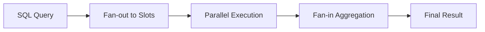

### Q5. Partitioning vs Clustering

* Partitioning = reduce scanned data.
* Clustering = speed filtering/sorting.

```mermaid
flowchart TB
    classDef part fill:#d0ebff,stroke:#1c7ed6,stroke-width:2px,color:#000,font-weight:bold
    classDef cluster fill:#ffe8cc,stroke:#d17b00,stroke-width:2px,color:#000,font-weight:bold
    classDef query fill:#d3f9d8,stroke:#2b8a3e,stroke-width:2px,color:#000,font-weight:bold

    Q[🔍 Query<br/>order_date=2025-09-07<br/>user_id=123]:::query

    subgraph P["📂 Partitioned by Date"]
      P1[📅 2025-09-06 Partition]:::part
      P2[📅 2025-09-07 Partition]:::part
      P3[📅 2025-09-08 Partition]:::part
    end

    subgraph C["📑 Clustering inside 2025-09-07 Partition"]
      C1[User_id 101 block]:::cluster
      C2[⭐ User_id 123 block]:::query
      C3[User_id 200 block]:::cluster
    end

    Q --> P2
    P2 --> C2
```

### Q6. External vs Native Tables

* **Native**: stored in BigQuery’s **Colossus**.
* **External**: data in **GCS/BigLake/Sheets**. Query via federation.
* Trade-off: flexibility vs performance.

```mermaid
flowchart TB
    classDef client fill:#e6ffe6,stroke:#006600,stroke-width:2px,color:#000,font-weight:bold
    classDef native fill:#eaf4ff,stroke:#2980b9,stroke-width:2px,color:#000,font-weight:bold
    classDef external fill:#fff0f6,stroke:#c2185b,stroke-width:2px,color:#000,font-weight:bold
    classDef trade fill:#fdf5e6,stroke:#8e44ad,stroke-width:1.5px,color:#000

    %% Client in the center
    C[🧑‍💻 Query<br/>Client/BI Tool]:::client

    %% BigQuery container
    subgraph BQ["🏛️ BigQuery"]
      direction TB
      N[💾 Native Table<br/>Colossus Storage]:::native
      X[🌐 External Table<br/>GCS / BigLake / Sheets]:::external
    end

    %% Place Client in middle linking to both
    C --> N
    C --> X

    N --> R1[⚡ Fast performance<br/>Optimized storage]:::trade
    X --> R2[🔄 Flexible federation<br/>But slower]:::trade
```

### Q7. BigQuery Caching

* Query results cached 24h.
* No cost if rerun unchanged query.

### Q8. Materialized Views vs Scheduled Queries

```mermaid
flowchart TB
    classDef mv fill:#eaf4ff,stroke:#2980b9,stroke-width:2px,color:#000,font-weight:bold
    classDef sq fill:#fff0f6,stroke:#c2185b,stroke-width:2px,color:#000,font-weight:bold
    classDef use fill:#fdf5e6,stroke:#8e44ad,stroke-width:1.5px,color:#000
    classDef diff fill:#e6ffe6,stroke:#006600,stroke-width:2px,color:#000,font-weight:bold

    C[🧑‍💻 Query Client or BI Tool]

    subgraph BQ["🏛️ BigQuery"]
      direction TB
      MV[📊 Materialized View<br/>Precomputed, Auto-refresh,<br/>Incremental updates]:::mv
      SQ[⏱️ Scheduled Query<br/>Periodic execution,<br/>Writes results into Table]:::sq
    end

    %% Differences
    subgraph D["❓ Q1. Difference"]
      DMV[✅ Best for<br/>Frequently queried aggregations]:::diff
      DSQ[✅ Best for<br/>Daily or Weekly reports]:::diff
    end

    %% Use Cases
    subgraph U["💡 Q2. Scenarios"]
      U1[⚡ Use MV → Dashboards<br/>Real-time fast queries]:::use
      U2[📅 Use SQ → Business snapshot<br/>Yesterday sales, reports]:::use
    end

    %% Connections
    C --> MV
    C --> SQ
    MV --> DMV
    SQ --> DSQ
    MV --> U1
    SQ --> U2
```

### Q9. Query Optimization Best Practices

* Avoid `SELECT *`.
* Use partition filters.
* Monitor with `INFORMATION_SCHEMA.JOBS`.

### Q10. Common Pitfalls

* Unpartitioned scans → \$\$\$.
* Too many streaming inserts.
* Misusing clustering.

| Pitfall | Explanation | Cost/Performance Impact | Best Practice |
|---------|-------------|--------------------------|---------------|
| **Unpartitioned scans** | Query runs over the entire table without filtering by partition | 🚨 Very high cost (pay per TB scanned) + slow queries | Use **Partitioning** (e.g., by date) and always filter on partition column |
| **Too many streaming inserts** | Writing rows in real-time with streaming API | 🚨 Expensive vs batch loads + quota limits | Prefer **Batch load from GCS**; if real-time needed, use **Pub/Sub + Dataflow** to micro-batch |
| **Misusing clustering** | Choosing low-cardinality fields (e.g., boolean) for clustering | 🚨 No performance benefit, still pay for scan | Use **high-cardinality, frequently filtered fields** (e.g., `user_id`, `product_id`) for clustering |

## 2. Cost & Security

```mermaid
flowchart TB
    classDef main fill:#ffe8cc,stroke:#b03a2e,stroke-width:2px,font-weight:bold,color:#000
    classDef pricing fill:#eaf4ff,stroke:#2874a6,stroke-width:2px,color:#000,font-weight:bold
    classDef saving fill:#f0fff0,stroke:#229954,stroke-width:2px,color:#000,font-weight:bold
    classDef security fill:#fff0f6,stroke:#8e44ad,stroke-width:2px,color:#000,font-weight:bold

    A[💰 Cost & 🔒 Security]:::main

    %% Q11 Pricing Models
    subgraph B["Q11. Pricing Models"]
      B1[⏳ On-demand<br/>5 USD per TB scanned]:::pricing
      B2[📊 Flat-rate<br/>Reserved slots]:::pricing
      B3[💾 Storage<br/>Active vs Long-term]:::pricing
    end

    %% Q12 Cost-saving
    subgraph C["Q12. Cost-saving Techniques"]
      C1[🗂️ Partition tables]:::saving
      C2[🗜️ Compressed formats<br/>Parquet ORC]:::saving
      C3[🚫 Avoid SELECT *]:::saving
      C4[📈 Monitor queries<br/>INFORMATION_SCHEMA]:::saving
    end

    %% Q13 Security
    subgraph D["Q13. Security in BigQuery"]
      D1[🔑 IAM<br/>Project Dataset Table]:::security
      D2[🧩 Row and Column-level policies]:::security
      D3[🔐 CMEK<br/>Customer managed keys]:::security
      D4[🛡️ VPC-SC<br/>Perimeter security]:::security
    end

    A --> B
    A --> C
    A --> D
```

## 3. Data Modeling & ETL

```mermaid
flowchart TB
    classDef main fill:#ffe8cc,stroke:#6c3483,stroke-width:2px,font-weight:bold,color:#000
    classDef schema fill:#eaf4ff,stroke:#2874a6,stroke-width:2px,color:#000,font-weight:bold
    classDef scd fill:#f0fff0,stroke:#27ae60,stroke-width:2px,color:#000,font-weight:bold
    classDef cdc fill:#fff0f6,stroke:#c2185b,stroke-width:2px,color:#000,font-weight:bold
    classDef batch fill:#fdf5e6,stroke:#8e44ad,stroke-width:2px,color:#000,font-weight:bold

    A[🧩 Data Modeling & ETL]:::main

    subgraph SE["Q14. Schema Evolution"]
      B1[➕ Add column = Easy]:::schema
      B2[❌ Drop or Change = New table + View]:::schema
    end

    subgraph SCD["Q15. Slowly Changing Dimensions"]
      C1[Type1 = Overwrite]:::scd
      C2[Type2 = New row<br/>valid_from and valid_to]:::scd
      C3[Type3 = Add new column]:::scd
    end

    subgraph CDC["Q16. Change Data Capture"]
      D1[🔄 Datastream]:::cdc
      D2[⚡ Dataflow Apply Changes]:::cdc
    end

    subgraph BL["Q17. Batch Loading"]
      E1[📂 From GCS CSV Parquet Avro]:::batch
      E2[📥 bq load or Dataflow]:::batch
      E3[✅ Parquet or Avro preferred]:::batch
    end

    A --> SE
    A --> SCD
    A --> CDC
    A --> BL
```

## 4. Dataflow (ETL/Streaming Layer)

[Data Pipeline](https://www.youtube.com/watch?v=yVUXvabnMRU)  

  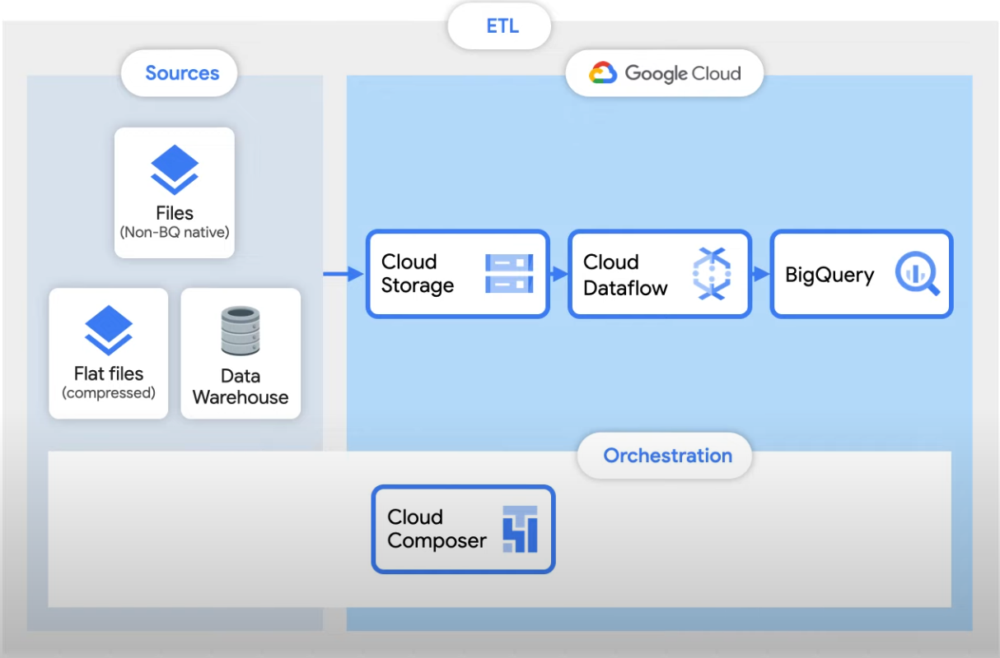

```mermaid
flowchart TB
    classDef main fill:#ffe8cc,stroke:#196f3d,stroke-width:2px,font-weight:bold,color:#000
    classDef beam fill:#eaf4ff,stroke:#1f618d,stroke-width:1.5px
    classDef window fill:#f0fff0,stroke:#27ae60,stroke-width:1.5px
    classDef state fill:#fff0f6,stroke:#c2185b,stroke-width:1.5px
    classDef shuffle fill:#fdf5e6,stroke:#8e44ad,stroke-width:1.5px
    classDef monitor fill:#e8f8f5,stroke:#148f77,stroke-width:1.5px

    A[⚙️ Dataflow]:::main
    B[🌊 Apache Beam]:::beam
    C[⏱️ Windowing & Triggers]:::window
    D[📈 Stateful Processing]:::state
    E[🔀 Shuffle/Streaming Engine]:::shuffle
    F[📡 Monitoring]:::monitor
    A --> B
    A --> C
    A --> D
    A --> E
    A --> F
```

[Google Cloud - Dataflow](https://www.youtube.com/watch?v=KalJ0VuEM7s)  

  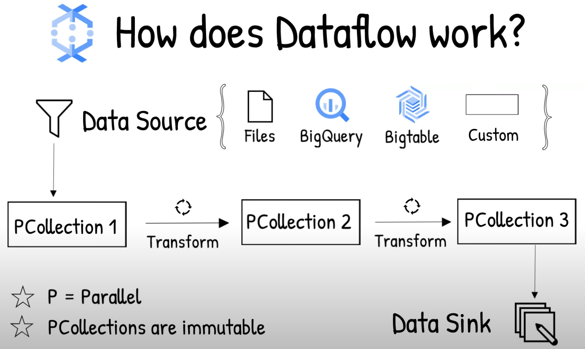

### Dataflow Q&A (Q18–Q25)

| Question | Key Points | Notes/Examples |
|----------|------------|----------------|
| **Q18. What is Dataflow?** | <mark>Serverless ETL</mark> for <mark>batch</mark> & <mark>streaming</mark>, built on <mark>Apache Beam</mark> | Unified model: one pipeline, multiple runners |
| **Q19. Dataflow Architecture** | <mark>Sources</mark>: Pub/Sub, GCS, DB   <mark>Pipeline</mark>: PCollection → PTransform → Window   <mark>Sinks</mark>: BigQuery, Bigtable, GCS | Think: <mark>Input → Transform → Output</mark> |
| **Q20. Batch vs Streaming** | <mark>Batch</mark>: daily/hourly jobs   <mark>Streaming</mark>: near real-time | Batch = <mark>GCS files</mark>, Streaming = <mark>Pub/Sub</mark> |
| **Q21. Event-time vs Processing-time** | <mark>Event-time</mark> = when event happened   <mark>Processing-time</mark> = when processed | Important for <mark>late data handling</mark> |
| **Q22. Windowing & Triggers** | <mark>Windows</mark>: Fixed, Sliding, Session   <mark>Triggers</mark>: control when partial results emitted | Example: <mark>5-min sliding window</mark> with early trigger |
| **Q23. Stateful Example** | Maintain <mark>per-key state</mark>, e.g., count clicks per user in 5 min | Requires <mark>stateful DoFn</mark> in Beam |
| **Q24. Shuffle & Streaming Engine** | <mark>Shuffle</mark>: offloaded to backend   <mark>Streaming Engine</mark>: moves state/shuffle to service | Enables <mark>autoscaling</mark> & reduces worker load |
| **Q25. Monitoring** | <mark>Stackdriver Logging</mark> + <mark>Cloud Monitoring</mark> metrics | Track <mark>latency</mark>, <mark>throughput</mark>, <mark>backlog</mark> |

## 5. Integration & Real-time

```mermaid
flowchart TB
    classDef pubsub fill:#eaf4ff,stroke:#1f618d,stroke-width:2px,color:#000,font-weight:bold
    classDef etl fill:#f0fff0,stroke:#27ae60,stroke-width:2px,color:#000,font-weight:bold
    classDef batch fill:#fff0f6,stroke:#c2185b,stroke-width:2px,color:#000,font-weight:bold
    classDef migrate fill:#fdf5e6,stroke:#8e44ad,stroke-width:2px,color:#000,font-weight:bold
    classDef bq fill:#fff3bf,stroke:#d48806,stroke-width:2px,color:#000,font-weight:bold
    classDef viz fill:#d9f7be,stroke:#389e0d,stroke-width:2px,color:#000,font-weight:bold

    %% Q26
    P[📩 Pub/Sub<br/>Real-time messaging]:::pubsub

    %% Q27
    D[⚡ Dataflow Streaming ETL]:::etl

    %% Q28
    B[📂 Batch ETL<br/>GCS → Dataflow or Dataproc]:::batch

    %% Q29
    M[🚚 Migration<br/>HDFS → GCS, Hive → Dataproc]:::migrate

    %% Q30
    W[🏛️ BigQuery<br/>Star Schema]:::bq
    V[📊 Looker<br/>Visualization]:::viz

    %% Flows
    P --> D --> W
    B --> W
    M --> W
    W --> V
```

| **Dimension** | Cloud Data Fusion (CDF) | Dataflow (Apache Beam) | Dataproc (Spark/Hadoop) |
|---|---|---|---|
| **Development model** | <mark>Low-code</mark>, visual pipelines, drag-and-drop | <mark>Code-first</mark> (Java/Python/SQL via <mark>Beam</mark> SDKs) | <mark>Code-first</mark> (<mark>Spark</mark>/Scala/PySpark, Hive) |
| **Primary paradigm** | <mark>Visual ETL/ELT</mark>, multi-source batch integration | <mark>Streaming</mark> + batch ETL with <mark>state</mark>, <mark>windows</mark>, <mark>triggers</mark> | <mark>Large-scale batch</mark>, existing <mark>Spark/Hadoop</mark> workloads |
| **Runtime / engine** | Runs on <mark>Dataproc/Spark</mark> via Profiles | Managed <mark>Beam runner</mark> (Dataflow) | Managed <mark>Spark/Hadoop</mark> clusters or Serverless |
| **Latency profile** | Minutes-level (cluster spin-up, scheduling) | <mark>Seconds / sub-seconds</mark> for streaming; efficient batch | Minutes to hours for batch; streaming via Spark Structured Streaming |
| **Streaming strength** | Good for standardized batch; can read Pub/Sub | <mark>Strongest</mark>: exactly-once sinks, stateful processing | Possible, but more ops effort; better for batch |
| **Connectors** | <mark>Rich catalog</mark>: JDBC, SaaS, GCS, <mark>BigQuery</mark>, Pub/Sub | Beam I/O connectors (broad, code-driven) | Spark ecosystem connectors; <mark>BigQuery connector</mark>, JDBC |
| **Ops & cost levers** | Low build effort; runtime uses Dataproc. Use <mark>temporary clusters</mark> and right-sized <mark>profiles</mark> | Serverless <mark>autoscaling</mark>, batching, efficient windows/triggers | <mark>Ephemeral clusters</mark>, <mark>preemptible workers</mark>, autoscaling; tuning needed |
| **Best fit** | <mark>Low-code teams</mark>, many sources, standardized batch, governance | <mark>Low-latency real-time</mark>, complex stateful ETL, portable logic | <mark>Existing Spark assets</mark>, custom libs, heavy offline batch |
| **Typical example** | SaaS/JDBC + files → cleanse/joins → BigQuery | Pub/Sub → Dataflow (sessionization/state) → BigQuery | HDFS/Parquet → Spark jobs → BigQuery via connector |

## 6. Cloud Data Fusion (Visual ETL)

```mermaid
flowchart TB
    classDef main fill:#ffe8cc,stroke:#154360,stroke-width:2px,font-weight:bold,color:#000
    classDef feat fill:#eaf4ff,stroke:#1f618d,stroke-width:2px,color:#000,font-weight:bold
    classDef use fill:#f0fff0,stroke:#27ae60,stroke-width:2px,color:#000,font-weight:bold
    classDef arch fill:#fff0f6,stroke:#c2185b,stroke-width:2px,color:#000,font-weight:bold

    A[🧩 Cloud Data Fusion<br/>Visual ETL]:::main

    subgraph Arch["Q31. What is CDF"]
      D1[🎨 Managed visual data integration<br/>Built on CDAP]:::arch
      D2[🖱️ Low-code ETL pipelines]:::arch
      D3[⚙️ Runtime = Dataflow streaming<br/>or Dataproc batch]:::arch
    end

    subgraph Feat["Q32. Features"]
      F1[🧹 Wrangler for data prep]:::feat
      F2[❌ Error handling<br/>dead-letter, retry]:::feat
      F3[📐 Schema drift alerts]:::feat
      F4[🚀 CI/CD export and deploy]:::feat
    end

    subgraph Use["Q33. Use Cases"]
      U1[🗄️ DB → BQ batch ingestion]:::use
      U2[📂 GCS CSV → Wrangler → BQ]:::use
      U3[📩 Pub/Sub → BQ streaming]:::use
    end

    A --> Arch
    A --> Feat
    A --> Use
```

## 7. Dataproc (Managed Spark/Hadoop)

```mermaid
flowchart TB
    classDef main fill:#ffe8cc,stroke:#d35400,stroke-width:2px,font-weight:bold,color:#000
    classDef arch fill:#eaf4ff,stroke:#2980b9,stroke-width:2px,color:#000,font-weight:bold
    classDef use fill:#f0fff0,stroke:#27ae60,stroke-width:2px,color:#000,font-weight:bold
    classDef cost fill:#fff0f6,stroke:#c2185b,stroke-width:2px,color:#000,font-weight:bold
    classDef pitfalls fill:#fdf5e6,stroke:#8e44ad,stroke-width:2px,color:#000,font-weight:bold

    A[🏔️ Dataproc<br/>Managed Spark/Hadoop]:::main

    subgraph Arch["Q35. Architecture"]
      M[🖥️ Master/Worker VMs]:::arch
      G[☁️ GCS as HDFS]:::arch
      C[⏳ Ephemeral or Long-running Clusters]:::arch
    end

    subgraph Use["Q36. When to Use"]
      U1[📦 Lift & Shift Hadoop/Spark]:::use
      U2[⚙️ Complex Batch ETL]:::use
      U3[🧪 PySpark ML/ETL Pipelines]:::use
    end

    subgraph Cost["Q37. Cost & Optimization"]
      P1[💵 Pay per VM-minute]:::cost
      P2[⚡ Ephemeral clusters → savings]:::cost
      P3[📂 Prefer GCS over HDFS]:::cost
    end

    subgraph Pitfalls["Q38. Pitfalls"]
      F1[⏸️ Leaving clusters idle]:::pitfalls
      F2[📂 Using HDFS instead of GCS]:::pitfalls
      F3[⚠️ Poor Spark tuning]:::pitfalls
    end

    A --> Arch
    A --> Use
    A --> Cost
    A --> Pitfalls
```

# ✅ Final Summary

* **BigQuery** → Data Warehouse Core.
* **Dataflow** → Batch + Streaming ETL (Apache Beam).
* **Pub/Sub** → Real-time ingestion.
* **Cloud Data Fusion** → Visual low-code ETL (runs on Dataflow/Dataproc).
* **Dataproc** → Legacy Spark/Hadoop bridge.
* Together → End-to-end **GCP Data Platform** (batch + streaming + migration).
