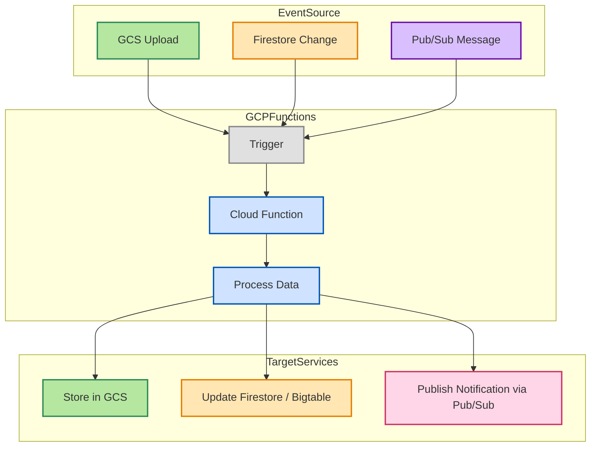

# 📦 GCP Data Engineering Overview

> 📚 Motivation: In life you can choose who you want to be; be very careful with that choice.

🌅 [**GCP Data Engineer – Equivalent**](https://cloud.google.com/certification)

- Google Cloud Storage (GCS)

---

## ✅ Cloud Data Platform Comparison

| **Layer**        | AWS                           | Azure                              | GCP                               | Traditional          |
|------------------|-------------------------------|------------------------------------|-----------------------------------|----------------------|
| **Storage Layer**   (for Data Lake)    | Amazon S3                     | Azure Data Lake Storage (ADLS)     | Google Cloud Storage (GCS)        | HDFS (cloudified)    |
| **Batch ETL**    | AWS Glue / EMR                | Azure Data Factory / HDInsight     | Dataflow / Dataproc               | Spark                |
| **Data Warehouse** | Amazon Redshift             | Azure Synapse Analytics            | BigQuery                          | Hive / Impala (DW)   |
| **Streaming ETL**| Kinesis / MSK / KDA           | Event Hubs / Stream Analytics      | Pub/Sub + Dataflow (streaming)    | Flink / Storm        |

---

## Preface

In modern data architecture, GCP provides a comprehensive set of tools to support the full data lifecycle — from ingestion and storage to processing and orchestration. 

> Solid line → main path (core data flow), Dashed line → optional/supplementary path; CDC: Change Data Capture

### Serverless Compute with Lambda

| **Category**         | **AWS**                    | **GCP Equivalent**                           |
| -------------------- | -------------------------- | -------------------------------------------- |
| Event Sources | **S3 Upload** → S3         | **Cloud Storage (GCS) Upload**               |
|                      | **DynamoDB Change**        | **Cloud Firestore / Cloud Datastore Change** |
|                      | **Kinesis Stream**         | **Pub/Sub Message**                          |
| Serverless Compute   | **AWS Lambda**             | **Cloud Functions** / **Cloud Run**          |
| Target Services  | **Store in S3**            | **Store in GCS**                             |
|                      | **Update DynamoDB**        | **Update Firestore / Bigtable**              |
|                      | **SNS / SQS Notification** | **Pub/Sub Notification**                     |

