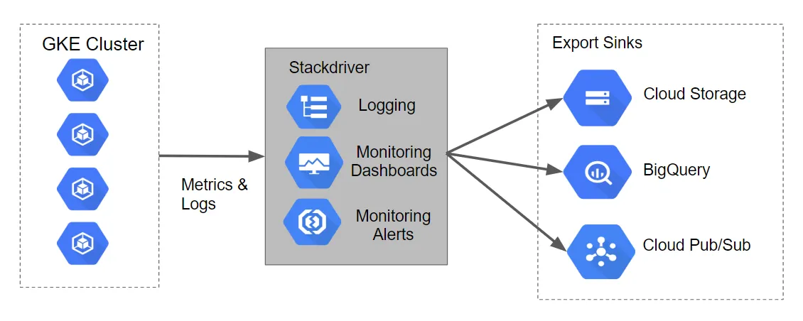

# Google Cloud Professional Data Engineer — Q&A (Q319)

<div align="center">
  
</div>

> Datastore ≈ Firestore (Datastore mode) = Document-oriented / Non-relational database

## 1. Machine Learning & TensorFlow
- [Q1: TensorFlow Overfitting Prevention](#q1-tensorflow-overfitting-prevention)
- [Q2: Retraining Recommendation Model](#q2-retraining-recommendation-model)
- [Q7: Predict Housing Prices](#q7-predict-housing-prices)
- [Q14: Unsupervised Anomaly Detection](#q14-unsupervised-anomaly-detection)
- [Q27: Speeding Up Model Training](#q27-speeding-up-model-training)
- [Q203: Faster TensorFlow Training](#q203-faster-tensorflow-training)
- [Q204: BigQuery ML + Vertex AI for Streaming](#q204-bigquery-ml--vertex-ai-for-streaming)
- [Q243: Handling Nulls in BigQueryML](#q243-handling-nulls-in-bigqueryml)
- [Q245: Next Step in ML Lifecycle](#q245-next-step-in-ml-lifecycle)

---

## 2. BigQuery Basics

<div align="center">
  
</div>

**BigQuery Table Types**

<div align="center">
  
</div>

### A) Query Patterns & SQL Features 

* [Q5: Partitioning vs Clustering ✅](#q5-partitioning-vs-clustering)
* [Q8: Deduplication with ROW\_NUMBER window function ✅](#q8-deduplication-with-row_number-window-function)
* [Q9: Wildcard Tables ✅](#q9-wildcard-tables)
* [Q53: Slow GROUP BY due to data skew ✅](#q53-slow-group-by-due-to-data-skew)
* [Q56: Legacy SQL over sharded tables — use `TABLE_DATE_RANGE` ✅](#q56-legacy-sql-over-sharded-tables--use-table_date_range)

### B) Ingestion, Freshness & Consistency

* [Q15: Streaming inserts are eventually consistent (wait before query) ✅](#q15-streaming-inserts-are-eventually-consistent-wait-before-query)
* [Q24: Convert STRING to TIMESTAMP with new table ✅](#q24-convert-string-to-timestamp-with-new-table)
* [Q48: CSV import mismatch — fix file encoding (BigQuery defaults to UTF-8) ✅](#q48-csv-import-mismatch--fix-file-encoding-bigquery-defaults-to-utf-8)

### C) Governance & Access Control

* [Q10: Restrict access in BigQuery (IAM roles, dataset isolation) ✅](#q10-restrict-access-in-bigquery-iam-roles-dataset-isolation)
* [Q40: Enforce regional access — dataset-per-region + IAM on datasets ✅](#q40-enforce-regional-access--dataset-per-region--iam-on-datasets)

### D) Admin, Performance & Workload Mgmt

* [Q233: Troubleshooting BigQuery slot contention ✅](#q233-troubleshooting-bigquery-slot-contention)
* [Q239: Concurrency issues with slots ✅](#q239-concurrency-issues-with-slots)

### E) Data Modeling & Table Design

* [Q60: Replace sharded tables with one partitioned table ✅](#q60-replace-sharded-tables-with-one-partitioned-table)
* [Q252: Designing customer–product–subscription model ✅](#q252-designing-customerproductsubscription-model)

### F) Integration & BI (Looker Studio / Tools)

* [Q4: Disable caching in Data Studio report (data missing for <1h) ✅](#q4-disable-caching-in-data-studio-report-data-missing-for-1h)
* [Q25: Stackdriver Logging + advanced filter for BQ insert jobs ✅](#q25-stackdriver-logging--advanced-filter-for-bq-insert-jobs)
* [Q36: Use a view to simplify columns for BI and cut query cost ✅](#q36-use-a-view-to-simplify-columns-for-bi-and-cut-query-cost)
* [Q39: Data Studio on BigQuery — build filtered, fast reports ✅](#q39-data-studio-on-bigquery--build-filtered-fast-reports)
* [Q43: Expose `FullName` via a BigQuery view (avoid reshaping data) ✅](#q43-expose-fullname-via-a-bigquery-view-avoid-reshaping-data)
* [Q46: Keep frequently updated reference data via BigQuery external table (GCS) ✅](#q46-keep-frequently-updated-reference-data-via-bigquery-external-table-gcs)
* [Q55: ODBC access — use Standard SQL view + service account ✅](#q55-odbc-access--use-standard-sql-view--service-account)

### G) Views & Materialized Views

* [Q248: Filtering rows with views vs materialized views ✅](#q248-filtering-rows-with-views-vs-materialized-views)


## 3. Cost & Security
- [Q11: Pricing Models ✅](#q11-pricing-models)
- [Q12: Cost-Saving Techniques ✅](#q12-cost-saving-techniques)
- [Q13: Security in BigQuery ✅](#q13-security-in-bigquery)
- [Q200: PII Protection](#q200-pii-protection)
- [Q215: CMEK Sharing](#q215-cmek-sharing)
- [Q238: Per-User Crypto-Deletion](#q238-per-user-crypto-deletion)

---

## 4. Data Modeling & ETL
- [Q14: SCD Types](#q14-scd-types)
- [Q16: CDC Pipelines](#q16-cdc-pipelines)
- [Q17: Batch Loading](#q17-batch-loading)
- [Q223: Dataform Assertions](#q223-dataform-assertions)
- [Q252: Data Warehouse Design](#q252-data-warehouse-design)

---

## 5. Dataflow & Pipelines
- [Q5: Handling Corrupted CSV Data](#q5-handling-corrupted-csv-data)
- [Q11: Basket Abandonment with Session Window](#q11-basket-abandonment-with-session-window)
- [Q212: Dataflow Firewall Troubleshooting](#q212-dataflow-firewall-troubleshooting)
- [Q253: Dataflow Internal IP Only](#q253-dataflow-internal-ip-only)
- [Q254: Dataflow Performance Optimization](#q254-dataflow-performance-optimization)


## 6. Dataplex / Data Mesh / Governance
- [Q16: Securing BigQuery with Audit Logs](#q16-securing-bigquery-with-audit-logs)
- [Q210: Dataplex Design for Data Products](#q210-dataplex-design-for-data-products)
- [Q217: Secure BigQuery Sharing with Policy Tags](#q217-secure-bigquery-sharing-with-policy-tags)
- [Q240: Dataplex Permissions](#q240-dataplex-permissions)
- [Q244: Analytics Hub Sharing](#q244-analytics-hub-sharing)
- [Q247: Data Mesh with Dataplex](#q247-data-mesh-with-dataplex)

## 7. Pub/Sub & Messaging
- [Q20: Duplicate Messages](#q20-duplicate-messages)
- [Q224: Dataflow Lag in Pub/Sub](#q224-dataflow-lag-in-pubsub)
- [Q228: Reprocessing Pub/Sub Messages](#q228-reprocessing-pubsub-messages)

---

## 8. Cloud SQL / Spanner / Databases
- [Q3: Scaling Patient Records](#q3-scaling-patient-records)
- [Q6: Weather App DB Failure Handling](#q6-weather-app-db-failure-handling)
- [Q197: ACID-Compliant Database](#q197-acid-compliant-database)
- [Q218: Cloud SQL Disaster Recovery](#q218-cloud-sql-disaster-recovery)
- [Q236: HA Cloud SQL Multi-Region](#q236-ha-cloud-sql-multi-region)


## 9. Cloud Storage & Data Lake
- [Q17: Migrating Hadoop Jobs to Cloud Dataproc with GCS Connector](#q17-migrating-hadoop-jobs-to-cloud-dataproc-with-gcs-connector)
- [Q19: Storage Costs with Dataproc](#q19-storage-costs-with-dataproc)
- [Q241: Cloud Storage RPO Design](#q241-cloud-storage-rpo-design)
- [Q249: Cost Optimization for Raw Data](#q249-cost-optimization-for-raw-data)
- [Q251: Retention Policy Lock](#q251-retention-policy-lock)
- [Q257: Autoclass for Data Lake](#q257-autoclass-for-data-lake)

## 10. Governance & IAM
- [Q10: Restricting Access in BigQuery](#q10-restricting-access-in-bigquery)
- [Q232: Resource Location Policy](#q232-resource-location-policy)
- [Q226: Pub/Sub Isolation with VPC-SC](#q226-pubsub-isolation-with-vpc-sc)

---


## 1. Machine Learning & TensorFlow

#### Q1: TensorFlow Overfitting Prevention


**Question:**  
Your company built a TensorFlow neural-network model with a large number of neurons and layers. The model fits well for the training data. However, when tested against new data, it performs poorly. What method can you employ to address this?

- **Answer:** A. Apply **regularization techniques** such as dropout, L1/L2 penalties, or early stopping.  
  - Overfitting means the model memorizes training data but fails to generalize.  
  - **Dropout** randomly disables neurons during training, preventing co-adaptation.  
  - **L1/L2 regularization** penalizes overly complex weights.  
  - **Early stopping** halts training once validation loss stops improving.  

## 2. BigQuery Basics

### A) Query Patterns & SQL Features

#### Q5: Partitioning vs Clustering

**Question:**
Your team wants to optimize query performance and cost in BigQuery. What is the difference between partitioning and clustering, and how can they be combined?

**Answer:**

  * <mark>Partitioning</mark> reduces the amount of data scanned by filtering on partition keys (e.g., date).
  * <mark>Clustering</mark> organizes data inside partitions based on specified columns, improving filtering and sorting.
  * <mark>Best Practice:</mark> Combine both. Example: Partition by `order_date` and cluster by `user_id`. This minimizes scanned data and speeds up queries.

---

#### Q8: Deduplication with ROW\_NUMBER window function

**Question:**
You are building a new real-time data warehouse using <mark>BigQuery streaming inserts</mark>. Since there’s no guarantee that data will only be sent once, but you do have a <mark>unique ID</mark> for each row and an <mark>event timestamp</mark>, you want to ensure that <mark>duplicates</mark> are not included when querying. Which query type should you use?

**Answer:**
  Use the <mark>ROW\_NUMBER</mark> window function with `PARTITION BY unique_id` and filter on `row_number = 1`.

**Explanation:**

* Streaming inserts may produce <mark>duplicate rows</mark>.
* To deduplicate:

  * Partition by <mark>unique ID</mark>.
  * Order by <mark>event timestamp</mark>.
  * Select only the <mark>first row</mark>.

```sql
SELECT *
FROM (
  SELECT *, ROW_NUMBER() OVER(PARTITION BY unique_id ORDER BY event_ts DESC) AS rn
  FROM mytable
)
WHERE rn = 1;
```

---

#### Q9: Wildcard Tables in BigQuery

**Question:**
You need to query across multiple tables in BigQuery whose names share a prefix (e.g., `gsod*`). Which query syntax should you use?

**Answer:**
  Use <mark>wildcards</mark> in the table name with <mark>backticks</mark>.

```sql
SELECT * 
FROM `bigquery-public-data.noaa_gsod.gsod*`
WHERE _TABLE_SUFFIX BETWEEN '2010' AND '2012';
```

**Explanation:**

* <mark>`_TABLE_SUFFIX`</mark> pseudo-column lets you filter specific tables.
* <mark>Best Practice:</mark> Prefer <mark>partitioned tables</mark> instead of sharded ones when designing new pipelines.

---

#### Q53: Slow GROUP BY due to data skew

**Question:**
Your users report that a simple query with `GROUP BY country` in BigQuery is running very slowly. The table is large, and the query plan shows imbalance in stage execution. What is the most likely cause?

**Answer:**
  The slowdown is caused by <mark>data skew</mark> — most rows in the table have the <mark>same value</mark> in the `country` column, leading to <mark>uneven slot usage</mark>.

**Explanation:**

* BigQuery distributes data by <mark>shuffling keys</mark>.
* If one key dominates (e.g., `"US"`), a <mark>single reducer</mark> gets overloaded.
* <mark>Best Practice:</mark>

  * Pre-aggregate or bucket data.
  * Use <mark>approximate functions</mark> like `APPROX_TOP_COUNT`.
  * Apply <mark>clustering/partitioning</mark> to balance load.

---

#### Q56: Legacy SQL over sharded tables — use `TABLE_DATE_RANGE`

**Question:**
Your Firebase Analytics integration automatically creates daily tables (e.g., `app_events_20240815`). You need to query across the past 30 days in Legacy SQL. What function should you use?

**Answer:**
  Use the <mark>`TABLE_DATE_RANGE`</mark> function in <mark>Legacy SQL</mark>.

```sql
SELECT event_name, COUNT(*)
FROM TABLE_DATE_RANGE([mydataset.app_events_],
                      TIMESTAMP("2024-08-01"),
                      TIMESTAMP("2024-08-30"))
GROUP BY event_name;
```

**Explanation:**

* Legacy SQL requires <mark>`TABLE_DATE_RANGE`</mark>.
* Standard SQL supports <mark>wildcards</mark> with <mark>`_TABLE_SUFFIX`</mark>.
* <mark>Best Practice:</mark> Use <mark>partitioned tables</mark> instead of sharding.

---

### B) Ingestion, Freshness & Consistency

#### Q15: Consistency in BigQuery Streaming Inserts

**Question:**
Your application streams data into BigQuery, and analysts complain that some records appear missing when querying right after insertion. How should you handle this?

**Answer:** <mark>Wait twice the average streaming latency before querying</mark>.

**Explanation:**

* Streaming inserts are <mark>eventually consistent</mark>.
* Queries executed too early may not return all rows.
* Wait a short buffer time for data to fully commit.


#### Q24: Convert STRING to TIMESTAMP with new table

**Question:**
You have a table where `event_time` is stored as a <mark>STRING</mark>. Analysts need it as a <mark>TIMESTAMP</mark>. How should you provide it without affecting the raw table?

**Answer:**
  Create a <mark>new table</mark> with `CAST(event_time AS TIMESTAMP)`.

```sql
CREATE OR REPLACE TABLE mydataset.cleaned_events AS
SELECT
  event_id,
  CAST(event_time AS TIMESTAMP) AS event_ts
FROM mydataset.raw_events;
```

**Explanation:**

* Keeps <mark>raw data</mark> intact.
* Provides analysts with <mark>cleaned schema</mark>.
* <mark>Best Practice:</mark> Always separate raw and transformed data layers.

---

#### Q48: CSV import mismatch — fix file encoding

**Question:**
Your CSV import into BigQuery succeeded, but the imported data does not match the source file byte-to-byte. What is the most likely cause?

**Answer:**
  BigQuery <mark>defaults to UTF-8 encoding</mark>. If the source file uses another encoding, mismatches occur.

**Explanation:**

* Always ensure <mark>CSV file encoding = UTF-8</mark>.
* If not, convert the file before loading.
* <mark>Best Practice:</mark> Standardize file encoding across pipelines.

---

### C) Governance & Access Control

#### Q10: Restrict access in BigQuery (IAM roles, dataset isolation)

**Question:**
Your company is in a highly regulated industry. One requirement is to ensure users have access only to the <mark>minimum information</mark> needed. How should you enforce this in BigQuery? (Choose three)

**Answer:**

  * <mark>Restrict access by IAM role</mark>
  * <mark>Restrict dataset access</mark>
  * <mark>Segregate data across datasets/tables</mark>

**Explanation:**

* BigQuery uses <mark>IAM roles</mark> for access control.
* <mark>Least privilege principle</mark>:
  * Assign <mark>dataset/table-level</mark> roles, not project-wide.
  * Separate <mark>sensitive data</mark> into dedicated datasets.
* <mark>Audit logs</mark> and <mark>encryption</mark> add compliance but do not enforce row/column-level access.


#### Q40: Enforce regional access — dataset-per-region + IAM

**Question:**
You created regional tables for a company policy where employees should only access data for their own region. How do you enforce this?

**Answer:**

  * Store tables in <mark>separate datasets per region</mark>.
  * Grant <mark>IAM access</mark> only to the relevant dataset.

**Explanation:**

* <mark>Dataset-level IAM</mark> is easier to maintain than table-level rules.
* Avoid duplicating tables into one dataset with complex filters.
* <mark>Best Practice:</mark> use <mark>dataset-per-region</mark> for clear boundaries.


### D) Admin, Performance & Workload Mgmt

#### Q233: Troubleshooting BigQuery slot contention

**Question:**
You suspect BigQuery query slowness is due to <mark>slot contention</mark>. How can you confirm?

**Answer:**

  * Query <mark>INFORMATION\_SCHEMA.JOBS</mark>
  * Use <mark>BigQuery admin resource charts</mark>

**Explanation:**

* INFORMATION\_SCHEMA shows <mark>job queuing and slot usage</mark>.
* Admin charts visualize <mark>slot allocation</mark>.
* Together, they help identify contention.


#### Q239: Concurrency issues with BigQuery slots

**Question:**
Your analysts run ad hoc queries, and you have 1500 scheduled jobs at peak, causing <mark>quota errors</mark>. How do you resolve concurrency?

**Answer:**

  * Run pipelines as <mark>batch queries</mark>.
  * Keep ad hoc as <mark>interactive queries</mark>.

**Explanation:**

* Batch jobs queue until slots free up, reducing pressure.
* Interactive queries remain responsive.
* <mark>Best Practice:</mark> Reserve slots only if workloads are predictable.


### E) Data Modeling & Table Design

#### Q60: Replace sharded tables with one partitioned table

**Question:**
You have 3 years of daily log tables (e.g., `LOGS_20210101`). Queries fail when scanning >1000 tables. How do you fix this?

**Answer:**
  Convert to a <mark>partitioned table</mark>.

**Explanation:**

* Partitioned tables scale better and avoid query limits.
* Easier to manage retention policies.
* <mark>Best Practice:</mark> Never use sharded tables for long-term pipelines.

---

#### Q252: Designing customer–product–subscription model

**Question:**  
You are designing a data warehouse in BigQuery to analyze sales data for a **telecommunication service provider**.  
You need to create a model for **customers, products, and subscriptions**.  
All entities can be **updated monthly**, but you must **maintain historical records**.  
The visualization layer must support **current and historical reporting**, and the model should be **simple, easy-to-use, and cost-effective**.  

**Answer:**  
  Use a <mark>denormalized</mark>, <mark>append-only</mark> model with <mark>nested and repeated fields</mark>, and include an <mark>ingestion timestamp</mark> to track historical data.  

**Explanation:**  

* **Denormalized**: Put customers, products, and subscriptions together in one table to reduce joins.  
* **Append-only**: Insert new rows instead of overwriting old ones, to preserve history.  
* **Nested/repeated fields**: Capture multiple subscriptions per customer efficiently.  
* **Ingestion timestamp**: Enables both point-in-time and current-state reporting.  

<mark>Best Practice:</mark> In BigQuery, prefer **wide denormalized tables** with nested fields for performance and cost efficiency, instead of complex star schemas.  

**Example Query — Count Active Subscriptions**

```sql
SELECT
  customer_id,
  customer_name,
  COUNTIF(sub.status = "Active") AS active_subscriptions
FROM telco.sales_data,
     UNNEST(products) AS p,
     UNNEST(p.subscriptions) AS sub
WHERE sub.end_date IS NULL OR sub.end_date > CURRENT_DATE()
GROUP BY customer_id, customer_name;
```

👉 This query uses **`UNNEST`** to flatten nested arrays (`products` and `subscriptions`),
then filters by `status = "Active"` and `end_date` to count current active subscriptions per customer.


### F) Integration & BI (Looker Studio / Tools)

#### Q4: Disable caching in Data Studio report (data missing for <1h)

**Question:**  
You create an important report for your large team in **Google Data Studio (Looker Studio)**.  
The report uses **BigQuery** as its data source.  

You notice that visualizations are not showing data that is **less than 1 hour old**.  
What should you do?

**Answer:**  
  <mark>Disable caching</mark> by editing the **report settings** in Data Studio.


#### Q25: Stackdriver Logging + advanced filter for BQ insert jobs

**Question:**
Your team suspects some BigQuery insert jobs are failing. How can you identify the failed jobs?

**Answer:**
  Use <mark>Stackdriver (Cloud Logging)</mark> with <mark>advanced filters</mark>.

<div align="center">
  
</div>

**Explanation:**

* Search `resource.type="bigquery_resource"` and `protoPayload.methodName="jobservice.insert"` in logs.
* Filter by <mark>status.errorResult</mark> to find failures.
* <mark>Best Practice:</mark> Always set up log-based alerts for job failures.

---

#### Q36: Use a view to simplify columns for BI and cut query cost

**Question:**
Your BI team struggles with too many columns in a large table and high query costs. What should you do?

**Answer:**
  Create a <mark>view</mark> exposing only the needed columns.

<div align="center">
  
</div>

**Explanation:**

* Views reduce <mark>query cost</mark> by limiting scanned columns.
* BI users see a <mark>simplified schema</mark>.
* <mark>Best Practice:</mark> Provide curated views for business users.


```sql
CREATE VIEW sales_summary AS
SELECT
  order_id,
  customer_id,
  total_amount,
  order_date
FROM raw_sales_table;
```

---

#### Q39: Data Studio on BigQuery — build filtered, fast reports

**Question:**
You need to create dashboards in Data Studio on BigQuery with <mark>fast performance</mark>. What design should you use?

**Answer:**

  * Pre-filter and aggregate data in <mark>BigQuery views</mark>.
  * Use <mark>clustering</mark> or <mark>materialized views</mark> if queries repeat.

**Explanation:**

* Avoid exposing raw wide tables to BI tools.
* Reduce <mark>data scanned</mark> before visualization.
* <mark>Best Practice:</mark> Build a BI-friendly semantic layer.

---

#### Q43: Expose `FullName` via a BigQuery view

**Question:**
You need a `FullName` field (`FirstName + LastName`) in a `Users` table. How do you provide it without altering the schema?

**Answer:**
  Create a <mark>view</mark> that concatenates the fields.

<div align="center">
  
</div>

```sql
CREATE MATERIALIZED VIEW mydataset.v_users AS
SELECT
  FirstName,
  LastName,
  CONCAT(FirstName, " ", LastName) AS FullName
FROM mydataset.users
WHERE status = 'ACTIVE';
```

**Explanation:**

* Keeps <mark>raw table</mark> unchanged.
* Avoids <mark>storage cost</mark> of duplicating data.
* <mark>Best Practice:</mark> Use views for derived fields.


#### Q46: Keep frequently updated reference data via BigQuery external table

**Question:**
You have a dataset of prices updated every 30 minutes. How should you expose it to BigQuery for cheap queries?

<div align="center">
  
</div>

**Answer:**
  Store it in <mark>Cloud Storage</mark> and use a <mark>federated external table</mark>.

**Explanation:**

* Avoid frequent re-loads into BigQuery.
* External table reflects updates directly.
* <mark>Best Practice:</mark> Use for small, frequently refreshed reference data.

---

#### Q55: ODBC access — use Standard SQL view + service account

**Question:**
Your team will connect to BigQuery via ODBC, but your current view is in <mark>Legacy SQL</mark>. How do you ensure compatibility?

**Answer:**

  * Create a <mark>Standard SQL view</mark>
  * Use a <mark>service account</mark> for ODBC authentication

**Explanation:**

* ODBC requires <mark>Standard SQL</mark> syntax.
* Legacy SQL → Standard SQL: Resolves compatibility issues.
* Service accounts provide <mark>secure, controlled access</mark>.

---

### G) Views & Materialized Views

#### Q248: Filtering rows with views vs materialized views

**Question:**  
You have an inventory of VM data stored in the BigQuery table `dataset.inventory_vm`.  
You need to prepare the data for **regular reporting** in the most **cost-effective** way.  
You want to **exclude VM rows with fewer than 8 vCPU** in your report. What should you do?

Options:  
<mark>A. Create a **view** with a filter to drop rows with fewer than 8 vCPU, and use the **UNNEST** operator.</mark>  
B. Create a **materialized view** with a filter to drop rows with fewer than 8 vCPU, and use a WITH CTE.  
C. Create a **view** with a filter to drop rows with fewer than 8 vCPU, and use a WITH CTE.  
D. Use **Dataflow** to batch process and write the result to another BigQuery table.  

**Correct Answer:**  
A. Create a <mark>view</mark> with a filter to drop rows with fewer than 8 vCPU, and use the <mark>UNNEST</mark> operator.  


**Explanation:**

* The `vcpu` information is stored in a **nested field** (inside `components` column).  
* You must use <mark>`UNNEST`</mark> to flatten the array before filtering.  
* <mark>View</mark>:
  * Zero storage cost.  
  * Always up-to-date with the base table.  
  * Perfect for reporting filters.  

* <mark>Materialized View</mark>:  
  * Adds storage cost.  
  * Useful for **pre-aggregations**, not simple filters.  

* <mark>Dataflow</mark>:  
  * Too complex and expensive for this use case.  

**View Definition:**

```sql
CREATE OR REPLACE VIEW dataset.v_inventory_vm AS
SELECT vm_id, c.vcpu
FROM dataset.inventory_vm,
     UNNEST(components) AS c
WHERE c.component = "cpu"
  AND c.vcpu >= 8;
```

## 3. Cost & Security

- [Q11: Pricing Models](#q11-pricing-models)
- [Q12: Cost-Saving Techniques](#q12-cost-saving-techniques)
- [Q13: Security in BigQuery](#q13-security-in-bigquery)
- [Q200: PII Protection](#q200-pii-protection)
- [Q215: CMEK Sharing](#q215-cmek-sharing)
- [Q238: Per-User Crypto-Deletion](#q238-per-user-crypto-deletion)

#### Q11: Basket Abandonment System with Dataflow

**Question:**  
You are designing a basket abandonment system for an e-commerce company. The rules are:  
* No interaction by the user for **1 hour**  
* Basket value > **$30**  
* No completed transaction  

You use **Google Cloud Dataflow** to process the data and decide if a message should be sent. How should you design the pipeline?

Options:  
A. Use a fixed-time window with a duration of 60 minutes.  
B. Use a sliding time window with a duration of 60 minutes.  
<mark>C. Use a session window with a gap time duration of 60 minutes.</mark>  
D. Use a global window with a time-based trigger with a delay of 60 minutes.  

**Correct Answer:**  
C. Use a <mark>session window</mark> with a gap time duration of 60 minutes.  

**Explanation:**  

* <mark>Session windows</mark> group events into sessions separated by inactivity gaps.  
* A **gap of 60 minutes** means if the user does nothing for 1 hour, the session closes.  
* Perfect fit for **user inactivity detection** like cart abandonment.  
* Fixed or sliding windows (A/B) cannot capture per-user inactivity properly.  
* Global window with custom triggers (D) is too complex.  

---

#### Q12: Secure Multi-Client BigQuery Access

**Question:**  
Your company handles data for multiple clients. Each client wants to use their own tools, with some accessing directly via **BigQuery**.  
You must ensure **clients cannot see each other’s data** and only have **appropriate access**. What should you do? (Choose three)

Options:  
A. Load data into different partitions.  
<mark>B. Load data into a different dataset for each client.</mark>  
C. Put each client’s data in a different table within the same dataset.  
<mark>D. Restrict a client’s dataset to approved users.</mark>  
E. Only allow a service account to access the datasets.  
<mark>F. Use IAM roles for each client’s users.</mark>  

**Correct Answer:**  
B, D, F  

**Explanation:**  

* <mark>Separate datasets per client</mark> = clean boundary.  
* <mark>Restrict dataset access</mark> = dataset-level IAM for approved users only.  
* <mark>IAM roles</mark> = enforce least privilege per client.  
* A is wrong: Partitions don’t isolate access.  
* C is wrong: Tables inside the same dataset share the same IAM policy.  
* E is wrong: Service accounts are for backend automation, not client-facing access.  

---

#### Q13: Scalable Database for POS Transactions

**Question:**  
You want to process **payment transactions** in a **point-of-sale (POS) app** running on Google Cloud.  
The user base may grow **exponentially**, and you do not want to manage infrastructure scaling. Which database should you use?

Options:  
A. Cloud SQL  
B. BigQuery  
C. Cloud Bigtable  
<mark>D. Cloud Datastore (Firestore in Datastore mode)</mark>  

**Correct Answer:**  
D. Cloud Datastore  

**Explanation:**  

* <mark>Cloud Datastore</mark> (now Firestore in Datastore mode) is **serverless**.  
  * Auto-scales storage & compute.  
  * Provides **ACID transactions** (within entity groups).  
  * No infra management needed.  
* Cloud SQL: Limited auto-scaling (storage only, not CPU/memory).  
* BigQuery: OLAP, not OLTP (not suitable for transactions).  
* Bigtable: Scales for throughput, but manual node management required.  

| Dimension   | **Cloud Datastore / Firestore (Datastore mode)** | **Cloud SQL**                        |
| ----------- | ----------------------------------------------- | ------------------------------------ |
| Operations  | <mark>**Serverless / Auto-scaling**</mark>       | **Manual** tuning of CPU/memory; storage auto-extends |
| Workload    | **OLTP**, low-latency read/write                | **OLTP**, relational model           |
| Transactions (ACID) | Yes (**small-scope transactions**, good for orders/inventory) | Full SQL transactions, strong relational integrity |
| Data Model  | Document / Entity (non-relational)              | Relational tables, schema, foreign keys |
| Scalability | <mark>**No ops required**</mark>                | Manual scaling windows needed         |
| POS Fit     | <mark>**✓ Best fit**</mark>                     | Possible (but need scaling/ops work) |

--- 未分类 -- 分类参考最上面 --

#### Q6: Weather app handling DB failure

**Question:**  
Your weather app queries a database every 15 minutes to get the current temperature. The frontend is powered by Google App Engine and serves millions of users. How should you design the frontend to respond to a database failure?

Options:  
A. Issue a command to restart the database servers.  
<mark>B. Retry the query with exponential backoff, up to a cap of 15 minutes.</mark>  
C. Retry the query every second until it comes back online to minimize staleness of data.  
D. Reduce the query frequency to once every hour until the database comes back online.  

**Correct Answer:**  
B. Retry the query with <mark>exponential backoff</mark>, up to a cap of 15 minutes.  

**Explanation:**  
- Exponential backoff prevents overwhelming the DB with retries.  
- Starts with short delays (1s, 2s, 4s …) and increases gradually.  
- A cap (15m) avoids infinite retry storms.  
- Restarting DB (A) is infra task, not frontend.  
- Retrying every second (C) overloads server.  
- Reducing to 1h (D) makes data too stale.  

---

#### Q16: First step to secure BigQuery warehouse

**Question:**  
Your startup has no formal security policy. Everyone in the company has access to BigQuery datasets. You’ve been asked to secure the data warehouse and need to first discover what everyone is doing. What should you do?

Options:  
<mark>A. Use Google Stackdriver (Cloud) Audit Logs to review data access.</mark>  
B. Get the IAM policy of each table.  
C. Use Stackdriver Monitoring to see BigQuery slot usage.  
D. Use the Google Cloud Billing API to check billing.  

**Correct Answer:**  
A. Use <mark>Cloud Audit Logs</mark> to review data access.  

**Explanation:**  
- Audit Logs = best way to discover *who accessed what and when*.  
- IAM policy only shows *permissions*, not actual usage.  
- Monitoring slots shows performance, not security.  
- Billing API only shows costs, not access.  

---

#### Q17: Migrating Hadoop cluster to cloud

**Question:**  
Your company is migrating their 30-node Apache Hadoop cluster to the cloud. They want to re-use Hadoop jobs, minimize cluster management, and persist data beyond cluster life. What should you do?

Options:  
A. Create a Google Cloud Dataflow job.  
B. Create a Dataproc cluster with persistent disks for HDFS.  
C. Create a Hadoop cluster on Compute Engine with persistent disks.  
<mark>D. Create a Cloud Dataproc cluster that uses the Google Cloud Storage connector.</mark>  
E. Create a Hadoop cluster on Compute Engine with Local SSDs.  

**Correct Answer:**  
D. Cloud Dataproc with <mark>GCS connector</mark>.  

**Explanation:**  
- **Dataproc** = managed Hadoop, minimal ops.  
- **GCS connector** = data persists even after cluster shutdown.  
- Persistent HDFS disks (B) still tied to cluster lifecycle.  
- Raw Compute Engine clusters (C, E) require manual ops.  
- Dataflow (A) can’t directly re-use existing Hadoop jobs.  

---

#### Q18: ML applications on bank transactions

**Question:**  
You are given a dataset of bank transactions (user ID, type, location, amount). Business asks what ML can be applied. Which three?  

Options:  
A. Supervised learning to determine which transactions are most likely fraudulent.  
<mark>B. Unsupervised learning to determine which transactions are most likely fraudulent.</mark>  
<mark>C. Clustering to divide transactions into N categories.</mark>  
<mark>D. Supervised learning to predict the location of a transaction.</mark>  
E. Reinforcement learning to predict the location.  
F. Unsupervised learning to predict the location.  

**Correct Answer:**  
B, C, D  

**Explanation:**  
- **Fraud detection** often starts as **unsupervised anomaly detection** (B).  <mark>Unsupervised learning does not give a definitive conclusion like “this is fraud”; instead, it outputs an anomaly score.</mark>
- **Clustering (C)** groups transactions by similarity (e.g., type, amount, location).  
- **Supervised classification (D)** works if location is the target label.  
- A requires labeled fraud data (not given).  
- E/F are not suitable for this dataset.  


#### Q19: Minimize storage cost when migrating Hadoop → Dataproc

**Question:**  
Like-for-like migration would need **50 TB Persistent Disk per node**. CIO worries about **block storage cost**. How to **minimize storage cost**?

Options:  
<mark>A. Put the data into Cloud Storage (GCS).</mark>  
B. Use preemptible VMs for the cluster.  
C. Tune cluster so disks are just enough.  
D. Move cold to GCS, keep hot on PD.  

**Correct Answer:**  
A  

**Explanation:**  
- Use **Dataproc + GCS connector**: compute ephemeral, data persists cheaply in **GCS**.  
- Avoids massive PD footprint per node.  
- **B** cuts compute cost, not storage.  
- **C/D** still rely on PD; more ops overhead.  

---

#### Q20: Pub/Sub push endpoint duplicate messages

**Question:**  
Push subscription to HTTPS endpoint receives many **duplicate messages**. Most likely cause?

Options:  
A. Message body too large.  
B. Expired SSL cert.  
C. Topic has too many messages.  
<mark>D. Endpoint not acknowledging within ack deadline.</mark>  ✅

**Correct Answer:**  
D  

**Explanation:**  
- Pub/Sub is **at-least-once**; if not acked, Pub/Sub redelivers → duplicates.  
- Expired cert = failure, not dupes.  
- Too many messages doesn’t directly cause duplicates.  

---

#### Q21: Deduplicate retransmitted inventory payloads

**Question:**  
System retransmits when in doubt; payload includes **fields + transmission timestamp**. How to dedup?

Options:  
<mark>A. Assign GUID per data entry.</mark>  
B. Compute hash vs history.  
C. Store full payload as primary key.  
D. Maintain hash table.  

**Correct Answer:**  
A  

**Explanation:**  
- **GUID** = stable ID → downstream dedup/idempotency trivial.  
- Hash breaks if timestamp changes.  
- Using payload as PK is heavy. (Payload = Effective load (useful load) It refers to the actual business data）


#### Q22: Data scientist laptop underpowered

**Question:**  
Data scientist needs to analyze huge GCS + Cassandra datasets. Laptop too weak.

Options:  
A. Local Jupyter.  
B. Cloud Shell.  
C. Host only viz tool.  
<mark>D. Cloud Datalab on GCE VM.</mark>  

**Correct Answer:**  
D  

**Explanation:**  
- Managed notebook close to data.  
- Scales with VM resources.  
- A/B limited resources.  
- C = viz only, no analysis.  

---

#### Q23: 10,000 IoT devices real-time pipeline

**Question:**  
Need real-time ingestion, processing, and analysis.

Options:  
A. Datastore → export → BQ.  
<mark>B. Pub/Sub → Dataflow (stream) → BigQuery.</mark>  
C. GCS + Dataproc.  
D. Batch to GCS → Cloud SQL.  

**Correct Answer:**  
B  

**Explanation:**  
- Canonical streaming stack: Pub/Sub (ingest), Dataflow (process), BQ (analyze).  
- A/D are batch.  
- C is slow/batch-oriented.  

---

#### Q24: STRING epoch → TIMESTAMP

**Question:**  
`CLICK_STREAM.DT` stored as STRING epoch. Need TIMESTAMP for sessions, minimize future query cost.

Options:  
A. Drop/reload with TIMESTAMP.  
B. Add TIMESTAMP col, backfill.  
C. View casting DT → TIMESTAMP.  
<mark>E. CTAS into NEW_CLICK_STREAM with casted TS.</mark>  

**Correct Answer:**  
E  

**Explanation:**  
- One-time transform → queries run on real TIMESTAMP (no per-query cast cost).  
- C = casts every query = costly.  
- A/B heavy ops.  


#### Q25: Alert on BigQuery insert job

**Question:**  
Send **instant notification** only when an **insert job** appends to one specific table.

Options:  
A. List logs via API.  
B. Sink logs to BQ.  
C. Sink logs to Pub/Sub (no fine filter).  
<mark>D. Create sink with advanced filter → Pub/Sub.</mark>  ✅ `protoPayload.methodName="jobservice.insert"`

**Correct Answer:**  
D  

**Explanation:**  
- Advanced filter isolates target table + job type.  
- Pub/Sub delivers instant events.  
- A/B don’t notify.  
- C lacks fine-grained filter.  

#### Q26: Consultant with sensitive Dataflow job

**Question:**  
External consultant needs to develop Dataflow transform, but **data is sensitive**. How to proceed?

Options:  
A. Project Viewer role.  
B. Dataflow Developer role.  
C. Share service account.  
<mark>D. Provide anonymized sample in separate project.</mark>  ✅ /əˈnɑː.nə.maɪzd/

**Correct Answer:**  
D  

**Explanation:**  
- **Least privilege**: anonymized sample → no PII exposure.  
- A/B still expose real data.  
- C is anti-pattern.  


#### Q27: Feature reduction for faster training

**Question:**  
Thousands of features; want faster training while preserving accuracy.

Options:  
A. Drop features correlated with label.  
<mark>B. Combine highly correlated features.</mark>  
C. Average features in groups of 3.  
D. Drop features with 50% nulls.  

**Correct Answer:**  
B  

**Explanation:**  
- Removes redundancy, preserves signal.  
- A: correlated with label = important!  
- C: arbitrary, loses info.  
- D: missingness ≠ useless.  

---

#### Q28: Dataflow reading BigQuery logs

**Question:**  
Need to read growing BigQuery logs efficiently for new features.

Options:  
A. Provide TableReference.  
<mark>B. Use `.fromQuery` selecting only needed columns.</mark>  ✅ `projection pushdown`  
C. Use TableSchema.  
D. Return TableRow.  

**Correct Answer:**  
B  

**Explanation:**  
- Push down projection → scan fewer bytes.  
- Others don’t cut scanned data size.  

---

#### Q29: Bigtable row key design

**Question:**  
Row key for real-time dashboards with sensors.

Options:  
A. `<timestamp>`  
B. `<sensorid>`  
C. `<timestamp>#<sensorid>`  
<mark>D. `<sensorid>#<timestamp>`</mark>  

**Correct Answer:**  
D  

**Explanation:**  
- Sensor-first avoids hotspotting.  
- Supports efficient time-range per sensor.  
- Timestamp-first = hotspotting.  

---

#### Q30: Analytics on busy MySQL cluster

**Question:**  
MySQL cluster overloaded. Need analytics without hurting ops.

Options:  
A. Add node + OLAP cube.  
<mark>B. ETL data into BigQuery.</mark>  
C. On-prem Hadoop.  
D. Restore backup → Cloud SQL → Dataproc.  

**Correct Answer:**  
B  

**Explanation:**  
- Offload to BigQuery = scalable analytics.  
- A = more OLTP load.  
- C = complex, heavy ops.  
- D = clunky multi-step.  

#### Q31: Updating incompatible Dataflow pipeline without data loss  

**Question:**  
Your streaming Dataflow pipeline (Pub/Sub source) needs an update that makes it **incompatible** with the current version. You must avoid data loss.  

Options:  
<mark>A. Update the current pipeline and use the drain flag.</mark>  
B. Update the current pipeline and provide the transform mapping JSON object.  
C. Create a new pipeline with the same Pub/Sub subscription and cancel the old one.  
D. Create a new pipeline with a new Pub/Sub subscription and cancel the old one.  

**Correct Answer:**  
A  

**Explanation:**  
- <mark>**Drain** allows current pipeline to **finish processing in-flight data** before shutdown → no loss.</mark>    
- **B** only works for compatible transform changes (rename/mapping), not for incompatible jobs.  
- **C/D** risk losing unacked or duplicate messages when switching subscriptions.  
- Safe approach: **drain old pipeline → deploy new one**.  

---

#### Q32: Improve Bigtable load performance (10TB initial load)  

**Question:**  
Data scientists observe poor read/write performance with Bigtable initial load (10TB). Want to improve performance at minimal cost.  

Options:  
<mark>A. Redefine schema to evenly distribute reads/writes across row space.</mark>  
B. Wait for cluster auto-scale.  
C. Use single row key for frequently updated values.  
D. Use sequential numeric IDs as row keys.  

**Correct Answer:**  
A  

**Explanation:**  
- **Bigtable best practice**: avoid **hotspotting** by distributing keys evenly.  
- **B**: cluster size ≠ schema design.  
- **C**: single row key concentrates load → bottleneck.  
- **D**: sequential IDs → hotspotting.  

---

#### Q33: Messages missing in Dataflow dashboard  

**Question:**  
Pub/Sub shows all messages published, but CFO dashboard (via Dataflow) is missing some. What to check next?  

Options:  
A. Check dashboard app rendering.  
<mark>B. Run a fixed dataset through Dataflow pipeline and analyze output.</mark>  
C. Use Stackdriver Monitoring on Pub/Sub.  
D. Switch Dataflow to pull mode.  

**Correct Answer:**  
B  

**Explanation:**  
- Pub/Sub confirmed fine → issue likely **in Dataflow pipeline**.  
- Re-run with **fixed dataset** → confirm transformations/parsing logic.  
- **C** shows backlog metrics but not actual missing message cause.  
- **A/D** don’t isolate pipeline logic.  

---

#### Q34: Flowlogistic — common storage for BigQuery & Hadoop  

**Question:**  
BigQuery is primary analytics system, but Hadoop/Spark workloads remain. Where to store **common data**?  

Options:  
A. Store in BigQuery partitioned tables.  
B. Store in BigQuery with authorized views.  
<mark>C. Store in GCS encoded as Avro.</mark>  
D. Store in HDFS on Dataproc.  

**Correct Answer:**  
C  

**Explanation:**  

- **GCS** is Google’s object storage, accessible to all systems.  
- **Avro** is a cross-platform format with built-in schema support (row-oriented with efficient serialization).

- BigQuery can directly load Avro files or query them as external tables.  
- Spark/Hadoop can read Avro natively through their connectors.  
- **GCS + Avro** = interoperable format for both **BigQuery** and **Spark/Hadoop**.  

---

- **A/B**: BigQuery-only, not usable directly by Spark.  
- **D**: HDFS on Dataproc adds cost/ops, not recommended for common data lake.  


#### Q35: Flowlogistic — real-time tracking ingestion system  

**Question:**  
Kafka cannot scale. Need ingestion, real-time processing, reliable storage.  

Options:  
<mark>A. Cloud Pub/Sub + Cloud Dataflow + Cloud Storage.</mark>  
B. Pub/Sub + Dataflow + Local SSD.  
C. Pub/Sub + Cloud SQL + Cloud Storage.  
D. Load Balancing + Dataflow + Cloud Storage.  

**Correct Answer:**  
A  

**Explanation:**  
- **Pub/Sub** = scalable global ingestion.  
- **Dataflow** = stream + batch processing.  
- **Cloud Storage** = durable storage for analytics.  
- Other options misuse SQL/SSD/LB → don’t fit streaming scale.  

---

#### Q36: Flowlogistic — cost-effective BigQuery reporting  

**Question:**  
Sales team (non-technical) overwhelmed by huge BQ tables, queries cost too much. Best fix?  

Options:  
A. Export to Google Sheets.  
B. Create extra table with only needed columns.  
<mark>C. Create a view with only necessary columns.</mark>  
D. Use IAM column-level access.  

**Correct Answer:**  
C  

**Explanation:**  
- **View**: logical subset, no extra storage, keeps data updated.  
- **B** static table duplicates data & requires sync.  
- **A** too small for TB-scale.  
- **D** controls access but doesn’t simplify data.  

---

#### Q37: Flowlogistic — tracking messages with Pub/Sub  

**Question:**  
Devices send package-tracking messages to one Pub/Sub topic. Need to ensure package data is analyzable over time.  

Options:  
A. Timestamp added by subscriber.  
<mark>B. Timestamp + Package ID added by publisher device.</mark>  
C. Use NOW() in BigQuery.  
D. Use Pub/Sub publishTime.  

**Correct Answer:**  
B  

**Explanation:**  
- **Event time from publisher** = true time of event + unique ID for ordering.  
- **A**: subscriber receive-time may be delayed.  
- **C**: NOW() in BQ = ingestion time, not event time.  
- **D**: Pub/Sub publishTime = system time, not guaranteed accurate for event sequence.  

---

#### Q38: MJTelco — Dataflow scaling  

**Question:**  
Dataflow must handle up to 50k installations, scale compute power dynamically. Which setting?  

Options:  
A. Zone  
B. Number of workers  
C. Disk size per worker  
<mark>D. Maximum number of workers</mark>  

**Correct Answer:**  
D  

**Explanation:**  
- Dataflow **autoscaling** adds/removes workers as needed → limited by **max workers**.  
- **A** irrelevant to scaling.  
- **B** = fixed workers, not dynamic.  
- **C** = storage size, not compute scaling.  

---

#### Q39: MJTelco — visualization of telemetry  

**Question:**  
Ops team needs dashboards: 50k installs, 6 weeks data, <3h delay, <5s load time, filter suboptimal links.  

Options:  
A. Google Sheets  
B. BigQuery + Apps Script + Sheets  
C. Datastore + App Engine + Charts API  
<mark>D. BigQuery + Data Studio 360 (Looker Studio)</mark>  

**Correct Answer:**  
D  

**Explanation:**  
- **BigQuery** handles large telemetry datasets.  
- **Data Studio** (Looker Studio) = cost-free, interactive dashboards with filters/sorting.  
- Meets latency + usability requirements.  
- Other options too small-scale or require custom apps.  

---

#### Q40: MJTelco — enforce regional access in BigQuery  

**Question:**  
Each region has its own table. Need to enforce access so employees only see their region.  

Options:  
A. Put all tables in one global dataset.  
<mark>B. Put each table in a dataset for a region.</mark>  
C. Adjust table-level IAM.  
D. Adjust view-level IAM.  
<mark>E. Adjust dataset-level IAM for each region’s group.</mark>  

**Correct Answer:**  
B, E  

**Explanation:**  
- **B**: region-specific dataset separation.  
- **E**: dataset-level IAM = scalable, easy to maintain.  
- **A**: global dataset breaks isolation.  
- **C/D**: possible, but harder to maintain vs dataset-level controls.  

---

#### Q41: MJTelco — Bigtable schema for historical telemetry

**Question:**  
MJTelco needs a schema in **Google Bigtable** for 2 years of telemetry records (every 15 min, unique device_id + datapoint).  
Most common query: *“all the data for a given device for a given day.”*  

Options:  
<mark>A. Rowkey: date#device_id; Column data: data_point</mark>  
B. Rowkey: date; Column data: device_id, data_point  
C. Rowkey: device_id; Column data: date, data_point  
D. Rowkey: data_point; Column data: device_id, date  
E. Rowkey: date#data_point; Column data: device_id  

**Correct Answer:**  
A  

**Explanation:**  
- **Rowkey = date#device_id** supports prefix scans like `2023-12-20#device123`, directly matching query pattern.  
- Avoids scanning full table for each query.  
- Column families store datapoints efficiently.  
- **C** is tempting (device_id#date), but the exam expects A since the *query* starts with date + device.  
- Best practice IRL: consider **device_id#date** to avoid hotspotting, but within given options, **A** is correct.  

---

#### Q42: Hadoop batch jobs falling behind with more data

**Question:**  
Batch MapReduce jobs on Hadoop are lagging as data volume grows. How to increase responsiveness **without adding cost**?  

Options:  
A. Rewrite in Pig  
<mark>B. Rewrite in Apache Spark</mark>  
C. Increase Hadoop cluster size  
D. Decrease cluster size + use Hive  

**Correct Answer:**  
B  

**Explanation:**  
- **Spark** executes in-memory, avoids MapReduce disk I/O overhead → much faster.  
- **A/D** still depend on MapReduce.  
- **C** solves performance but increases cost (more hardware).  
- Spark = modern, scalable solution with better responsiveness.  

---

#### Q43: BigQuery Users table — FullName field

**Question:**  
Users table has `FirstName`, `LastName`. App wants `FullName` = `FirstName + ' ' + LastName`. Cheapest way?  

Options:  
<mark>A. Create a BigQuery view concatenating FirstName + LastName</mark>  
B. Add new column FullName + UPDATE all rows  
C. Dataflow pipeline to build new table  
D. Export → process in Dataproc → reload  

**Correct Answer:**  
A  

**Explanation:**  
- **View** = logical layer, no extra storage. Always up-to-date when queried.  
- **B** = more storage + maintenance for new inserts.  
- **C/D** = overkill, extra infra.  
- Cost-effective, minimal change = **View**.  

---

#### Q44: Cloud Datastore — avoid index explosion

**Question:**  
Entity *Movie*: fields = `actors` (multi), `tags` (multi), `date_released` (single).  
Queries like “all movies with actor=X ordered by date_released.”  
How to avoid **combinatorial index explosion**?  

Options:  
<mark>A. Manually configure composite indexes in index.yaml</mark>  
B. (invalid syntax)  
C. Exclude `actors, tags` from index  
D. Exclude `date_released` from index  

**Correct Answer:**  
A  

**Explanation:**  
- By default, Datastore builds indexes for every property combo → explosion if multiple arrays.  
- **Custom composite index** (actor/date, tag/date) avoids explosion.  
- **C/D** exclude needed fields → queries fail.  

---

#### Q45: Dataflow job once per day

**Question:**  
Manufacturing plant batches logs once daily at 2AM. Need to process exactly once/day, as cheaply as possible.  

Options:  
A. Use Dataproc instead  
B. Manually start Dataflow job  
<mark>C. Use App Engine Cron Service (or Cloud Scheduler) to trigger Dataflow</mark>  
D. Run job as streaming  

**Correct Answer:**  
C  

**Explanation:**  
- **Cron/Scheduler** = automate Dataflow trigger daily, reliable, no ops overhead.  
- **A**: Dataproc cluster = more infra, cost.  
- **B**: manual = error-prone, labor cost.  
- **D**: streaming job = expensive for once/day logs.  

---

#### Q46: BigQuery + external price data (updated every 30m)

**Question:**  
You need to join customer data in BQ with **price data** (100 goods, updated every 30 minutes). Must be cheap & up-to-date.  

Options:  
A. Load into partitioned table every 30 min  
<mark>B. Store in Cloud Storage, expose via federated external table</mark>  
C. Use Cloud Datastore + Dataflow  
D. Use GCS + Dataflow to push into BQ  

**Correct Answer:**  
B  

**Explanation:**  
- **External table (GCS)**: avoids constant reloading, always reflects updates, cheap.  
- **A**: partition granularity = 1h minimum, not 30m. Repeated loads add cost.  
- **C/D**: too complex for small ref data.  
- **Best practice**: external tables for small, frequently refreshed reference datasets.  

#### Q47: Database schema for ML-based food ordering service

**Question:**  
You are designing the schema for a food ordering service (user likes/dislikes, account info, order history).  
The DB must store **all transactional data** and support schema optimization. Which product?  

Options:  
A. BigQuery  
<mark>B. Cloud SQL</mark>  
C. Cloud Bigtable  
D. Cloud Datastore  

**Correct Answer:**  
B  

**Explanation:**  
- **Cloud SQL** = managed relational DB (ACID, schema design, queries). Perfect for transactional workloads.  
- **BigQuery (A)** = analytical warehouse, not for OLTP.  
- **Bigtable (C)** = wide-column, best for time-series/IoT, not relational.  
- **Datastore (D)** = schema-less NoSQL, not good for strict schema optimization.  

---

#### Q48: CSV data mismatch in BigQuery  

**Question:**  
You load CSVs into BigQuery. Import succeeds, but data doesn’t match byte-to-byte with the source. Why?  

Options:  
A. CSV not flagged correctly  
B. Invalid rows skipped  
<mark>C. Wrong file encoding (not UTF-8)</mark>  
D. Missing ETL  

**Correct Answer:**  
C  

**Explanation:**  
- **BigQuery defaults to UTF-8**. If CSV uses ISO-8859-1 or other encoding → BigQuery auto-converts.  
- Import succeeds, but data differs byte-by-byte.  
- **A/B/D** don’t fit since load completed without errors.  

---

#### Q49: Ingesting 20k small CSV files/hour with 200ms latency  

**Question:**  
You must ingest 20,000 CSV files/hour (<4 KB each) via GCP. Current SFTP barely keeps up. Next quarter volume doubles.  
Which two actions help?  

Options:  
A. Compress each file  
B. Increase ISP bandwidth  
<mark>C. Use `gsutil -m` to upload in parallel to GCS</mark>  
<mark>D. Batch 1,000 files into TAR before upload</mark>  
E. Use Storage Transfer Service from on-prem  

**Correct Answer:**  
C, D  

**Explanation:**  
- **C**: Parallel uploads reduce impact of 200ms latency on each file.  
- **D**: Fewer, larger files improve throughput.  
- **A**: compression useless (files are already tiny).  
- **B**: bandwidth not bottleneck (latency is).  
- **E**: STS requires higher throughput (≥300 Mbps).  

---

#### Q50: NoSQL DB for IoT telemetry (100 TB/year, 100 attributes/record)  

**Question:**  
IoT telemetry, 100 TB/year, high availability + low latency, no ACID required. Which 3 DBs?  

Options:  
A. Redis  
<mark>B. HBase</mark>  
C. MySQL  
<mark>D. MongoDB</mark>  
<mark>E. Cassandra</mark>  
F. HDFS + Hive  

**Correct Answer:**  
B, D, E  

**Explanation:**  
- **HBase (B)**: column-oriented, scalable, low latency.  
- **MongoDB (D)**: flexible schema, handles high-volume telemetry.  
- **Cassandra (E)**: distributed, high availability, low latency.  
- **Redis (A)**: in-memory, not for 100TB/year persistence.  
- **MySQL (C)**: relational, not NoSQL.  
- **Hive (F)**: OLAP, not low-latency NoSQL.  

Here you go — tidy cards for **Q51–Q54** with quick justifications:


#### Q51: Fix overfitting in a spam classifier (choose 3)

**Question:**  
You’re overfitting the training data. Which three actions help?

Options:  
<mark>A. Get more training examples</mark>  
B. Reduce the number of training examples  
<mark>C. Use a smaller set of features</mark>  
D. Use a larger set of features  
<mark>E. Increase the regularization parameters</mark>  
F. Decrease the regularization parameters  

**Correct Answer:**  
A, C, E

**Explanation:**  
- **More data (A)** → better generalization.  
- **Fewer features (C)** → simpler model, less noise.  
- **Stronger regularization (E)** → penalize complexity.  
- B & F increase overfitting risk; D often raises variance.

---

#### Q52: Securely automate GCS → Dataproc → BigQuery

**Question:**  
Nightly Spark (Dataproc) job reads **non-public** files from GCS and writes to BigQuery. How to run securely?

Options:  
A. Lock bucket to only yourself  
B. Give **Project Owner** to a service account  
<mark>C. Use a service account with GCS read + BigQuery write</mark>  
D. Use a user account with **Project Viewer**  

**Correct Answer:**  
C

**Explanation:**  
Follow **least privilege**: run with a **service account** scoped just to **read GCS** and **write BigQuery**.  
B is over-privileged; A/D don’t enable a secure automated pipeline.

---

#### Q53: BigQuery GROUP BY is very slow

**Question:**  
`SELECT country, state, city FROM [proj:ds.tbl] GROUP BY country` runs slowly; plan shows heavy skew in Read stage. Why?

Options:  
A. Too many concurrent queries  
B. Too many partitions  
C. Many NULLs in state/city  
<mark>D. Most rows share the same country (data skew)</mark>  

**Correct Answer:**  
D

**Explanation:**  
Grouping on a **highly skewed key** funnels most rows to one reducer/slot → **hotspot** → slow stage.

---

#### Q54: Real-time “who bid first” across global servers

**Question:**  
Multiple app servers emit bid events (item, amount, user, timestamp). Collate centrally in **real time** to determine who bid first.

Options:  
A. Write to shared file; batch Hadoop  
B. Pub/Sub → **push** → custom endpoint → Cloud SQL  
C. Per-server MySQL, then periodic merge  
<mark>D. Pub/Sub → pull with Dataflow; determine first in stream</mark>  

**Correct Answer:**  
D

**Explanation:**  
Use **Pub/Sub** for global ingestion and **Dataflow** streaming to process in real time using **event-time** timestamps, windowing, and tie-breaking logic. Cloud SQL (B) adds a custom endpoint, isn’t ideal for high-throughput ordered streaming, and complicates global scalability.


#### Q55: ODBC connection to BigQuery (Legacy SQL view issue)

**Question:**  
Your org has a **time-partitioned table** `events_partitioned`.  
To save cost, a **view** `events` was created (last 14 days only), but it’s written in **Legacy SQL**.  
Next month, apps will connect via **ODBC**. What must you do? (Choose 2)

Options:  
A. Create a new view over `events` using Standard SQL  
B. Create a new partitioned table using a Standard SQL query  
<mark>C. Create a new view over `events_partitioned` using Standard SQL</mark>  
<mark>D. Create a service account for the ODBC connection</mark>  
E. Create a Cloud IAM role for the ODBC connection  

**Correct Answer:**  
C, D  

**Explanation:**  
- **C** → ODBC drivers **only support Standard SQL**, not Legacy SQL. You must rewrite the view over the partitioned table.  
- **D** → ODBC connection requires **authentication via a Service Account** with proper IAM roles.  
- **A** wrong → still points to Legacy SQL view.  
- **B** wrong → no need for new table, just update the view.  
- **E** → custom IAM role not needed; service account already covers it.  

---

#### Q56: Query Firebase sharded tables in BigQuery (Legacy SQL)

**Question:**  
Firebase → BigQuery creates daily sharded tables: `app_events_YYYYMMDD`.  
You want to query last 30 days in **Legacy SQL**. What should you use?  

Options:  
<mark>A. TABLE_DATE_RANGE()</mark>  
B. `_PARTITIONTIME` pseudo column  
C. WHERE date BETWEEN …  
D. SELECT IF(date >= … AND date <= …)  

**Correct Answer:**  
A  

**Explanation:**  
- In **Legacy SQL**, `TABLE_DATE_RANGE([dataset.table_], start_date, end_date)` queries across date-sharded tables.  
- **B** `_PARTITIONTIME` works only in **Standard SQL partitioned tables**, not sharded legacy tables.  
- **C/D** are row filters, won’t union multiple sharded tables.  

#### Q57: Dataflow streaming + windowing job fails

**Question:**  
Your Pub/Sub → Dataflow pipeline applies windowing to group events for a campaign.  
During testing, the job fails for **all streaming inserts**. What is the most likely cause?  

Options:  
A. No timestamp assigned  
B. No triggers for late data  
C. No global windowing function applied  
<mark>D. No non-global windowing function applied</mark>  

**Correct Answer:**  
D  

**Explanation:**  
- In **Apache Beam/Dataflow**, unbounded PCollections default to a **global window**, which waits forever for completion.  
- If you use `GroupByKey` or aggregations without a **non-global window** (tumbling/sliding/session), the job **fails at pipeline construction**.  
- A (timestamps) or B (triggers) affect correctness, not this specific failure.  


---

#### Q58: Add missing sensor calibration to Hadoop ETL

**Question:**  
ETL = series of MapReduce jobs; processing takes days. A sensor calibration step was omitted.  
How should you change the ETL to systematically ensure calibration?  

Options:  
A. Modify every transform MR job to apply calibration first  
<mark>B. Add a new MapReduce job to calibrate raw data, chain all others after</mark>  
C. Add calibration metadata to final output, let users handle it  
D. Predict calibration factors via algorithm at the end  

**Correct Answer:**  
B  

**Explanation:**  
- Calibration is a **data quality step** that belongs at raw ingest.  
- Adding a **dedicated MR job** ensures **every downstream step** works on calibrated data.  
- A = repetitive, complex to maintain.  
- C = pushes responsibility to users (bad practice).  
- D = guesswork, not systematic.  


---

#### Q59: Single database for transactions + BI tool

**Question:**  
Retailer’s App Engine app adds **shopping transactions** (OLTP) + wants BI analysis (OLAP).  
They want **one database** for both. Which should they choose?  

Options:  
A. BigQuery  
<mark>B. Cloud SQL</mark>  
C. Cloud Bigtable  
D. Cloud Datastore  

**Correct Answer:**  
B  

**Explanation:**  
- **Cloud SQL** = fully managed RDBMS, supports **ACID transactions** + SQL for BI tools.  
- **BigQuery** = great for analytics, but not for **row-level transactional updates**.  
- **Bigtable** = wide-column NoSQL, not ACID, not BI-friendly.  
- **Datastore/Firestore** = document store, lacks SQL + joins for BI.  


---

#### Q60: Sharded log tables exceed 1000-table limit

**Question:**  
3 years of daily logs, sharded as `LOGS_YYYYMMDD`.  
Queries over long ranges exceed **1000-table wildcard limit** and fail. How to fix?  

Options:  
A. Convert all daily logs into multiple date-partitioned tables  
<mark>B. Convert all sharded tables into one partitioned table</mark>  
C. Enable query caching  
D. Create monthly views and query those  

**Correct Answer:**  
B  

**Explanation:**  
- **Partitioned tables** solve the 1000-table wildcard limit.  
- BigQuery manages partitions internally → **better performance + pruning**.  
- A still leaves many tables.  
- C only caches results (24h), doesn’t reduce tables.  
- D = workarounds with views, still metadata overhead.  


#### Q61: Optimize Dataproc cluster cost for weekly Spark job

**Question:**  
Analytics team runs a Spark job (30 min runtime on 15 nodes) weekly. Data in GCS, output to BigQuery. How to optimize cluster cost?

Options:  
A. Migrate to Cloud Dataflow  
<mark>B. Use pre-emptible VMs for the cluster</mark>  
C. Use higher-memory nodes so job runs faster  
D. Use SSDs on worker nodes so job runs faster  

**Correct Answer:**  
B

**Explanation:**  
- **Preemptible VMs (B)** cut compute cost by up to 80%. Perfect for **batch jobs** (short, restartable, non-critical).  
- **A** adds migration effort; question focuses on **cost optimization within Dataproc**.  
- **C** increases cost; speed isn’t the problem (job already fits in 30 min).  
- **D** SSDs increase I/O cost; Spark jobs reading from GCS don’t need large local PD.  

---

#### Q62: Handle late or out-of-order events in Dataflow

**Question:**  
Company receives batch + stream event data. Sometimes late or out-of-order. How should Dataflow pipeline handle this?

Options:  
A. Single global window  
B. Sliding windows  
<mark>C. Use watermarks and timestamps</mark>  
D. Require all data sources to include timestamps  

**Correct Answer:**  
C

**Explanation:**  
- **Watermarks** track event-time progress and allow Dataflow to wait for stragglers.  
- **Timestamps** order events correctly, even if out-of-order.  
- A/B don’t solve late arrivals properly.  
- D is good practice but incomplete—still need **watermarks** to know how late is acceptable.

---

#### Q63: Add synthetic feature for linear separation

**Question:**  
Dataset has circular separation by class (X,Y). Need to classify with linear algorithm by adding a synthetic feature. Which?  

Options:  
<mark>A. X² + Y²</mark>  
B. X²  
C. Y²  
D. cos(X)  

**Correct Answer:**  
A

**Explanation:**  
- Circle equation: **X² + Y² = r²**. Adding this feature makes data linearly separable in higher dimension.  
- B and C lose joint relationship (need both X and Y).  
- D ignores Y, doesn’t match circular boundary.

---

#### Q64: Secure app → BigQuery access without per-user auth

**Question:**  
IT app integrates with BigQuery. Users should not authenticate individually, nor get dataset access. How to access securely?  

Options:  
A. Grant group dataset access  
B. Use SSO + pass user creds  
<mark>C. Use service account, grant dataset access, use its key</mark>  
D. Dummy user + stored password  

**Correct Answer:**  
C

**Explanation:**  
- **Service accounts** are for apps, not humans. Grant dataset access to SA → app authenticates securely.  
- A/B/D require per-user or insecure key/password sharing.  
- **C is Google-recommended best practice** for app-to-BigQuery integration.

#### Q65: Casual prep for ML with nulls in logistic regression

**Question:**  
Build a data pipeline for logistic regression. Need a casual way to prep data, monitor/adjust **null values**, keep them **real-valued** (not removed).  

Options:  
A. Dataprep → find nulls → Dataproc job: convert to 'none'  
<mark>B. Dataprep → find nulls → Dataprep job: convert to 0</mark>  
C. Dataflow → find nulls → Dataprep job: convert to 'none'  
D. Dataflow → find nulls → custom script: convert to 0  

**Correct Answer:**  
B  

**Explanation:**  
- Logistic regression requires **numeric (real-valued)** inputs.  
- **Dataprep** is the “casual” tool (UI-based wrangling).  
- Converting nulls to **0** keeps them real-valued.  
- 'none' is a string, not numeric.  
- Dataflow/custom scripts are heavier ops than required.

---

#### Q66: Encrypt at rest for Redis/Kafka on GCE with key rotation

**Question:**  
Redis via Kafka on GCE. Must encrypt data at rest with keys you can **create, rotate, and destroy**.  

Options:  
A. SA + API call “encryption at rest”  
<mark>B. Create keys in Cloud KMS; use them for GCE data encryption</mark>  
C. Create keys locally, upload to KMS, use for GCE  
D. Create keys in KMS; reference in API calls at runtime  

**Correct Answer:**  
B  

**Explanation:**  
- **Cloud KMS** supports customer-managed keys (CMEK): creation, rotation, destruction.  
- Integrated directly with GCE disk encryption.  
- **C** (CSEK) = external keys, but rotation harder.  
- **D** = API call use, not true disk encryption at rest.  
- Best practice: use CMEK with KMS (option B).

---

#### Q67: Recommend videos (fast filtering, TB-scale)

**Question:**  
App recommends new videos by past views. Must generate **labels** for video entities, and provide **fast filtering** across several TB of data.  

Options:  
A. Build classifier (MLlib) → Dataproc  
B. Build 2 classifiers (MLlib) → Dataproc  
<mark>C. Use Video Intelligence API for labels; store in Bigtable; filter</mark>  
D. Use Video Intelligence API; store in Cloud SQL; join/filter  

**Correct Answer:**  
C  

**Explanation:**  
- Use **Video Intelligence API** for managed labeling (avoid custom ML).  
- **Bigtable** → low-latency, scalable TB+ data store with key-based filtering.  
- **Cloud SQL** → limited storage (~64TB), slower joins.  
- Spark MLlib (A/B) → heavy/overkill; not needed.

---

#### Q68: Cheapest scalable JSON → BigQuery pipeline

**Question:**  
Write/transform JSON from Pub/Sub to BigQuery. Must minimize **service costs**, handle variable input sizes, with minimal manual ops.  

Options:  
A. Dataproc + monitor CPU + resize workers  
B. Dataproc + diagnose bottleneck + manual tuning  
<mark>C. Dataflow + monitor lag (Stackdriver) + default autoscaling</mark>  
D. Dataflow + monitor runtimes + custom machine types  

**Correct Answer:**  
C  

**Explanation:**  
- **Dataflow** = serverless, auto-scaling, ideal for spiky workloads.  
- **Autoscaling** lowers costs and removes manual intervention.  
- **Dataproc** (A/B) = cluster ops overhead.  
- **D** customizing machine types = more manual ops.

---

#### Q69: YouTube channel log data transfer for ANSI SQL analysis

**Question:**
Your infrastructure includes YouTube channels. You need to transfer YouTube channel data into Google Cloud so worldwide marketing teams can perform **ANSI SQL analysis** on up-to-date logs. What should you do?

**Options:**  
A. Use Storage Transfer Service to transfer offsite backup files to **Cloud Storage Multi-Regional** bucket as final destination.  
B. Use Storage Transfer Service to transfer offsite backup files to **Cloud Storage Regional** bucket as final destination.  
C. Use **BigQuery Data Transfer Service** to transfer offsite backup files to **Cloud Storage Multi-Regional** bucket.  
D. Use **BigQuery Data Transfer Service** to transfer offsite backup files to **Cloud Storage Regional** bucket.  

**Correct Answer:** A

**Explanation:**

* **A**: Storage Transfer Service moves backup files into Cloud Storage → from there you can query with BigQuery (external tables / BigLake). Multi-Regional bucket ensures global access for distributed teams.
* **B**: Regional bucket is cheaper but not global; less aligned with worldwide requirement.
* **C/D**: BigQuery Data Transfer Service only loads into **BigQuery datasets**, not GCS. Options C/D are invalid.

---

#### Q70: Storage design for very large text files with ANSI SQL

**Question:**
You are designing storage for very large text files in a Google Cloud data pipeline. Requirements:

* Support **ANSI SQL queries**.
* Support **compression**.
* Support **parallel load** from input locations (Google best practices).

**Options:**  
A. Transform text files to compressed **Avro** using Cloud Dataflow. Store in BigQuery for storage and query.  
B. <mark>Transform text files to compressed **Avro** using Cloud Dataflow. Store in **Cloud Storage** and query via permanent BigQuery external tables.</mark>  
C. Compress text files to **gzip** using Grid Computing Tools. Store in BigQuery for storage and query.  
D. Compress text files to **gzip** using Grid Computing Tools. Store in Cloud Storage, then import into **Cloud Bigtable** for query.  

**Correct Answer:** B

**Explanation:**

* **B**: Best practice → Store Avro in Cloud Storage (cheap, compressed, parallel load). BigQuery external tables allow ANSI SQL queries without fully loading into BQ storage.
* **A**: Works but increases storage costs in BigQuery.
* **C/D**: Gzip is slower, not parallel-friendly; Bigtable doesn’t support ANSI SQL.

---

#### Q71: Auto-label blog posts without ML expertise

**Question:**  
You need to add **subject labels** to users’ blog posts quickly with **no ML expertise or extra dev resources**.  

**Options:**  
A. <mark>Call the **Cloud Natural Language API** and use **Entity Analysis** results as labels.</mark>  
B. Call the Cloud Natural Language API and use **Sentiment Analysis** as labels.  
C. Build/train a TensorFlow text classifier; deploy on Cloud ML Engine; call from the app.  
D. Build/train a TensorFlow model; deploy on GKE; call from the app.  

**Correct Answer:** A  

**Explanation:**  
- **A** uses a pre-trained API (fastest path) and returns label-like entities (person/org/location/product).  
- **B** returns emotion/attitude, not subjects.  
- **C/D** require custom ML work (slow, resource-heavy).  

---

#### Q72: Cheapest storage for 20 TB CSV with ANSI SQL via multiple engines

**Question:**  
Store **20 TB CSV** and let multiple teams query aggregates while minimizing **query cost**. Data is in **Cloud Storage** and queried by multiple engines.  

**Options:**  
A. Cloud **Bigtable** for storage; query with **HBase shell** on GCE.  
B. Cloud **Bigtable** for storage; link as **permanent tables** in BigQuery.  
C. <mark>**Cloud Storage** for storage; link as **permanent external tables** in BigQuery.</mark>  
D. **Cloud Storage** for storage; link as **temporary tables** in BigQuery.  

**Correct Answer:** C  

**Explanation:**  
- **C** stores cheaply in GCS and uses **permanent external tables** for reusable ANSI SQL without loading into BQ storage.  
- **A/B**: Bigtable suits NoSQL/point lookups, not aggregate analytics economy.  
- **D**: Temporary tables are ad-hoc and not shareable.  

---

#### Q73: Relational workload, horizontal transactions + range queries

**Question:**  
Two relational tables (~10 TB) must support **horizontally scalable transactions** and **range queries on non-key columns**.  

**Options:**  
A. **Cloud SQL** with secondary indexes.  
B. **Cloud SQL** + Dataflow transforms.  
C. <mark>**Cloud Spanner** with **secondary indexes**.</mark>  
D. **Cloud Spanner** + Dataflow transforms.  

**Correct Answer:** C  

**Explanation:**  
- **C**: Only **Cloud Spanner** provides **horizontal scale + transactions**; secondary indexes optimize range queries.  
- **A/B**: Cloud SQL scales vertically; Dataflow doesn’t fix scaling/transactions.  
- **D**: ETL not required for the query pattern.  

---

#### Q74: 50 TB financial time-series, frequent updates, Hadoop migration

**Question:**  
Store **50 TB time-series** data with **frequent updates/streaming** and migrate existing **Hadoop** jobs.  

**Options:**  
A. <mark>**Cloud Bigtable**</mark>  
B. **BigQuery**  
C. **Cloud Storage**  
D. **Cloud Datastore**  

**Correct Answer:** A  

**Explanation:**  
- **Bigtable** is ideal for **time-series** with high write/read throughput and HBase API compatibility (Dataproc/Hadoop).  
- **BigQuery** is for analytical queries, not frequent row updates.  
- **GCS/Datastore** don’t fit high-throughput time-series writes.  

---

#### Q75: Share aggregates securely across projects with cost isolation

**Question:**  
Expose only **aggregated** BigQuery results to other projects, **hide user-level data**, **minimize storage**, and **bill query cost to the consumer project**.  

**Options:**  
A. <mark>Create and share an **authorized view** that returns aggregates.</mark>  
B. Create/share a new dataset and a view with aggregates.  
C. Create/share a new dataset and a precomputed aggregate **table**.  
D. Grant **dataViewer** IAM on the dataset.  

**Correct Answer:** A  

**Explanation:**  
- **Authorized views** restrict raw data, avoid duplication, and billing goes to the querying project; storage isn’t duplicated.  
- **B/C** add management/storage overhead (and C duplicates data).  
- **D** exposes raw tables.  

---

#### Q76: Where to store data requiring auditable access records

**Question:**  
Regulations require an **auditable record of access** to certain data (assume expiring logs are archived correctly). Where to store the **regulated data**?  

**Options:**  
A. Encrypt in **Cloud Storage** with user-supplied keys; give separate decryption keys.  
B. <mark>Store in a **BigQuery** dataset restricted to authorized users; rely on **Data Access logs** for auditability.</mark>  
C. Store in **Cloud SQL** with separate DB users; use **Admin activity logs**.  
D. Use a **Cloud Storage** bucket only reachable via an App Engine service that logs access before sharing links.  

**Correct Answer:** B  

**Explanation:**  
- **B**: BigQuery’s **Data Access logs** + IAM provide native, fine-grained query/access auditing.  
- **A**: Encryption ≠ access audit trail.  
- **C**: Admin logs cover admin actions, not data read access granularity.  
- **D**: Custom logging adds complexity and is easier to bypass.  


---


#### Q77: Speeding up neural network training

**Question:**  
Your neural network model is taking days to train. You want to increase the training speed. What can you do?  

**Options:**  
A. Subsample your test dataset.  
B. <mark>Subsample your training dataset.</mark>  
C. Increase the number of input features to your model.  
D. Increase the number of layers in your neural network.  

**Correct Answer:** B  

**Explanation:**  
- **B**: Reducing the training dataset lowers the volume of data processed → faster iteration and quicker feedback during model prototyping.  
- **A**: Subsampling the **test set** compromises evaluation, not training.  
- **C/D**: Adding features or layers makes the model more complex, **slowing down training**.  
- Tradeoff: Faster experimentation but potentially lower accuracy/generalization.  

---

#### Q78: Writing ETL pipelines on Hadoop with checkpointing

**Question:**  
You are responsible for writing ETL pipelines to run on an Apache Hadoop cluster. The pipeline will require some **checkpointing and splitting pipelines**. Which method should you use?  

**Options:**  
A. <mark>PigLatin using Pig</mark>  
B. HiveQL using Hive  
C. Java using MapReduce  
D. Python using MapReduce  

**Correct Answer:** A  

**Explanation:**  
- **PigLatin**: High-level scripting language built for **ETL pipelines**, supports **checkpointing** and **pipeline splitting**.  
- **Hive**: SQL-like → designed for querying, not ETL control flow.  
- **MapReduce (Java/Python)**: Low-level and flexible, but more complex to implement.  
- Best balance of simplicity and ETL features = **Pig**.  

---

#### Q79: Maximizing hybrid transfer speeds (datacenter → GCP)

**Question:**  
Analytics data is imported daily to Cloud Storage via parallel uploads through a **transfer server in GCP**. Transfers take too long. You need to maximize **transfer speed**.  

**Options:**  
A. Increase the CPU size on your server.  
B. Increase the size of the Google Persistent Disk on your server.  
C. <mark>Increase your network bandwidth from your datacenter to GCP.</mark>  
D. Increase your network bandwidth from Compute Engine to Cloud Storage.  

**Correct Answer:** C  

**Explanation:**  
- **C**: The real bottleneck is **network throughput** from the on-premises datacenter to GCP → more bandwidth = faster transfers.  
- **A/B**: CPU/disk won’t help if network is the bottleneck.  
- **D**: Within GCP, bandwidth is usually sufficient; the constraint lies in the external datacenter connection.  

---

#### Q80: MJTelco — query petabyte-scale + millisecond scans

**Question:**  
MJTelco needs:  
1. **Aggregations** over petabyte-scale datasets.  
2. **Millisecond scans** of specific time-range rows.  

Which GCP products should you recommend?  

**Options:**  
A. Cloud Datastore and Cloud Bigtable  
B. Cloud Bigtable and Cloud SQL  
C. <mark>BigQuery and Cloud Bigtable</mark>  
D. BigQuery and Cloud Storage  

**Correct Answer:** C  

**Explanation:**  
- **BigQuery**: Best for **petabyte-scale aggregations** with ANSI SQL.  
- **Bigtable**: Optimized for **low-latency time-series / range scans**.  
- **A/B/D**: Datastore/SQL can’t scale to PB analytics; GCS is for storage, not millisecond queries.  
- Combination of **BigQuery + Bigtable** covers both analytics and fast time-range lookups.  

---

#### Q81: MJTelco — Visualization for suboptimal links

**Question:**
Ops team needs dashboards:

* 50k installs, 6 weeks telemetry (1-min samples).
* Report ≤3h delayed from live data.
* Actionable report: only **suboptimal links**, sorted to top.
* Group/filter by region.
* Report load time <5s.
* Avoid creating/updating new visualizations monthly.

**Options:**  
A. Pre-build charts/tables for every criteria combination.  
B. <mark>Generalized charts + filters for dynamic selection</mark>  
C. Export to spreadsheets, multiple tabs.  
D. Custom App Engine + Google Charts API.  

**Correct Answer:** B

**Explanation:**

* **Filters** allow flexible exploration (date range, region, type) without redesign.
* **Dynamic dashboards** scale better than manually building many static charts.
* **C/D** = heavy maintenance or deprecated APIs.
* **B** minimizes effort while ensuring dashboards always reflect latest 6 weeks.

---

#### Q82: MJTelco — BigQuery cost optimization with streaming

**Question:**
MJTelco wants:

* A **single table** `tracking_table`.
* Streaming ingestion.
* **Fine-grained daily analysis**.
* Control costs of queries (100M records/day).

**Options:**  
A. Single table + DATE column.  
B. <mark>Partitioned table + TIMESTAMP column</mark>  
C. Sharded tables per day   (`tracking_table_YYYYMMDD`).
D. Single table + TIMESTAMP only.  

**Correct Answer:** B

**Explanation:**

* **Partitioned tables** = efficient querying (scan only partitions).
* Supports **streaming ingestion** into partitions.
* **A/D**: No partitioning → high query costs.
* **C**: Sharding works but is harder to manage vs partitioning.

---

#### Q83: Flowlogistic — Real-time inventory tracking (Kafka replacement)

**Question:**
Flowlogistic needs to replace **Kafka** for real-time tracking:

* Ingest from **global sources**.
* Process/query in **real time**.
* Store data reliably.

**Options:**  
A. <mark>Cloud Pub/Sub + Cloud Dataflow + Cloud Storage</mark>  
B. Pub/Sub + Dataflow + Local SSD.  
C. Pub/Sub + Cloud SQL + Cloud Storage.  
D. Cloud Load Balancing + Dataflow + Cloud Storage.  
E. Dataflow + Cloud SQL + Cloud Storage.  

**Correct Answer:** A

**Explanation:**

* **Pub/Sub** = scalable ingestion (global).
* **Dataflow** = streaming/batch processing with real-time query transforms.
* **Cloud Storage** = durable + cost-effective storage.
* **SQL/SSD/Load Balancing** = not scalable for this scenario.

---

#### Q84: BigQuery ETL migration — verify identical outputs

**Question:**
After migrating ETL jobs to BigQuery, you need to verify new vs old outputs.

* Tables have **no primary key**.
* Must confirm outputs are **identical**.

**Options:**  
A. Random sample with RAND().  
B. Random sample with HASH().  
C. <mark>Dataproc + BQ Hadoop connector → sort + hash non-timestamp columns</mark>  
D. Stratified random samples with OVER().  

**Correct Answer:** C

**Explanation:**

* **C** ensures **full-table deterministic comparison** (hash of sorted rows).
* **A/B/D** only validate samples, risk missing mismatches.
* For correctness, must check **all rows**.

#### Q85: BigQuery slot quota — enterprise BI teams

**Question:**  
You are a head of BI at a large enterprise with multiple business units.  
- Using **on-demand pricing** for BigQuery  
- Quota: 2K concurrent on-demand slots per project  
- Users sometimes cannot get slots to run queries  
- Want to solve without adding new projects  

**Options:**  
A. Convert batch BQ queries into interactive queries  
B. Create an additional project to bypass 2K slot quota  
C. <mark>Switch to flat-rate pricing and establish a hierarchical priority model</mark>  
D. Increase concurrent slots quota per project in Cloud Console  

**Correct Answer:** C  

**Explanation:**  
- Flat-rate reservations → purchase dedicated slots, no 2K/project cap.  
- Hierarchical priorities = allocate slots fairly across business units.  
- A does not fix quota.  
- B adds projects (explicitly disallowed).  
- D: 2K is a hard limit, cannot increase.  

#### Q86: Kafka → Google Cloud mirroring

**Question:**  
On-prem Kafka cluster with web logs. Need replication to Google Cloud (for BQ + GCS).  
- Preferred: **mirroring** (avoid Kafka Connect plugins).  

**Options:**  
A. <mark>Deploy Kafka on GCE → mirror from on-prem → read with Dataproc/Dataflow → GCS</mark>  
B. Kafka on GCE + Pub/Sub Kafka connector (Sink)  
C. Pub/Sub Kafka connector on-prem (Source) + Dataflow → GCS  
D. Pub/Sub Kafka connector on-prem (Sink) + Dataflow → GCS  

**Correct Answer:** A  

**Explanation:**  
- Mirroring = Kafka-native geo-replication, avoids connectors.  
- B/C/D require Kafka Connect plugins (not allowed).  
- A fits requirement best, though Google-native designs often prefer D.  

#### Q87: Dataproc shuffle optimization (cost-sensitive)

**Question:**  
Migrated Hadoop job → Dataproc + GCS.  
- Spark workload with heavy shuffles  
- Parquet files: 200–400 MB each  
- Organization is **cost-sensitive**, using preemptibles (2 non-preemptibles only)  
- Performance degraded after migration  

**Options:**  
A. Increase Parquet file size ≥ 1 GB  
B. Switch to TFRecords (~200 MB each)  
C. Switch HDD → SSD, copy GCS → HDFS for shuffle → back to GCS  
D. <mark>Switch HDD → SSD, override preemptible VM boot disk size</mark>  

**Correct Answer:** D  

**Explanation:**  
- Shuffle-intensive Spark workloads benefit from faster/larger local disks.  
- Preemptibles default to small HDD boot disks; overriding with SSD improves shuffle speed.  
- A: larger Parquet files help, but less impactful vs shuffle bottleneck.  
- B: TFRecords irrelevant.  
- C: more ops + cost overhead.  

---

#### Q88: Dataflow pipeline — error handling & reprocessing

**Question:**  
Dataflow job fails due to bad input rows. Need reliability + ability to reprocess failing data.  

**Options:**  
A. Filter errors, skip in future; extract from logs  
B. Try/catch in DoFn, log errors only  
C. Try/catch in DoFn, write bad rows directly to Pub/Sub  
D. <mark>Try/catch in DoFn, sideOutput → PCollection → later Pub/Sub/BigQuery</mark>  

**Correct Answer:** D  

**Explanation:**  
- Side outputs = Beam best practice for “dead letter” data.  
- Keeps pipeline clean (I/O via sinks, not inside DoFn).  
- A/B = data loss, no reprocess path.  
- C = direct Pub/Sub writes inside DoFn = inefficient & brittle.  

#### Q89: Housing price model — location feature engineering

**Question:**  
You are training a neural net to predict housing prices. Dataset includes **latitude** and **longitude**.  
Real estate experts confirm **location** is very influential. Need to engineer a feature that reflects this spatial dependency.  

**Options:**  
A. Provide latitude and longitude as input vectors  
B. Create a numeric column from a feature cross of latitude and longitude  
C. <mark>Create a feature cross of latitude and longitude, bucketize at minute level, use L1 regularization</mark>  
D. Create a feature cross of latitude and longitude, bucketize at minute level, use L2 regularization  

**Correct Answer:** C  

**Explanation:**  
- L1 regularization encourages sparsity → keeps influential features, shrinks irrelevant ones.  
- C: feature cross + bucketization captures **local neighborhood effect** (1 minute ≈ 1.8 km).  
- A: raw lat/long not effective for neural net.  
- B: numeric cross less expressive.  
- D: L2 distributes weights more evenly, less effective for sparse geography.  

---

#### Q90: MariaDB monitoring on GCE VMs

**Question:**  
Deploying **MariaDB** on GCE VMs. Need metrics (network connections, disk I/O, replication status) with **minimal development effort**, using **Stackdriver dashboards/alerts**.  

**Options:**  
A. Install OpenCensus Agent + custom exporter to Stackdriver  
B. Place MariaDB instances in Instance Group with Health Check  
C. Install Stackdriver Logging Agent + fluentd in_tail plugin for MariaDB logs  
D. <mark>Install Stackdriver Agent and configure the MySQL plugin</mark>  

**Correct Answer:** D  

**Explanation:**  
- D: Stackdriver (Ops Agent) has a **MySQL plugin** that works with MariaDB → ready-made metrics (I/O, replication, connections).  
- A: requires **custom development** (not minimal).  
- B: health check = uptime only, no metrics.  
- C: logging only, not metrics.  


#### Q91: Credit default rates — model choice

**Question:**  
You work for a bank with a labeled dataset of already granted loans and whether they defaulted. You must train a model to predict **default rates** for applicants.  

**Options:**  
A. Increase the size of the dataset by collecting additional data  
B. <mark>Train a linear regression to predict a credit default risk score</mark>  
C. Remove the bias from the data and collect applications that have been declined loans  
D. Match loan applicants with their social profiles to enable feature engineering  

**Correct Answer:** B  

**Explanation:**  
- Predicting a **rate/score** can be framed as a regression target; linear regression yields a continuous risk score.  
- A/C/D may be useful later, but don’t directly deliver a working model now (and D risks privacy/compliance issues).  


---

#### Q92: 2TB relational DB to GCP — minimize refactor & cost

**Question:**  
Migrate a **2TB relational database** to GCP. Minimal refactoring; cost is primary concern.  

**Options:**  
A. Cloud Spanner  
B. Cloud Bigtable  
C. Cloud Firestore  
D. <mark>Cloud SQL</mark>  

**Correct Answer:** D  

**Explanation:**  
- Cloud SQL is a **managed relational** service → lowest refactor effort and cost for 2TB.  
- Spanner is powerful but costlier and requires schema/SQL changes; Bigtable/Firestore are NoSQL.  


---

#### Q93: Bigtable prod + hourly analytics — workload isolation

**Question:**  
Real-time Bigtable app (heavy read/write). New **hourly** analytics over whole DB; must protect production reliability.  

**Options:**  
A. Export dump to GCS and run analytics on files  
B. Add second cluster with **multi-cluster** routing; live app vs batch profiles  
C. <mark>Add second cluster with **single-cluster** routing; live app vs batch profiles</mark>  
D. Double the size of existing cluster and run both workloads there  

**Correct Answer:** C  

**Explanation:**  
- Replicate instance; use **app profiles** to route prod traffic to one cluster and analytics to the other via **single-cluster routing** to avoid interference.  
- B is for HA/failover; here isolation is the key.  


---

#### Q94: Beam — enrich Pub/Sub with BigQuery reference data

**Question:**  
Enrich **Pub/Sub** events with small static reference data from **BigQuery**; write enriched results back to BigQuery.  

**Options:**  
A. Batch job, PubSubIO, side-inputs  
B. Streaming job, PubSubIO, JdbcIO, side-outputs  
C. <mark>Streaming job, PubSubIO, BigQueryIO, side-inputs</mark>  
D. Streaming job, PubSubIO, BigQueryIO, side-outputs  

**Correct Answer:** C  

**Explanation:**  
- Streaming from Pub/Sub; **side inputs** hold small BQ reference set; **BigQueryIO** writes results.  


---

#### Q95: Scale Bigtable writes — what to monitor (choose 2)

**Question:**  
Pipeline writes to Bigtable with good row keys. When should you scale the cluster?  

**Options:**  
A. Key Visualizer: Read pressure index > 100  
B. Key Visualizer: Write pressure index > 100  
C. <mark>Monitor **write latency**; sustained increase ⇒ add nodes</mark>  
D. <mark>Monitor **storage utilization**; > ~70% of max ⇒ add nodes</mark>  
E. Monitor read latency; if > 100 ms ⇒ add nodes  

**Correct Answer:** C, D  

**Explanation:**  
- **C:** Sustained write latency growth indicates insufficient capacity.  
- **D:** Google recommends adding nodes when storage utilization exceeds ~**70%**.  


---

#### Q96: Daily NLP on social posts — archive raw & analyze cheaply

**Question:**  
Batch-load posts daily, run Cloud **Natural Language API**, extract topics/sentiment, **archive raw** data, and build dashboards.  

**Options:**  
A. Store posts + extracted data in BigQuery  
B. Store posts + extracted data in Cloud SQL  
C. <mark>Store **raw posts in Cloud Storage**, write **extracted data to BigQuery**</mark>  
D. Feed posts directly to API from source, write extracted data to BigQuery  

**Correct Answer:** C  

**Explanation:**  
- GCS is ideal/cheap for **raw archival**; BigQuery is ideal for **analytics / dashboards** on extracted features.  


---

#### Q97: Transform GCS data — no programming / no SQL

**Question:**  
Historic data in GCS; need error detection and transformations **without coding or SQL**.  

**Options:**  
A. Cloud Dataflow with Beam  
B. <mark>Cloud Dataprep with recipes</mark>  
C. Cloud Dataproc with Hadoop job  
D. Federated BigQuery tables with queries  

**Correct Answer:** B  

**Explanation:**  
- **Dataprep** (Trifacta) provides **visual, no-code** data profiling, cleansing, and transformation.  


---

#### Q98: Upload historic data to GCS — no inbound from external IPs

**Question:**  
Security forbids external IP access **into** on-prem. After initial upload, add daily data from on-prem apps.  

**Options:**  
A. <mark>Run **gsutil rsync** from on-prem servers</mark>  
B. Use Dataflow to write to GCS  
C. Dataproc job to transfer  
D. FTP to a GCE VM then move to GCS  

**Correct Answer:** A  

**Explanation:**  
- Outbound from on-prem to GCS is allowed; **gsutil rsync** handles incremental daily syncs simply and securely.  


---

#### Q99: BigQuery full scan — filter on timestamp & ID

**Question:**  
A query filters by **timestamp** and **ID** but still **full scans**. Minimize scanned bytes with minimal SQL changes.  

**Options:**  
A. Separate table per ID  
B. LIMIT  
C. <mark>Recreate table with a **partitioning** column and a **clustering** column</mark>  
D. maximum_bytes_billed flag  

**Correct Answer:** C  

**Explanation:**  
- **Partition** on time to prune partitions; **cluster** on ID to prune blocks → less data scanned without changing queries much.  
- LIMIT doesn’t reduce bytes scanned; D only caps billing, not scan.  


---

#### Q100: 50k sensors every minute — sub-minute availability in BQ

**Question:**  
Insert minute-resolution data from **50,000 sensors** into BigQuery, with data available within **~1 minute**; expect growth.  

**Options:**  
A. bq load every 60 seconds  
B. <mark>Use a **Cloud Dataflow** pipeline to **stream** into BigQuery</mark>  
C. INSERT a batch every 60 seconds  
D. MERGE updates every 60 seconds  

**Correct Answer:** B  

**Explanation:**  
- **Streaming inserts** via Dataflow provide near-real-time availability and scale for growing, high-rate sensor data.  

---

#### Q101: Secure migration of 10TB patient records to BigQuery

**Question:**  
You need to copy millions of **sensitive patient records** (10 TB total) from a relational DB to BigQuery.  
The solution must be **secure and time-efficient**.  

**Options:**  
A. Export as Avro → upload via gsutil → load into BQ via Console  
B. <mark>Export as Avro → load via Transfer Appliance → load into BQ via Console</mark>  
C. Export as CSV → publish as public URL → Storage Transfer Service → GCS → BQ  
D. Export as Avro → publish as public URL → Storage Transfer Service → GCS → BQ  

**Correct Answer:** B  

**Explanation:**  
- **B:** Transfer Appliance is Google’s recommended approach for **large (TB+) and sensitive datasets**, avoiding long uploads and public internet risks.  
- **A:** Feasible if bandwidth is high, but risky for sensitive data and 10TB scale.  
- **C/D:** Public URL introduces **security risks**, unacceptable for patient records.  


---

#### Q102: Near real-time inventory dashboard on BigQuery

**Question:**  
Need near real-time **inventory dashboard** on BigQuery.  
- Historical data = balances by item & location.  
- Several **thousand updates/hour**.  
- Must ensure **accuracy + performance**.  

**Options:**  
A. Use BQ UPDATE statements on balances directly  
B. Partition balances table by item  
C. <mark>Stream changes into daily movement table → calculate balances in a view (join to history) → nightly update balance table</mark>  
D. Use bulk loader for daily movement table, join in a view, nightly update balances  

**Correct Answer:** C  

**Explanation:**  
- **C:** Streaming inserts → near real-time updates in movement table; view joins history for accurate dashboards; nightly balance update keeps history consistent.  
- **A:** Inefficient — thousands of UPDATEs/hour hit quotas and cost.  
- **B:** Partitioning helps queries but not streaming updates.  
- **D:** Bulk loader adds latency; not near real-time.  

#### Q103: BigQuery HA + backup — 30-day RPO
**Question:**  
Need 30-day recovery (RPO), minimize cost.  

**Options:**  
A. Regional + point-in-time snapshot  
B. Regional + scheduled query copies (time-suffixed tables)  
C. Multi-regional + point-in-time snapshot  
D. Multi-regional + scheduled query copies  

**Correct Answer:** B  

**Explanation:**  
- Time travel = only 7 days. For 30 days → need **scheduled copies**.  
- Regional storage = cheaper than multi-regional.  
- C/D = mislead; "point-in-time snapshot" is max 7 days.  

---

#### Q104: Reuse Dataprep recipe daily after load
**Question:**  
Dataprep recipe on sample BQ table. Must run daily **after load (variable time)**.  

**Options:**  
A. Cron schedule in Dataprep  
B. App Engine cron job  
C. Export recipe template + Cloud Scheduler  
D. Export Dataprep job as Dataflow template + use Composer  

**Correct Answer:** D  

**Explanation:**  
- Job must wait until **load finishes (variable time)**.  
- Only **Composer DAG** can orchestrate dependencies.  
- D = Dataprep → Dataflow template → Composer trigger.  
- A = fixed schedule → fails with variable load time.  

---

#### Q105: Automate multi-step pipeline (Dataproc + Dataflow)
**Question:**  
Daily pipeline with multiple dependencies. Use managed orchestration.  

**Options:**  
A. cron  
B. <mark>Cloud Composer</mark>  
C. Cloud Scheduler  
D. Workflow Templates (Dataproc only)  

**Correct Answer:** B  

**Explanation:**  
- Composer (Airflow) = managed multi-step DAG orchestration.  
- cron / Scheduler = too simple.  
- Dataproc templates = single service, not multi-step.  

---

#### Q106: Speed up Dataproc job cheaply, no lost work
**Question:**  
Make job faster, minimize cost, don’t lose in-progress work.  

**Options:**  
A. Add more non-preemptible workers  
B. Preemptible workers (forceful decommission)  
C. Preemptible workers + script  
D. <mark>Preemptible workers + graceful decommission</mark>  

**Correct Answer:** D  

**Explanation:**  
- Preemptibles = cheap.  
- Graceful decommission = tasks finish before removal.  
- A = safe but expensive.  
- B/C risk losing work.  

---

#### Q107: Prevent PII leak in Kafka → Analytics
**Question:**  
Scanners accidentally sent PII. Need quick managed solution to filter.  

**Options:**  
A. Authorized BQ view  
B. Third-party validation on VM  
C. Cloud Logging  
D. <mark>Cloud Function + DLP API (tag + quarantine)</mark>  

**Correct Answer:** D  

**Explanation:**  
- Cloud DLP detects PII with confidence tags.  
- Cloud Function = scalable inline filter.  

---

#### Q108: Schedule 3 jobs (Dataflow + Dataproc + 3rd-party ingest)
**Question:**  
Need scheduling, monitoring, manual run.  

**Options:**  
A. <mark>Cloud Composer DAG</mark>  
B. Stackdriver + webhook  
C. App Engine app  
D. cron on GCE  

**Correct Answer:** A  

**Explanation:**  
- Composer = DAG orchestration, monitoring, manual trigger.  
- B/C/D = ad hoc, not managed orchestration.  

---

#### Q109: Pub/Sub → Cloud Functions, message rate too high, no errors
**Question:**  
What 2 causes?  

**Options:**  
A. Publisher quota  
B. Outstanding messages > 10MB  
C. Bad error handling  
D. Subscriber too slow  
E. Subscriber not acking messages  

**Correct Answer:** D, E  

**Explanation:**  
- D: subscriber can’t keep up → backlog.  
- E: no ack → Pub/Sub redelivers = inflated message rate.  

---

#### Q110: Filter corrupt IoT data in Dataflow
**Question:**  
2% of data corrupt → filter out.  

**Options:**  
A. SideInput Boolean  
B. <mark>ParDo</mark>  
C. Partition  
D. GroupByKey  

**Correct Answer:** B  

**Explanation:**  
- ParDo = standard transform for filtering/discarding elements.  
- Partition/GroupByKey overkill.  

---

#### Q111: 3 years BQ data, query 30–90 days → full scan
**Question:**  
Bill rising. Cost-effective fix?  

**Options:**  
A. <mark>Recreate table with partitioned DATE/TIMESTAMP</mark>  
B. Export CSV + Datalab  
C. Separate last 90d vs history tables  
D. Beam job → table-per-day  

**Correct Answer:** A  

**Explanation:**  
- Partitioning reduces scanned bytes; SQL unchanged.  
- Sharding/wildcards less efficient than partitions.  

---

#### Q112: Event delivery unreliable via leased lines
**Question:**  
Global IoT, latency unpredictable, want cost-effective fix.  

**Options:**  
A. Deploy local Kafka  
B. <mark>Publish directly to Pub/Sub</mark>  
C. Cloud Interconnect everywhere  
D. Dataflow session windows  

**Correct Answer:** B  

**Explanation:**  
- Pub/Sub = global, retry buffer, cost-effective.  
- Kafka/Interconnect = expensive.  
- D = doesn’t solve connectivity issue.  

---

#### Q113: Online sales + in-home assistants (Google Home)
**Question:**  
Interpret voice commands → backend order.  

**Options:**  
A. Speech-to-Text  
B. Natural Language API  
C. <mark>Dialogflow EE</mark>  
D. AutoML NL  

**Correct Answer:** C  

**Explanation:**  
- Dialogflow = voice + intent recognition + integration.  
- STT only transcribes, no intent.  

---

#### Q114: Hybrid/multi-cloud pipeline orchestration
**Question:**  
Pipeline spans multiple clouds. Which orchestration?  

**Options:**  
A. Dataflow  
B. <mark>Cloud Composer</mark>  
C. Dataprep  
D. Dataproc  

**Correct Answer:** B  

**Explanation:**  
- Composer (Airflow) = multi-cloud orchestration.  
- Others = single-service ETL tools.  

---

#### Q115: Share BQ dataset with 3rd parties, keep cost low
**Question:**  
Need current data, low sharing cost.  

**Options:**  
A. <mark>Analytics Hub</mark>  
B. Export to GCS + share bucket  
C. Create copy dataset  
D. Dataflow copy jobs  

**Correct Answer:** A  

**Explanation:**  
- Analytics Hub = share BQ datasets securely, no duplication.  
- B/C/D = duplicate/export = more cost.  

---

#### Q116: Optimize CDC ingestion to BQ (log-based streams)
**Question:**  
Daily CDC, want near-real-time + reduce compute.  

**Options:**  
A. Apply DML INSERT/UPDATE/DELETE directly in reporting table  
B. <mark>Insert CDC records into staging table</mark>  
C. Periodic DELETE outdated rows  
D. <mark>Periodically MERGE from staging → reporting</mark>  
E. Insert into reporting table + materialized view  

**Correct Answer:** B, D  

**Explanation:**  
- Staging + MERGE pattern = Google recommended CDC → balance **low latency** + **lower compute overhead**.  
- A = too costly (per-row DML).  
- C = not needed.  
- E = unusual pattern, not common practice.  

#### Q117: Scalable, ordered, at-least-once pipeline
**Question:**  
Pipeline must auto-scale, process messages **at least once**, ordered within 1-hour windows.  

**Options:**  
A. Kafka + Dataproc  
B. Kafka + Dataflow  
C. Pub/Sub + Dataproc  
D. <mark>Pub/Sub + Dataflow</mark> ✅  

**Correct Answer:** D  

**Explanation:**  
- **Pub/Sub** → at-least-once delivery, fully managed, elastic.  
- **Dataflow** → auto-scaling, supports **windowed ordering** (1h).  
- Dataproc = cluster-based, not auto-scaling serverless.  
- Kafka not needed in GCP exam context.  

---

#### Q118: BigQuery access control for departments
**Question:**  
- Each dept only sees their own data.  
- Leads: can **create/update tables**.  
- Analysts: can **query only**.  

**Options:**  
A. Dataset per dept, Leads=OWNER, Analysts=WRITER  
B. <mark>Dataset per dept, Leads=WRITER, Analysts=READER</mark> ✅  
C. Table per dept, roles at project-level (Owner/Editor)  
D. Table per dept, roles at project-level (Editor/Viewer)  

**Correct Answer:** B  

**Explanation:**  
- Dataset-level separation = clean boundary.  
- **WRITER** → can create tables.  
- **READER** → query-only.  
- Project-level (C/D) violates least privilege.  
- OWNER too much power.  

---

#### Q119: Bigtable schema for stock trades

**Question:**  
Stock trades stored in Bigtable.  
- Current row key = datetime prefix.  
- App queries “average stock price for company over time.”  
- Performance degrades with more stocks.  

**Options:**  
A. <mark>Row key starts with stock symbol</mark> ✅  
B. Row key starts with random number per second  
C. Use BigQuery instead  
D. Write daily summary to Avro in GCS  

**Correct Answer:** A  

**Explanation:**  
- Row key design is critical in Bigtable.  
- Starting with **timestamp** = hotspotting (sequential writes to same node).  
- Best practice: prepend **high-cardinality field (stock symbol)** before timestamp → distributes load across cluster.  
- Random prefix (B) = even spread, but kills queryability.  
- C/D = architectural shifts, not schema fix.  


#### Q120: Monitoring Dataflow pipeline health

**Question:**
You run a Cloud Dataflow streaming pipeline:

* Source = Pub/Sub subscription
* Sink = Cloud Storage bucket
  Throughput is consistent. You want to monitor alerts in Cloud Monitoring to ensure the pipeline is processing data. Which metrics should you alert on?

**Options:**
A. Alert on *decrease* of `subscription/num_undelivered_messages` and *increase* of `instance/storage/used_bytes`
B. Alert on *increase* of `subscription/num_undelivered_messages` and *decrease* of `instance/storage/used_bytes` ✅
C. Alert on *decrease* of `instance/storage/used_bytes` and *increase* of backlog
D. Alert on *increase* of sink usage and *decrease* of backlog

**Correct Answer:** B

**Explanation:**

* If pipeline stalls: Pub/Sub backlog **increases** (`num_undelivered_messages` grows).
* At the same time, writes to sink slow down → rate of change in storage usage **decreases**.
* Together, these two conditions = failure indicator.

---


#### Q121: Global IoT ingestion architecture

**Question:**  
Kafka cluster (us-east) ingests IoT worldwide. Poor connectivity → bursts. Managing Kafka is costly. What’s the cloud-native solution?

**Options:**  
A. Edge TPUs to buffer and send data  
B. Dataflow + on-prem Kafka  
C. <mark>IoT gateway + Cloud Pub/Sub + Dataflow</mark> ✅  
D. Kafka on Compute Engine + Cloud Load Balancer  

**Correct Answer:** C  

**Explanation:**  
- **Pub/Sub**: global, serverless ingestion, auto-scales to handle spikes.  
- **Dataflow**: streaming processor, integrates natively with Pub/Sub.  
- **Kafka**: ops-heavy, not cloud-native.  
- **Other options**: not designed for scale or streaming.  

---

#### Q122: Datastore backup & recovery

**Question:**  
Need low-cost archival, PIT recovery, clone to another environment.

**Options:**  
A. <mark>Managed export → Cloud Storage Nearline/Coldline</mark> ✅  
B. <mark>Managed export → Import to Datastore in another project/namespace</mark> ✅  
C. Managed export → BigQuery  
D. Stream into BigQuery  
E. Export JSON → Source Repositories  

**Correct Answer:** A, B  

**Explanation:**  
- **Export → GCS**: official long-term backup method. Supports Coldline/Archive for low cost.  
- **Import → another Datastore**: enables recovery or clone.  
- **BigQuery**: built for analytics, not recovery.  
- **Repos**: not for data storage.  

---

#### Q123: BigQuery schema for transactions

**Question:**  
1.5 PB structured, +3 TB/day. Thousands of status updates hourly. Must maximize performance & usability.

**Options:**  
A. <mark>Denormalize data</mark> ✅  
B. Preserve normalized structure  
C. Use UPDATE  
D. <mark>Append status updates (no UPDATE)</mark> ✅  
E. External GCS table  

**Correct Answer:** A, D  

**Explanation:**  
- **Denormalization**: reduces joins, improves performance at scale.  
- **Append-only**: BigQuery favors inserts over row-by-row UPDATE.  
- **Normalized schema**: query cost increases with joins.  
- **External tables**: slower, not optimized for frequent queries.  

---

#### Q124: Multi-format, highly available storage

**Question:**  
Historical CSV, Avro, PDF. Access via Dataproc, BigQuery, Compute Engine. Perf not critical. Max availability.

**Options:**  
A. Dataproc + HDFS  
B. BigQuery  
C. Regional Cloud Storage  
D. <mark>Multi-regional Cloud Storage</mark> ✅  

**Correct Answer:** D  

**Explanation:**  
- **Multi-regional GCS**: highly available, supports all file formats, accessible by all GCP services.  
- **BigQuery**: can’t store PDFs directly.  
- **HDFS**: requires ops overhead.  
- **Regional storage**: less resilient than multi-region.  

---

#### Q125: Data warehouse + external file delivery

**Question:**  
1 PB dataset. Must support BigQuery analytics + expose files for other providers.

**Options:**  
A. BigQuery only  
B. Bigtable  
C. <mark>BigQuery + compressed copy in Cloud Storage</mark> ✅  
D. 80% GCS, 20% BigQuery  

**Correct Answer:** C  

**Explanation:**  
- **BigQuery**: analytics layer.  
- **GCS export**: file delivery for external systems.  
- **Bigtable**: wrong fit (NoSQL).  
- **Split storage**: unnecessary complexity.  

---

#### Q126: PoC for image recognition

**Question:**  
750 components × ~1000 labeled images. Need PoC in few days.

**Options:**  
A. <mark>Cloud Vision AutoML</mark> ✅  
B. AutoML with reduced dataset  
C. Vision API hints  
D. Train custom CNN  

**Correct Answer:** A  

**Explanation:**  
- **AutoML Vision**: fast, low-code, supports custom labels.  
- **Vision API**: generic classifier, not for custom components.  
- **Custom CNN**: too time-consuming.  

---

#### Q127: Accelerating custom C++ TensorFlow ops

**Question:**  
Training dominated by custom C++ ops (matrix multiplies). Takes days. Want faster, low-cost.

**Options:**  
A. TPUs without changes  
B. TPUs with GPU kernel support  
C. <mark>GPUs with GPU kernel support</mark> ✅  
D. Larger CPU cluster  

**Correct Answer:** C  

**Explanation:**  
- **GPUs**: optimized for matrix multiplies, fit well after kernel support.  
- **TPUs**: not designed for arbitrary C++ custom ops.  
- **CPUs**: not scalable enough.  

---

#### Q128: RMSE higher on training set

**Question:**  
Train RMSE > Test RMSE (2× higher).

**Options:**  
A. Increase test set  
B. Collect more data  
C. Regularization  
D. <mark>Increase model complexity</mark> ✅  

**Correct Answer:** D  

**Explanation:**  
- **Higher train error**: underfitting.  
- Fix = increase model complexity (more features or deeper network).  
- **Regularization**: combats overfitting, not underfitting.  
- **More data**: helps generalization but doesn’t solve underfitting.  

---

#### Q129: Error recovery in BigQuery

**Question:**  
ETL sometimes corrupts data. Errors found after 2 weeks. Need low-cost rollback.

**Options:**  
A. One big table + export to GCS  
B. <mark>Partition by month + export compressed to GCS</mark> ✅  
C. Duplicate tables  
D. Snapshot decorators  

**Correct Answer:** B  

**Explanation:**  
- **Partition + export**: cost-effective, long-term rollback beyond 7-day time travel.  
- **Snapshots**: limited to 7 days.  
- **Duplicate tables**: costly, hard to maintain.  

---

#### Q130: Updating BigQuery with 1M CSV records

**Question:**  
Marketing provides 1M CSV updates. UPDATE fails with quotaExceeded.

**Options:**  
A. Reduce batch size  
B. Increase quota  
C. Split CSV smaller  
D. <mark>Stage table + MERGE</mark> ✅  

**Correct Answer:** D  

**Explanation:**  
- **Staging + MERGE**: scalable way to apply batch updates.  
- **UPDATE**: inefficient, quota-bound.  
- **Quota increase**: not feasible.  
- **Splitting files**: doesn’t solve core issue.  

---

#### Q131: Simplify IAM across many projects

**Question:**  
Many projects, unique configs, IT needs global access, share datasets ad hoc. Minimize IAM policies.

**Options:**  
A. Deployment Manager  
B. <mark>Use org/folder/project hierarchy</mark> ✅  
C. <mark>Use groups instead of individuals</mark> ✅  
D. Service accounts only  
E. Manual bucket/dataset policies  

**Correct Answer:** B, C  

**Explanation:**  
- **Hierarchy**: IAM inheritance reduces repeated policies.  
- **Groups**: easier management than individual users.  
- **Other options**: either too manual or not scalable.  

---

#### Q132: Global transactional DB requirement

**Question:**  
Table grows 250k rows/sec. Needs: global endpoint, ANSI SQL, strong consistency.

**Options:**  
A. BigQuery (no region set)  
B. <mark>Cloud Spanner with leader in US + replicas in EU/Asia</mark> ✅  
C. Cloud SQL with master/replicas  
D. Bigtable with clusters  

**Correct Answer:** B  

**Explanation:**  
- **Spanner**: only solution with global SQL, strong consistency, horizontal scaling.  
- **BigQuery**: analytics, not transactional.  
- **Cloud SQL**: can’t handle scale.  
- **Bigtable**: no SQL support.  

#### Q133: Low-latency BQML serving pipeline

**Question:**  
Serve per–user-id predictions from a BigQuery ML model via REST API with **<100 ms** latency. Current query:  
`SELECT predicted_label, user_id FROM ML.PREDICT(MODEL 'dataset.model', TABLE user_features)`

**Options:**  
A. Add WHERE filter in query; grant BigQuery Data Viewer to the app  
B. Create an Authorized View and share it with the app service account  
C. Dataflow reading query results via BigQueryIO; grant Dataflow Worker to the app  
D. <mark>Dataflow to precompute predictions for all users → write to Bigtable; app reads per user from Bigtable</mark> ✅

**Correct Answer:** D

**Explanation:**  
- **Sub-100 ms** per-row lookups call for a **KV store**: precompute with Dataflow, **serve from Bigtable**.  
- BigQuery queries/views (A/B) are not designed for single-row, ultra-low-latency access.  
- C still leaves the app querying BigQuery online; it’s not a serving layer.  
- D decouples scoring (batch/stream) from serving (Bigtable), meeting latency and scale.


---

#### Q134: Real-time market data to consumers

**Question:**  
Provide: (1) real-time event stream, (2) ANSI SQL over real-time + historical, (3) batch historical exports.

**Options:**  
A. Cloud Dataflow, Cloud SQL, Cloud Spanner  
B. <mark>Cloud Pub/Sub, Cloud Storage, BigQuery</mark> ✅  
C. Cloud Dataproc, Cloud Dataflow, BigQuery  
D. Cloud Pub/Sub, Cloud Dataproc, Cloud SQL

**Correct Answer:** B

**Explanation:**  
- **Pub/Sub** streams events in real time to consumers.  
- **BigQuery** gives ANSI SQL over streaming + historical data.  
- **Cloud Storage** supports batch exports (from BigQuery) for downstream delivery.  
- Other combos miss either SQL-at-scale or simple streaming→warehouse path.


---

#### Q135: Scalable ingestion with decoupling & SQL

**Question:**  
Continuous JSON (~150 GB/day end-of-year). Requirements: decouple producers/consumers, cost-efficient raw storage (indefinite), near real-time SQL, keep ≥2 years for SQL queries.

**Options:**  
A. Polling API → write gzipped JSON to GCS  
B. App writes to Cloud SQL; export to GCS → load to BigQuery  
C. App → Pub/Sub; Dataproc Spark → Avro on HDFS on PD  
D. <mark>App → Pub/Sub; Dataflow → Avro to GCS (raw) + load to BigQuery (near-real-time SQL)</mark> ✅

**Correct Answer:** D

**Explanation:**  
- **Pub/Sub** ensures **decoupling** and elastic ingestion.  
- **Dataflow** transforms to **Avro** (space-efficient) and lands **raw** to **GCS** for indefinite retention.  
- Simultaneously streams/loads into **BigQuery** for **near real-time ANSI SQL** and multi-year analytics.  
- A/B lack decoupling or don’t scale; C stores on cluster disks, not durable/cost-efficient.


---

#### Q136: Speeding up a struggling Dataflow → BigQuery pipeline

**Question:**  
Streaming from Pub/Sub to BigQuery (EU). Pipeline in `europe-west4`, **max 3 workers**, `n1-standard-1`. At peaks, all workers are CPU-bound; pipeline lags. What two actions improve performance?

**Options:**  
A. <mark>Increase the number of max workers</mark> ✅  
B. <mark>Use a larger instance type for the Dataflow workers</mark> ✅  
C. Move pipeline to `us-central1`  
D. Buffer to Bigtable first, then another pipeline to BigQuery  
E. Buffer to Spanner first, then another pipeline to BigQuery

**Correct Answer:** A, B

**Explanation:**  
- **Scale out** (more workers) and **scale up** (bigger machines) directly relieve CPU bottlenecks.  
- Cross-region (C) breaks EU-data locality/compliance and adds latency.  
- Adding intermediate stores (D/E) complicates design, not a CPU fix.


---

#### Q137: Faster writes & more concurrent readers (Dataflow → Bigtable)

**Question:**  
Dataflow aggregates time-series metrics and writes to Bigtable; updates are slow and dashboard has many users. How to reduce write time and support more concurrency? (Choose two)

**Options:**  
A. Run pipeline with local execution  
B. <mark>Increase max Dataflow workers (maxNumWorkers)</mark> ✅  
C. <mark>Increase Bigtable cluster nodes</mark> ✅  
D. Use Flatten before writing  
E. Use CoGroupByKey before writing

**Correct Answer:** B, C

**Explanation:**  
- **More Dataflow workers** → higher parallel write throughput.  
- **More Bigtable nodes** → increased ingestion and read capacity (serving dashboard users).  
- Local execution (A) is for dev/testing.  
- D/E are transforms unrelated to serving/write throughput here.


---

#### Q138: Orchestrating sequential & concurrent Dataproc jobs

**Question:**  
Several Spark jobs on Dataproc; some sequential, some concurrent; need automation.

**Options:**  
A. Cloud Dataproc Workflow Template  
B. Init action to execute jobs  
C. <mark>Cloud Composer DAG (Airflow)</mark> ✅  
D. Bash script (create cluster, run, teardown)

**Correct Answer:** C

**Explanation:**  
- **Composer (Airflow)** models **DAGs** with explicit dependencies and **parallel tasks**, plus scheduling, retries, SLAs.  
- Workflow Templates (A) help submit jobs but are limited for complex orchestration across sequences + concurrency.  
- Init actions (B) run once at cluster start.  
- Bash (D) is brittle and lacks first-class orchestration features.

#### Q139: Scalable decoupled job handoff (generators → runners)

**Question:**  
You’re building a data pipeline between job generators and job runners. It must scale with usage and allow new apps without hurting existing ones.

**Options:**  
A. App Engine API  
B. <mark>Cloud Pub/Sub topic + subscriptions</mark> ✅  
C. Cloud SQL table  
D. Cloud Spanner table  

**Correct Answer:** B

**Explanation:**  
- **Pub/Sub** decouples producers/consumers, **auto-scales**, and new apps can be added via **additional subscriptions**.  
- App Engine API (A) adds coupling/ops overhead.  
- Cloud SQL/Spanner (C/D) aren’t built for high-throughput queueing.


---

#### Q140: Spanner primary key for write-hot table

**Question:**  
Pick a primary key for a high-write transaction table in **Cloud Spanner**.

**Options:**  
A. Epoch time  
B. Product name + epoch time  
C. <mark>UUID v4 (random)</mark> ✅  
D. Monotonically increasing order ID  

**Correct Answer:** C

**Explanation:**  
- ✅ **C is correct**: **UUID v4** generates random values, spreading writes evenly and **avoiding hotspots**.  
- ❌ **A**: Epoch time is monotonically increasing, causing sequential writes to the same leader node.  
- ❌ **D**: Same problem as A, hotspots on sequential order IDs.  
- ❌ **B**: Still skewed—popular product names combined with epoch timestamps create clustering and imbalance.


---

#### Q141: Centralize and secure BigQuery data access logs

**Question:**  
Retain BigQuery **data access logs** for 6 months; only auditors can view them across all projects.

**Options:**  
A. Enable per project; restrict Logging  
B. Project-level sink to bucket in analyst projects  
C. Project-level sink to a new audit project  
D. <mark>Aggregated export sink to a bucket in a dedicated audit project</mark> ✅  

**Correct Answer:** D

**Explanation:**  
- ✅ **D is correct**: An **aggregated export sink** collects logs from **all projects/org** into one audit project, simplifying access control.  
- ❌ **A**: Requires enabling and managing sinks per project, cumbersome at scale.  
- ❌ **B**: Logs stored in analyst projects allow analysts to access them, violating the requirement.  
- ❌ **C**: A single project-level sink won’t capture logs across all projects.


---

#### Q142: Let each team monitor BigQuery slot usage

**Question:**  
Teams run BigQuery in their own projects and want to see **slot usage**.

**Options:**  
A. Dashboard on `query/scanned_bytes`  
B. <mark>Dashboard on `bigquery.googleapis.com/slots/allocated_for_project`</mark> ✅  
C. Per-project log export → custom metric from `totalSlotMs`  
D. Org aggregated log export → custom metric  

**Correct Answer:** B

**Explanation:**  
- ✅ **B is correct**: The **built-in Monitoring metric** directly shows slots allocated per project, ideal for team visibility.  
- ❌ **A**: Scanned bytes only measure query cost, not slot usage.  
- ❌ **C/D**: Custom log exports are heavier and add unnecessary complexity.


---

#### Q143: Update streaming Dataflow with major window/trigger change

**Question:**  
Deploy new pipeline version with **different windowing/triggering** without losing data.

**Options:**  
A. In-place `--update` same job name  
B. In-place `--update` new job name  
C. Stop with **Cancel** and relaunch  
D. <mark>Stop with **Drain**, then start a new job</mark> ✅  

**Correct Answer:** D

**Explanation:**  
- ✅ **D is correct**: The **Drain** option ensures all in-flight data is processed before shutting down, avoiding data loss.  
- ❌ **A/B**: Updates may fail compatibility checks with major changes; no guarantee of safety.  
- ❌ **C**: Cancel stops immediately and can drop data.


---

#### Q144: Move 2 PB data to GCS with only 20 Mb/s bandwidth in 6 months

**Question:**  
Need to migrate 2 PB of historical data from on-premises storage to Cloud Storage within 6 months, outbound bandwidth only 20 Mb/s.

**Options:**  
A. <mark>Use Transfer Appliance to copy the data</mark> ✅  
B. Use `gsutil cp -J` with compression  
C. Create private URL and use Storage Transfer Service  
D. Use `gsutil cp` with throttling to ≤20 Mb/s  

**Correct Answer:** A  

**Explanation:**  
- ✅ **A is correct**: Transfer Appliance is designed for PB-scale migrations when bandwidth is constrained; avoids 19+ months of online transfer.  
- ❌ **B**: Compression helps but still far too slow.  
- ❌ **C**: Still limited by 20 Mb/s network.  
- ❌ **D**: Throttling doesn’t solve the timeline problem.  

---

#### Q145: Monthly CSV ingestion, schema changes every 3 months

**Question:**  
CSV files arrive monthly, schema changes every third month. Analysts (non-developers) must cleanse and transform using a graphical tool with scheduling.

**Options:**  
A. <mark>Dataprep (Trifacta) recipes + scheduling</mark> ✅  
B. Load into BigQuery, use SQL transform/merge  
C. Analysts write Dataflow pipeline in Python  
D. Use Dataproc + Spark SQL + HDFS  

**Correct Answer:** A  

**Explanation:**  
- ✅ **A is correct**: Dataprep provides GUI-based transformation, analyst-friendly, handles schema drift, supports scheduled jobs.  
- ❌ **B**: Requires SQL coding, less analyst-friendly.  
- ❌ **C**: Requires Python skills, not suitable for non-developers.  
- ❌ **D**: Spark SQL powerful but heavy and not no-code.  

---

#### Q146: Use Hive on Dataproc with ORC in GCS, need some HDFS replication *(Choose two)*

**Question:**  
Migrated ORC files to GCS, want Hive on Dataproc, with some data in HDFS for performance.

**Options:**  
A. `gsutil` → HDFS directly; mount Hive locally  
B. `gsutil` → any node; mount Hive locally  
C. <mark>`gsutil` → master node → copy to HDFS; mount from HDFS</mark> ✅  
D. <mark>Use GCS connector for Hive external tables, then replicate to managed tables</mark> ✅  
E. Load into BigQuery; use BQ connector; replicate  

**Correct Answer:** C, D  

**Explanation:**  
- ✅ **C**: Practical way to move hot data into HDFS for faster I/O.  
- ✅ **D**: GCS connector allows external Hive tables on GCS, replicate to native for performance.  
- ❌ **A/B**: Incomplete; don’t properly load into HDFS.  
- ❌ **E**: Adds unnecessary BigQuery step.  

---

#### Q147: Orchestrating long batch jobs with dependencies & retries

**Question:**  
Several long-running batch jobs (shell, Hadoop, BigQuery), need scheduling, dependency management, retries.

**Options:**  
A. Cloud Scheduler  
B. Cloud Dataflow  
C. Cloud Functions  
D. <mark>Cloud Composer (Airflow)</mark> ✅  

**Correct Answer:** D  

**Explanation:**  
- ✅ **D is correct**: Composer manages complex DAGs, dependencies, retries, schedules.  
- ❌ **A**: Scheduler only triggers jobs, no orchestration.  
- ❌ **B**: Dataflow is for data pipelines, not cross-service orchestration.  
- ❌ **C**: Functions are event-driven, not suited for multi-hour batch with retries.  

---

#### Q148: Real-time camera-based damage detection on packages

**Question:**  
A shipping company wants to detect and flag damaged packages in real time using cameras on delivery lines.

**Options:**  
A. Use BigQuery ML to train and analyze in batches  
B. <mark>Train AutoML Vision model on your images, build API for real-time use</mark> ✅  
C. Use Cloud Vision API pre-trained models to detect damage  
D. Train TensorFlow model in Cloud Datalab notebook  

**Correct Answer:** B  

**Explanation:**  
- ✅ **B is correct**: “Damage” is domain-specific, requiring a **custom model**. AutoML Vision enables training on your own corpus and serving via API for real-time detection.  
- ❌ **A**: BigQuery ML is batch-oriented, not real-time image analysis.  
- ❌ **C**: Vision API is generic; lacks “damage” label.  
- ❌ **D**: TensorFlow DIY is valid but heavier; not fastest to production.  

---

#### Q149: Limit table visibility per team after migrating to BigQuery

**Question:**  
Users should only see specific tables based on team membership.

**Options:**  
A. <mark>Grant table-level `roles/bigquery.dataViewer` on each table to the right users/groups</mark> ✅  
B. Create simple SQL views in same dataset; grant viewers on views  
C. Create authorized views in same dataset; grant viewers on views  
D. Create authorized views per team in separate datasets; grant dataset access appropriately  

**Correct Answer:** A  

**Explanation:**  
- ✅ **A is correct**: BigQuery now supports **table-level IAM**, so you can restrict access per team at table granularity.  
- ❌ **B**: Plain views don’t isolate access; users might still query source tables.  
- ❌ **C**: Authorized views useful for row/column filtering, not plain table isolation.  
- ❌ **D**: Separate datasets add complexity with no benefit here.  

---

#### Q150: Dataproc job is disk I/O-intensive and slow with GCS-only intermediates

**Question:**  
One Dataproc Hadoop job is disk I/O-heavy and runs slowly when intermediates are stored in Cloud Storage.  

**Options:**  
A. Add memory to keep intermediates in RAM  
B. <mark>Add persistent disk and store intermediates on native HDFS</mark> ✅  
C. Add more vCPUs to scale NIC bandwidth  
D. Add extra NICs and bond links  

**Correct Answer:** B  

**Explanation:**  
- ✅ **B is correct**: Disk-intensive workloads benefit from **local HDFS storage** for shuffle/intermediates; use GCS for input/output only.  
- ❌ **A**: RAM-only is fragile for large shuffle; not scalable.  
- ❌ **C/D**: Extra CPU/NIC doesn’t solve disk bottleneck.  

---

#### Q151: Migrate Spark ML pipelines, data moved to BigQuery

**Question:**  
You need rapid lift-and-shift of Spark ML pipelines, data now in BigQuery.  

**Options:**  
A. Use Vertex AI to train Spark ML models  
B. Rewrite models in TensorFlow for Vertex AI  
C. <mark>Use Dataproc for Spark ML; read directly from BigQuery</mark> ✅  
D. Spin up Spark cluster on Compute Engine; export BigQuery data first  

**Correct Answer:** C  

**Explanation:**  
- ✅ **C is correct**: Dataproc supports Spark ML natively and integrates with BigQuery connector. Easiest migration with minimal code changes.  
- ❌ **A/B**: Vertex AI doesn’t support Spark ML directly; requires rewrite.  
- ❌ **D**: Export adds overhead, less efficient than BigQuery connector.  

---

#### Q152: Predict shipping delays from 40 TB of telemetry (GeoJSON)

**Question:**  
Need storage with native ML + geospatial processing to train predictive models and power dashboards.  

**Options:**  
A. <mark>BigQuery</mark> ✅  
B. Cloud Bigtable  
C. Cloud Datastore  
D. Cloud SQL for PostgreSQL  

**Correct Answer:** A  

**Explanation:**  
- ✅ **A is correct**: BigQuery supports **BigQuery ML** + **GIS functions** for GeoJSON; scales to 40 TB and integrates with BI dashboards.  
- ❌ **B**: Bigtable lacks SQL/ML/geospatial.  
- ❌ **C/D**: Not suited for TB-scale analytical + ML workloads.  

---

#### Q153: IoT pipeline, Kafka stream drops below 4000 msg/s (moving average)

**Question:**  
Alert when moving average over 1h < 4000 msg/s, normal ~5000 msg/s.  

**Options:**  
A. <mark>Dataflow KafkaIO + sliding window (1h, every 5min)</mark> ✅  
B. Dataflow KafkaIO + fixed 1h window  
C. Kafka → Pub/Sub → Bigtable + Cloud Scheduler hourly check  
D. Kafka → Pub/Sub → BigQuery + Cloud Scheduler every 5min  

**Correct Answer:** A  

**Explanation:**  
- ✅ **A is correct**: Sliding window updates average every 5 minutes → real-time alerts.  
- ❌ **B**: Fixed window only alerts hourly; misses granularity.  
- ❌ **C/D**: Adds unnecessary pipelines; more complex, higher latency.  

---

#### Q154: Cloud SQL MySQL with high availability across zones

**Question:**  
Need HA for MySQL in Cloud SQL in case of zone failure.  

**Options:**  
A. <mark>Create primary in one zone + failover replica in another zone</mark> ✅  
B. Primary + read replica in another zone  
C. Primary + external read replica in another region  
D. Primary + Cloud Storage backups  

**Correct Answer:** A  

**Explanation:**  
- ✅ **A is correct**: Legacy Cloud SQL HA = **failover replica** in another zone; automatic failover.  
- ❌ **B**: Read replicas are for scaling, not HA.  
- ❌ **C**: Cross-region replica = DR, not HA.  
- ❌ **D**: Backups help recovery, not real-time failover.  

---

#### Q155: Centralized messaging system with offset seek + per-key ordering

**Question:**  
Requirements:  
- Seek to specific offset in topic  
- Hundreds of pub/sub topics  
- Retain per-key ordering  

**Options:**  
A. <mark>Apache Kafka</mark> ✅  
B. Cloud Storage  
C. Dataflow  
D. Firebase Cloud Messaging  

**Correct Answer:** A  

**Explanation:**  
- ✅ **A is correct**: Kafka uniquely supports **offset seek** and **per-key ordering** across topics.  
- ❌ **B**: Storage is not a messaging system.  
- ❌ **C**: Dataflow is a processing engine, not message broker.  
- ❌ **D**: Firebase is for push notifications, not streaming ingestion.  

---

#### Q156: Migrate on-prem Hadoop to managed cloud, batch jobs, cost-sensitive

**Question:**  
Need managed Hadoop, fault-tolerant, cost-effective, long batch jobs.  

**Options:**  
A. <mark>Dataproc + standard persistent disk + 50% preemptible workers + GCS</mark> ✅  
B. Dataproc + SSD disks + 50% preemptible workers + GCS  
C. Self-managed Hadoop on Compute Engine + Cloud Storage connector  
D. Hadoop on preemptible VMs with HDFS  

**Correct Answer:** A  

**Explanation:**  
- ✅ **A is correct**: Standard PD cheaper than SSD; mix of preemptible/non-preemptible nodes for cost + reliability; GCS for durable storage.  
- ❌ **B**: SSD adds cost, not required unless high I/O.  
- ❌ **C/D**: Not managed, harder to operate.  

---

#### Q157: Improve SVM classifier AUC (currently 0.87)

**Question:**  
How to improve AUC of SVM model.  

**Options:**  
A. <mark>Perform hyperparameter tuning</mark> ✅  
B. Replace with deep neural network  
C. Deploy model; real-world AUC is always higher  
D. Scale predictions output  

**Correct Answer:** A  

**Explanation:**  
- ✅ **A is correct**: Tune kernel, C, gamma → better AUC.  
- ❌ **B**: Neural nets not guaranteed better; costly.  
- ❌ **C**: Wrong; validation AUC ≠ real-world higher.  
- ❌ **D**: Scaling predictions doesn’t change ROC ranking.  

---

#### Q158: Dataproc init actions without internet access

**Question:**  
Company forbids Dataproc nodes from internet access; still need dependencies at startup.  

**Options:**  
A. Deploy Cloud SQL Proxy  
B. Use SSH tunnel for internet access  
C. <mark>Copy dependencies to GCS bucket inside VPC perimeter</mark> ✅  
D. Add Dataproc service account to Network User role  

**Correct Answer:** C  

**Explanation:**  
- ✅ **C is correct**: Store init scripts/deps in private GCS bucket; nodes fetch via Private Google Access.  
- ❌ **A**: Cloud SQL Proxy irrelevant.  
- ❌ **B**: SSH tunnel violates security policy.  
- ❌ **D**: IAM role doesn’t solve dependency fetching.  

---

#### Q159: Choose database — fully managed, SQL, transactional, 6 TB, auto-scale

**Question:**  
Requirements: fully managed, transactional, SQL, up to 6 TB, scales automatically.  

**Options:**  
A. <mark>Cloud SQL</mark> ✅  
B. Cloud Bigtable  
C. Cloud Spanner  
D. Cloud Datastore  

**Correct Answer:** A  

**Explanation:**  
- ✅ **A is correct**: Cloud SQL supports **up to 64 TB**, SQL, ACID, auto storage increase → meets requirements.  
- ❌ **B**: Bigtable = NoSQL, not transactional.  
- ❌ **C**: Spanner is global-scale, costlier, overkill here.  
- ❌ **D**: Datastore = NoSQL, not SQL/transactional.  

---

#### Q160: Migrate 20 TB operational OLTP DB to GCP

**Question:**  
Mid-sized enterprise, 20 TB transactional DB migration.  

**Options:**  
A. <mark>Cloud SQL</mark> ✅  
B. Cloud Bigtable  
C. Cloud Spanner  
D. Cloud Datastore  

**Correct Answer:** A  

**Explanation:**  
- ✅ **A is correct**: Cloud SQL supports up to 64 TB now, fits 20 TB OLTP workloads. Familiar SQL, ACID transactions.  
- ❌ **B**: Bigtable is NoSQL, unsuitable for OLTP.  
- ❌ **C**: Spanner good for global scale, but overkill for single 20 TB workload.  
- ❌ **D**: Datastore is NoSQL, not fit for transactional RDBMS replacement.  


#### Q161: Store time-series CPU and memory usage for millions of computers

**Question:**  
You need to store CPU and memory metrics sampled every second for millions of computers. Analysts will run real-time, ad hoc analytics. You want to avoid being charged per query and need a schema design that scales with future growth.

**Options:**  
A. Create a table in BigQuery, and append samples per second  
B. Create a wide BigQuery table with a column for each second and update rows  
C. <mark>Create a narrow Bigtable table with row key = computer ID + timestamp per second</mark> ✅  
D. Create a wide Bigtable table with row key = computer ID + minute, each second as column data  

**Correct Answer:** C  

**Explanation:**  
- ✅ **C is correct**: Narrow schema in Bigtable is the best practice for time-series data. Row key = `computer_id#timestamp` ensures scalability, efficient retrieval, and schema flexibility for future metrics.  
- ❌ **A/B**: BigQuery charges per query scan, not ideal for high-frequency metrics. Wide schema (B) quickly hits row size/column limits.  
- ❌ **D**: Wide schema makes schema evolution painful (adding metrics = adding many columns).  

---

#### Q162: Archive data in Cloud Storage using "Trust No One" (TNO) encryption

**Question:**  
You must archive sensitive data to Cloud Storage with TNO encryption, ensuring even cloud provider staff cannot decrypt it.

**Options:**  
A. <mark>Create symmetric KMS key; encrypt files with `gcloud kms encrypt` + unique AAD; upload; keep AAD outside GCP</mark> ✅  
B. Encrypt with KMS, upload, then destroy the key  
C. Use CSEK in `.boto` file; upload; save CSEK in Cloud Memorystore  
D. Use CSEK in `.boto` file; upload; save CSEK in a separate project only security team can access  

**Correct Answer:** A  

**Explanation:**  
- ✅ **A is correct**: Encrypt files locally with **Cloud KMS + AAD**, then upload. Keeping **AAD outside GCP** ensures the provider cannot decrypt. Implements TNO principle.  
- ❌ **B**: Destroying the key prevents decryption by anyone, including you.  
- ❌ **C**: Cloud Memorystore is not secure permanent storage for encryption keys.  
- ❌ **D**: CSEK inside GCP still means the provider could access it; less aligned with TNO than A.  

---

#### Q163: Monitor BigQuery, Dataflow, Dataproc pipelines across projects

**Question:**  
You need to perform health checks and monitoring of pipelines in BigQuery, Dataflow, and Dataproc across multiple projects, and notify the team on failure. Prefer managed services.

**Options:**  
A. <mark>Export to Cloud Monitoring and configure Alerting policies</mark> ✅  
B. Run Airflow on VM, export to Monitoring  
C. Export logs to BigQuery, use App Engine to parse and email alerts  
D. Build App Engine app to consume logs via API and send alerts  

**Correct Answer:** A  

**Explanation:**  
- ✅ **A is correct**: Cloud Monitoring is fully managed, supports metrics/logs from BigQuery/Dataflow/Dataproc, and can create cross-project alerting policies.  
- ❌ **B**: Airflow on VM is self-managed, not aligned with “prefer managed services.”  
- ❌ **C/D**: Custom solutions increase complexity, not needed when Monitoring already provides native alerts.  

---

#### Q164: Prepare city name data for BigQuery ML linear regression

**Question:**  
You are training a linear regression model in BigQuery ML. The **city name** is a key predictive variable. Data must be organized in columns. You want the **least coding effort** while keeping predictive power.

**Options:**  
A. Create a new view without city column  
B. <mark>Use SQL in BigQuery to one-hot encode the city column into binary columns</mark> ✅  
C. Use TensorFlow with a vocabulary file for categorical variable  
D. Use Cloud Data Fusion to assign each city a numeric region code  

**Correct Answer:** B  

**Explanation:**  
- ✅ **B is correct**: One-hot encoding transforms categorical city names into binary columns, preserving predictive power and making them usable in linear regression. BigQuery supports SQL-based one-hot encoding with minimal coding.  
- ❌ **A**: Dropping city column removes an important predictor.  
- ❌ **C**: TensorFlow vocab adds extra infra/code; not minimal.  
- ❌ **D**: Assigning arbitrary numeric codes loses granularity and introduces false ordering.  

---

#### Q165: Database for North American bank transactions (ACID required)

**Question:**  
A bank operates across North America. You need a **SQL database with ACID compliance** to handle **account transactions**.  

**Options:**  
A. Cloud Spanner with stale reads  
B. <mark>Cloud Spanner with locking read-write transactions</mark> ✅  
C. BigQuery with cache disabled  
D. Cloud SQL with BigQuery federated queries  

**Correct Answer:** B  

**Explanation:**  
- ✅ **B is correct**: Cloud Spanner supports **locking read-write transactions** ensuring ACID compliance and strong consistency, critical for banking.  
- ❌ **A**: Stale reads reduce consistency, violating ACID.  
- ❌ **C**: BigQuery is analytical, not OLTP.  
- ❌ **D**: Cloud SQL is ACID but limited in scale compared to Spanner for global banking.  

---

#### Q166: Optimize BigQuery queries on package-tracking table

**Question:**  
Package-tracking data streams from Kafka → BigQuery. Table is **partitioned by ingestion date**. Query performance has degraded.  

**Options:**  
A. Cluster on ingestion date  
B. <mark>Cluster on package-tracking ID</mark> ✅  
C. Move older data to GCS external tables  
D. Partition by delivery date  

**Correct Answer:** B  

**Explanation:**  
- ✅ **B is correct**: Clustering by **package ID** optimizes lifecycle queries, as most filters are on tracking ID.  
- ❌ **A**: Clustering on ingestion date is redundant; already partitioned.  
- ❌ **C**: External tables slow down queries further.  
- ❌ **D**: Delivery date is often null until completion; not reliable for partitioning.  

---

#### Q167: Migrate large Spark/Hive/HDFS cluster to cloud in 2 months

**Question:**  
On-prem Spark + Hive + HDFS cluster must migrate in **2 months**. Usage fluctuates; goal = reduce infra overhead + cost, later modernize.  

**Options:**  
A. Dataproc + HDFS; modernize later  
B. <mark>Dataproc + Cloud Storage; modernize later</mark> ✅  
C. Spark → Dataproc + HDFS; Hive → BigQuery  
D. Spark → Dataflow; Hive → BigQuery  

**Correct Answer:** B  

**Explanation:**  
- ✅ **B is correct**: Fastest lift-and-shift → Dataproc for Spark/Hive compute, Cloud Storage replacing HDFS. Meets 2-month deadline + cost savings.  
- ❌ **A**: Keeping HDFS means continuing cluster ops overhead.  
- ❌ **C/D**: Modernization in 2 months is unrealistic.  

---

#### Q168: Redact government IDs in Pub/Sub → BigQuery pipeline

**Question:**  
Customer registration data flows into Pub/Sub then BigQuery. Requirement: **redact IDs** but allow customer service reps to view originals when needed.  

**Options:**  
A. BigQuery AEAD encryption + separate key table  
B. BigQuery column-level security on ID column  
C. Cloud DLP cryptographic hash of IDs  
D. <mark>Cloud DLP format-preserving encryption (FPE) before BigQuery</mark> ✅  

**Correct Answer:** D  

**Explanation:**  
- ✅ **D is correct**: DLP with **format-preserving encryption** redacts IDs by default but allows authorized users to decrypt when necessary.  
- ❌ **A**: AEAD requires manual key mgmt; doesn’t solve selective access.  
- ❌ **B**: Column-level security only hides data, doesn’t redact/encrypt.  
- ❌ **C**: Hashing is irreversible → customer service reps cannot recover originals.  

---
 
#### Q169: BigQuery modeling for purchases (30-day queries + geo trends)

**Question:**  
You are migrating a purchases table to BigQuery. Queries: last 30 days of sales, trends by state, city, store. How should you model?  

**Options:**  
A. <mark>Partition by transaction time; cluster by state → city → store</mark> ✅  
B. Partition by transaction time; cluster by store → city → state  
C. Cluster by state → city → store (no partition)  
D. Cluster by store → city → state (no partition)  

**Correct Answer:** A  

**Explanation:**  
- ✅ **A is correct**: Partitioning by transaction time optimizes 30-day queries; clustering by geographic hierarchy prunes data efficiently.  
- ❌ **B**: Wrong clustering order; doesn’t align with common queries.  
- ❌ **C/D**: No partitioning → scans all time data, slower & costly.

#### Q170: Pub/Sub deploy risk (erroneous acks)

**Question:**  
When deploying a new subscriber, messages might be acknowledged incorrectly and lost. How to recover?  

**Options:**  
A. Use Pub/Sub emulator to test locally  
B. <mark>Create Pub/Sub snapshot pre-deploy; use Seek to re-deliver</mark> ✅  
C. Use Cloud Build timestamp with Seek  
D. Enable dead-letter queue  

**Correct Answer:** B  

**Explanation:**  
- ✅ **B is correct**: Snapshots + Seek let you replay messages from before deployment → no data loss.  
- ❌ **A**: Emulator only helps testing, not recovery.  
- ❌ **C**: Requires retaining acked messages, not enabled here.  
- ❌ **D**: DLQ only works for unacked failures, not erroneous acks.

#### Q171: Prevent skew in BQML predictions

**Question:**  
You train a BigQuery ML model with preprocessing. How to prevent training–serving skew at prediction time?  

**Options:**  
A. <mark>Define preprocessing in `TRANSFORM` clause; auto-applied at prediction</mark> ✅  
B. Use TRANSFORM for training, apply saved query at prediction  
C. Use a BigQuery view for preprocessing both training and prediction  
D. Preprocess with Dataflow, then predict raw  

**Correct Answer:** A  

**Explanation:**  
- ✅ **A is correct**: BigQuery ML auto-applies `TRANSFORM` steps to predictions, preventing skew.  
- ❌ **B/C**: Require manual re-apply of transforms → risk of mismatch.  
- ❌ **D**: Adds complexity, not needed for this use case.

#### Q172: Moving average every 5s over past 30s in Dataflow

**Question:**  
Pub/Sub → Dataflow: need moving average of last 30s data, recomputed every 5s.  

**Options:**  
A. Fixed 5s window + delayed trigger  
B. Fixed 30s window + delayed trigger  
C. Sliding 5s window + delayed trigger  
D. <mark>Sliding 30s window with 5s period; trigger AfterWatermark</mark> ✅  

**Correct Answer:** D  

**Explanation:**  
- ✅ **D is correct**: Sliding window covers 30s history, advances every 5s, matches requirement.  
- ❌ **A/B**: Fixed windows emit at wrong intervals.  
- ❌ **C**: Window length too short, only 5s of data.

#### Q173: Aggregate Pub/Sub events hourly → BigQuery

**Question:**  
Need to aggregate events into **hourly buckets** before loading to BigQuery, at scale.  

**Options:**  
A. Cloud Function per message  
B. Hourly Cloud Function batch  
C. Hourly batch Dataflow job  
D. <mark>Streaming Dataflow job with tumbling (hourly) windows</mark> ✅  

**Correct Answer:** D  

**Explanation:**  
- ✅ **D is correct**: Streaming Dataflow scales for large event volumes; tumbling window = disjoint hourly buckets.  
- ❌ **A/B**: Functions don’t scale for large streaming input.  
- ❌ **C**: Batch mode risks message backlog & Pub/Sub limits.

#### Q174: Dialogflow chatbot intents (70% simple, 30% complex)

**Question:**  
Which intents should be automated first?  

**Options:**  
A. <mark>Automate top 10 simple intents (70% traffic)</mark> ✅  
B. Automate long, complex intents first  
C. Mix simple + complex intents  
D. Automate rare intents (avoid confusion)  

**Correct Answer:** A  

**Explanation:**  
- ✅ **A is correct**: Automating high-volume, simple intents gives max benefit (Pareto 80/20).  
- ❌ **B**: Complex cases are harder, lower ROI.  
- ❌ **C**: Dilutes impact, slower ROI.  
- ❌ **D**: Rare intents won’t reduce workload significantly.

#### Q175: BigQuery DW slow for last 30-day queries

**Question:**  
You migrated a star-schema DW to BigQuery. Queries over past 30 days are slow. What to do without increasing storage cost?  

**Options:**  
A. Denormalize further  
B. Shard by customer ID  
C. Materialize dims as views  
D. <mark>Partition by transaction date</mark> ✅  

**Correct Answer:** D  

**Explanation:**  
- ✅ **D is correct**: Partition pruning limits scanned data to last 30 days, no extra storage.  
- ❌ **A**: Denormalization usually increases storage.  
- ❌ **B**: Sharding by ID not aligned with queries.  
- ❌ **C**: Views don’t improve performance.

#### Q176: Clean 5 years of logs in GCS (keep originals for compliance)

**Question:**  
Some log values are out of range; must clean but keep raw data.  

**Options:**  
A. Load to BigQuery, skip bad rows  
B. Copy in GCE VM, skip bad rows  
C. <mark>Dataflow: read GCS, fix values, write cleaned copy to new GCS dataset</mark> ✅  
D. Dataflow overwrite original GCS files  

**Correct Answer:** C  

**Explanation:**  
- ✅ **C is correct**: Dataflow pipeline fixes errors, keeps originals intact for compliance.  
- ❌ **A/B**: Lose data or add ops overhead.  
- ❌ **D**: Overwrites raw data → violates compliance.

#### Q177: Rebuild batch pipeline (PySpark too slow, >12h)

**Question:**  
You want serverless, SQL-based transformations. Data is already in GCS.  

**Options:**  
A. Convert to SparkSQL on Dataproc  
B. Load into Cloud SQL + federated queries  
C. <mark>Load into BigQuery, transform with SQL, write new tables</mark> ✅  
D. Use Apache Beam Python SDK  

**Correct Answer:** C  

**Explanation:**  
- ✅ **C is correct**: BigQuery = serverless, SQL-native, fast for structured batch ETL.  
- ❌ **A**: Dataproc requires cluster mgmt (not serverless).  
- ❌ **B**: Cloud SQL can’t scale to TBs.  
- ❌ **D**: Beam is code-heavy, not SQL-based.

#### Q178: Dataflow pipeline slow (gzip text, SideInputs)

**Question:**  
Text ingestion pipeline with SideInputs runs too slow. How to improve?  

**Options:**  
A. Switch to Avro files  
B. Reduce batch size  
C. Retry error records  
D. <mark>Use CoGroupByKey instead of SideInput</mark> ✅  

**Correct Answer:** D  

**Explanation:**  
- ✅ **D is correct**: Large SideInputs force data into worker memory; CoGroupByKey shuffles & scales joins.  
- ❌ **A**: File format change doesn’t fix join bottleneck.  
- ❌ **B**: Smaller batches increase overhead.  
- ❌ **C**: Retries don’t improve performance.

#### Q179: Time-series CPU/mem samples for millions of machines

**Question:**  
Store per-second samples; need real-time queries; avoid per-query costs; must scale.  

**Options:**  
A. Append rows to BigQuery  
B. Wide BigQuery table (second-per-column)  
C. <mark>Narrow Bigtable: row key = machineID + timestamp</mark> ✅  
D. Wide Bigtable: minute + columns per second  

**Correct Answer:** C  

**Explanation:**  
- ✅ **C is correct**: Bigtable + narrow schema = scalable, low-latency time-series design.  
- ❌ **A/B**: BigQuery charges per query; schema inflexible.  
- ❌ **D**: Wide schema breaks with new metrics, harder to scale.

#### Q180: Encrypt archival data in Cloud Storage with Trust No One (TNO)

**Question:**  
Need to archive sensitive data in GCS; provider staff must not decrypt.  

**Options:**  
A. <mark>Encrypt with Cloud KMS key + AAD; keep AAD outside GCP</mark> ✅  
B. Encrypt with KMS key, then delete key  
C. Use CSEK in boto config; store key in Memorystore  
D. Use CSEK in boto config; store key in separate project  

**Correct Answer:** A  

**Explanation:**  
- ✅ **A is correct**: KMS + AAD, with AAD kept outside GCP, ensures provider can’t decrypt.  
- ❌ **B**: Key rotation/deletion breaks future decryption.  
- ❌ **C**: Memorystore is cache, not secure storage.  
- ❌ **D**: Keys still inside GCP → violates TNO principle.


#### Q181: Minimize backpressure when calling external GUID service

**Question:**  
Pipeline must call external service to generate GUIDs, tens of thousands messages/sec, multi-threaded. How to minimize backpressure?

**Options:**  
A. Call out to the service via HTTP  
B. Create the pipeline statically in the class definition  
C. Create a new object in the startBundle method of DoFn  
D. <mark>Batch the job into ten-second increments</mark> ✅  

**Correct Answer:** D  

**Explanation:**  
- ✅ **D is correct**: Batching reduces external HTTP calls, avoids overwhelming service, mitigates backpressure.  
- ❌ **A**: Per-element HTTP calls cause huge backpressure.  
- ❌ **B/C**: Address initialization, not throughput/backpressure.  

---

#### Q182: Migrate 90GB files + enable real-time warehouse updates

**Question:**  
Initial migration of ~90GB files from on-prem to GCP, then continuous real-time updates to warehouse.

**Options:**  
A. Storage Transfer Service + Pub/Sub + Data Fusion  
B. BigQuery Data Transfer Service + Pub/Sub + Dataproc  
C. <mark>gsutil for migration; Pub/Sub + Dataflow for real-time updates</mark> ✅  
D. gsutil for both migration and real-time updates  

**Correct Answer:** C  

**Explanation:**  
- ✅ **C is correct**: gsutil handles sub-TB one-time migrations efficiently; Pub/Sub + Dataflow supports scalable real-time streaming.  
- ❌ **A**: STS is for PB-scale, not 90GB.  
- ❌ **B**: BQ DTS not suited for arbitrary on-prem sources.  
- ❌ **D**: gsutil not usable for real-time streaming.  

---

#### Q183: Bigtable schema for most recent stock prices

**Question:**  
Stock price data stored in Bigtable; need fast queries for most recent prices.

**Options:**  
A. One table, row key = index + timestamp  
B. <mark>One table, row key = index + reverse timestamp</mark> ✅  
C. Separate table per index, row key = timestamp  
D. Separate table per index, row key = reverse timestamp  

**Correct Answer:** B  

**Explanation:**  
- ✅ **B is correct**: Reverse timestamp orders rows newest→oldest, efficient for “latest price” queries.  
- ❌ **A**: Plain timestamp hotspots writes.  
- ❌ **C/D**: Separate tables add complexity, less efficient scaling.  

---

#### Q184: BigQuery staging vs production (streaming pipeline)

**Question:**  
Streaming API ingestion; need staging + production table setup for reporting.

**Options:**  
A. Append-only staging; update prod every 3 hours  
B. Append-only staging; update prod every 90 minutes  
C. <mark>Move staged data → production; clear staging every 3 hours</mark> ✅  
D. Move staged data → production; clear staging every 30 minutes  

**Correct Answer:** C  

**Explanation:**  
- ✅ **C is correct**: Matches GCP best practice; balances buffer flush timing with report freshness.  
- ❌ **A/B**: Updating prod table directly with DML is less efficient.  
- ❌ **D**: Too frequent → performance overhead.  

---

#### Q185: Dataflow job fails with DoFn errors

**Question:**  
Job starts, processes some elements, then fails. Monitoring shows DoFn errors.

**Options:**  
A. Job validation  
B. <mark>Exceptions in worker code</mark> ✅  
C. Graph/pipeline construction  
D. Insufficient permissions  

**Correct Answer:** B  

**Explanation:**  
- ✅ **B is correct**: Runtime exceptions inside DoFn cause worker task failures.  
- ❌ **A/C**: If validation/graph failed, job wouldn’t start.  
- ❌ **D**: Permission issues block job start, not mid-execution.  

---

#### Q186: Daily compute usage reports by project & user

**Question:**  
Need daily reports of compute consumption by project and user.

**Options:**  
A. <mark>Export Cloud Logging → BigQuery daily; use views</mark> ✅  
B. Filter Cloud Logging → CSV  
C. Filter Cloud Logging → BigQuery manually  
D. Export logs → Cloud Storage CSV + Dataprep  

**Correct Answer:** A  

**Explanation:**  
- ✅ **A is correct**: Export logs into BigQuery daily, build SQL views for flexible reporting.  
- ❌ **B/D**: CSV export = manual, unscalable.  
- ❌ **C**: Filtering pre-BQ loses flexibility.  

---

#### Q187: Restrict Dev vs External team access to GCS/BQ

**Question:**  
Dev team: access Storage + BQ. External team: BQ only.

**Options:**  
A. Remove IAM on Storage for external  
B. VPC firewall rules  
C. VPC-SC perimeter + restrict BQ  
D. <mark>VPC-SC perimeter + restrict GCS, add Dev to Access Level</mark> ✅  

**Correct Answer:** D  

**Explanation:**  
- ✅ **D is correct**: VPC Service Controls perimeter with restricted API = Cloud Storage; Dev inside perimeter, External excluded.  
- ❌ **A**: Removing IAM at project level doesn’t scale.  
- ❌ **B**: Firewall doesn’t solve API-level access.  
- ❌ **C**: Restricting BQ blocks both teams.  

---

#### Q188: Startup DB → optimize for cost now, global later

**Question:**  
Asia startup → cost now, global replication later; JDBC required.

**Options:**  
A. <mark>Spanner single-region → multi-region</mark> ✅  
B. Cloud SQL HA → Bigtable multi-region  
C. Cloud SQL zonal → Bigtable  
D. Cloud SQL zonal → Cloud SQL HA  

**Correct Answer:** A  

**Explanation:**  
- ✅ **A is correct**: Spanner supports JDBC, cheap regional mode initially, scale to multi-region globally later.  
- ❌ **B/C**: Bigtable doesn’t support JDBC.  
- ❌ **D**: Cloud SQL lacks global scalability.  

---

#### Q189: Migrate 1PB in few hours securely

**Question:**  
1 PB transfer in “a few hours,” secure connection.

**Options:**  
A. <mark>Dedicated Interconnect + Storage Transfer Service</mark> ✅  
B. Transfer Appliance + manual encrypt/decrypt  
C. VPN + scp in parallel  
D. gsutil in 3TB batches  

**Correct Answer:** A  

**Explanation:**  
- ✅ **A is correct**: Dedicated Interconnect (100–200 Gbps) + STS = PB-scale in hours, secure by default.  
- ❌ **B**: TA turnaround = weeks.  
- ❌ **C/D**: Too slow for PB-scale.  

---

#### Q190: CSV → BigQuery with messy data (types/formatting)

**Options:**  
A. <mark>Use Data Fusion to transform before loading</mark> ✅  
B. Data Fusion convert to Avro, then load  
C. Stage table + SQL transform → final  
D. Load directly into final table + SQL fix  

**Correct Answer:** A  

**Explanation:**  
- ✅ **A is correct**: Cloud **Data Fusion** offers pipelines with built-in **cleansing, validation, type casting**, fits “pipeline” requirement.  
- ❌ **B**: Avro format doesn’t solve quality issues.  
- ❌ **C/D**: ELT in BigQuery possible, but not framed as **data pipeline**; less aligned with question intent.  

#### Q191: Fix overfitting deep learning model for ecommerce prediction

**Question:**  
Model is overfitting on training data. How to improve accuracy on new data?

**Options:**  
A. Increase training data, and increase input features  
B. <mark>Increase training data, and decrease input features</mark> ✅  
C. Reduce training data, and increase input features  
D. Reduce training data, and decrease input features  

**Correct Answer:** B  

**Explanation:**  
- ✅ **B is correct**: More diverse training data improves generalization; fewer features reduce noise and complexity.  
- ❌ **A**: Adding features may worsen overfitting (curse of dimensionality).  
- ❌ **C**: Less data increases overfitting risk.  
- ❌ **D**: Less data reduces predictive power despite fewer features.  

---

#### Q192: Implement chatbot for retailer (text + voice, low-code)

**Question:**  
Retailer wants chatbot for text/voice, low-code/no-code, easy keyword/intents training.

**Options:**  
A. Speech-to-Text API + App Engine app  
B. Speech-to-Text API + Compute Engine app  
C. Dialogflow for simple, Speech-to-Text for complex  
D. <mark>Use Dialogflow to implement chatbot, define intents</mark> ✅  

**Correct Answer:** D  

**Explanation:**  
- ✅ **D is correct**: Dialogflow is designed for low/no-code conversational bots, supports text + voice, and intents-based design.  
- ❌ **A/B**: Require custom coding, not low-code.  
- ❌ **C**: Adds unnecessary split; Dialogflow already integrates with Speech APIs.  

---

#### Q193: Stream proprietary aerospace format into BigQuery

**Question:**  
Proprietary data format, must stream efficiently into BigQuery.

**Options:**  
A. Shell script + Cloud Function batch ETL  
B. Standard Dataflow → raw BigQuery, transform later  
C. Hive on Dataproc → CSV → BigQuery  
D. <mark>Apache Beam custom connector + Dataflow streaming in Avro</mark> ✅  

**Correct Answer:** D  

**Explanation:**  
- ✅ **D is correct**: Custom Beam connector can read proprietary format, Dataflow handles streaming at scale, Avro is efficient and schema-friendly.  
- ❌ **A**: Batch Cloud Functions aren’t suited for streaming.  
- ❌ **B**: Loading raw then re-transform is inefficient.  
- ❌ **C**: Dataproc adds ops overhead, not optimized for streaming.  

---

#### Q194: High-volume trade processing, secure queue + Python API

**Question:**  
Need secure queuing, trigger Python API jobs at high volume.

**Options:**  
A. <mark>Pub/Sub push subscription → Cloud Function → Python API</mark> ✅  
B. Compute Engine app with Pub/Sub push  
C. Queue in NoSQL DB  
D. Cloud Composer subscribe to Pub/Sub  

**Correct Answer:** A  

**Explanation:**  
- ✅ **A is correct**: Pub/Sub + Cloud Functions = serverless, scalable, secure, low latency.  
- ❌ **B**: Compute Engine adds ops burden, not needed.  
- ❌ **C**: NoSQL isn’t a proper queueing service.  
- ❌ **D**: Composer is heavy; overkill for API call triggers.  

---

#### Q195: Low-maintenance SQL analytics for 10TB+ medical DB

**Question:**  
Need SQL-accessible, low-maintenance, cost-effective analytics on 10TB+.

**Options:**  
A. Cloud SQL + JOIN queries  
B. <mark>BigQuery warehouse + query result caching</mark> ✅  
C. MySQL cluster on Compute Engine  
D. Cloud Spanner multi-region  

**Correct Answer:** B  

**Explanation:**  
- ✅ **B is correct**: BigQuery is serverless, scales to 10TB+, optimized for SQL analytics, and supports cached query destinations.  
- ❌ **A**: Cloud SQL not suited for huge analytical workloads.  
- ❌ **C**: Self-managed cluster = high ops overhead.  
- ❌ **D**: Spanner is OLTP, not analytical.  

---

#### Q196: Weekly 15TB transfer (POSIX, 500 Mbps)

**Question:**  
Need reliable weekly transfer from on-prem POSIX source.

**Options:**  
A. Cloud Scheduler + gsutil -m  
B. Transfer Appliance → GKE → weekly transfer  
C. <mark>Storage Transfer Service agent on-prem + scheduled job</mark> ✅  
D. STS agent on GCP VM  

**Correct Answer:** C  

**Explanation:**  
- ✅ **C is correct**: On-prem STS agent reads POSIX directly, supports scheduling and weekly sync.  
- ❌ **A**: gsutil fragile for large recurring jobs.  
- ❌ **B**: Transfer Appliance is for one-time PB-scale, not weekly.  
- ❌ **D**: Installing STS in GCP VM cannot access on-prem file system.  

---

#### Q197: ACID DB with minimal failover intervention

**Question:**  
Need ACID database with automatic failure recovery.

**Options:**  
A. Cloud SQL MySQL + PITR  
B. <mark>Cloud SQL PostgreSQL + High Availability</mark> ✅  
C. Bigtable multi-cluster  
D. BigQuery multi-region table  

**Correct Answer:** B  

**Explanation:**  
- ✅ **B is correct**: Cloud SQL Postgres is ACID, HA ensures automatic failover (no manual work).  
- ❌ **A**: PITR requires manual restore.  
- ❌ **C**: Bigtable not fully ACID.  
- ❌ **D**: BigQuery is analytical, not OLTP ACID.  

---

#### Q198: Workflow pipeline scheduling with GKE, Shared VPC

**Question:**  
Want Google-managed Airflow service in Shared VPC.

**Options:**  
A. Dataflow pipelines + Cloud Run triggers  
B. Dataflow pipelines + shell scheduling  
C. Composer in host project  
D. <mark>Composer in Shared VPC, resources in service project</mark> ✅  

**Correct Answer:** D  

**Explanation:**  
- ✅ **D is correct**: Best practice → deploy Composer in **service project** with Shared VPC connectivity.  
- ❌ **A/B**: Not orchestration solutions.  
- ❌ **C**: Putting Composer in host project breaks VPC isolation best practice.  

---

#### Q199: Customer-facing BI dashboard (BigQuery + Data Studio)

**Question:**  
High concurrency, large aggregations, minimal latency.

**Options:**  
A. <mark>BI Engine + materialized views</mark> ✅  
B. BI Engine + logical views  
C. BI Engine + streaming  
D. BI Engine + authorized views  

**Correct Answer:** A  

**Explanation:**  
- ✅ **A is correct**: Materialized views precompute results; BI Engine caches in-memory → lowest latency.  
- ❌ **B**: Logical views are recomputed per query.  
- ❌ **C**: Streaming doesn’t improve dashboard query latency.  
- ❌ **D**: Authorized views control access, not performance.  

---

#### Q200: Protect PII in banking, use service accounts + DLP

**Question:**  
Need access control, encryption, compliance, service account best practices.

**Options:**  
A. IAM roles to employees + one shared SA  
B. One SA for DB, one per user  
C. Cloud Storage + one shared SA  
D. <mark>Cloud Storage + multiple SAs mapped to IAM groups</mark> ✅  

**Correct Answer:** D  

**Explanation:**  
- ✅ **D is correct**: Cloud Storage compliant; multiple service accounts per group = granular least-privilege access.  
- ❌ **A**: Shared service account = bad practice.  
- ❌ **B**: Human users shouldn’t get service accounts.  
- ❌ **C**: Single shared SA = weak isolation.  


