# Google Cloud Professional Data Engineer — Q&A (Q319)

<div align="center">
  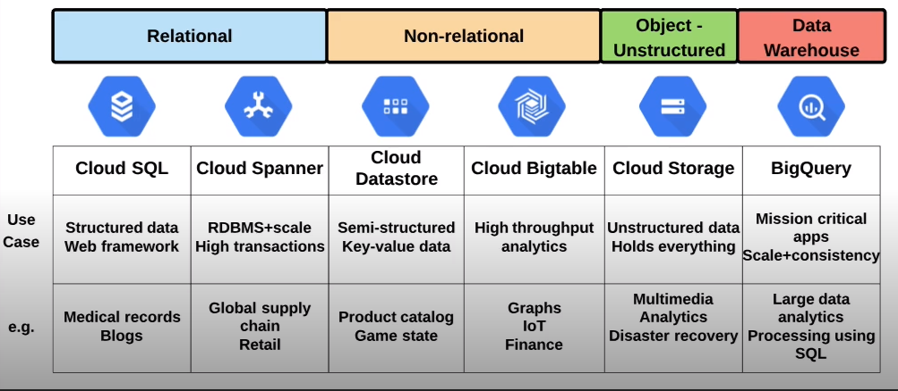
</div>

> Datastore ≈ Firestore (Datastore mode) = Document-oriented / Non-relational database

[GCP-Q1](#q1-orchestrating-sequential--concurrent-dataproc-jobs)

## 1. Machine Learning & TensorFlow

## 2. BigQuery Basics

<div align="center">
  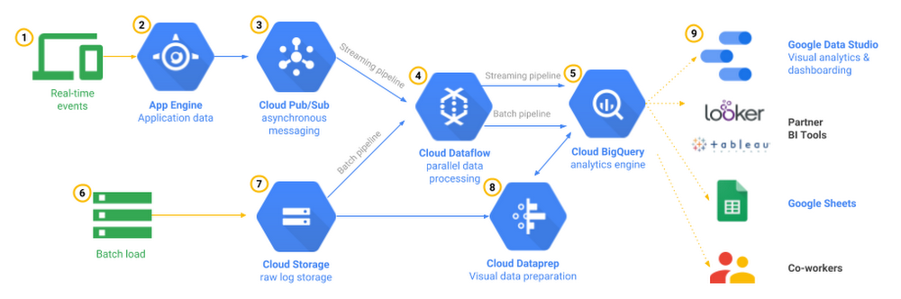
</div>

**BigQuery Table Types**

<div align="center">
  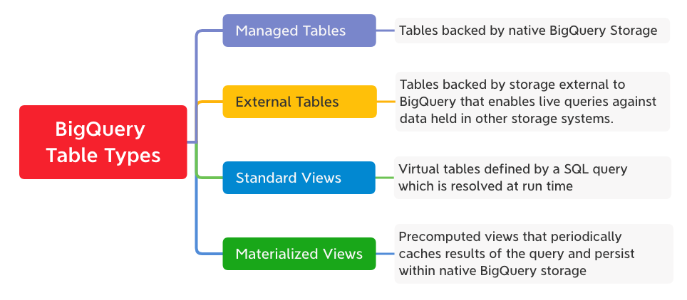
</div>

### A) Query Patterns & SQL Features 


### B) Ingestion, Freshness & Consistency


### C) Governance & Access Control


### D) Admin, Performance & Workload Mgmt


### E) Data Modeling & Table Design


### F) Integration & BI (Looker Studio / Tools)


### G) Views & Materialized Views


## 3. Cost & Security

## 4. Data Modeling & ETL

## 5. Dataflow & Pipelines


## 6. Dataplex / Data Mesh / Governance

## 7. Pub/Sub & Messaging

## 8. Cloud SQL / Spanner / Databases


## 9. Cloud Storage & Data Lake

## 10. Governance & IAM

 
<div align="center">
  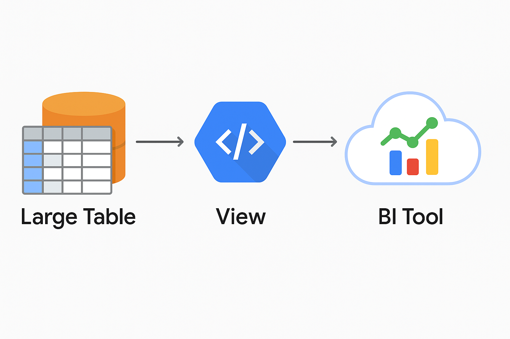
</div>


<div align="center">
  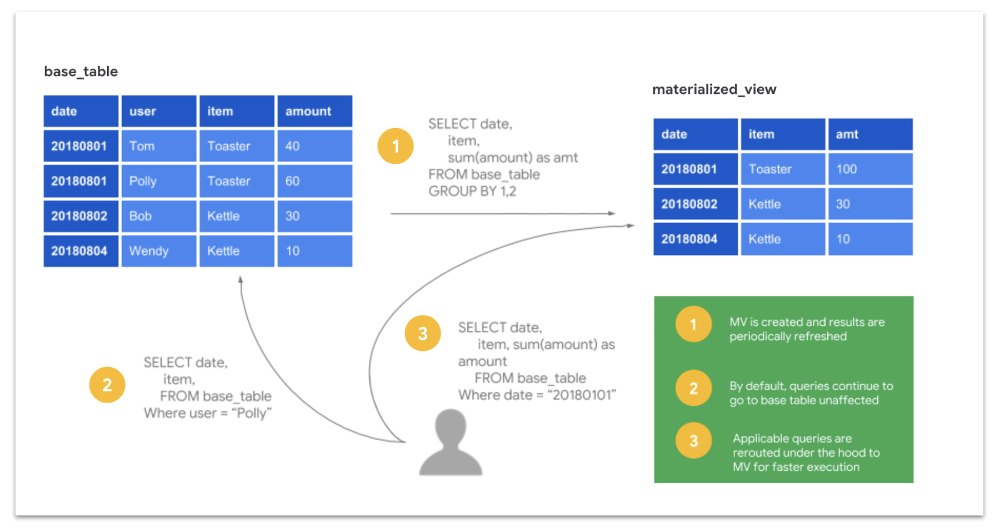
</div>

```sql
CREATE MATERIALIZED VIEW mydataset.v_users AS
SELECT
  FirstName,
  LastName,
  CONCAT(FirstName, " ", LastName) AS FullName
FROM mydataset.users
WHERE status = 'ACTIVE';
```

<div align="center">
  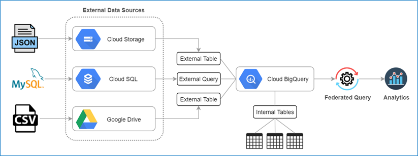
</div>


| Dimension   | **Cloud Datastore / Firestore (Datastore mode)** | **Cloud SQL**                        |
| ----------- | ----------------------------------------------- | ------------------------------------ |
| Operations  | <mark>**Serverless / Auto-scaling**</mark>       | **Manual** tuning of CPU/memory; storage auto-extends |
| Workload    | **OLTP**, low-latency read/write                | **OLTP**, relational model           |
| Transactions (ACID) | Yes (**small-scope transactions**, good for orders/inventory) | Full SQL transactions, strong relational integrity |
| Data Model  | Document / Entity (non-relational)              | Relational tables, schema, foreign keys |
| Scalability | <mark>**No ops required**</mark>                | Manual scaling windows needed         |
| POS Fit     | <mark>**✓ Best fit**</mark>                     | Possible (but need scaling/ops work) |

--- 

#### Q1: Orchestrating sequential & concurrent Dataproc jobs

**Question:**  
Several Spark jobs on Dataproc; some sequential, some concurrent; need automation.

**Options:**  
A. Cloud Dataproc Workflow Template  
B. Init action to execute jobs  
C. <mark>**Cloud Composer DAG (Airflow)**</mark> ✅  
D. Bash script (create cluster, run, teardown)

**Correct Answer:** C  

**Explanation:**  
- ✅ **C**: **Composer (Airflow)** supports DAG orchestration, parallel tasks, retries, SLAs.  
- ❌ **A**: Workflow Templates limited for complex sequences + concurrency.  
- ❌ **B**: Init actions run only once at cluster start.  
- ❌ **D**: Bash scripts brittle, no orchestration features.  

#### Q2: Ensure transactional integrity in BigQuery multi-table updates

**Question:**  
Need to update multiple BigQuery tables in one transaction with rollback if any fail.

**Options:**  
A. Partitioned tables  
B. Legacy SQL scripts  
C. <mark>**BigQuery multi-statement transactions**</mark> ✅  
D. Scheduled queries  

**Correct Answer:** C  

**Explanation:**  
- ✅ **C**: Multi-statement transactions (`BEGIN…COMMIT`) ensure **atomic updates** across tables.  
- ❌ **A**: Partitioning improves query efficiency, not transactions.  
- ❌ **B**: Legacy SQL lacks transactional support.  
- ❌ **D**: Scheduling doesn’t guarantee atomicity.  

```sql
BEGIN TRANSACTION;

UPDATE dataset.table1
SET status = 'processed'
WHERE id = 123;

INSERT INTO dataset.table2 (id, value)
VALUES (123, 'done');

COMMIT TRANSACTION;
```

#### Q3: Streaming pipeline with at-least-once processing

**Question:**  
Need streaming ingestion into BigQuery with **at-least-once** delivery guarantee.

**Options:**  
A. Pub/Sub → Dataflow → BQ with retries  
B. <mark>**Pub/Sub exactly-once enabled + Dataflow streaming inserts**</mark> ✅  
C. Cloud Functions writing to BQ  
D. Scheduled DTS  

**Correct Answer:** B  

**Explanation:**  
- ✅ **B**: Pub/Sub + Dataflow streaming ensures **at-least-once delivery**, can achieve exactly-once with deduplication.  
- ❌ **A**: Manual retries increase duplicates.  
- ❌ **C**: Functions can drop events under load.  
- ❌ **D**: DTS is batch, not streaming.  

---

#### Q4: Minimize shuffle in Spark SQL joins

**Question:**  
Large Spark job has severe shuffle overhead in joins.

**Options:**  
A. Use broadcast join for small tables ✅  
B. Increase shuffle partitions  
C. Cache input tables  
D. Run on bigger cluster  

**Correct Answer:** A  

**Explanation:**  
- ✅ **A**: Broadcast join avoids shuffle by sending small table to all nodes.  
- ❌ **B**: More partitions ≠ less shuffle.  
- ❌ **C**: Cache helps reuse, not shuffle.  
- ❌ **D**: Bigger cluster only masks inefficiency.  

---

#### Q5: Cost optimization for BigQuery queries on historical data

**Question:**  
Petabytes of log data in BigQuery; queries usually on last 7 days.

**Options:**  
A. Cluster by user_id  
B. <mark>**Partition by ingestion date, filter on partition**</mark> ✅  
C. Export to GCS and query  
D. Create materialized views on all data  

**Correct Answer:** B  

**Explanation:**  
- ✅ **B**: Partition pruning ensures scanning only last 7 days → huge cost savings.  
- ❌ **A**: Clustering helps within partitions but not across time.  
- ❌ **C**: Exporting adds cost + latency.  
- ❌ **D**: Materialized views over PBs = expensive.  

---

#### Q6: Auto-scaling Spark job on GCP

**Question:**  
Need Spark job that scales automatically with workload.

**Options:**  
A. Static Dataproc cluster  
B. <mark>**Dataproc autoscaling policy**</mark> ✅  
C. Compute Engine autoscaler  
D. GKE horizontal pod autoscaler  

**Correct Answer:** B  

**Explanation:**  
- ✅ **B**: Dataproc supports **autoscaling policies** for Spark/YARN workloads.  
- ❌ **A**: Static cluster = wasted cost.  
- ❌ **C**: VM autoscaler not Spark-aware.  
- ❌ **D**: GKE autoscaler fits containers, not native Spark.  

---

#### Q7: Secure PII in BigQuery for analysts

**Question:**  
Analysts need access to join on emails, but emails are sensitive PII.

**Options:**  
A. Mask emails fully  
B. <mark>**Format-preserving encryption (deterministic)**</mark> ✅  
C. Remove emails  
D. Hash with random salt  

**Correct Answer:** B  

**Explanation:**  
- ✅ **B**: Deterministic FPE allows joins while protecting privacy.  
- ❌ **A**: Masking destroys joinability.  
- ❌ **C**: Removing prevents analytics.  
- ❌ **D**: Random salt breaks determinism.  

---

#### Q8: CI/CD for BigQuery SQL models

**Question:**  
Need version control + automated deployment for SQL-based models in BigQuery.

**Options:**  
A. Cloud Functions  
B. <mark>**Dataform**</mark> ✅  
C. Composer DAG  
D. Dataflow  

**Correct Answer:** B  

**Explanation:**  
- ✅ **B**: Dataform manages **<mark>SQL workflows, testing, Git integration, deployments</mark>**.  
- ❌ **A**: Functions not suited for SQL pipeline mgmt.  
- ❌ **C**: Composer can orchestrate but not version SQL models.  
- ❌ **D**: Dataflow is code (Java/Python), not SQL.  

---

#### Q9: Handle skew in Spark groupBy

**Question:**  
Spark job skewed on single key during `groupBy`.

**Options:**  
A. Repartition by key  
B. Increase executor memory  
C. <mark>**Salting the skewed key**</mark> ✅  
D. Cache before groupBy  

**Correct Answer:** C  

**Explanation:**  
- ✅ **C**: **Salting** distributes skewed keys across partitions.  
- ❌ **A**: Doesn’t fix skew.  
- ❌ **B**: Just allocates more memory, not scalable.  
- ❌ **D**: Cache doesn’t address skew.  

---

#### Q10: Reduce BigQuery storage cost for infrequently used tables

**Question:**  
Some datasets queried rarely, but must be retained.

**Options:**  
A. <mark>**Move to long-term storage (BQ auto after 90d)**</mark> ✅  
B. Export to GCS and delete  
C. Compress with clustering  
D. Delete partitions older than 90 days  

**Correct Answer:** A  

**Explanation:**  
- ✅ **A**: BigQuery automatically applies **long-term storage pricing** after 90d of no updates.  
- ❌ **B**: Export loses queryability.  
- ❌ **C**: Clustering doesn’t reduce storage cost.  
- ❌ **D**: Deletes data, not allowed.  

```sql
# long-term storage pricing
SELECT
  table_schema,
  table_name,
  creation_time,
  last_modified_time,
  storage_last_modified_time
FROM `region-us`.INFORMATION_SCHEMA.TABLE_STORAGE
WHERE total_logical_bytes > 0;

```


---

#### Q11: Automate daily ETL pipeline with dependencies

**Question:**  
Daily pipeline: load raw → transform → aggregate → publish.

**Options:**  
A. Cron jobs  
B. <mark>**Cloud Composer DAG**</mark> ✅  
C. Dataflow streaming job  
D. Cloud Functions with Pub/Sub  

**Correct Answer:** B  

**Explanation:**  
- ✅ **B**: Composer DAG manages task dependencies, retries, scheduling.  
- ❌ **A**: Cron lacks dependency mgmt.  
- ❌ **C**: Streaming doesn’t fit daily batch.  
- ❌ **D**: Functions work for event-driven, not multi-step batch.  

---

#### Q12: Encrypt all new Cloud Storage objects with CMEK

**Question:**  
Need to ensure all new GCS uploads use **customer-managed keys**.

**Options:**  
A. Manually encrypt before upload  
B. <mark>**Set bucket default CMEK (Customer-Managed Encryption Key)**</mark> ✅  
C. Encrypt with Cloud KMS after upload  
D. Use signed URLs with CMEK  

**Correct Answer:** B  

**Explanation:**  
- ✅ **B**: Bucket-level **default CMEK** ensures every new object is encrypted with customer key.  
- ❌ **A**: Manual process = error-prone.  
- ❌ **C**: Re-encrypting after upload risky.  
- ❌ **D**: Signed URLs unrelated.  

```bash
# Create a bucket (in Singapore region, with default CMEK)
gsutil mb -l asia-southeast1 \
  -k projects/my-proj/locations/global/keyRings/kr/cryptoKeys/my-key \
  gs://my-secure-bucket

# Upload a file to the bucket
gsutil cp local.csv gs://my-secure-bucket/data/local.csv
```

---

#### Q13: Optimize repeated queries in BigQuery dashboards

**Question:**  
Dashboards run same aggregations repeatedly, high cost.

**Options:**  
A. Cached queries  
B. <mark>**Materialized views**</mark> ✅  
C. Authorized views  
D. Export to GCS and pre-aggregate  

**Correct Answer:** B  

**Explanation:**  
- ✅ **B**: Materialized views precompute and auto-refresh, perfect for BI dashboards.  
- ❌ **A**: Cache invalidates easily, not reliable.  
- ❌ **C**: Authorized views control access, not performance.  
- ❌ **D**: Exporting breaks live dashboards.  

---

```sql
-- Create a materialized view for daily active users
CREATE MATERIALIZED VIEW my_dataset.mv_daily_active_users
AS
SELECT
  user_id,
  COUNT(*) AS activity_count
FROM my_dataset.events
WHERE event_date = CURRENT_DATE()
GROUP BY user_id;
```

#### Q14: Reduce latency for global Cloud SQL app

**Question:**  
Global users experience high latency querying Cloud SQL in single region.

**Options:**  
A. <mark>**Read replicas in multiple regions**</mark> ✅  
B. Multi-region bucket  
C. Scale machine size  
D. Shard database  

**Correct Answer:** A  

**Explanation:**  
- ✅ **A**: Regional **read replicas** reduce read latency globally.  
- ❌ **B**: Buckets not relevant.  
- ❌ **C**: Bigger instance ≠ solve geography.  
- ❌ **D**: Sharding complex, not needed.  


```bash
gcloud sql instances create-replica my-replica-europe \
  --master-instance-name=my-sql-primary \
  --region=europe-west1
```

---

#### Q15: Enforce column-level security in BigQuery

**Question:**  
Analysts must see only specific columns in sensitive tables.

**Options:**  
A. Authorized views  
B. <mark>**Policy tags in Data Catalog**</mark> ✅  
C. Separate tables  
D. Row-level security  

**Correct Answer:** B  

**Explanation:**  
- ✅ **B**: **Policy tags** enforce column-level access control.  
- ❌ **A**: Views can hide columns but not enforce governance.  
- ❌ **C**: Copying tables is inefficient.  
- ❌ **D**: Row-level ≠ column-level control.  


```
-- Add a PII policy tag to the column in the Data Catalog

ALTER TABLE my_dataset.customers
ALTER COLUMN email
SET POLICY TAGS ('projects/my-proj/locations/us/taxonomies/1234/policyTags/5678');
```
---

#### Q16: First step to secure BigQuery warehouse

**Question:**  
Your startup has no formal security policy. Everyone in the company has access to BigQuery datasets. You’ve been asked to secure the data warehouse and need to first discover what everyone is doing. What should you do?

Options:  
<mark>A. Use Google Stackdriver (Cloud) Audit Logs to review data access.</mark>  
B. Get the IAM policy of each table.  
C. Use Stackdriver Monitoring to see BigQuery slot usage.  
D. Use the Google Cloud Billing API to check billing.  

**Correct Answer:**  
A. Use <mark>Cloud Audit Logs</mark> to review data access.  

**Explanation:**  
- Audit Logs = best way to discover *who accessed what and when*.  
- IAM policy only shows *permissions*, not actual usage.  
- Monitoring slots shows performance, not security.  
- Billing API only shows costs, not access.  

```bash
-- Query BigQuery Data Access audit logs
SELECT
  protopayload_auditlog.authenticationInfo.principalEmail AS user,
  protopayload_auditlog.servicedata_v1_bigquery.jobCompletedEvent.job.jobStatistics.totalProcessedBytes AS bytes_scanned,
  timestamp
FROM `my-project.logs_dataset.cloudaudit_googleapis_com_data_access`
WHERE protopayload_auditlog.servicedata_v1_bigquery.jobCompletedEvent.job.jobConfiguration.query.query IS NOT NULL
ORDER BY timestamp DESC
LIMIT 100;
```

---

#### Q17: Migrating Hadoop cluster to cloud

**Question:**  
Your company is migrating their 30-node Apache Hadoop cluster to the cloud. They want to re-use Hadoop jobs, minimize cluster management, and persist data beyond cluster life. What should you do?

Options:  
A. Create a Google Cloud Dataflow job.  
B. Create a Dataproc cluster with persistent disks for HDFS.  
C. Create a Hadoop cluster on Compute Engine with persistent disks.  
<mark>D. Create a Cloud Dataproc cluster that uses the Google Cloud Storage connector.</mark>  
E. Create a Hadoop cluster on Compute Engine with Local SSDs.  

**Correct Answer:**  
D. Cloud Dataproc with <mark>GCS connector</mark>.  

**Explanation:**  
- **Dataproc** = managed Hadoop, minimal ops.  
- **GCS connector** = data persists even after cluster shutdown.  
- Persistent HDFS disks (B) still tied to cluster lifecycle.  
- Raw Compute Engine clusters (C, E) require manual ops.  
- Dataflow (A) can’t directly re-use existing Hadoop jobs.  

```bash
gcloud dataproc clusters create my-cluster \
  --region=us-central1 \
  --bucket=my-hadoop-data \
  --single-node
```

---

#### Q18: ML applications on bank transactions

**Question:**  
You are given a dataset of bank transactions (user ID, type, location, amount). Business asks what ML can be applied. Which three?  

Options:  
A. Supervised learning to determine which transactions are most likely fraudulent.  
<mark>B. Unsupervised learning to determine which transactions are most likely fraudulent.</mark>  
<mark>C. Clustering to divide transactions into N categories.</mark>  
<mark>D. Supervised learning to predict the location of a transaction.</mark>  
E. Reinforcement learning to predict the location.  
F. Unsupervised learning to predict the location.  

**Correct Answer:**  
B, C, D  

**Explanation:**  
- **Fraud detection** often starts as **unsupervised anomaly detection** (B).  <mark>Unsupervised learning does not give a definitive conclusion like “this is fraud”; instead, it outputs an anomaly score.</mark>
- **Clustering (C)** groups transactions by similarity (e.g., type, amount, location).  
- **Supervised classification (D)** works if location is the target label.  
- A requires labeled fraud data (not given).  
- E/F are not suitable for this dataset.  


#### Q19: Minimize storage cost when migrating Hadoop → Dataproc

**Question:**  
Like-for-like migration would need **50 TB Persistent Disk per node**. CIO worries about **block storage cost**. How to **minimize storage cost**?

Options:  
<mark>A. Put the data into Cloud Storage (GCS).</mark>  
B. Use preemptible VMs for the cluster.  
C. Tune cluster so disks are just enough.  
D. Move cold to GCS, keep hot on PD.  

**Correct Answer:**  
A  

**Explanation:**  
- Use **Dataproc + GCS connector**: compute ephemeral, data persists cheaply in **GCS**.  
- Avoids massive PD footprint per node.  
- **B** cuts compute cost, not storage.  
- **C/D** still rely on PD; more ops overhead.  

```bash
gcloud dataproc clusters create my-dataproc \
  --region=us-central1 \
  --bucket=my-hadoop-data \
  --single-node
```

---

#### Q20: Pub/Sub push endpoint duplicate messages

**Question:**  
Push subscription to HTTPS endpoint receives many **duplicate messages**. Most likely cause?

Options:  
A. Message body too large.  
B. Expired SSL cert.  
C. Topic has too many messages.  
<mark>D. Endpoint not acknowledging within ack deadline.</mark>  ✅

**Correct Answer:**  
D  

**Explanation:**  
- Pub/Sub is **at-least-once**; if not acked, Pub/Sub redelivers → duplicates.  
- Expired cert = failure, not dupes.  
- Too many messages doesn’t directly cause duplicates.  

---

#### Q21: Deduplicate retransmitted inventory payloads

**Question:**  
System retransmits when in doubt; payload includes **fields + transmission timestamp**. How to dedup?

Options:  
<mark>A. Assign GUID per data entry.</mark>  
B. Compute hash vs history.  
C. Store full payload as primary key.  
D. Maintain hash table.  

**Correct Answer:**  
A  

**Explanation:**  
- **GUID** = stable ID → downstream dedup/idempotency trivial.  
- Hash breaks if timestamp changes.  
- Using payload as PK is heavy. (Payload = Effective load (useful load) It refers to the actual business data）


#### Q22: Data scientist laptop underpowered

**Question:**  
Data scientist needs to analyze huge GCS + Cassandra datasets. Laptop too weak.

Options:  
A. Local Jupyter.  
B. Cloud Shell.  
C. Host only viz tool.  
<mark>D. Cloud Datalab on GCE VM. </mark>  (GCE VM = Google Compute Engine Virtual Machine) - 👉 A "cloud computer/server" rented in a GCP data center

**Correct Answer:**  
D  

**Explanation:**  
- Managed notebook close to data.  
- Scales with VM resources.  
- A/B limited resources.  
- C = viz only, no analysis.  

---

#### Q23: 10,000 IoT devices real-time pipeline

**Question:**  
Need real-time ingestion, processing, and analysis.

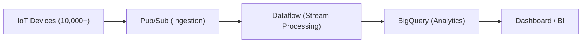

Options:  
A. Datastore → export → BQ.  
<mark>B. Pub/Sub → Dataflow (stream) → BigQuery.</mark>  
C. GCS + Dataproc.  
D. Batch to GCS → Cloud SQL.  

**Correct Answer:**  
B  

**Explanation:**  
- Canonical streaming stack: Pub/Sub (ingest), Dataflow (process), BQ (analyze).  
- A/D are batch.  
- C is slow/batch-oriented.  

---

#### Q24: STRING epoch → TIMESTAMP

**Question:**  
`CLICK_STREAM.DT` stored as STRING epoch. Need TIMESTAMP for sessions, minimize future query cost.

Options:  
A. Drop/reload with TIMESTAMP.  
B. Add TIMESTAMP col, backfill.  
C. View casting DT → TIMESTAMP.  
<mark>E. CTAS into NEW_CLICK_STREAM with casted TIMESTAMP.</mark>  

**Correct Answer:**  
E  

**Explanation:**  
- One-time transform → queries run on real TIMESTAMP (no per-query cast cost).  
- C = casts every query = costly.  
- A/B heavy ops.  

```sql
CREATE TABLE NEW_CLICK_STREAM AS
SELECT
  user_id,
  CAST(DT AS TIMESTAMP) AS event_ts,
  ...
FROM CLICK_STREAM;
```


#### Q25: Alert on BigQuery insert job

**Question:**  
Send **instant notification** only when an **insert job** appends to one specific table.

Options:  
A. List logs via API.  
B. Sink logs to BQ.  
C. Sink logs to Pub/Sub (no fine filter).  
<mark>D. Create sink with advanced filter → Pub/Sub.</mark>  ✅ `protoPayload.methodName="jobservice.insert"`

**Correct Answer:**  
D  

```bash
protoPayload.methodName="jobservice.insert"
resource.type="bigquery_table"
resource.labels.table_id="target_table"
```

**Explanation:**  
- Advanced filter isolates target table + job type.  
- Pub/Sub delivers instant events.  
- A/B don’t notify.  
- C lacks fine-grained filter.  


#### Q26: Consultant with sensitive Dataflow job

**Question:**  
External consultant needs to develop Dataflow transform, but **data is sensitive**. How to proceed?

Options:  
A. Project Viewer role.  
B. Dataflow Developer role.  
C. Share service account.  
<mark>D. Provide anonymized sample in separate project.</mark>  ✅ /əˈnɑː.nə.maɪzd/

**Correct Answer:**  
D  

**Explanation:**  
- **Least privilege**: anonymized sample → no PII exposure.  
- A/B still expose real data.  
- C is anti-pattern.  


#### Q27: Feature reduction for faster training

**Question:**  
Thousands of features; want faster training while preserving accuracy.

Options:  
A. Drop features correlated with label.  
**<mark>B. Combine highly correlated features. (e.g., PCA)</mark>**  
C. Average features in groups of 3.  
D. Drop features with 50% nulls.  

**Correct Answer:**  
B  

**Explanation:**  
- Removes redundancy, preserves signal.  
- A: correlated with label = important!  
- C: arbitrary, loses info.  
- D: missingness ≠ useless.  

---

#### Q28: Dataflow reading BigQuery logs

**Question:**  
Need to read growing BigQuery logs efficiently for new features.

Options:  
A. Provide TableReference.  
<mark>B. Use `.fromQuery` selecting only needed columns.</mark>  ✅ `projection pushdown`  
C. Use TableSchema.  
D. Return TableRow.  

```bash
BigQueryIO.readTableRows()
  .fromQuery("SELECT user_id, event_type FROM dataset.logs");
```

**Correct Answer:**  
B  

**Explanation:**  
- Push down projection → scan fewer bytes.  
- Others don’t cut scanned data size.  

---

#### Q29: Bigtable row key design

**Question:**  
Row key for real-time dashboards with sensors.

Options:  
A. `<timestamp>`  
B. `<sensorid>`  
C. `<timestamp>#<sensorid>`  
<mark>D. `<sensorid>#<timestamp>`</mark>  

**Correct Answer:**  
D  

**Explanation:**  
- Sensor-first avoids hotspotting.  
- Supports efficient time-range per sensor.  
- Timestamp-first = hotspotting.  

---

#### Q30: Analytics on busy MySQL cluster

**Question:**  
MySQL cluster overloaded. Need analytics without hurting ops.

Options:  
A. Add node + OLAP cube.  
<mark>B. ETL data into BigQuery.</mark>  
C. On-prem Hadoop.  
D. Restore backup → Cloud SQL → Dataproc.  

**Correct Answer:**  
B  

**Explanation:**  
- Offload to BigQuery = scalable analytics.  
- A = more OLTP load.  
- C = complex, heavy ops.  
- D = clunky multi-step.  

#### Q31: Updating incompatible Dataflow pipeline without data loss  

**Question:**  
Your streaming Dataflow pipeline (Pub/Sub source) needs an update that makes it **incompatible** with the current version. You must avoid data loss.  

Options:  
<mark>A. Update the current pipeline and use the drain flag.</mark>  
B. Update the current pipeline and provide the transform mapping JSON object.  
C. Create a new pipeline with the same Pub/Sub subscription and cancel the old one.  
D. Create a new pipeline with a new Pub/Sub subscription and cancel the old one.  

**Correct Answer:**  
A  

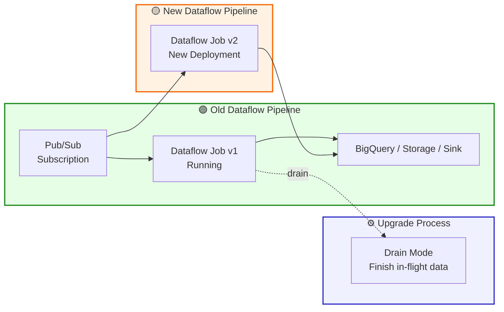

**Explanation:**  
- <mark>**Drain** allows current pipeline to **finish processing in-flight data** before shutdown → no loss.</mark>    
- **B** only works for compatible transform changes (rename/mapping), not for incompatible jobs.  
- **C/D** risk losing unacked or duplicate messages when switching subscriptions.  
- Safe approach: **drain old pipeline → deploy new one**.  

#### Q32: Improve Bigtable load performance (10TB initial load)  

**Question:**  
Data scientists observe poor read/write performance with Bigtable initial load (10TB). Want to improve performance at minimal cost.  

Options:  
<mark>A. Redefine schema to evenly distribute reads/writes across row space.</mark>  
B. Wait for cluster auto-scale.  
C. Use single row key for frequently updated values.  
D. Use sequential numeric IDs as row keys.  

**Correct Answer:**  
A  

**Good keys (hashed prefix → balanced load):**

```
Good key:  hash01#202509190001
Good key:  hash07#202509190002
Good key:  hash12#202509190003   (randomized distribution → balanced across nodes)
```

**Explanation:**  
- **Bigtable best practice**: avoid **hotspotting** by distributing keys evenly.  
- **B**: cluster size ≠ schema design.  
- **C**: single row key concentrates load → bottleneck.  
- **D**: sequential IDs → hotspotting.  

---

#### Q33: Messages missing in Dataflow dashboard  

**Question:**  
Pub/Sub shows all messages published, but CFO dashboard (via Dataflow) is missing some. What to check next?  

Options:  
A. Check dashboard app rendering.  
<mark>B. Run a fixed dataset through Dataflow pipeline and analyze output.</mark>  
C. Use Stackdriver Monitoring on Pub/Sub.  
D. Switch Dataflow to pull mode.  

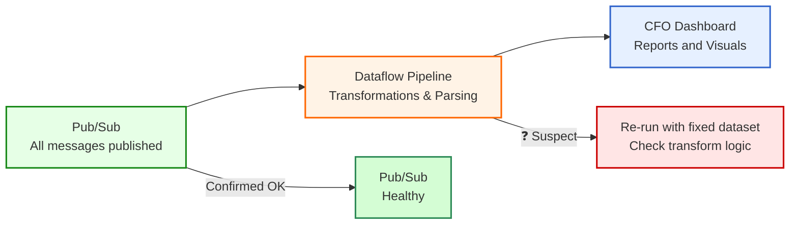

**Correct Answer:**  
B  

**Explanation:**  
- Pub/Sub confirmed fine → issue likely **in Dataflow pipeline**.  
- Re-run with **fixed dataset** → confirm transformations/parsing logic.  
- **C** shows backlog metrics but not actual missing message cause.  
- **A/D** don’t isolate pipeline logic.  

---

#### Q34: Flowlogistic — common storage for BigQuery & Hadoop  

**Question:**  
BigQuery is primary analytics system, but Hadoop/Spark workloads remain. Where to store **common data**?  

Options:  
A. Store in BigQuery partitioned tables.  
B. Store in BigQuery with authorized views.  
<mark>C. Store in GCS encoded as Avro.</mark>  
D. Store in HDFS on Dataproc.  

**Correct Answer:**  
C  

**Explanation:**  

- **GCS** is Google’s object storage, accessible to all systems.  
- **Avro** is a cross-platform format with built-in schema support (row-oriented with efficient serialization).

- BigQuery can directly load Avro files or query them as external tables.  
- Spark/Hadoop can read Avro natively through their connectors.  
- **GCS + Avro** = interoperable format for both **BigQuery** and **Spark/Hadoop**.  

---

- **A/B**: BigQuery-only, not usable directly by Spark.  
- **D**: HDFS on Dataproc adds cost/ops, not recommended for common data lake.  


#### Q35: Flowlogistic — real-time tracking ingestion system  

**Question:**  
Kafka cannot scale. Need ingestion, real-time processing, reliable storage.  

Options:  
<mark>A. Cloud Pub/Sub + Cloud Dataflow + Cloud Storage.</mark>  
B. Pub/Sub + Dataflow + Local SSD.  
C. Pub/Sub + Cloud SQL + Cloud Storage.  
D. Load Balancing + Dataflow + Cloud Storage.  

**Correct Answer:**  
A  

**Explanation:**  
- **Pub/Sub** = scalable global ingestion.  
- **Dataflow** = stream + batch processing.  
- **Cloud Storage** = durable storage for analytics.  
- Other options misuse SQL/SSD/LB → don’t fit streaming scale.  

---

#### Q36: Flowlogistic — cost-effective BigQuery reporting  

**Question:**  
Sales team (non-technical) overwhelmed by huge BQ tables, queries cost too much. Best fix?  

Options:  
A. Export to Google Sheets.  
B. Create extra table with only needed columns.  
<mark>C. Create a view with only necessary columns.</mark>  
D. Use IAM column-level access.  

**Correct Answer:**  
C  

**Explanation:**  
- **View**: logical subset, no extra storage, keeps data updated.  
- **B** static table duplicates data & requires sync.  
- **A** too small for TB-scale.  
- **D** controls access but doesn’t simplify data.  

---

#### Q37: Flowlogistic — tracking messages with Pub/Sub  

**Question:**  
Devices send package-tracking messages to one Pub/Sub topic. Need to ensure package data is analyzable over time.  

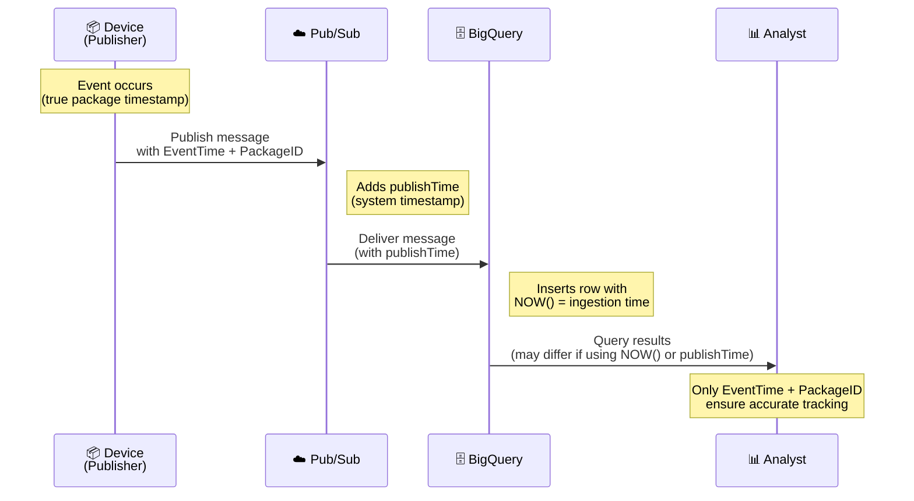

Options:  
A. Timestamp added by subscriber.  
<mark>B. Timestamp + Package ID added by publisher device.</mark>  
C. Use NOW() in BigQuery.  
D. Use Pub/Sub publishTime.  

**Correct Answer:**  
B  

**Explanation:**  
- **Event time from publisher** = true time of event + unique ID for ordering.  
- **A**: subscriber receive-time may be delayed.  
- **C**: NOW() in BQ = ingestion time, not event time.  
- **D**: Pub/Sub publishTime = system time, not guaranteed accurate for event sequence.  

---

#### Q38: MJTelco — Dataflow scaling  

**Question:**  
Dataflow must handle up to 50k installations, scale compute power dynamically. Which setting?  

Options:  
A. Zone  
B. Number of workers  
C. Disk size per worker  
<mark>D. Maximum number of workers</mark>  

**Correct Answer:**  
D  

**Explanation:**  
- Dataflow **autoscaling** adds/removes workers as needed → limited by **max workers**.  
- **A** irrelevant to scaling.  
- **B** = fixed workers, not dynamic.  
- **C** = storage size, not compute scaling.  

```bash
gcloud dataflow jobs run my-job \
  --gcs-location gs://my-template/template.json \
  --region=us-central1 \
  --max-workers=100 \
  --autoscaling-algorithm=THROUGHPUT_BASED
```

#### Q39: MJTelco — visualization of telemetry  

**Question:**  
Ops team needs dashboards: 50k installs, 6 weeks data, <3h delay, <5s load time, filter suboptimal links.  

Options:  
A. Google Sheets  
B. BigQuery + Apps Script + Sheets  
C. Datastore + App Engine + Charts API  
<mark>D. BigQuery + Data Studio 360 (Looker Studio)</mark>  

**Correct Answer:**  
D  

**Explanation:**  
- **BigQuery** handles large telemetry datasets.  
- **Data Studio** (Looker Studio) = cost-free, interactive dashboards with filters/sorting.  
- Meets latency + usability requirements.  
- Other options too small-scale or require custom apps.  

---

#### Q40: MJTelco — enforce regional access in BigQuery  

**Question:**  
Each region has its own table. Need to enforce access so employees only see their region.  

Options:  
A. Put all tables in one global dataset.  
<mark>B. Put each table in a dataset for a region.</mark>  
C. Adjust table-level IAM.  
D. Adjust view-level IAM.  
<mark>E. Adjust dataset-level IAM for each region’s group.</mark>  

**Correct Answer:**  
B, E  

**Explanation:**  
- **B**: region-specific dataset separation.  
- **E**: dataset-level IAM = scalable, easy to maintain.  
- **A**: global dataset breaks isolation.  
- **C/D**: possible, but harder to maintain vs dataset-level controls.  

---

#### Q41: MJTelco — Bigtable schema for historical telemetry

**Question:**  
MJTelco needs a schema in **Google Bigtable** for 2 years of telemetry records (every 15 min, unique device_id + datapoint).  
Most common query: *“all the data for a given device for a given day.”*  

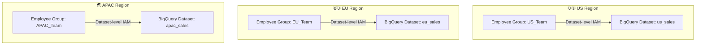

Options:  
<mark>A. Rowkey: date#device_id; Column data: data_point</mark>  
B. Rowkey: date; Column data: device_id, data_point  
C. Rowkey: device_id; Column data: date, data_point  
D. Rowkey: data_point; Column data: device_id, date  
E. Rowkey: date#data_point; Column data: device_id  

**Correct Answer:**  
A  

**Explanation:**  
- **Rowkey = date#device_id** supports prefix scans like `2023-12-20#device123`, directly matching query pattern.  
- Avoids scanning full table for each query.  
- Column families store datapoints efficiently.  
- **C** is tempting (device_id#date), but the exam expects A since the *query* starts with date + device.  
- Best practice IRL: consider **device_id#date** to avoid hotspotting, but within given options, **A** is correct.  

---

#### Q42: Hadoop batch jobs falling behind with more data

**Question:**  
Batch MapReduce jobs on Hadoop are lagging as data volume grows. How to increase responsiveness **without adding cost**?  

Options:  
A. Rewrite in Pig  
<mark>B. Rewrite in Apache Spark</mark>  
C. Increase Hadoop cluster size  
D. Decrease cluster size + use Hive  

**Correct Answer:**  
B  

**Explanation:**  
- **Spark** executes in-memory, avoids MapReduce disk I/O overhead → much faster.  
- **A/D** still depend on MapReduce.  
- **C** solves performance but increases cost (more hardware).  
- Spark = modern, scalable solution with better responsiveness.  

---

#### Q43: BigQuery Users table — FullName field

**Question:**  
Users table has `FirstName`, `LastName`. App wants `FullName` = `FirstName + ' ' + LastName`. Cheapest way?  

Options:  
<mark>A. Create a BigQuery view concatenating FirstName + LastName</mark>  
B. Add new column FullName + UPDATE all rows  
C. Dataflow pipeline to build new table  
D. Export → process in Dataproc → reload  

```mermaid
CREATE VIEW dataset.user_view AS
SELECT
  FirstName,
  LastName,
  CONCAT(FirstName, ' ', LastName) AS FullName
FROM dataset.users;
```

**Correct Answer:**  
A  

**Explanation:**  
- **View** = logical layer, no extra storage. Always up-to-date when queried.  
- **B** = more storage + maintenance for new inserts.  
- **C/D** = overkill, extra infra.  
- Cost-effective, minimal change = **View**.  

---

#### Q44: Cloud Datastore — avoid index explosion

**Question:**  
Entity *Movie*: fields = `actors` (multi), `tags` (multi), `date_released` (single).  
Queries like “all movies with actor=X ordered by date_released.”  
How to avoid **combinatorial index explosion**?  

Options:  
<mark>A. Manually configure composite indexes in index.yaml</mark>  
B. (invalid syntax)  
C. Exclude `actors, tags` from index  
D. Exclude `date_released` from index  

**Correct Answer:**  
A  

**Explanation:**  
- By default, Datastore builds indexes for every property combo → explosion if multiple arrays.  
- **Custom composite index** (actor/date, tag/date) avoids explosion.  
- **C/D** exclude needed fields → queries fail.  

```yaml
indexes:
- kind: Movie
  properties:
  - name: actors
  - name: date_released
    direction: desc
- kind: Movie
  properties:
  - name: tags
  - name: date_released
    direction: desc
```

---

#### Q45: Dataflow job once per day

**Question:**  
Manufacturing plant batches logs once daily at 2AM. Need to process exactly once/day, as cheaply as possible.  

Options:  
A. Use Dataproc instead  
B. Manually start Dataflow job  
<mark>C. Use App Engine Cron Service (or Cloud Scheduler) to trigger Dataflow</mark>  
D. Run job as streaming  

**Correct Answer:**  
C  

**Explanation:**  
- **Cron/Scheduler** = automate Dataflow trigger daily, reliable, no ops overhead.  
- **A**: Dataproc cluster = more infra, cost.  
- **B**: manual = error-prone, labor cost.  
- **D**: streaming job = expensive for once/day logs.  

```
gcloud scheduler jobs create pubsub daily-dataflow-job \
  --schedule "0 2 * * *" \
  --topic dataflow-job-trigger \
  --message-body '{}'
```

---

#### Q46: BigQuery + external price data (updated every 30m)

**Question:**  
You need to join customer data in BQ with **price data** (100 goods, updated every 30 minutes). Must be cheap & up-to-date.  

Options:  
A. Load into partitioned table every 30 min  
<mark>B. Store in Cloud Storage, expose via federated external table</mark>  
C. Use Cloud Datastore + Dataflow  
D. Use GCS + Dataflow to push into BQ  

**Correct Answer:**  
B  

**Explanation:**  
- **External table (GCS)**: avoids constant reloading, always reflects updates, cheap.  
- **A**: partition granularity = 1h minimum, not 30m. Repeated loads add cost.  
- **C/D**: too complex for small ref data.  
- **Best practice**: external tables for small, frequently refreshed reference datasets.  

#### Q47: Database schema for ML-based food ordering service

**Question:**  
You are designing the schema for a food ordering service (user likes/dislikes, account info, order history).  
The DB must store **all transactional data** and support schema optimization. Which product?  

Options:  
A. BigQuery  
<mark>B. Cloud SQL</mark>  
C. Cloud Bigtable  
D. Cloud Datastore  

**Correct Answer:**  
B  

**Explanation:**  
- **Cloud SQL** = managed relational DB (ACID, schema design, queries). Perfect for transactional workloads.  
- **BigQuery (A)** = analytical warehouse, not for OLTP.  
- **Bigtable (C)** = wide-column, best for time-series/IoT, not relational.  
- **Datastore (D)** = schema-less NoSQL, **not good for strict schema optimization.**  

---

#### Q48: CSV data mismatch in BigQuery  

**Question:**  
You load CSVs into BigQuery. Import succeeds, but data doesn’t match byte-to-byte with the source. Why?  

Options:  
A. CSV not flagged correctly  
B. Invalid rows skipped  
<mark>C. Wrong file encoding (not UTF-8)</mark>  
D. Missing ETL  

**Correct Answer:**  
C  

**Explanation:**  
- **BigQuery defaults to UTF-8**. If CSV uses ISO-8859-1 or other encoding → BigQuery auto-converts.  
- Import succeeds, but data differs byte-by-byte.  
- **A/B/D** don’t fit since load completed without errors.  

---

#### Q49: Ingesting 20k small CSV files/hour with 200ms latency  

**Question:**  
You must ingest 20,000 CSV files/hour (<4 KB each) via GCP. Current SFTP barely keeps up. Next quarter volume doubles.  
Which two actions help?  

Options:  
A. Compress each file  
B. Increase ISP bandwidth  
<mark>C. Use `gsutil -m` to upload in parallel to GCS</mark>  
<mark>D. Batch 1,000 files into TAR before upload</mark>  
E. Use Storage Transfer Service from on-prem  

**Correct Answer:**  
C, D  

**Explanation:**  
- **C**: Parallel uploads reduce impact of 200ms latency on each file.  
- **D**: Fewer, larger files improve throughput.  
- **A**: compression useless (files are already tiny).  
- **B**: bandwidth not bottleneck (latency is).  
- **E**: STS requires higher throughput (≥300 Mbps).  

---

#### Q50: NoSQL DB for IoT telemetry (100 TB/year, 100 attributes/record)  

**Question:**  
IoT telemetry, 100 TB/year, high availability + low latency, no ACID required. Which 3 DBs?  

Options:  
A. Redis  
<mark>B. HBase</mark>  
C. MySQL  
<mark>D. MongoDB</mark>  
<mark>E. Cassandra</mark>  
F. HDFS + Hive  

**Correct Answer:**  
B, D, E  

**Explanation:**  
- **HBase (B)**: column-oriented, scalable, low latency.  
- **MongoDB (D)**: flexible schema, handles high-volume telemetry.  
- **Cassandra (E)**: distributed, high availability, low latency.  
- **Redis (A)**: in-memory, not for 100TB/year persistence.  
- **MySQL (C)**: relational, not NoSQL.  
- **Hive (F)**: OLAP, not low-latency NoSQL.  


#### Q51: Fix overfitting in a spam classifier (choose 3)

**Question:**  
You’re overfitting the training data. Which three actions help?

Options:  
<mark>A. Get more training examples</mark>  
B. Reduce the number of training examples  
<mark>C. Use a smaller set of features</mark>  
D. Use a larger set of features  
<mark>E. Increase the regularization parameters</mark>  
F. Decrease the regularization parameters  

**Correct Answer:**  
A, C, E

**Explanation:**  
- **More data (A)** → better generalization.  
- **Fewer features (C)** → simpler model, less noise.  
- **Stronger regularization (E)** → penalize complexity.  
- B & F increase overfitting risk; D often raises variance.

---

#### Q52: Securely automate GCS → Dataproc → BigQuery

**Question:**  
Nightly Spark (Dataproc) job reads **non-public** files from GCS and writes to BigQuery. How to run securely?

Options:  
A. Lock bucket to only yourself  
B. Give **Project Owner** to a service account  
<mark>C. Use a service account with GCS read + BigQuery write</mark>  
D. Use a user account with **Project Viewer**  

**Correct Answer:**  
C

**Explanation:**  
Follow **least privilege**: run with a **service account** scoped just to **read GCS** and **write BigQuery**.  
B is over-privileged; A/D don’t enable a secure automated pipeline.

---

#### Q53: BigQuery GROUP BY is very slow

**Question:**  
`SELECT country, state, city FROM [proj:ds.tbl] GROUP BY country` runs slowly; plan shows heavy skew in Read stage. Why?

Options:  
A. Too many concurrent queries  
B. Too many partitions  
C. Many NULLs in state/city  
<mark>D. Most rows share the same country (data skew)</mark>  

**Correct Answer:**  
D

**Explanation:**  
Grouping on a **highly skewed key** funnels most rows to one reducer/slot → **hotspot** → slow stage.

---

#### Q54: Real-time “who bid first” across global servers

**Question:**  
Multiple app servers emit bid events (item, amount, user, timestamp). Collate centrally in **real time** to determine who bid first.

Options:  
A. Write to shared file; batch Hadoop  
B. Pub/Sub → **push** → custom endpoint → Cloud SQL  
C. Per-server MySQL, then periodic merge  
<mark>D. Pub/Sub → pull with Dataflow; determine first in stream</mark>  

**Correct Answer:**  
D

**Explanation:**  
Use **Pub/Sub** for global ingestion and **Dataflow** streaming to process in real time using **event-time** timestamps, windowing, and tie-breaking logic. Cloud SQL (B) adds a custom endpoint, isn’t ideal for high-throughput ordered streaming, and complicates global scalability.


#### Q55: ODBC connection to BigQuery (Legacy SQL view issue)

**Question:**  
Your org has a **time-partitioned table** `events_partitioned`.  
To save cost, a **view** `events` was created (last 14 days only), but it’s written in **Legacy SQL**.  
Next month, apps will connect via **ODBC**. What must you do? (Choose 2)

Options:  
A. Create a new view over `events` using Standard SQL  
B. Create a new partitioned table using a Standard SQL query  
<mark>C. Create a new view over `events_partitioned` using Standard SQL</mark>  
<mark>D. Create a service account for the ODBC connection</mark>  
E. Create a Cloud IAM role for the ODBC connection  

**Correct Answer:**  
C, D  

**Explanation:**  
- **C** → ODBC drivers **only support Standard SQL**, not Legacy SQL. You must rewrite the view over the partitioned table.  
- **D** → ODBC connection requires **authentication via a Service Account** with proper IAM roles.  
- **A** wrong → still points to Legacy SQL view.  
- **B** wrong → no need for new table, just update the view.  
- **E** → custom IAM role not needed; service account already covers it.  

---

#### Q56: Query Firebase sharded tables in BigQuery (Legacy SQL)

**Question:**  
Firebase → BigQuery creates daily sharded tables: `app_events_YYYYMMDD`.  
You want to query last 30 days in **Legacy SQL**. What should you use?  

Options:  
<mark>A. TABLE_DATE_RANGE()</mark>  
B. `_PARTITIONTIME` pseudo column  
C. WHERE date BETWEEN …  
D. SELECT IF(date >= … AND date <= …)  

**Correct Answer:**  
A  

**Explanation:**  
- In **Legacy SQL**, `TABLE_DATE_RANGE([dataset.table_], start_date, end_date)` queries across date-sharded tables.  
- **B** `_PARTITIONTIME` works only in **Standard SQL partitioned tables**, not sharded legacy tables.  
- **C/D** are row filters, won’t union multiple sharded tables.  

#### Q57: Dataflow streaming + windowing job fails

**Question:**  
Your Pub/Sub → Dataflow pipeline applies windowing to group events for a campaign.  
During testing, the job fails for **all streaming inserts**. What is the most likely cause?  

Options:  
A. No timestamp assigned  
B. No triggers for late data  
C. No global windowing function applied  
<mark>D. No non-global windowing function applied</mark>  

**Correct Answer:**  
D  

**Explanation:**  
- In **Apache Beam/Dataflow**, unbounded PCollections default to a **global window**, which waits forever for completion.  
- If you use `GroupByKey` or aggregations without a **non-global window** (tumbling/sliding/session), the job **fails at pipeline construction**.  
- A (timestamps) or B (triggers) affect correctness, not this specific failure.  


---

#### Q58: Add missing sensor calibration to Hadoop ETL

**Question:**  
ETL = series of MapReduce jobs; processing takes days. A sensor calibration step was omitted.  
How should you change the ETL to systematically ensure calibration?  

Options:  
A. Modify every transform MR job to apply calibration first  
<mark>B. Add a new MapReduce job to calibrate raw data, chain all others after</mark>  
C. Add calibration metadata to final output, let users handle it  
D. Predict calibration factors via algorithm at the end  

**Correct Answer:**  
B  

**Explanation:**  
- Calibration is a **data quality step** that belongs at raw ingest.  
- Adding a **dedicated MR job** ensures **every downstream step** works on calibrated data.  
- A = repetitive, complex to maintain.  
- C = pushes responsibility to users (bad practice).  
- D = guesswork, not systematic.  


---

#### Q59: Single database for transactions + BI tool

**Question:**  
Retailer’s App Engine app adds **shopping transactions** (OLTP) + wants BI analysis (OLAP).  
They want **one database** for both. Which should they choose?  

Options:  
A. BigQuery  
<mark>B. Cloud SQL</mark>  
C. Cloud Bigtable  
D. Cloud Datastore  

**Correct Answer:**  
B  

**Explanation:**  
- **Cloud SQL** = fully managed RDBMS, supports **ACID transactions** + SQL for BI tools.  
- **BigQuery** = great for analytics, but not for **row-level transactional updates**.  
- **Bigtable** = wide-column NoSQL, not ACID, not BI-friendly.  
- **Datastore/Firestore** = document store, lacks SQL + joins for BI.  


---

#### Q60: Sharded log tables exceed 1000-table limit

**Question:**  
3 years of daily logs, sharded as `LOGS_YYYYMMDD`.  
Queries over long ranges exceed **1000-table wildcard limit** and fail. How to fix?  

Options:  
A. Convert all daily logs into multiple date-partitioned tables  
<mark>B. Convert all sharded tables into one partitioned table</mark>  
C. Enable query caching  
D. Create monthly views and query those  

**Correct Answer:**  
B  

**Explanation:**  
- **Partitioned tables** solve the 1000-table wildcard limit.  
- BigQuery manages partitions internally → **better performance + pruning**.  
- A still leaves many tables.  
- C only caches results (24h), doesn’t reduce tables.  
- D = workarounds with views, still metadata overhead.  


#### Q61: Optimize Dataproc cluster cost for weekly Spark job

**Question:**  
Analytics team runs a Spark job (30 min runtime on 15 nodes) weekly. Data in GCS, output to BigQuery. How to optimize cluster cost?

Options:  
A. Migrate to Cloud Dataflow  
<mark>B. Use pre-emptible VMs for the cluster</mark>  
C. Use higher-memory nodes so job runs faster  
D. Use SSDs on worker nodes so job runs faster  

**Correct Answer:**  
B

**Explanation:**  
- **Preemptible VMs (B)** cut compute cost by up to 80%. Perfect for **batch jobs** (short, restartable, non-critical).  
- **A** adds migration effort; question focuses on **cost optimization within Dataproc**.  
- **C** increases cost; speed isn’t the problem (job already fits in 30 min).  
- **D** SSDs increase I/O cost; Spark jobs reading from GCS don’t need large local PD.  

---

#### Q62: Handle late or out-of-order events in Dataflow

**Question:**  
Company receives batch + stream event data. Sometimes late or out-of-order. How should Dataflow pipeline handle this?

Options:  
A. Single global window  
B. Sliding windows  
<mark>C. Use watermarks and timestamps</mark>  
D. Require all data sources to include timestamps  

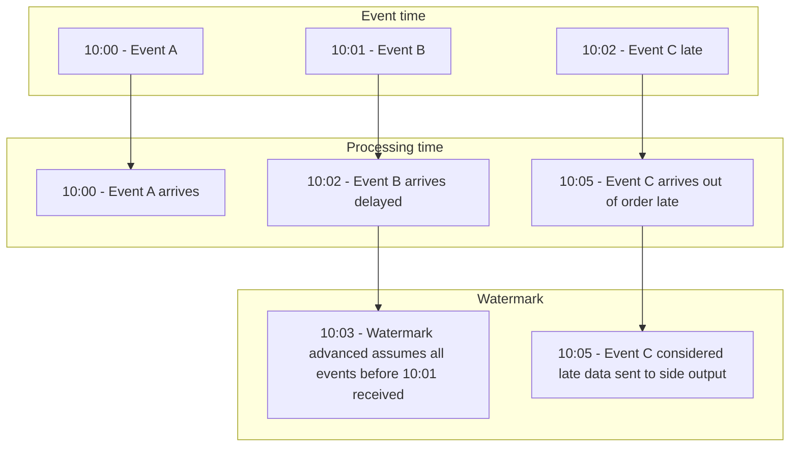

**Correct Answer:**  
C

**Explanation:**  
- **Watermarks** track event-time progress and allow Dataflow to wait for stragglers.  
- **Timestamps** order events correctly, even if out-of-order.  
- A/B don’t solve late arrivals properly.  
- D is good practice but incomplete—still need **watermarks** to know how late is acceptable.

---

#### Q63: Add synthetic feature for linear separation

**Question:**  
Dataset has circular separation by class (X,Y). Need to classify with linear algorithm by adding a synthetic feature. Which?  

Options:  
<mark>A. X² + Y²</mark>  
B. X²  
C. Y²  
D. cos(X)  

**Correct Answer:**  
A

**Explanation:**  
- Circle equation: **X² + Y² = r²**. Adding this feature makes data linearly separable in higher dimension.  
- B and C lose joint relationship (need both X and Y).  
- D ignores Y, doesn’t match circular boundary.

---

#### Q64: Secure app → BigQuery access without per-user auth

**Question:**  
IT app integrates with BigQuery. Users should not authenticate individually, nor get dataset access. How to access securely?  

Options:  
A. Grant group dataset access  
B. Use SSO + pass user creds  
<mark>C. Use service account, grant dataset access, use its key</mark>  
D. Dummy user + stored password  

**Correct Answer:**  
C

**Explanation:**  
- **Service accounts** are for apps, not humans. Grant dataset access to SA → app authenticates securely.  
- A/B/D require per-user or insecure key/password sharing.  
- **C is Google-recommended best practice** for app-to-BigQuery integration.

#### Q65: Casual prep for ML with nulls in logistic regression

**Question:**  
Build a data pipeline for logistic regression. Need a casual way to prep data, monitor/adjust **null values**, keep them **real-valued** (not removed).  

Options:  
A. Dataprep → find nulls → Dataproc job: convert to 'none'  
<mark>B. Dataprep → find nulls → Dataprep job: convert to 0</mark>  
C. Dataflow → find nulls → Dataprep job: convert to 'none'  
D. Dataflow → find nulls → custom script: convert to 0  

**Correct Answer:**  
B  

**Explanation:**  
- Logistic regression requires **numeric (real-valued)** inputs.  
- **Dataprep** is the “casual” tool (UI-based wrangling).  
- Converting nulls to **0** keeps them real-valued.  
- 'none' is a string, not numeric.  
- Dataflow/custom scripts are heavier ops than required.

---

#### Q66: Encrypt at rest for Redis/Kafka on GCE with key rotation

**Question:**  
Redis via Kafka on GCE. Must encrypt data at rest with keys you can **create, rotate, and destroy**.  

Options:  
A. SA + API call “encryption at rest”  
<mark>B. Create keys in Cloud KMS; use them for GCE data encryption</mark>  
C. Create keys locally, upload to KMS, use for GCE  
D. Create keys in KMS; reference in API calls at runtime  

**Correct Answer:**  
B  

**Explanation:**  
- **Cloud KMS** supports customer-managed keys (CMEK): creation, rotation, destruction.  
- Integrated directly with GCE disk encryption.  
- **C** (CSEK) = external keys, but rotation harder.  
- **D** = API call use, not true disk encryption at rest.  
- Best practice: use CMEK with KMS (option B).

---

#### Q67: Recommend videos (fast filtering, TB-scale)

**Question:**  
App recommends new videos by past views. Must generate **labels** for video entities, and provide **fast filtering** across several TB of data.  

Options:  
A. Build classifier (MLlib) → Dataproc  
B. Build 2 classifiers (MLlib) → Dataproc  
<mark>C. Use Video Intelligence API for labels; store in Bigtable; filter</mark>  
D. Use Video Intelligence API; store in Cloud SQL; join/filter  

**Correct Answer:**  
C  

**Explanation:**  
- Use **Video Intelligence API** for managed labeling (avoid custom ML).  
- **Bigtable** → low-latency, scalable TB+ data store with key-based filtering.  
- **Cloud SQL** → limited storage (~64TB), slower joins.  
- Spark MLlib (A/B) → heavy/overkill; not needed.

---

#### Q68: Cheapest scalable JSON → BigQuery pipeline

**Question:**  
Write/transform JSON from Pub/Sub to BigQuery. Must minimize **service costs**, handle variable input sizes, with minimal manual ops.  

Options:  
A. Dataproc + monitor CPU + resize workers  
B. Dataproc + diagnose bottleneck + manual tuning  
<mark>C. Dataflow + monitor lag (Stackdriver) + default autoscaling</mark>  
D. Dataflow + monitor runtimes + custom machine types  

**Correct Answer:**  
C  

**Explanation:**  
- **Dataflow** = serverless, auto-scaling, ideal for spiky workloads.  
- **Autoscaling** lowers costs and removes manual intervention.  
- **Dataproc** (A/B) = cluster ops overhead.  
- **D** customizing machine types = more manual ops.

---

#### Q69: YouTube channel log data transfer for ANSI SQL analysis

**Question:**
Your infrastructure includes YouTube channels. You need to transfer YouTube channel data into Google Cloud so worldwide marketing teams can perform **ANSI SQL analysis** on up-to-date logs. What should you do?

**Options:**  
A. <mark>Use Storage Transfer Service to transfer offsite backup files to **Cloud Storage Multi-Regional** bucket as final destination.</mark>  
B. Use Storage Transfer Service to transfer offsite backup files to **Cloud Storage Regional** bucket as final destination.  
C. Use **BigQuery Data Transfer Service** to transfer offsite backup files to **Cloud Storage Multi-Regional** bucket.  
D. Use **BigQuery Data Transfer Service** to transfer offsite backup files to **Cloud Storage Regional** bucket.  

**Correct Answer:** A

**Explanation:**

* **A**: Storage Transfer Service moves backup files into Cloud Storage → from there you can query with BigQuery (external tables / BigLake). Multi-Regional bucket ensures global access for distributed teams.
* **B**: Regional bucket is cheaper but not global; less aligned with worldwide requirement.
* **C/D**: BigQuery Data Transfer Service only loads into **BigQuery datasets**, not GCS. Options C/D are invalid.

---

#### Q70: Storage design for very large text files with ANSI SQL

**Question:**
You are designing storage for very large text files in a Google Cloud data pipeline. Requirements:

* Support **ANSI SQL queries**.
* Support **compression**.
* Support **parallel load** from input locations (Google best practices).

**Options:**  
A. Transform text files to compressed **Avro** using Cloud Dataflow. Store in BigQuery for storage and query.  
B. <mark>Transform text files to compressed **Avro** using Cloud Dataflow. Store in **Cloud Storage** and query via permanent BigQuery external tables.</mark>  
C. Compress text files to **gzip** using Grid Computing Tools. Store in BigQuery for storage and query.  
D. Compress text files to **gzip** using Grid Computing Tools. Store in Cloud Storage, then import into **Cloud Bigtable** for query.  

**Correct Answer:** B

**Explanation:**

* **B**: Best practice → Store Avro in Cloud Storage (cheap, compressed, parallel load). BigQuery external tables allow ANSI SQL queries without fully loading into BQ storage.
* **A**: Works but increases storage costs in BigQuery.
* **C/D**: Gzip is slower, not parallel-friendly; Bigtable doesn’t support ANSI SQL.

---

#### Q71: Auto-label blog posts without ML expertise

**Question:**  
You need to add **subject labels** to users’ blog posts quickly with **no ML expertise or extra dev resources**.  

**Options:**  
A. <mark>Call the **Cloud Natural Language API** and use **Entity Analysis** results as labels.</mark>  
B. Call the Cloud Natural Language API and use **Sentiment Analysis** as labels.  
C. Build/train a TensorFlow text classifier; deploy on Cloud ML Engine; call from the app.  
D. Build/train a TensorFlow model; deploy on GKE; call from the app.  

**Correct Answer:** A  

**Explanation:**  
- **A** uses a pre-trained API (fastest path) and returns label-like entities (person/org/location/product).  
- **B** returns emotion/attitude, not subjects.  
- **C/D** require custom ML work (slow, resource-heavy).  

---

#### Q72: Cheapest storage for 20 TB CSV with ANSI SQL via multiple engines

**Question:**  
Store **20 TB CSV** and let multiple teams query aggregates while minimizing **query cost**. Data is in **Cloud Storage** and queried by multiple engines.  

**Options:**  
A. Cloud **Bigtable** for storage; query with **HBase shell** on GCE.  
B. Cloud **Bigtable** for storage; link as **permanent tables** in BigQuery.  
C. <mark>**Cloud Storage** for storage; link as **permanent external tables** in BigQuery.</mark>  
D. **Cloud Storage** for storage; link as **temporary tables** in BigQuery.  

**Correct Answer:** C  

**Explanation:**  
- **C** stores cheaply in GCS and uses **permanent external tables** for reusable ANSI SQL without loading into BQ storage.  
- **A/B**: Bigtable suits NoSQL/point lookups, not aggregate analytics economy.  
- **D**: Temporary tables are ad-hoc and not shareable.  

---

#### Q73: Relational workload, horizontal transactions + range queries

**Question:**  
Two relational tables (~10 TB) must support **horizontally scalable transactions** and **range queries on non-key columns**.  

**Options:**  
A. **Cloud SQL** with secondary indexes.  
B. **Cloud SQL** + Dataflow transforms.  
C. <mark>**Cloud Spanner** with **secondary indexes**.</mark>  
D. **Cloud Spanner** + Dataflow transforms.  

**Correct Answer:** C  

**Explanation:**  
- **C**: Only **Cloud Spanner** provides **horizontal scale + transactions**; secondary indexes optimize range queries.  
- **A/B**: Cloud SQL scales vertically; Dataflow doesn’t fix scaling/transactions.  
- **D**: ETL not required for the query pattern.  

---

#### Q74: 50 TB financial time-series, frequent updates, Hadoop migration

**Question:**  
Store **50 TB time-series** data with **frequent updates/streaming** and migrate existing **Hadoop** jobs.  

**Options:**  
A. <mark>**Cloud Bigtable**</mark>  
B. **BigQuery**  
C. **Cloud Storage**  
D. **Cloud Datastore**  

**Correct Answer:** A  

**Explanation:**  
- **Bigtable** is ideal for **time-series** with high write/read throughput and HBase API compatibility (Dataproc/Hadoop).  
- **BigQuery** is for analytical queries, not frequent row updates.  
- **GCS/Datastore** don’t fit high-throughput time-series writes.  

---

#### Q75: Share aggregates securely across projects with cost isolation

**Question:**  
Expose only **aggregated** BigQuery results to other projects, **hide user-level data**, **minimize storage**, and **bill query cost to the consumer project**.  

**Options:**  
A. <mark>Create and share an **authorized view** that returns aggregates.</mark>  
B. Create/share a new dataset and a view with aggregates.  
C. Create/share a new dataset and a precomputed aggregate **table**.  
D. Grant **dataViewer** IAM on the dataset.  

**Correct Answer:** A  

**Explanation:**  
- **Authorized views** restrict raw data, avoid duplication, and billing goes to the querying project; storage isn’t duplicated.  
- **B/C** add management/storage overhead (and C duplicates data).  
- **D** exposes raw tables.  

---

#### Q76: Where to store data requiring auditable access records

**Question:**  
Regulations require an **auditable record of access** to certain data (assume expiring logs are archived correctly). Where to store the **regulated data**?  

**Options:**  
A. Encrypt in **Cloud Storage** with user-supplied keys; give separate decryption keys.  
B. <mark>Store in a **BigQuery** dataset restricted to authorized users; rely on **Data Access logs** for auditability.</mark>  
C. Store in **Cloud SQL** with separate DB users; use **Admin activity logs**.  
D. Use a **Cloud Storage** bucket only reachable via an App Engine service that logs access before sharing links.  

**Correct Answer:** B  

**Explanation:**  
- **B**: BigQuery’s **Data Access logs** + IAM provide native, fine-grained query/access auditing.  
- **A**: Encryption ≠ access audit trail.  
- **C**: Admin logs cover admin actions, not data read access granularity.  
- **D**: Custom logging adds complexity and is easier to bypass.  


---


#### Q77: Speeding up neural network training

**Question:**  
Your neural network model is taking days to train. You want to increase the training speed. What can you do?  

**Options:**  
A. Subsample your test dataset.  
B. <mark>Subsample your training dataset.</mark>  
C. Increase the number of input features to your model.  
D. Increase the number of layers in your neural network.  

**Correct Answer:** B  

**Explanation:**  
- **B**: Reducing the training dataset lowers the volume of data processed → faster iteration and quicker feedback during model prototyping.  
- **A**: Subsampling the **test set** compromises evaluation, not training.  
- **C/D**: Adding features or layers makes the model more complex, **slowing down training**.  
- Tradeoff: Faster experimentation but potentially lower accuracy/generalization.  

---

#### Q78: Writing ETL pipelines on Hadoop with checkpointing

**Question:**  
You are responsible for writing ETL pipelines to run on an Apache Hadoop cluster. The pipeline will require some **checkpointing and splitting pipelines**. Which method should you use?  

**Options:**  
A. <mark>PigLatin using Pig</mark>  
B. HiveQL using Hive  
C. Java using MapReduce  
D. Python using MapReduce  

**Correct Answer:** A  

**Explanation:**  
- **PigLatin**: High-level scripting language built for **ETL pipelines**, supports **checkpointing** and **pipeline splitting**.  
- **Hive**: SQL-like → designed for querying, not ETL control flow.  
- **MapReduce (Java/Python)**: Low-level and flexible, but more complex to implement.  
- Best balance of simplicity and ETL features = **Pig**.  

---

#### Q79: Maximizing hybrid transfer speeds (datacenter → GCP)

**Question:**  
Analytics data is imported daily to Cloud Storage via parallel uploads through a **transfer server in GCP**. Transfers take too long. You need to maximize **transfer speed**.  

**Options:**  
A. Increase the CPU size on your server.  
B. Increase the size of the Google Persistent Disk on your server.  
C. <mark>Increase your network bandwidth from your datacenter to GCP.</mark>  
D. Increase your network bandwidth from Compute Engine to Cloud Storage.  

**Correct Answer:** C  

**Explanation:**  
- **C**: The real bottleneck is **network throughput** from the on-premises datacenter to GCP → more bandwidth = faster transfers.  
- **A/B**: CPU/disk won’t help if network is the bottleneck.  
- **D**: Within GCP, bandwidth is usually sufficient; the constraint lies in the external datacenter connection.  

---

#### Q80: MJTelco — query petabyte-scale + millisecond scans

**Question:**  
MJTelco needs:  
1. **Aggregations** over petabyte-scale datasets.  
2. **Millisecond scans** of specific time-range rows.  

Which GCP products should you recommend?  

**Options:**  
A. Cloud Datastore and Cloud Bigtable  
B. Cloud Bigtable and Cloud SQL  
C. <mark>BigQuery and Cloud Bigtable</mark>  
D. BigQuery and Cloud Storage  

**Correct Answer:** C  

**Explanation:**  
- **BigQuery**: Best for **petabyte-scale aggregations** with ANSI SQL.  
- **Bigtable**: Optimized for **low-latency time-series / range scans**.  
- **A/B/D**: Datastore/SQL can’t scale to PB analytics; GCS is for storage, not millisecond queries.  
- Combination of **BigQuery + Bigtable** covers both analytics and fast time-range lookups.  

---

#### Q81: MJTelco — Visualization for suboptimal links

**Question:**
Ops team needs dashboards:

* 50k installs, 6 weeks telemetry (1-min samples).
* Report ≤3h delayed from live data.
* Actionable report: only **suboptimal links**, sorted to top.
* Group/filter by region.
* Report load time <5s.
* Avoid creating/updating new visualizations monthly.

**Options:**  
A. Pre-build charts/tables for every criteria combination.  
B. <mark>Generalized charts + filters for dynamic selection</mark>  
C. Export to spreadsheets, multiple tabs.  
D. Custom App Engine + Google Charts API.  

**Correct Answer:** B

**Explanation:**

* **Filters** allow flexible exploration (date range, region, type) without redesign.
* **Dynamic dashboards** scale better than manually building many static charts.
* **C/D** = heavy maintenance or deprecated APIs.
* **B** minimizes effort while ensuring dashboards always reflect latest 6 weeks.

---

#### Q82: MJTelco — BigQuery cost optimization with streaming

**Question:**
MJTelco wants:

* A **single table** `tracking_table`.
* Streaming ingestion.
* **Fine-grained daily analysis**.
* Control costs of queries (100M records/day).

**Options:**  
A. Single table + DATE column.  
B. <mark>Partitioned table + TIMESTAMP column</mark>  
C. Sharded tables per day   (`tracking_table_YYYYMMDD`).
D. Single table + TIMESTAMP only.  

**Correct Answer:** B

**Explanation:**

* **Partitioned tables** = efficient querying (scan only partitions).
* Supports **streaming ingestion** into partitions.
* **A/D**: No partitioning → high query costs.
* **C**: Sharding works but is harder to manage vs partitioning.

---

#### Q83: Flowlogistic — Real-time inventory tracking (Kafka replacement)

**Question:**
Flowlogistic needs to replace **Kafka** for real-time tracking:

* Ingest from **global sources**.
* Process/query in **real time**.
* Store data reliably.

**Options:**  
A. <mark>Cloud Pub/Sub + Cloud Dataflow + Cloud Storage</mark>  
B. Pub/Sub + Dataflow + Local SSD.  
C. Pub/Sub + Cloud SQL + Cloud Storage.  
D. Cloud Load Balancing + Dataflow + Cloud Storage.  
E. Dataflow + Cloud SQL + Cloud Storage.  

**Correct Answer:** A

**Explanation:**

* **Pub/Sub** = scalable ingestion (global).
* **Dataflow** = streaming/batch processing with real-time query transforms.
* **Cloud Storage** = durable + cost-effective storage.
* **SQL/SSD/Load Balancing** = not scalable for this scenario.

---

#### Q84: BigQuery ETL migration — verify identical outputs

**Question:**
After migrating ETL jobs to BigQuery, you need to verify new vs old outputs.

* Tables have **no primary key**.
* Must confirm outputs are **identical**.

**Options:**  
A. Random sample with RAND().  
B. Random sample with HASH().  
C. <mark>Dataproc + BQ Hadoop connector → sort + hash non-timestamp columns</mark>  
D. Stratified random samples with OVER().  

**Correct Answer:** C

**Explanation:**

* **C** ensures **full-table deterministic comparison** (hash of sorted rows).
* **A/B/D** only validate samples, risk missing mismatches.
* For correctness, must check **all rows**.

#### Q85: BigQuery slot quota — enterprise BI teams

**Question:**  
You are a head of BI at a large enterprise with multiple business units.  
- Using **on-demand pricing** for BigQuery  
- Quota: 2K concurrent on-demand slots per project  
- Users sometimes cannot get slots to run queries  
- Want to solve without adding new projects  

**Options:**  
A. Convert batch BQ queries into interactive queries  
B. Create an additional project to bypass 2K slot quota  
C. <mark>Switch to flat-rate pricing and establish a hierarchical priority model</mark>  
D. Increase concurrent slots quota per project in Cloud Console  

**Correct Answer:** C  

**Explanation:**  
- Flat-rate reservations → purchase dedicated slots, no 2K/project cap.  
- Hierarchical priorities = allocate slots fairly across business units.  
- A does not fix quota.  
- B adds projects (explicitly disallowed).  
- D: 2K is a hard limit, cannot increase.  

#### Q86: Kafka → Google Cloud mirroring

**Question:**  
On-prem Kafka cluster with web logs. Need replication to Google Cloud (for BQ + GCS).  
- Preferred: **mirroring** (avoid Kafka Connect plugins).  

**Options:**  
A. <mark>Deploy Kafka on GCE → mirror from on-prem → read with Dataproc/Dataflow → GCS</mark>  
B. Kafka on GCE + Pub/Sub Kafka connector (Sink)  
C. Pub/Sub Kafka connector on-prem (Source) + Dataflow → GCS  
D. Pub/Sub Kafka connector on-prem (Sink) + Dataflow → GCS  

**Correct Answer:** A  

**Explanation:**  
- Mirroring = Kafka-native geo-replication, avoids connectors.  
- B/C/D require Kafka Connect plugins (not allowed).  
- A fits requirement best, though Google-native designs often prefer D.  

#### Q87: Dataproc shuffle optimization (cost-sensitive)

**Question:**  
Migrated Hadoop job → Dataproc + GCS.  
- Spark workload with heavy shuffles  
- Parquet files: 200–400 MB each  
- Organization is **cost-sensitive**, using preemptibles (2 non-preemptibles only)  
- Performance degraded after migration  

**Options:**  
A. Increase Parquet file size ≥ 1 GB  
B. Switch to TFRecords (~200 MB each)  
C. Switch HDD → SSD, copy GCS → HDFS for shuffle → back to GCS  
D. <mark>Switch HDD → SSD, override preemptible VM boot disk size</mark>  

**Correct Answer:** D  

**Explanation:**  
- Shuffle-intensive Spark workloads benefit from faster/larger local disks.  
- Preemptibles default to small HDD boot disks; overriding with SSD improves shuffle speed.  
- A: larger Parquet files help, but less impactful vs shuffle bottleneck.  
- B: TFRecords irrelevant.  
- C: more ops + cost overhead.  

---

#### Q88: Dataflow pipeline — error handling & reprocessing

**Question:**  
Dataflow job fails due to bad input rows. Need reliability + ability to reprocess failing data.  

**Options:**  
A. Filter errors, skip in future; extract from logs  
B. Try/catch in DoFn, log errors only  
C. Try/catch in DoFn, write bad rows directly to Pub/Sub  
D. <mark>Try/catch in DoFn, sideOutput → PCollection → later Pub/Sub/BigQuery</mark>  

**Correct Answer:** D  

**Explanation:**  
- Side outputs = Beam best practice for “dead letter” data.  
- Keeps pipeline clean (I/O via sinks, not inside DoFn).  
- A/B = data loss, no reprocess path.  
- C = direct Pub/Sub writes inside DoFn = inefficient & brittle.  

#### Q89: Housing price model — location feature engineering

**Question:**  
You are training a neural net to predict housing prices. Dataset includes **latitude** and **longitude**.  
Real estate experts confirm **location** is very influential. Need to engineer a feature that reflects this spatial dependency.  

**Options:**  
A. Provide latitude and longitude as input vectors  
B. Create a numeric column from a feature cross of latitude and longitude  
C. <mark>Create a feature cross of latitude and longitude, bucketize at minute level, use L1 regularization</mark>  
D. Create a feature cross of latitude and longitude, bucketize at minute level, use L2 regularization  

**Correct Answer:** C  

**Explanation:**  
- L1 regularization encourages sparsity → keeps influential features, shrinks irrelevant ones.  
- C: feature cross + bucketization captures **local neighborhood effect** (1 minute ≈ 1.8 km).  
- A: raw lat/long not effective for neural net.  
- B: numeric cross less expressive.  
- D: L2 distributes weights more evenly, less effective for sparse geography.  

---

#### Q90: MariaDB monitoring on GCE VMs

**Question:**  
Deploying **MariaDB** on GCE VMs. Need metrics (network connections, disk I/O, replication status) with **minimal development effort**, using **Stackdriver dashboards/alerts**.  

**Options:**  
A. Install OpenCensus Agent + custom exporter to Stackdriver  
B. Place MariaDB instances in Instance Group with Health Check  
C. Install Stackdriver Logging Agent + fluentd in_tail plugin for MariaDB logs  
D. <mark>Install Stackdriver Agent and configure the MySQL plugin</mark>  

**Correct Answer:** D  

**Explanation:**  
- D: Stackdriver (Ops Agent) has a **MySQL plugin** that works with MariaDB → ready-made metrics (I/O, replication, connections).  
- A: requires **custom development** (not minimal).  
- B: health check = uptime only, no metrics.  
- C: logging only, not metrics.  


#### Q91: Credit default rates — model choice

**Question:**  
You work for a bank with a labeled dataset of already granted loans and whether they defaulted. You must train a model to predict **default rates** for applicants.  

**Options:**  
A. Increase the size of the dataset by collecting additional data  
B. <mark>Train a linear regression to predict a credit default risk score</mark>  
C. Remove the bias from the data and collect applications that have been declined loans  
D. Match loan applicants with their social profiles to enable feature engineering  

**Correct Answer:** B  

**Explanation:**  
- Predicting a **rate/score** can be framed as a regression target; linear regression yields a continuous risk score.  
- A/C/D may be useful later, but don’t directly deliver a working model now (and D risks privacy/compliance issues).  


---

#### Q92: 2TB relational DB to GCP — minimize refactor & cost

**Question:**  
Migrate a **2TB relational database** to GCP. Minimal refactoring; cost is primary concern.  

**Options:**  
A. Cloud Spanner  
B. Cloud Bigtable  
C. Cloud Firestore  
D. <mark>Cloud SQL</mark>  

**Correct Answer:** D  

**Explanation:**  
- Cloud SQL is a **managed relational** service → lowest refactor effort and cost for 2TB.  
- Spanner is powerful but costlier and requires schema/SQL changes; Bigtable/Firestore are NoSQL.  


---

#### Q93: Bigtable prod + hourly analytics — workload isolation

**Question:**  
Real-time Bigtable app (heavy read/write). New **hourly** analytics over whole DB; must protect production reliability.  

**Options:**  
A. Export dump to GCS and run analytics on files  
B. Add second cluster with **multi-cluster** routing; live app vs batch profiles  
C. <mark>Add second cluster with **single-cluster** routing; live app vs batch profiles</mark>  
D. Double the size of existing cluster and run both workloads there  

**Correct Answer:** C  

**Explanation:**  
- Replicate instance; use **app profiles** to route prod traffic to one cluster and analytics to the other via **single-cluster routing** to avoid interference.  
- B is for HA/failover; here isolation is the key.  


---

#### Q94: Beam — enrich Pub/Sub with BigQuery reference data

**Question:**  
Enrich **Pub/Sub** events with small static reference data from **BigQuery**; write enriched results back to BigQuery.  

**Options:**  
A. Batch job, PubSubIO, side-inputs  
B. Streaming job, PubSubIO, JdbcIO, side-outputs  
C. <mark>Streaming job, PubSubIO, BigQueryIO, side-inputs</mark>  
D. Streaming job, PubSubIO, BigQueryIO, side-outputs  

**Correct Answer:** C  

**Explanation:**  
- Streaming from Pub/Sub; **side inputs** hold small BQ reference set; **BigQueryIO** writes results.  


---

#### Q95: Scale Bigtable writes — what to monitor (choose 2)

**Question:**  
Pipeline writes to Bigtable with good row keys. When should you scale the cluster?  

**Options:**  
A. Key Visualizer: Read pressure index > 100  
B. Key Visualizer: Write pressure index > 100  
C. <mark>Monitor **write latency**; sustained increase ⇒ add nodes</mark>  
D. <mark>Monitor **storage utilization**; > ~70% of max ⇒ add nodes</mark>  
E. Monitor read latency; if > 100 ms ⇒ add nodes  

**Correct Answer:** C, D  

**Explanation:**  
- **C:** Sustained write latency growth indicates insufficient capacity.  
- **D:** Google recommends adding nodes when storage utilization exceeds ~**70%**.  


---

#### Q96: Daily NLP on social posts — archive raw & analyze cheaply

**Question:**  
Batch-load posts daily, run Cloud **Natural Language API**, extract topics/sentiment, **archive raw** data, and build dashboards.  

**Options:**  
A. Store posts + extracted data in BigQuery  
B. Store posts + extracted data in Cloud SQL  
C. <mark>Store **raw posts in Cloud Storage**, write **extracted data to BigQuery**</mark>  
D. Feed posts directly to API from source, write extracted data to BigQuery  

**Correct Answer:** C  

**Explanation:**  
- GCS is ideal/cheap for **raw archival**; BigQuery is ideal for **analytics / dashboards** on extracted features.  


---

#### Q97: Transform GCS data — no programming / no SQL

**Question:**  
Historic data in GCS; need error detection and transformations **without coding or SQL**.  

**Options:**  
A. Cloud Dataflow with Beam  
B. <mark>Cloud Dataprep with recipes</mark>  
C. Cloud Dataproc with Hadoop job  
D. Federated BigQuery tables with queries  

**Correct Answer:** B  

**Explanation:**  
- **Dataprep** (Trifacta) provides **visual, no-code** data profiling, cleansing, and transformation.  


---

#### Q98: Upload historic data to GCS — no inbound from external IPs

**Question:**  
Security forbids external IP access **into** on-prem. After initial upload, add daily data from on-prem apps.  

**Options:**  
A. <mark>Run **gsutil rsync** from on-prem servers</mark>  
B. Use Dataflow to write to GCS  
C. Dataproc job to transfer  
D. FTP to a GCE VM then move to GCS  

**Correct Answer:** A  

**Explanation:**  
- Outbound from on-prem to GCS is allowed; **gsutil rsync** handles incremental daily syncs simply and securely.  


---

#### Q99: BigQuery full scan — filter on timestamp & ID

**Question:**  
A query filters by **timestamp** and **ID** but still **full scans**. Minimize scanned bytes with minimal SQL changes.  

**Options:**  
A. Separate table per ID  
B. LIMIT  
C. <mark>Recreate table with a **partitioning** column and a **clustering** column</mark>  
D. maximum_bytes_billed flag  

**Correct Answer:** C  

**Explanation:**  
- **Partition** on time to prune partitions; **cluster** on ID to prune blocks → less data scanned without changing queries much.  
- LIMIT doesn’t reduce bytes scanned; D only caps billing, not scan.  


---

#### Q100: 50k sensors every minute — sub-minute availability in BQ

**Question:**  
Insert minute-resolution data from **50,000 sensors** into BigQuery, with data available within **~1 minute**; expect growth.  

**Options:**  
A. bq load every 60 seconds  
B. <mark>Use a **Cloud Dataflow** pipeline to **stream** into BigQuery</mark>  
C. INSERT a batch every 60 seconds  
D. MERGE updates every 60 seconds  

**Correct Answer:** B  

**Explanation:**  
- **Streaming inserts** via Dataflow provide near-real-time availability and scale for growing, high-rate sensor data.  

---

#### Q101: Secure migration of 10TB patient records to BigQuery

**Question:**  
You need to copy millions of **sensitive patient records** (10 TB total) from a relational DB to BigQuery.  
The solution must be **secure and time-efficient**.  

**Options:**  
A. Export as Avro → upload via gsutil → load into BQ via Console  
B. <mark>Export as Avro → load via Transfer Appliance → load into BQ via Console</mark> ✅
C. Export as CSV → publish as public URL → Storage Transfer Service → GCS → BQ  
D. Export as Avro → publish as public URL → Storage Transfer Service → GCS → BQ  

**Correct Answer:** B  

**Explanation:**  
- **B:** Transfer Appliance is Google’s recommended approach for **large (TB+) and sensitive datasets**, ✅avoiding long uploads and public internet risks.  
- **A:** Feasible if bandwidth is high, but risky for sensitive data and 10TB scale.  
- **C/D:** Public URL introduces **security risks**, unacceptable for patient records.  


---

#### Q102: Near real-time inventory dashboard on BigQuery

**Question:**  
Need near real-time **inventory dashboard** on BigQuery.  
- Historical data = balances by item & location.  
- Several **thousand updates/hour**.  
- Must ensure **accuracy + performance**.  

**Options:**  
A. Use BQ UPDATE statements on balances directly  
B. Partition balances table by item  
C. <mark>Stream changes into daily movement table → calculate balances in a view (join to history) → nightly update balance table</mark>  ✅   
D. Use bulk loader for daily movement table, join in a view, nightly update balances  

**Correct Answer:** C  

**Explanation:**  
- **C:** Streaming inserts → near real-time updates in movement table; view joins history for accurate dashboards; nightly balance update keeps history consistent.  ✅   
- **A:** Inefficient — thousands of UPDATEs/hour hit quotas and cost.  
- **B:** Partitioning helps queries but not streaming updates.  
- **D:** Bulk loader adds latency; not near real-time.  

#### Q103: BigQuery HA + backup — 30-day RPO
**Question:**  
Need 30-day recovery (RPO), minimize cost.  

**Options:**  
A. Regional + point-in-time snapshot  
B. Regional + scheduled query copies (time-suffixed tables)  
C. Multi-regional + point-in-time snapshot  
D. Multi-regional + scheduled query copies  

**Correct Answer:** B  

**Explanation:**  
- Time travel = only 7 days. For 30 days → need **scheduled copies**.  
- Regional storage = cheaper than multi-regional.  
- C/D = mislead; "point-in-time snapshot" is max 7 days.  

---

#### Q104: Reuse Dataprep recipe daily after load
**Question:**  
Dataprep recipe on sample BQ table. Must run daily **after load (variable time)**.  

**Options:**  
A. Cron schedule in Dataprep  
B. App Engine cron job  
C. Export recipe template + Cloud Scheduler  
D. Export Dataprep job as Dataflow template + use Composer  

**Correct Answer:** D  

**Explanation:**  
- Job must wait until **load finishes (variable time)**.  
- Only **Composer DAG** can orchestrate dependencies.  
- D = Dataprep → Dataflow template → Composer trigger.  
- A = fixed schedule → fails with variable load time.  

---

#### Q105: Automate multi-step pipeline (Dataproc + Dataflow)
**Question:**  
Daily pipeline with multiple dependencies. Use managed orchestration.  

**Options:**  
A. cron  
B. <mark>Cloud Composer</mark>  
C. Cloud Scheduler  
D. Workflow Templates (Dataproc only)  

**Correct Answer:** B  

**Explanation:**  
- Composer (Airflow) = managed multi-step DAG orchestration.  
- cron / Scheduler = too simple.  
- Dataproc templates = single service, not multi-step.  

---

#### Q106: Speed up Dataproc job cheaply, no lost work
**Question:**  
Make job faster, minimize cost, don’t lose in-progress work.  

**Options:**  
A. Add more non-preemptible workers  
B. Preemptible workers (forceful decommission)  
C. Preemptible workers + script  
D. <mark>Preemptible workers + graceful decommission</mark>  

**Correct Answer:** D  

**Explanation:**  
- Preemptibles = cheap.  
- Graceful decommission = tasks finish before removal.  
- A = safe but expensive.  
- B/C risk losing work.  

---

#### Q107: Prevent PII leak in Kafka → Analytics
**Question:**  
Scanners accidentally sent PII. Need quick managed solution to filter.  

**Options:**  
A. Authorized BQ view  
B. Third-party validation on VM  
C. Cloud Logging  
D. <mark>Cloud Function + DLP API (tag + quarantine)</mark>  

**Correct Answer:** D  

**Explanation:**  
- Cloud DLP detects PII with confidence tags.  
- Cloud Function = scalable inline filter.  

---

#### Q108: Schedule 3 jobs (Dataflow + Dataproc + 3rd-party ingest)
**Question:**  
Need scheduling, monitoring, manual run.  

**Options:**  
A. <mark>Cloud Composer DAG</mark>  
B. Stackdriver + webhook  
C. App Engine app  
D. cron on GCE  

**Correct Answer:** A  

**Explanation:**  
- Composer = DAG orchestration, monitoring, manual trigger.  
- B/C/D = ad hoc, not managed orchestration.  

---

#### Q109: Pub/Sub → Cloud Functions, message rate too high, no errors
**Question:**  
What 2 causes?  

**Options:**  
A. Publisher quota  
B. Outstanding messages > 10MB  
C. Bad error handling  
D. Subscriber too slow  
E. Subscriber not acking messages  

**Correct Answer:** D, E  

**Explanation:**  
- D: subscriber can’t keep up → backlog.  
- E: no ack → Pub/Sub redelivers = inflated message rate.  

---

#### Q110: Filter corrupt IoT data in Dataflow
**Question:**  
2% of data corrupt → filter out.  

**Options:**  
A. SideInput Boolean  
B. <mark>ParDo</mark>  
C. Partition  
D. GroupByKey  

**Correct Answer:** B  

**Explanation:**  
- ParDo = standard transform for filtering/discarding elements.  
- Partition/GroupByKey overkill.  

---

#### Q111: 3 years BQ data, query 30–90 days → full scan
**Question:**  
Bill rising. Cost-effective fix?  

**Options:**  
A. <mark>Recreate table with partitioned DATE/TIMESTAMP</mark>  
B. Export CSV + Datalab  
C. Separate last 90d vs history tables  
D. Beam job → table-per-day  

**Correct Answer:** A  

**Explanation:**  
- Partitioning reduces scanned bytes; SQL unchanged.  
- Sharding/wildcards less efficient than partitions.  

---

#### Q112: Event delivery unreliable via leased lines
**Question:**  
Global IoT, latency unpredictable, want cost-effective fix.  

**Options:**  
A. Deploy local Kafka  
B. <mark>Publish directly to Pub/Sub</mark>  
C. Cloud Interconnect everywhere  
D. Dataflow session windows  

**Correct Answer:** B  

**Explanation:**  
- Pub/Sub = global, retry buffer, cost-effective.  
- Kafka/Interconnect = expensive.  
- D = doesn’t solve connectivity issue.  

---

#### Q113: Online sales + in-home assistants (Google Home)
**Question:**  
Interpret voice commands → backend order.  

**Options:**  
A. Speech-to-Text  
B. Natural Language API  
C. <mark>Dialogflow EE</mark>  
D. AutoML NL  

**Correct Answer:** C  

**Explanation:**  
- Dialogflow = voice + intent recognition + integration.  
- STT only transcribes, no intent.  

---

#### Q114: Hybrid/multi-cloud pipeline orchestration
**Question:**  
Pipeline spans multiple clouds. Which orchestration?  

**Options:**  
A. Dataflow  
B. <mark>Cloud Composer</mark>  
C. Dataprep  
D. Dataproc  

**Correct Answer:** B  

**Explanation:**  
- Composer (Airflow) = multi-cloud orchestration.  
- Others = single-service ETL tools.  

---

#### Q115: Share BQ dataset with 3rd parties, keep cost low
**Question:**  
Need current data, low sharing cost.  

**Options:**  
A. <mark>Analytics Hub</mark>  
B. Export to GCS + share bucket  
C. Create copy dataset  
D. Dataflow copy jobs  

**Correct Answer:** A  

**Explanation:**  
- Analytics Hub = share BQ datasets securely, no duplication.  
- B/C/D = duplicate/export = more cost.  

---

#### Q116: Optimize CDC ingestion to BQ (log-based streams)
**Question:**  
Daily CDC, want near-real-time + reduce compute.  

**Options:**  
A. Apply DML INSERT/UPDATE/DELETE directly in reporting table  
B. <mark>Insert CDC records into staging table</mark>  
C. Periodic DELETE outdated rows  
D. <mark>Periodically MERGE from staging → reporting</mark>  
E. Insert into reporting table + materialized view  

**Correct Answer:** B, D  

**Explanation:**  
- Staging + MERGE pattern = Google recommended CDC → balance **low latency** + **lower compute overhead**.  
- A = too costly (per-row DML).  
- C = not needed.  
- E = unusual pattern, not common practice.  

#### Q117: Scalable, ordered, at-least-once pipeline
**Question:**  
Pipeline must auto-scale, process messages **at least once**, ordered within 1-hour windows.  

**Options:**  
A. Kafka + Dataproc  
B. Kafka + Dataflow  
C. Pub/Sub + Dataproc  
D. <mark>Pub/Sub + Dataflow</mark> ✅  

**Correct Answer:** D  

**Explanation:**  
- **Pub/Sub** → at-least-once delivery, fully managed, elastic.  
- **Dataflow** → auto-scaling, supports **windowed ordering** (1h).  
- Dataproc = cluster-based, not auto-scaling serverless.  
- Kafka not needed in GCP exam context.  

---

#### Q118: BigQuery access control for departments
**Question:**  
- Each dept only sees their own data.  
- Leads: can **create/update tables**.  
- Analysts: can **query only**.  

**Options:**  
A. Dataset per dept, Leads=OWNER, Analysts=WRITER  
B. <mark>Dataset per dept, Leads=WRITER, Analysts=READER</mark> ✅  
C. Table per dept, roles at project-level (Owner/Editor)  
D. Table per dept, roles at project-level (Editor/Viewer)  

**Correct Answer:** B  

**Explanation:**  
- Dataset-level separation = clean boundary.  
- **WRITER** → can create tables.  
- **READER** → query-only.  
- Project-level (C/D) violates least privilege.  
- OWNER too much power.  

---

#### Q119: Bigtable schema for stock trades

**Question:**  
Stock trades stored in Bigtable.  
- Current row key = datetime prefix.  
- App queries “average stock price for company over time.”  
- Performance degrades with more stocks.  

**Options:**  
A. <mark>Row key starts with stock symbol</mark> ✅  
B. Row key starts with random number per second  
C. Use BigQuery instead  
D. Write daily summary to Avro in GCS  

**Correct Answer:** A  

**Explanation:**  
- Row key design is critical in Bigtable.  
- Starting with **timestamp** = hotspotting (sequential writes to same node).  
- Best practice: prepend **high-cardinality field (stock symbol)** before timestamp → distributes load across cluster.  
- Random prefix (B) = even spread, but kills queryability.  
- C/D = architectural shifts, not schema fix.  


#### Q120: Monitoring Dataflow pipeline health

**Question:**
You run a Cloud Dataflow streaming pipeline:

* Source = Pub/Sub subscription
* Sink = Cloud Storage bucket
  Throughput is consistent. You want to monitor alerts in Cloud Monitoring to ensure the pipeline is processing data. Which metrics should you alert on?

**Options:**
A. Alert on *decrease* of `subscription/num_undelivered_messages` and *increase* of `instance/storage/used_bytes`
B. Alert on *increase* of `subscription/num_undelivered_messages` and *decrease* of `instance/storage/used_bytes` ✅
C. Alert on *decrease* of `instance/storage/used_bytes` and *increase* of backlog
D. Alert on *increase* of sink usage and *decrease* of backlog

**Correct Answer:** B

**Explanation:**

* If pipeline stalls: Pub/Sub backlog **increases** (`num_undelivered_messages` grows).
* At the same time, writes to sink slow down → rate of change in storage usage **decreases**.
* Together, these two conditions = failure indicator.

---


#### Q121: Global IoT ingestion architecture

**Question:**  
Kafka cluster (us-east) ingests IoT worldwide. Poor connectivity → bursts. Managing Kafka is costly. What’s the cloud-native solution?

**Options:**  
A. Edge TPUs to buffer and send data  
B. Dataflow + on-prem Kafka  
C. <mark>IoT gateway + Cloud Pub/Sub + Dataflow</mark> ✅  
D. Kafka on Compute Engine + Cloud Load Balancer  

**Correct Answer:** C  

**Explanation:**  
- **Pub/Sub**: global, serverless ingestion, auto-scales to handle spikes.  
- **Dataflow**: streaming processor, integrates natively with Pub/Sub.  
- **Kafka**: ops-heavy, not cloud-native.  
- **Other options**: not designed for scale or streaming.  

---

#### Q122: Datastore backup & recovery

**Question:**  
Need low-cost archival, PIT recovery, clone to another environment.

**Options:**  
A. <mark>Managed export → Cloud Storage Nearline/Coldline</mark> ✅  
B. <mark>Managed export → Import to Datastore in another project/namespace</mark> ✅  
C. Managed export → BigQuery  
D. Stream into BigQuery  
E. Export JSON → Source Repositories  

**Correct Answer:** A, B  

**Explanation:**  
- **Export → GCS**: official long-term backup method. Supports Coldline/Archive for low cost.  
- **Import → another Datastore**: enables recovery or clone.  
- **BigQuery**: built for analytics, not recovery.  
- **Repos**: not for data storage.  

---

#### Q123: BigQuery schema for transactions

**Question:**  
1.5 PB structured, +3 TB/day. Thousands of status updates hourly. Must maximize performance & usability.

**Options:**  
A. <mark>Denormalize data</mark> ✅  
B. Preserve normalized structure  
C. Use UPDATE  
D. <mark>Append status updates (no UPDATE)</mark> ✅  
E. External GCS table  

**Correct Answer:** A, D  

**Explanation:**  
- **Denormalization**: reduces joins, improves performance at scale.  
- **Append-only**: BigQuery favors inserts over row-by-row UPDATE.  
- **Normalized schema**: query cost increases with joins.  
- **External tables**: slower, not optimized for frequent queries.  

---

#### Q124: Multi-format, highly available storage

**Question:**  
Historical CSV, Avro, PDF. Access via Dataproc, BigQuery, Compute Engine. Perf not critical. Max availability.

**Options:**  
A. Dataproc + HDFS  
B. BigQuery  
C. Regional Cloud Storage  
D. <mark>Multi-regional Cloud Storage</mark> ✅  

**Correct Answer:** D  

**Explanation:**  
- **Multi-regional GCS**: highly available, supports all file formats, accessible by all GCP services.  
- **BigQuery**: can’t store PDFs directly.  
- **HDFS**: requires ops overhead.  
- **Regional storage**: less resilient than multi-region.  

---

#### Q125: Data warehouse + external file delivery

**Question:**  
1 PB dataset. Must support BigQuery analytics + expose files for other providers.

**Options:**  
A. BigQuery only  
B. Bigtable  
C. <mark>BigQuery + compressed copy in Cloud Storage</mark> ✅  
D. 80% GCS, 20% BigQuery  

**Correct Answer:** C  

**Explanation:**  
- **BigQuery**: analytics layer.  
- **GCS export**: file delivery for external systems.  
- **Bigtable**: wrong fit (NoSQL).  
- **Split storage**: unnecessary complexity.  

---

#### Q126: PoC for image recognition

**Question:**  
750 components × ~1000 labeled images. Need PoC in few days.

**Options:**  
A. <mark>Cloud Vision AutoML</mark> ✅  
B. AutoML with reduced dataset  
C. Vision API hints  
D. Train custom CNN  

**Correct Answer:** A  

**Explanation:**  
- **AutoML Vision**: fast, low-code, supports custom labels.  
- **Vision API**: generic classifier, not for custom components.  
- **Custom CNN**: too time-consuming.  

---

#### Q127: Accelerating custom C++ TensorFlow ops

**Question:**  
Training dominated by custom C++ ops (matrix multiplies). Takes days. Want faster, low-cost.

**Options:**  
A. TPUs without changes  
B. TPUs with GPU kernel support  
C. <mark>GPUs with GPU kernel support</mark> ✅  
D. Larger CPU cluster  

**Correct Answer:** C  

**Explanation:**  
- **GPUs**: optimized for matrix multiplies, fit well after kernel support.  
- **TPUs**: not designed for arbitrary C++ custom ops.  
- **CPUs**: not scalable enough.  

---

#### Q128: RMSE higher on training set

**Question:**  
Train RMSE > Test RMSE (2× higher).

**Options:**  
A. Increase test set  
B. Collect more data  
C. Regularization  
D. <mark>Increase model complexity</mark> ✅  

**Correct Answer:** D  

**Explanation:**  
- **Higher train error**: underfitting.  
- Fix = increase model complexity (more features or deeper network).  
- **Regularization**: combats overfitting, not underfitting.  
- **More data**: helps generalization but doesn’t solve underfitting.  

---

#### Q129: Error recovery in BigQuery

**Question:**  
ETL sometimes corrupts data. Errors found after 2 weeks. Need low-cost rollback.

**Options:**  
A. One big table + export to GCS  
B. <mark>Partition by month + export compressed to GCS</mark> ✅  
C. Duplicate tables  
D. Snapshot decorators  

**Correct Answer:** B  

**Explanation:**  
- **Partition + export**: cost-effective, long-term rollback beyond 7-day time travel.  
- **Snapshots**: limited to 7 days.  
- **Duplicate tables**: costly, hard to maintain.  

---

#### Q130: Updating BigQuery with 1M CSV records

**Question:**  
Marketing provides 1M CSV updates. UPDATE fails with quotaExceeded.

**Options:**  
A. Reduce batch size  
B. Increase quota  
C. Split CSV smaller  
D. <mark>Stage table + MERGE</mark> ✅  

**Correct Answer:** D  

**Explanation:**  
- **Staging + MERGE**: scalable way to apply batch updates.  
- **UPDATE**: inefficient, quota-bound.  
- **Quota increase**: not feasible.  
- **Splitting files**: doesn’t solve core issue.  

---

#### Q131: Simplify IAM across many projects

**Question:**  
Many projects, unique configs, IT needs global access, share datasets ad hoc. Minimize IAM policies.

**Options:**  
A. Deployment Manager  
B. <mark>Use org/folder/project hierarchy</mark> ✅  
C. <mark>Use groups instead of individuals</mark> ✅  
D. Service accounts only  
E. Manual bucket/dataset policies  

**Correct Answer:** B, C  

**Explanation:**  
- **Hierarchy**: IAM inheritance reduces repeated policies.  
- **Groups**: easier management than individual users.  
- **Other options**: either too manual or not scalable.  

---

#### Q132: Global transactional DB requirement

**Question:**  
Table grows 250k rows/sec. Needs: global endpoint, ANSI SQL, strong consistency.

**Options:**  
A. BigQuery (no region set)  
B. <mark>Cloud Spanner with leader in US + replicas in EU/Asia</mark> ✅  
C. Cloud SQL with master/replicas  
D. Bigtable with clusters  

**Correct Answer:** B  

**Explanation:**  
- **Spanner**: only solution with global SQL, strong consistency, horizontal scaling.  
- **BigQuery**: analytics, not transactional.  
- **Cloud SQL**: can’t handle scale.  
- **Bigtable**: no SQL support.  

#### Q133: Low-latency BQML serving pipeline

**Question:**  
Serve per–user-id predictions from a BigQuery ML model via REST API with **<100 ms** latency. Current query:  
`SELECT predicted_label, user_id FROM ML.PREDICT(MODEL 'dataset.model', TABLE user_features)`

**Options:**  
A. Add WHERE filter in query; grant BigQuery Data Viewer to the app  
B. Create an Authorized View and share it with the app service account  
C. Dataflow reading query results via BigQueryIO; grant Dataflow Worker to the app  
D. <mark>Dataflow to precompute predictions for all users → write to Bigtable; app reads per user from Bigtable</mark> ✅

**Correct Answer:** D

**Explanation:**  
- **Sub-100 ms** per-row lookups call for a **KV store**: precompute with Dataflow, **serve from Bigtable**.  
- BigQuery queries/views (A/B) are not designed for single-row, ultra-low-latency access.  
- C still leaves the app querying BigQuery online; it’s not a serving layer.  
- D decouples scoring (batch/stream) from serving (Bigtable), meeting latency and scale.


---

#### Q134: Real-time market data to consumers

**Question:**  
Provide: (1) real-time event stream, (2) ANSI SQL over real-time + historical, (3) batch historical exports.

**Options:**  
A. Cloud Dataflow, Cloud SQL, Cloud Spanner  
B. <mark>Cloud Pub/Sub, Cloud Storage, BigQuery</mark> ✅  
C. Cloud Dataproc, Cloud Dataflow, BigQuery  
D. Cloud Pub/Sub, Cloud Dataproc, Cloud SQL

**Correct Answer:** B

**Explanation:**  
- **Pub/Sub** streams events in real time to consumers.  
- **BigQuery** gives ANSI SQL over streaming + historical data.  
- **Cloud Storage** supports batch exports (from BigQuery) for downstream delivery.  
- Other combos miss either SQL-at-scale or simple streaming→warehouse path.


---

#### Q135: Scalable ingestion with decoupling & SQL

**Question:**  
Continuous JSON (~150 GB/day end-of-year). Requirements: decouple producers/consumers, cost-efficient raw storage (indefinite), near real-time SQL, keep ≥2 years for SQL queries.

**Options:**  
A. Polling API → write gzipped JSON to GCS  
B. App writes to Cloud SQL; export to GCS → load to BigQuery  
C. App → Pub/Sub; Dataproc Spark → Avro on HDFS on PD  
D. <mark>App → Pub/Sub; Dataflow → Avro to GCS (raw) + load to BigQuery (near-real-time SQL)</mark> ✅

**Correct Answer:** D

**Explanation:**  
- **Pub/Sub** ensures **decoupling** and elastic ingestion.  
- **Dataflow** transforms to **Avro** (space-efficient) and lands **raw** to **GCS** for indefinite retention.  
- Simultaneously streams/loads into **BigQuery** for **near real-time ANSI SQL** and multi-year analytics.  
- A/B lack decoupling or don’t scale; C stores on cluster disks, not durable/cost-efficient.


---

#### Q136: Speeding up a struggling Dataflow → BigQuery pipeline

**Question:**  
Streaming from Pub/Sub to BigQuery (EU). Pipeline in `europe-west4`, **max 3 workers**, `n1-standard-1`. At peaks, all workers are CPU-bound; pipeline lags. What two actions improve performance?

**Options:**  
A. <mark>Increase the number of max workers</mark> ✅  
B. <mark>Use a larger instance type for the Dataflow workers</mark> ✅  
C. Move pipeline to `us-central1`  
D. Buffer to Bigtable first, then another pipeline to BigQuery  
E. Buffer to Spanner first, then another pipeline to BigQuery

**Correct Answer:** A, B

**Explanation:**  
- **Scale out** (more workers) and **scale up** (bigger machines) directly relieve CPU bottlenecks.  
- Cross-region (C) breaks EU-data locality/compliance and adds latency.  
- Adding intermediate stores (D/E) complicates design, not a CPU fix.


---

#### Q137: Faster writes & more concurrent readers (Dataflow → Bigtable)

**Question:**  
Dataflow aggregates time-series metrics and writes to Bigtable; updates are slow and dashboard has many users. How to reduce write time and support more concurrency? (Choose two)

**Options:**  
A. Run pipeline with local execution  
B. <mark>Increase max Dataflow workers (maxNumWorkers)</mark> ✅  
C. <mark>Increase Bigtable cluster nodes</mark> ✅  
D. Use Flatten before writing  
E. Use CoGroupByKey before writing

**Correct Answer:** B, C

**Explanation:**  
- **More Dataflow workers** → higher parallel write throughput.  
- **More Bigtable nodes** → increased ingestion and read capacity (serving dashboard users).  
- Local execution (A) is for dev/testing.  
- D/E are transforms unrelated to serving/write throughput here.


---

#### Q138: Orchestrating sequential & concurrent Dataproc jobs

**Question:**  
Several Spark jobs on Dataproc; some sequential, some concurrent; need automation.

**Options:**  
A. Cloud Dataproc Workflow Template  
B. Init action to execute jobs  
C. <mark>Cloud Composer DAG (Airflow)</mark> ✅  
D. Bash script (create cluster, run, teardown)

**Correct Answer:** C

**Explanation:**  
- **Composer (Airflow)** models **DAGs** with explicit dependencies and **parallel tasks**, plus scheduling, retries, SLAs.  
- Workflow Templates (A) help submit jobs but are limited for complex orchestration across sequences + concurrency.  
- Init actions (B) run once at cluster start.  
- Bash (D) is brittle and lacks first-class orchestration features.

#### Q139: Scalable decoupled job handoff (generators → runners)

**Question:**  
You’re building a data pipeline between job generators and job runners. It must scale with usage and allow new apps without hurting existing ones.

**Options:**  
A. App Engine API  
B. <mark>Cloud Pub/Sub topic + subscriptions</mark> ✅  
C. Cloud SQL table  
D. Cloud Spanner table  

**Correct Answer:** B

**Explanation:**  
- **Pub/Sub** decouples producers/consumers, **auto-scales**, and new apps can be added via **additional subscriptions**.  
- App Engine API (A) adds coupling/ops overhead.  
- Cloud SQL/Spanner (C/D) aren’t built for high-throughput queueing.


---

#### Q140: Spanner primary key for write-hot table

**Question:**  
Pick a primary key for a high-write transaction table in **Cloud Spanner**.

**Options:**  
A. Epoch time  
B. Product name + epoch time  
C. <mark>UUID v4 (random)</mark> ✅  
D. Monotonically increasing order ID  

**Correct Answer:** C

**Explanation:**  
- ✅ **C is correct**: **UUID v4** generates random values, spreading writes evenly and **avoiding hotspots**.  
- ❌ **A**: Epoch time is monotonically increasing, causing sequential writes to the same leader node.  
- ❌ **D**: Same problem as A, hotspots on sequential order IDs.  
- ❌ **B**: Still skewed—popular product names combined with epoch timestamps create clustering and imbalance.


---

#### Q141: Centralize and secure BigQuery data access logs

**Question:**  
Retain BigQuery **data access logs** for 6 months; only auditors can view them across all projects.

**Options:**  
A. Enable per project; restrict Logging  
B. Project-level sink to bucket in analyst projects  
C. Project-level sink to a new audit project  
D. <mark>Aggregated export sink to a bucket in a dedicated audit project</mark> ✅  

**Correct Answer:** D

**Explanation:**  
- ✅ **D is correct**: An **aggregated export sink** collects logs from **all projects/org** into one audit project, simplifying access control.  
- ❌ **A**: Requires enabling and managing sinks per project, cumbersome at scale.  
- ❌ **B**: Logs stored in analyst projects allow analysts to access them, violating the requirement.  
- ❌ **C**: A single project-level sink won’t capture logs across all projects.


---

#### Q142: Let each team monitor BigQuery slot usage

**Question:**  
Teams run BigQuery in their own projects and want to see **slot usage**.

**Options:**  
A. Dashboard on `query/scanned_bytes`  
B. <mark>Dashboard on `bigquery.googleapis.com/slots/allocated_for_project`</mark> ✅  
C. Per-project log export → custom metric from `totalSlotMs`  
D. Org aggregated log export → custom metric  

**Correct Answer:** B

**Explanation:**  
- ✅ **B is correct**: The **built-in Monitoring metric** directly shows slots allocated per project, ideal for team visibility.  
- ❌ **A**: Scanned bytes only measure query cost, not slot usage.  
- ❌ **C/D**: Custom log exports are heavier and add unnecessary complexity.


---

#### Q143: Update streaming Dataflow with major window/trigger change

**Question:**  
Deploy new pipeline version with **different windowing/triggering** without losing data.

**Options:**  
A. In-place `--update` same job name  
B. In-place `--update` new job name  
C. Stop with **Cancel** and relaunch  
D. <mark>Stop with **Drain**, then start a new job</mark> ✅  

**Correct Answer:** D

**Explanation:**  
- ✅ **D is correct**: The **Drain** option ensures all in-flight data is processed before shutting down, avoiding data loss.  
- ❌ **A/B**: Updates may fail compatibility checks with major changes; no guarantee of safety.  
- ❌ **C**: Cancel stops immediately and can drop data.


---

#### Q144: Move 2 PB data to GCS with only 20 Mb/s bandwidth in 6 months

**Question:**  
Need to migrate 2 PB of historical data from on-premises storage to Cloud Storage within 6 months, outbound bandwidth only 20 Mb/s.

**Options:**  
A. <mark>Use Transfer Appliance to copy the data</mark> ✅  
B. Use `gsutil cp -J` with compression  
C. Create private URL and use Storage Transfer Service  
D. Use `gsutil cp` with throttling to ≤20 Mb/s  

**Correct Answer:** A  

**Explanation:**  
- ✅ **A is correct**: Transfer Appliance is designed for PB-scale migrations when bandwidth is constrained; avoids 19+ months of online transfer.  
- ❌ **B**: Compression helps but still far too slow.  
- ❌ **C**: Still limited by 20 Mb/s network.  
- ❌ **D**: Throttling doesn’t solve the timeline problem.  

---

#### Q145: Monthly CSV ingestion, schema changes every 3 months

**Question:**  
CSV files arrive monthly, schema changes every third month. Analysts (non-developers) must cleanse and transform using a graphical tool with scheduling.

**Options:**  
A. <mark>Dataprep (Trifacta) recipes + scheduling</mark> ✅  
B. Load into BigQuery, use SQL transform/merge  
C. Analysts write Dataflow pipeline in Python  
D. Use Dataproc + Spark SQL + HDFS  

**Correct Answer:** A  

**Explanation:**  
- ✅ **A is correct**: Dataprep provides GUI-based transformation, analyst-friendly, handles schema drift, supports scheduled jobs.  
- ❌ **B**: Requires SQL coding, less analyst-friendly.  
- ❌ **C**: Requires Python skills, not suitable for non-developers.  
- ❌ **D**: Spark SQL powerful but heavy and not no-code.  

---

#### Q146: Use Hive on Dataproc with ORC in GCS, need some HDFS replication *(Choose two)*

**Question:**  
Migrated ORC files to GCS, want Hive on Dataproc, with some data in HDFS for performance.

**Options:**  
A. `gsutil` → HDFS directly; mount Hive locally  
B. `gsutil` → any node; mount Hive locally  
C. <mark>`gsutil` → master node → copy to HDFS; mount from HDFS</mark> ✅  
D. <mark>Use GCS connector for Hive external tables, then replicate to managed tables</mark> ✅  
E. Load into BigQuery; use BQ connector; replicate  

**Correct Answer:** C, D  

**Explanation:**  
- ✅ **C**: Practical way to move hot data into HDFS for faster I/O.  
- ✅ **D**: GCS connector allows external Hive tables on GCS, replicate to native for performance.  
- ❌ **A/B**: Incomplete; don’t properly load into HDFS.  
- ❌ **E**: Adds unnecessary BigQuery step.  

---

#### Q147: Orchestrating long batch jobs with dependencies & retries

**Question:**  
Several long-running batch jobs (shell, Hadoop, BigQuery), need scheduling, dependency management, retries.

**Options:**  
A. Cloud Scheduler  
B. Cloud Dataflow  
C. Cloud Functions  
D. <mark>Cloud Composer (Airflow)</mark> ✅  

**Correct Answer:** D  

**Explanation:**  
- ✅ **D is correct**: Composer manages complex DAGs, dependencies, retries, schedules.  
- ❌ **A**: Scheduler only triggers jobs, no orchestration.  
- ❌ **B**: Dataflow is for data pipelines, not cross-service orchestration.  
- ❌ **C**: Functions are event-driven, not suited for multi-hour batch with retries.  

---

#### Q148: Real-time camera-based damage detection on packages

**Question:**  
A shipping company wants to detect and flag damaged packages in real time using cameras on delivery lines.

**Options:**  
A. Use BigQuery ML to train and analyze in batches  
B. <mark>Train AutoML Vision model on your images, build API for real-time use</mark> ✅  
C. Use Cloud Vision API pre-trained models to detect damage  
D. Train TensorFlow model in Cloud Datalab notebook  

**Correct Answer:** B  

**Explanation:**  
- ✅ **B is correct**: “Damage” is domain-specific, requiring a **custom model**. AutoML Vision enables training on your own corpus and serving via API for real-time detection.  
- ❌ **A**: BigQuery ML is batch-oriented, not real-time image analysis.  
- ❌ **C**: Vision API is generic; lacks “damage” label.  
- ❌ **D**: TensorFlow DIY is valid but heavier; not fastest to production.  

---

#### Q149: Limit table visibility per team after migrating to BigQuery

**Question:**  
Users should only see specific tables based on team membership.

**Options:**  
A. <mark>Grant table-level `roles/bigquery.dataViewer` on each table to the right users/groups</mark> ✅  
B. Create simple SQL views in same dataset; grant viewers on views  
C. Create authorized views in same dataset; grant viewers on views  
D. Create authorized views per team in separate datasets; grant dataset access appropriately  

**Correct Answer:** A  

**Explanation:**  
- ✅ **A is correct**: BigQuery now supports **table-level IAM**, so you can restrict access per team at table granularity.  
- ❌ **B**: Plain views don’t isolate access; users might still query source tables.  
- ❌ **C**: Authorized views useful for row/column filtering, not plain table isolation.  
- ❌ **D**: Separate datasets add complexity with no benefit here.  

---

#### Q150: Dataproc job is disk I/O-intensive and slow with GCS-only intermediates

**Question:**  
One Dataproc Hadoop job is disk I/O-heavy and runs slowly when intermediates are stored in Cloud Storage.  

**Options:**  
A. Add memory to keep intermediates in RAM  
B. <mark>Add persistent disk and store intermediates on native HDFS</mark> ✅  
C. Add more vCPUs to scale NIC bandwidth  
D. Add extra NICs and bond links  

**Correct Answer:** B  

**Explanation:**  
- ✅ **B is correct**: Disk-intensive workloads benefit from **local HDFS storage** for shuffle/intermediates; use GCS for input/output only.  
- ❌ **A**: RAM-only is fragile for large shuffle; not scalable.  
- ❌ **C/D**: Extra CPU/NIC doesn’t solve disk bottleneck.  

---

#### Q151: Migrate Spark ML pipelines, data moved to BigQuery

**Question:**  
You need rapid lift-and-shift of Spark ML pipelines, data now in BigQuery.  

**Options:**  
A. Use Vertex AI to train Spark ML models  
B. Rewrite models in TensorFlow for Vertex AI  
C. <mark>Use Dataproc for Spark ML; read directly from BigQuery</mark> ✅  
D. Spin up Spark cluster on Compute Engine; export BigQuery data first  

**Correct Answer:** C  

**Explanation:**  
- ✅ **C is correct**: Dataproc supports Spark ML natively and integrates with BigQuery connector. Easiest migration with minimal code changes.  
- ❌ **A/B**: Vertex AI doesn’t support Spark ML directly; requires rewrite.  
- ❌ **D**: Export adds overhead, less efficient than BigQuery connector.  

---

#### Q152: Predict shipping delays from 40 TB of telemetry (GeoJSON)

**Question:**  
Need storage with native ML + geospatial processing to train predictive models and power dashboards.  

**Options:**  
A. <mark>BigQuery</mark> ✅  
B. Cloud Bigtable  
C. Cloud Datastore  
D. Cloud SQL for PostgreSQL  

**Correct Answer:** A  

**Explanation:**  
- ✅ **A is correct**: BigQuery supports **BigQuery ML** + **GIS functions** for GeoJSON; scales to 40 TB and integrates with BI dashboards.  
- ❌ **B**: Bigtable lacks SQL/ML/geospatial.  
- ❌ **C/D**: Not suited for TB-scale analytical + ML workloads.  

---

#### Q153: IoT pipeline, Kafka stream drops below 4000 msg/s (moving average)

**Question:**  
Alert when moving average over 1h < 4000 msg/s, normal ~5000 msg/s.  

**Options:**  
A. <mark>Dataflow KafkaIO + sliding window (1h, every 5min)</mark> ✅  
B. Dataflow KafkaIO + fixed 1h window  
C. Kafka → Pub/Sub → Bigtable + Cloud Scheduler hourly check  
D. Kafka → Pub/Sub → BigQuery + Cloud Scheduler every 5min  

**Correct Answer:** A  

**Explanation:**  
- ✅ **A is correct**: Sliding window updates average every 5 minutes → real-time alerts.  
- ❌ **B**: Fixed window only alerts hourly; misses granularity.  
- ❌ **C/D**: Adds unnecessary pipelines; more complex, higher latency.  

---

#### Q154: Cloud SQL MySQL with high availability across zones

**Question:**  
Need HA for MySQL in Cloud SQL in case of zone failure.  

**Options:**  
A. <mark>Create primary in one zone + failover replica in another zone</mark> ✅  
B. Primary + read replica in another zone  
C. Primary + external read replica in another region  
D. Primary + Cloud Storage backups  

**Correct Answer:** A  

**Explanation:**  
- ✅ **A is correct**: Legacy Cloud SQL HA = **failover replica** in another zone; automatic failover.  
- ❌ **B**: Read replicas are for scaling, not HA.  
- ❌ **C**: Cross-region replica = DR, not HA.  
- ❌ **D**: Backups help recovery, not real-time failover.  

---

#### Q155: Centralized messaging system with offset seek + per-key ordering

**Question:**  
Requirements:  
- Seek to specific offset in topic  
- Hundreds of pub/sub topics  
- Retain per-key ordering  

**Options:**  
A. <mark>Apache Kafka</mark> ✅  
B. Cloud Storage  
C. Dataflow  
D. Firebase Cloud Messaging  

**Correct Answer:** A  

**Explanation:**  
- ✅ **A is correct**: Kafka uniquely supports **offset seek** and **per-key ordering** across topics.  
- ❌ **B**: Storage is not a messaging system.  
- ❌ **C**: Dataflow is a processing engine, not message broker.  
- ❌ **D**: Firebase is for push notifications, not streaming ingestion.  

---

#### Q156: Migrate on-prem Hadoop to managed cloud, batch jobs, cost-sensitive

**Question:**  
Need managed Hadoop, fault-tolerant, cost-effective, long batch jobs.  

**Options:**  
A. <mark>Dataproc + standard persistent disk + 50% preemptible workers + GCS</mark> ✅  
B. Dataproc + SSD disks + 50% preemptible workers + GCS  
C. Self-managed Hadoop on Compute Engine + Cloud Storage connector  
D. Hadoop on preemptible VMs with HDFS  

**Correct Answer:** A  

**Explanation:**  
- ✅ **A is correct**: Standard PD cheaper than SSD; mix of preemptible/non-preemptible nodes for cost + reliability; GCS for durable storage.  
- ❌ **B**: SSD adds cost, not required unless high I/O.  
- ❌ **C/D**: Not managed, harder to operate.  

---

#### Q157: Improve SVM classifier AUC (currently 0.87)

**Question:**  
How to improve AUC of SVM model.  

**Options:**  
A. <mark>Perform hyperparameter tuning</mark> ✅  
B. Replace with deep neural network  
C. Deploy model; real-world AUC is always higher  
D. Scale predictions output  

**Correct Answer:** A  

**Explanation:**  
- ✅ **A is correct**: Tune kernel, C, gamma → better AUC.  
- ❌ **B**: Neural nets not guaranteed better; costly.  
- ❌ **C**: Wrong; validation AUC ≠ real-world higher.  
- ❌ **D**: Scaling predictions doesn’t change ROC ranking.  

---

#### Q158: Dataproc init actions without internet access

**Question:**  
Company forbids Dataproc nodes from internet access; still need dependencies at startup.  

**Options:**  
A. Deploy Cloud SQL Proxy  
B. Use SSH tunnel for internet access  
C. <mark>Copy dependencies to GCS bucket inside VPC perimeter</mark> ✅  
D. Add Dataproc service account to Network User role  

**Correct Answer:** C  

**Explanation:**  
- ✅ **C is correct**: Store init scripts/deps in private GCS bucket; nodes fetch via Private Google Access.  
- ❌ **A**: Cloud SQL Proxy irrelevant.  
- ❌ **B**: SSH tunnel violates security policy.  
- ❌ **D**: IAM role doesn’t solve dependency fetching.  

---

#### Q159: Choose database — fully managed, SQL, transactional, 6 TB, auto-scale

**Question:**  
Requirements: fully managed, transactional, SQL, up to 6 TB, scales automatically.  

**Options:**  
A. <mark>Cloud SQL</mark> ✅  
B. Cloud Bigtable  
C. Cloud Spanner  
D. Cloud Datastore  

**Correct Answer:** A  

**Explanation:**  
- ✅ **A is correct**: Cloud SQL supports **up to 64 TB**, SQL, ACID, auto storage increase → meets requirements.  
- ❌ **B**: Bigtable = NoSQL, not transactional.  
- ❌ **C**: Spanner is global-scale, costlier, overkill here.  
- ❌ **D**: Datastore = NoSQL, not SQL/transactional.  

---

#### Q160: Migrate 20 TB operational OLTP DB to GCP

**Question:**  
Mid-sized enterprise, 20 TB transactional DB migration.  

**Options:**  
A. <mark>Cloud SQL</mark> ✅  
B. Cloud Bigtable  
C. Cloud Spanner  
D. Cloud Datastore  

**Correct Answer:** A  

**Explanation:**  
- ✅ **A is correct**: Cloud SQL supports up to 64 TB now, fits 20 TB OLTP workloads. Familiar SQL, ACID transactions.  
- ❌ **B**: Bigtable is NoSQL, unsuitable for OLTP.  
- ❌ **C**: Spanner good for global scale, but overkill for single 20 TB workload.  
- ❌ **D**: Datastore is NoSQL, not fit for transactional RDBMS replacement.  


#### Q161: Store time-series CPU and memory usage for millions of computers

**Question:**  
You need to store CPU and memory metrics sampled every second for millions of computers. Analysts will run real-time, ad hoc analytics. You want to avoid being charged per query and need a schema design that scales with future growth.

**Options:**  
A. Create a table in BigQuery, and append samples per second  
B. Create a wide BigQuery table with a column for each second and update rows  
C. <mark>Create a narrow Bigtable table with row key = computer ID + timestamp per second</mark> ✅  
D. Create a wide Bigtable table with row key = computer ID + minute, each second as column data  

**Correct Answer:** C  

**Explanation:**  
- ✅ **C is correct**: Narrow schema in Bigtable is the best practice for time-series data. Row key = `computer_id#timestamp` ensures scalability, efficient retrieval, and schema flexibility for future metrics.  
- ❌ **A/B**: BigQuery charges per query scan, not ideal for high-frequency metrics. Wide schema (B) quickly hits row size/column limits.  
- ❌ **D**: Wide schema makes schema evolution painful (adding metrics = adding many columns).  

---

#### Q162: Archive data in Cloud Storage using "Trust No One" (TNO) encryption

**Question:**  
You must archive sensitive data to Cloud Storage with TNO encryption, ensuring even cloud provider staff cannot decrypt it.

**Options:**  
A. <mark>Create symmetric KMS key; encrypt files with `gcloud kms encrypt` + unique AAD; upload; keep AAD outside GCP</mark> ✅  
B. Encrypt with KMS, upload, then destroy the key  
C. Use CSEK in `.boto` file; upload; save CSEK in Cloud Memorystore  
D. Use CSEK in `.boto` file; upload; save CSEK in a separate project only security team can access  

**Correct Answer:** A  

**Explanation:**  
- ✅ **A is correct**: Encrypt files locally with **Cloud KMS + AAD**, then upload. Keeping **AAD outside GCP** ensures the provider cannot decrypt. Implements TNO principle.  
- ❌ **B**: Destroying the key prevents decryption by anyone, including you.  
- ❌ **C**: Cloud Memorystore is not secure permanent storage for encryption keys.  
- ❌ **D**: CSEK inside GCP still means the provider could access it; less aligned with TNO than A.  

---

#### Q163: Monitor BigQuery, Dataflow, Dataproc pipelines across projects

**Question:**  
You need to perform health checks and monitoring of pipelines in BigQuery, Dataflow, and Dataproc across multiple projects, and notify the team on failure. Prefer managed services.

**Options:**  
A. <mark>Export to Cloud Monitoring and configure Alerting policies</mark> ✅  
B. Run Airflow on VM, export to Monitoring  
C. Export logs to BigQuery, use App Engine to parse and email alerts  
D. Build App Engine app to consume logs via API and send alerts  

**Correct Answer:** A  

**Explanation:**  
- ✅ **A is correct**: Cloud Monitoring is fully managed, supports metrics/logs from BigQuery/Dataflow/Dataproc, and can create cross-project alerting policies.  
- ❌ **B**: Airflow on VM is self-managed, not aligned with “prefer managed services.”  
- ❌ **C/D**: Custom solutions increase complexity, not needed when Monitoring already provides native alerts.  

---

#### Q164: Prepare city name data for BigQuery ML linear regression

**Question:**  
You are training a linear regression model in BigQuery ML. The **city name** is a key predictive variable. Data must be organized in columns. You want the **least coding effort** while keeping predictive power.

**Options:**  
A. Create a new view without city column  
B. <mark>Use SQL in BigQuery to one-hot encode the city column into binary columns</mark> ✅  
C. Use TensorFlow with a vocabulary file for categorical variable  
D. Use Cloud Data Fusion to assign each city a numeric region code  

**Correct Answer:** B  

**Explanation:**  
- ✅ **B is correct**: One-hot encoding transforms categorical city names into binary columns, preserving predictive power and making them usable in linear regression. BigQuery supports SQL-based one-hot encoding with minimal coding.  
- ❌ **A**: Dropping city column removes an important predictor.  
- ❌ **C**: TensorFlow vocab adds extra infra/code; not minimal.  
- ❌ **D**: Assigning arbitrary numeric codes loses granularity and introduces false ordering.  

---

#### Q165: Database for North American bank transactions (ACID required)

**Question:**  
A bank operates across North America. You need a **SQL database with ACID compliance** to handle **account transactions**.  

**Options:**  
A. Cloud Spanner with stale reads  
B. <mark>Cloud Spanner with locking read-write transactions</mark> ✅  
C. BigQuery with cache disabled  
D. Cloud SQL with BigQuery federated queries  

**Correct Answer:** B  

**Explanation:**  
- ✅ **B is correct**: Cloud Spanner supports **locking read-write transactions** ensuring ACID compliance and strong consistency, critical for banking.  
- ❌ **A**: Stale reads reduce consistency, violating ACID.  
- ❌ **C**: BigQuery is analytical, not OLTP.  
- ❌ **D**: Cloud SQL is ACID but limited in scale compared to Spanner for global banking.  

---

#### Q166: Optimize BigQuery queries on package-tracking table

**Question:**  
Package-tracking data streams from Kafka → BigQuery. Table is **partitioned by ingestion date**. Query performance has degraded.  

**Options:**  
A. Cluster on ingestion date  
B. <mark>Cluster on package-tracking ID</mark> ✅  
C. Move older data to GCS external tables  
D. Partition by delivery date  

**Correct Answer:** B  

**Explanation:**  
- ✅ **B is correct**: Clustering by **package ID** optimizes lifecycle queries, as most filters are on tracking ID.  
- ❌ **A**: Clustering on ingestion date is redundant; already partitioned.  
- ❌ **C**: External tables slow down queries further.  
- ❌ **D**: Delivery date is often null until completion; not reliable for partitioning.  

---

#### Q167: Migrate large Spark/Hive/HDFS cluster to cloud in 2 months

**Question:**  
On-prem Spark + Hive + HDFS cluster must migrate in **2 months**. Usage fluctuates; goal = reduce infra overhead + cost, later modernize.  

**Options:**  
A. Dataproc + HDFS; modernize later  
B. <mark>Dataproc + Cloud Storage; modernize later</mark> ✅  
C. Spark → Dataproc + HDFS; Hive → BigQuery  
D. Spark → Dataflow; Hive → BigQuery  

**Correct Answer:** B  

**Explanation:**  
- ✅ **B is correct**: Fastest lift-and-shift → Dataproc for Spark/Hive compute, Cloud Storage replacing HDFS. Meets 2-month deadline + cost savings.  
- ❌ **A**: Keeping HDFS means continuing cluster ops overhead.  
- ❌ **C/D**: Modernization in 2 months is unrealistic.  

---

#### Q168: Redact government IDs in Pub/Sub → BigQuery pipeline

**Question:**  
Customer registration data flows into Pub/Sub then BigQuery. Requirement: **redact IDs** but allow customer service reps to view originals when needed.  

**Options:**  
A. BigQuery AEAD encryption + separate key table  
B. BigQuery column-level security on ID column  
C. Cloud DLP cryptographic hash of IDs  
D. <mark>Cloud DLP format-preserving encryption (FPE) before BigQuery</mark> ✅  

**Correct Answer:** D  

**Explanation:**  
- ✅ **D is correct**: DLP with **format-preserving encryption** redacts IDs by default but allows authorized users to decrypt when necessary.  
- ❌ **A**: AEAD requires manual key mgmt; doesn’t solve selective access.  
- ❌ **B**: Column-level security only hides data, doesn’t redact/encrypt.  
- ❌ **C**: Hashing is irreversible → customer service reps cannot recover originals.  

---
 
#### Q169: BigQuery modeling for purchases (30-day queries + geo trends)

**Question:**  
You are migrating a purchases table to BigQuery. Queries: last 30 days of sales, trends by state, city, store. How should you model?  

**Options:**  
A. <mark>Partition by transaction time; cluster by state → city → store</mark> ✅  
B. Partition by transaction time; cluster by store → city → state  
C. Cluster by state → city → store (no partition)  
D. Cluster by store → city → state (no partition)  

**Correct Answer:** A  

**Explanation:**  
- ✅ **A is correct**: Partitioning by transaction time optimizes 30-day queries; clustering by geographic hierarchy prunes data efficiently.  
- ❌ **B**: Wrong clustering order; doesn’t align with common queries.  
- ❌ **C/D**: No partitioning → scans all time data, slower & costly.

#### Q170: Pub/Sub deploy risk (erroneous acks)

**Question:**  
When deploying a new subscriber, messages might be acknowledged incorrectly and lost. How to recover?  

**Options:**  
A. Use Pub/Sub emulator to test locally  
B. <mark>Create Pub/Sub snapshot pre-deploy; use Seek to re-deliver</mark> ✅  
C. Use Cloud Build timestamp with Seek  
D. Enable dead-letter queue  

**Correct Answer:** B  

**Explanation:**  
- ✅ **B is correct**: Snapshots + Seek let you replay messages from before deployment → no data loss.  
- ❌ **A**: Emulator only helps testing, not recovery.  
- ❌ **C**: Requires retaining acked messages, not enabled here.  
- ❌ **D**: DLQ only works for unacked failures, not erroneous acks.

#### Q171: Prevent skew in BQML predictions

**Question:**  
You train a BigQuery ML model with preprocessing. How to prevent training–serving skew at prediction time?  

**Options:**  
A. <mark>Define preprocessing in `TRANSFORM` clause; auto-applied at prediction</mark> ✅  
B. Use TRANSFORM for training, apply saved query at prediction  
C. Use a BigQuery view for preprocessing both training and prediction  
D. Preprocess with Dataflow, then predict raw  

**Correct Answer:** A  

**Explanation:**  
- ✅ **A is correct**: BigQuery ML auto-applies `TRANSFORM` steps to predictions, preventing skew.  
- ❌ **B/C**: Require manual re-apply of transforms → risk of mismatch.  
- ❌ **D**: Adds complexity, not needed for this use case.

#### Q172: Moving average every 5s over past 30s in Dataflow

**Question:**  
Pub/Sub → Dataflow: need moving average of last 30s data, recomputed every 5s.  

**Options:**  
A. Fixed 5s window + delayed trigger  
B. Fixed 30s window + delayed trigger  
C. Sliding 5s window + delayed trigger  
D. <mark>Sliding 30s window with 5s period; trigger AfterWatermark</mark> ✅  

**Correct Answer:** D  

**Explanation:**  
- ✅ **D is correct**: Sliding window covers 30s history, advances every 5s, matches requirement.  
- ❌ **A/B**: Fixed windows emit at wrong intervals.  
- ❌ **C**: Window length too short, only 5s of data.

#### Q173: Aggregate Pub/Sub events hourly → BigQuery

**Question:**  
Need to aggregate events into **hourly buckets** before loading to BigQuery, at scale.  

**Options:**  
A. Cloud Function per message  
B. Hourly Cloud Function batch  
C. Hourly batch Dataflow job  
D. <mark>Streaming Dataflow job with tumbling (hourly) windows</mark> ✅  

**Correct Answer:** D  

**Explanation:**  
- ✅ **D is correct**: Streaming Dataflow scales for large event volumes; tumbling window = disjoint hourly buckets.  
- ❌ **A/B**: Functions don’t scale for large streaming input.  
- ❌ **C**: Batch mode risks message backlog & Pub/Sub limits.

#### Q174: Dialogflow chatbot intents (70% simple, 30% complex)

**Question:**  
Which intents should be automated first?  

**Options:**  
A. <mark>Automate top 10 simple intents (70% traffic)</mark> ✅  
B. Automate long, complex intents first  
C. Mix simple + complex intents  
D. Automate rare intents (avoid confusion)  

**Correct Answer:** A  

**Explanation:**  
- ✅ **A is correct**: Automating high-volume, simple intents gives max benefit (Pareto 80/20).  
- ❌ **B**: Complex cases are harder, lower ROI.  
- ❌ **C**: Dilutes impact, slower ROI.  
- ❌ **D**: Rare intents won’t reduce workload significantly.

#### Q175: BigQuery DW slow for last 30-day queries

**Question:**  
You migrated a star-schema DW to BigQuery. Queries over past 30 days are slow. What to do without increasing storage cost?  

**Options:**  
A. Denormalize further  
B. Shard by customer ID  
C. Materialize dims as views  
D. <mark>Partition by transaction date</mark> ✅  

**Correct Answer:** D  

**Explanation:**  
- ✅ **D is correct**: Partition pruning limits scanned data to last 30 days, no extra storage.  
- ❌ **A**: Denormalization usually increases storage.  
- ❌ **B**: Sharding by ID not aligned with queries.  
- ❌ **C**: Views don’t improve performance.

#### Q176: Clean 5 years of logs in GCS (keep originals for compliance)

**Question:**  
Some log values are out of range; must clean but keep raw data.  

**Options:**  
A. Load to BigQuery, skip bad rows  
B. Copy in GCE VM, skip bad rows  
C. <mark>Dataflow: read GCS, fix values, write cleaned copy to new GCS dataset</mark> ✅  
D. Dataflow overwrite original GCS files  

**Correct Answer:** C  

**Explanation:**  
- ✅ **C is correct**: Dataflow pipeline fixes errors, keeps originals intact for compliance.  
- ❌ **A/B**: Lose data or add ops overhead.  
- ❌ **D**: Overwrites raw data → violates compliance.

#### Q177: Rebuild batch pipeline (PySpark too slow, >12h)

**Question:**  
You want serverless, SQL-based transformations. Data is already in GCS.  

**Options:**  
A. Convert to SparkSQL on Dataproc  
B. Load into Cloud SQL + federated queries  
C. <mark>Load into BigQuery, transform with SQL, write new tables</mark> ✅  
D. Use Apache Beam Python SDK  

**Correct Answer:** C  

**Explanation:**  
- ✅ **C is correct**: BigQuery = serverless, SQL-native, fast for structured batch ETL.  
- ❌ **A**: Dataproc requires cluster mgmt (not serverless).  
- ❌ **B**: Cloud SQL can’t scale to TBs.  
- ❌ **D**: Beam is code-heavy, not SQL-based.

#### Q178: Dataflow pipeline slow (gzip text, SideInputs)

**Question:**  
Text ingestion pipeline with SideInputs runs too slow. How to improve?  

**Options:**  
A. Switch to Avro files  
B. Reduce batch size  
C. Retry error records  
D. <mark>Use CoGroupByKey instead of SideInput</mark> ✅  

**Correct Answer:** D  

**Explanation:**  
- ✅ **D is correct**: Large SideInputs force data into worker memory; CoGroupByKey shuffles & scales joins.  
- ❌ **A**: File format change doesn’t fix join bottleneck.  
- ❌ **B**: Smaller batches increase overhead.  
- ❌ **C**: Retries don’t improve performance.

#### Q179: Time-series CPU/mem samples for millions of machines

**Question:**  
Store per-second samples; need real-time queries; avoid per-query costs; must scale.  

**Options:**  
A. Append rows to BigQuery  
B. Wide BigQuery table (second-per-column)  
C. <mark>Narrow Bigtable: row key = machineID + timestamp</mark> ✅  
D. Wide Bigtable: minute + columns per second  

**Correct Answer:** C  

**Explanation:**  
- ✅ **C is correct**: Bigtable + narrow schema = scalable, low-latency time-series design.  
- ❌ **A/B**: BigQuery charges per query; schema inflexible.  
- ❌ **D**: Wide schema breaks with new metrics, harder to scale.

#### Q180: Encrypt archival data in Cloud Storage with Trust No One (TNO)

**Question:**  
Need to archive sensitive data in GCS; provider staff must not decrypt.  

**Options:**  
A. <mark>Encrypt with Cloud KMS key + AAD; keep AAD outside GCP</mark> ✅  
B. Encrypt with KMS key, then delete key  
C. Use CSEK in boto config; store key in Memorystore  
D. Use CSEK in boto config; store key in separate project  

**Correct Answer:** A  

**Explanation:**  
- ✅ **A is correct**: KMS + AAD, with AAD kept outside GCP, ensures provider can’t decrypt.  
- ❌ **B**: Key rotation/deletion breaks future decryption.  
- ❌ **C**: Memorystore is cache, not secure storage.  
- ❌ **D**: Keys still inside GCP → violates TNO principle.


#### Q181: Minimize backpressure when calling external GUID service

**Question:**  
Pipeline must call external service to generate GUIDs, tens of thousands messages/sec, multi-threaded. How to minimize backpressure?

**Options:**  
A. Call out to the service via HTTP  
B. Create the pipeline statically in the class definition  
C. Create a new object in the startBundle method of DoFn  
D. <mark>Batch the job into ten-second increments</mark> ✅  

**Correct Answer:** D  

**Explanation:**  
- ✅ **D is correct**: Batching reduces external HTTP calls, avoids overwhelming service, mitigates backpressure.  
- ❌ **A**: Per-element HTTP calls cause huge backpressure.  
- ❌ **B/C**: Address initialization, not throughput/backpressure.  

---

#### Q182: Migrate 90GB files + enable real-time warehouse updates

**Question:**  
Initial migration of ~90GB files from on-prem to GCP, then continuous real-time updates to warehouse.

**Options:**  
A. Storage Transfer Service + Pub/Sub + Data Fusion  
B. BigQuery Data Transfer Service + Pub/Sub + Dataproc  
C. <mark>gsutil for migration; Pub/Sub + Dataflow for real-time updates</mark> ✅  
D. gsutil for both migration and real-time updates  

**Correct Answer:** C  

**Explanation:**  
- ✅ **C is correct**: gsutil handles sub-TB one-time migrations efficiently; Pub/Sub + Dataflow supports scalable real-time streaming.  
- ❌ **A**: STS is for PB-scale, not 90GB.  
- ❌ **B**: BQ DTS not suited for arbitrary on-prem sources.  
- ❌ **D**: gsutil not usable for real-time streaming.  

---

#### Q183: Bigtable schema for most recent stock prices

**Question:**  
Stock price data stored in Bigtable; need fast queries for most recent prices.

**Options:**  
A. One table, row key = index + timestamp  
B. <mark>One table, row key = index + reverse timestamp</mark> ✅  
C. Separate table per index, row key = timestamp  
D. Separate table per index, row key = reverse timestamp  

**Correct Answer:** B  

**Explanation:**  
- ✅ **B is correct**: Reverse timestamp orders rows newest→oldest, efficient for “latest price” queries.  
- ❌ **A**: Plain timestamp hotspots writes.  
- ❌ **C/D**: Separate tables add complexity, less efficient scaling.  

---

#### Q184: BigQuery staging vs production (streaming pipeline)

**Question:**  
Streaming API ingestion; need staging + production table setup for reporting.

**Options:**  
A. Append-only staging; update prod every 3 hours  
B. Append-only staging; update prod every 90 minutes  
C. <mark>Move staged data → production; clear staging every 3 hours</mark> ✅  
D. Move staged data → production; clear staging every 30 minutes  

**Correct Answer:** C  

**Explanation:**  
- ✅ **C is correct**: Matches GCP best practice; balances buffer flush timing with report freshness.  
- ❌ **A/B**: Updating prod table directly with DML is less efficient.  
- ❌ **D**: Too frequent → performance overhead.  

---

#### Q185: Dataflow job fails with DoFn errors

**Question:**  
Job starts, processes some elements, then fails. Monitoring shows DoFn errors.

**Options:**  
A. Job validation  
B. <mark>Exceptions in worker code</mark> ✅  
C. Graph/pipeline construction  
D. Insufficient permissions  

**Correct Answer:** B  

**Explanation:**  
- ✅ **B is correct**: Runtime exceptions inside DoFn cause worker task failures.  
- ❌ **A/C**: If validation/graph failed, job wouldn’t start.  
- ❌ **D**: Permission issues block job start, not mid-execution.  

---

#### Q186: Daily compute usage reports by project & user

**Question:**  
Need daily reports of compute consumption by project and user.

**Options:**  
A. <mark>Export Cloud Logging → BigQuery daily; use views</mark> ✅  
B. Filter Cloud Logging → CSV  
C. Filter Cloud Logging → BigQuery manually  
D. Export logs → Cloud Storage CSV + Dataprep  

**Correct Answer:** A  

**Explanation:**  
- ✅ **A is correct**: Export logs into BigQuery daily, build SQL views for flexible reporting.  
- ❌ **B/D**: CSV export = manual, unscalable.  
- ❌ **C**: Filtering pre-BQ loses flexibility.  

---

#### Q187: Restrict Dev vs External team access to GCS/BQ

**Question:**  
Dev team: access Storage + BQ. External team: BQ only.

**Options:**  
A. Remove IAM on Storage for external  
B. VPC firewall rules  
C. VPC-SC perimeter + restrict BQ  
D. <mark>VPC-SC perimeter + restrict GCS, add Dev to Access Level</mark> ✅  

**Correct Answer:** D  

**Explanation:**  
- ✅ **D is correct**: VPC Service Controls perimeter with restricted API = Cloud Storage; Dev inside perimeter, External excluded.  
- ❌ **A**: Removing IAM at project level doesn’t scale.  
- ❌ **B**: Firewall doesn’t solve API-level access.  
- ❌ **C**: Restricting BQ blocks both teams.  

---

#### Q188: Startup DB → optimize for cost now, global later

**Question:**  
Asia startup → cost now, global replication later; JDBC required.

**Options:**  
A. <mark>Spanner single-region → multi-region</mark> ✅  
B. Cloud SQL HA → Bigtable multi-region  
C. Cloud SQL zonal → Bigtable  
D. Cloud SQL zonal → Cloud SQL HA  

**Correct Answer:** A  

**Explanation:**  
- ✅ **A is correct**: Spanner supports JDBC, cheap regional mode initially, scale to multi-region globally later.  
- ❌ **B/C**: Bigtable doesn’t support JDBC.  
- ❌ **D**: Cloud SQL lacks global scalability.  

---

#### Q189: Migrate 1PB in few hours securely

**Question:**  
1 PB transfer in “a few hours,” secure connection.

**Options:**  
A. <mark>Dedicated Interconnect + Storage Transfer Service</mark> ✅  
B. Transfer Appliance + manual encrypt/decrypt  
C. VPN + scp in parallel  
D. gsutil in 3TB batches  

**Correct Answer:** A  

**Explanation:**  
- ✅ **A is correct**: Dedicated Interconnect (100–200 Gbps) + STS = PB-scale in hours, secure by default.  
- ❌ **B**: TA turnaround = weeks.  
- ❌ **C/D**: Too slow for PB-scale.  

---

#### Q190: CSV → BigQuery with messy data (types/formatting)

**Options:**  
A. <mark>Use Data Fusion to transform before loading</mark> ✅  
B. Data Fusion convert to Avro, then load  
C. Stage table + SQL transform → final  
D. Load directly into final table + SQL fix  

**Correct Answer:** A  

**Explanation:**  
- ✅ **A is correct**: Cloud **Data Fusion** offers pipelines with built-in **cleansing, validation, type casting**, fits “pipeline” requirement.  
- ❌ **B**: Avro format doesn’t solve quality issues.  
- ❌ **C/D**: ELT in BigQuery possible, but not framed as **data pipeline**; less aligned with question intent.  

#### Q191: Fix overfitting deep learning model for ecommerce prediction

**Question:**  
Model is overfitting on training data. How to improve accuracy on new data?

**Options:**  
A. Increase training data, and increase input features  
B. <mark>Increase training data, and decrease input features</mark> ✅  
C. Reduce training data, and increase input features  
D. Reduce training data, and decrease input features  

**Correct Answer:** B  

**Explanation:**  
- ✅ **B is correct**: More diverse training data improves generalization; fewer features reduce noise and complexity.  
- ❌ **A**: Adding features may worsen overfitting (curse of dimensionality).  
- ❌ **C**: Less data increases overfitting risk.  
- ❌ **D**: Less data reduces predictive power despite fewer features.  

---

#### Q192: Implement chatbot for retailer (text + voice, low-code)

**Question:**  
Retailer wants chatbot for text/voice, low-code/no-code, easy keyword/intents training.

**Options:**  
A. Speech-to-Text API + App Engine app  
B. Speech-to-Text API + Compute Engine app  
C. Dialogflow for simple, Speech-to-Text for complex  
D. <mark>Use Dialogflow to implement chatbot, define intents</mark> ✅  

**Correct Answer:** D  

**Explanation:**  
- ✅ **D is correct**: Dialogflow is designed for low/no-code conversational bots, supports text + voice, and intents-based design.  
- ❌ **A/B**: Require custom coding, not low-code.  
- ❌ **C**: Adds unnecessary split; Dialogflow already integrates with Speech APIs.  

---

#### Q193: Stream proprietary aerospace format into BigQuery

**Question:**  
Proprietary data format, must stream efficiently into BigQuery.

**Options:**  
A. Shell script + Cloud Function batch ETL  
B. Standard Dataflow → raw BigQuery, transform later  
C. Hive on Dataproc → CSV → BigQuery  
D. <mark>Apache Beam custom connector + Dataflow streaming in Avro</mark> ✅  

**Correct Answer:** D  

**Explanation:**  
- ✅ **D is correct**: Custom Beam connector can read proprietary format, Dataflow handles streaming at scale, Avro is efficient and schema-friendly.  
- ❌ **A**: Batch Cloud Functions aren’t suited for streaming.  
- ❌ **B**: Loading raw then re-transform is inefficient.  
- ❌ **C**: Dataproc adds ops overhead, not optimized for streaming.  

---

#### Q194: High-volume trade processing, secure queue + Python API

**Question:**  
Need secure queuing, trigger Python API jobs at high volume.

**Options:**  
A. <mark>Pub/Sub push subscription → Cloud Function → Python API</mark> ✅  
B. Compute Engine app with Pub/Sub push  
C. Queue in NoSQL DB  
D. Cloud Composer subscribe to Pub/Sub  

**Correct Answer:** A  

**Explanation:**  
- ✅ **A is correct**: Pub/Sub + Cloud Functions = serverless, scalable, secure, low latency.  
- ❌ **B**: Compute Engine adds ops burden, not needed.  
- ❌ **C**: NoSQL isn’t a proper queueing service.  
- ❌ **D**: Composer is heavy; overkill for API call triggers.  

---

#### Q195: Low-maintenance SQL analytics for 10TB+ medical DB

**Question:**  
Need SQL-accessible, low-maintenance, cost-effective analytics on 10TB+.

**Options:**  
A. Cloud SQL + JOIN queries  
B. <mark>BigQuery warehouse + query result caching</mark> ✅  
C. MySQL cluster on Compute Engine  
D. Cloud Spanner multi-region  

**Correct Answer:** B  

**Explanation:**  
- ✅ **B is correct**: BigQuery is serverless, scales to 10TB+, optimized for SQL analytics, and supports cached query destinations.  
- ❌ **A**: Cloud SQL not suited for huge analytical workloads.  
- ❌ **C**: Self-managed cluster = high ops overhead.  
- ❌ **D**: Spanner is OLTP, not analytical.  

---

#### Q196: Weekly 15TB transfer (POSIX, 500 Mbps)

**Question:**  
Need reliable weekly transfer from on-prem POSIX source.

**Options:**  
A. Cloud Scheduler + gsutil -m  
B. Transfer Appliance → GKE → weekly transfer  
C. <mark>Storage Transfer Service agent on-prem + scheduled job</mark> ✅  
D. STS agent on GCP VM  

**Correct Answer:** C  

**Explanation:**  
- ✅ **C is correct**: On-prem STS agent reads POSIX directly, supports scheduling and weekly sync.  
- ❌ **A**: gsutil fragile for large recurring jobs.  
- ❌ **B**: Transfer Appliance is for one-time PB-scale, not weekly.  
- ❌ **D**: Installing STS in GCP VM cannot access on-prem file system.  

---

#### Q197: ACID DB with minimal failover intervention

**Question:**  
Need ACID database with automatic failure recovery.

**Options:**  
A. Cloud SQL MySQL + PITR  
B. <mark>Cloud SQL PostgreSQL + High Availability</mark> ✅  
C. Bigtable multi-cluster  
D. BigQuery multi-region table  

**Correct Answer:** B  

**Explanation:**  
- ✅ **B is correct**: Cloud SQL Postgres is ACID, HA ensures automatic failover (no manual work).  
- ❌ **A**: PITR requires manual restore.  
- ❌ **C**: Bigtable not fully ACID.  
- ❌ **D**: BigQuery is analytical, not OLTP ACID.  

---

#### Q198: Workflow pipeline scheduling with GKE, Shared VPC

**Question:**  
Want Google-managed Airflow service in Shared VPC.

**Options:**  
A. Dataflow pipelines + Cloud Run triggers  
B. Dataflow pipelines + shell scheduling  
C. Composer in host project  
D. <mark>Composer in Shared VPC, resources in service project</mark> ✅  

**Correct Answer:** D  

**Explanation:**  
- ✅ **D is correct**: Best practice → deploy Composer in **service project** with Shared VPC connectivity.  
- ❌ **A/B**: Not orchestration solutions.  
- ❌ **C**: Putting Composer in host project breaks VPC isolation best practice.  

---

#### Q199: Customer-facing BI dashboard (BigQuery + Data Studio)

**Question:**  
High concurrency, large aggregations, minimal latency.

**Options:**  
A. <mark>BI Engine + materialized views</mark> ✅  
B. BI Engine + logical views  
C. BI Engine + streaming  
D. BI Engine + authorized views  

**Correct Answer:** A  

**Explanation:**  
- ✅ **A is correct**: Materialized views precompute results; BI Engine caches in-memory → lowest latency.  
- ❌ **B**: Logical views are recomputed per query.  
- ❌ **C**: Streaming doesn’t improve dashboard query latency.  
- ❌ **D**: Authorized views control access, not performance.  

---

#### Q200: Protect PII in banking, use service accounts + DLP

**Question:**  
Need access control, encryption, compliance, service account best practices.

**Options:**  
A. IAM roles to employees + one shared SA  
B. One SA for DB, one per user  
C. Cloud Storage + one shared SA  
D. <mark>Cloud Storage + multiple SAs mapped to IAM groups</mark> ✅  

**Correct Answer:** D  

**Explanation:**  
- ✅ **D is correct**: Cloud Storage compliant; multiple service accounts per group = granular least-privilege access.  
- ❌ **A**: Shared service account = bad practice.  
- ❌ **B**: Human users shouldn’t get service accounts.  
- ❌ **C**: Single shared SA = weak isolation.  

---

#### Q201: Migrate Redis to Memorystore

**Question:**  
Migrate on-prem Redis → Memorystore with minimal cost/effort.

**Options:**  
A. <mark>RDB backup → GCS → import</mark> ✅  
B. Secondary instance on GCE, live cutover  
C. Dataflow job to copy  
D. Shell script migrate  

**Correct Answer:** A  

**Explanation:**  
- ✅ **A**: Google-recommended approach — export Redis RDB snapshot, upload to GCS, then import into Memorystore. Fast and low effort.  
- ❌ **B**: Requires running/manage GCE instance, adds ops overhead.  
- ❌ **C**: Dataflow too heavy for one-time migration.  
- ❌ **D**: Scripted migration error-prone and not supported.  


#### Q202: On-prem JSON files → BigQuery, no public internet

**Question:**  
100 GB/day JSON, no public internet; must query in BigQuery.

**Options:**  
A. Cloud Scheduler → GCS → BQ DTS  
B. Transfer Appliance daily  
C. <mark>Transfer Service for on-prem data → GCS → BQ DTS</mark> ✅  
D. BQ DTS dataset copy  

**Correct Answer:** C  

**Explanation:**  
- ✅ **C**: Transfer Service agent securely copies on-prem → GCS, then DTS loads to BQ. Works without public internet.  
- ❌ **A**: Scheduler cannot directly transfer on-prem data.  
- ❌ **B**: Appliance is for bulk one-time, not daily ingestion.  
- ❌ **D**: DTS dataset copy only works inside BigQuery.  


#### Q203: Speed up TensorFlow training

**Question:**  
Training takes 2 days on CPU; need faster & cost-effective, some ops require CPU.

**Options:**  
A. n2-highmem-32  
B. e2-standard-32  
C. <mark>GPU VM</mark> ✅  
D. TPU VM  

**Correct Answer:** C  

**Explanation:**  
- ✅ **C**: GPU accelerates TensorFlow significantly, while CPU ops still run. Cost-effective and widely supported.  
- ❌ **A/B**: Bigger CPU only; limited performance gain.  
- ❌ **D**: TPU better for pure deep learning but not for mixed CPU ops; also more costly.  


#### Q204: Stream vendor data to BigQuery with invalid values

**Question:**  
Need near real-time ingestion, sanitize vendor data before BigQuery ML.

**Options:**  
A. BQ streaming inserts dataset  
B. BQ streaming inserts where model is  
C. Pub/Sub → Cloud Function → BQ  
D. <mark>Pub/Sub → Dataflow sanitize → BQ</mark> ✅  

**Correct Answer:** D  

**Explanation:**  
- ✅ **D**: Dataflow scales, cleans data (validate/remove bad values) before loading to BQ.  
- ❌ **A/B**: Direct streaming inserts do not handle invalid data.  
- ❌ **C**: Cloud Functions not suitable for continuous, large-scale streaming ETL.  


#### Q205: CI/CD for GKE with GPUs, SSDs, 8 Gbps

**Question:**  
Need infra provisioning + container deployment pipeline.

**Options:**  
A. GCE startup scripts  
B. <mark>Cloud Build + Terraform</mark> ✅  
C. GKE autoscale + gcloud  
D. Dataflow + Scheduler  

**Correct Answer:** B  

**Explanation:**  
- ✅ **B**: Terraform handles infra (GPU, SSD, networking), Cloud Build manages CI/CD for containers. Efficient & automated.  
- ❌ **A**: Startup scripts are manual and fragile.  
- ❌ **C**: Autoscale only manages pods, not infra provisioning.  
- ❌ **D**: Wrong services — Dataflow/Scheduler unrelated.  

#### Q206: Ingest 100 GB/day IoT data, low latency, 1-hour delay OK

**Question:**  
IoT → Cloud Storage → BigQuery, must handle schema changes, allow ML.

**Options:**  
A. Cloud SQL + Dataflow  
B. Pub/Sub → Dataflow → BQ  
C. <mark>Cloud Storage → Dataflow → BigQuery</mark> ✅  
D. IoT Core → Pub/Sub → BQ streaming  

**Correct Answer:** C  

**Explanation:**  
- ✅ **C**: Dataflow pipeline can batch from Cloud Storage, handle schema drift, transform, and load into BigQuery.  
- ❌ **A**: Cloud SQL not designed for large-scale ingestion.  
- ❌ **B**: Pub/Sub good for streaming, but data already lands in GCS.  
- ❌ **D**: Streaming unnecessary; 1-hour delay is acceptable.  


#### Q207: Hybrid cloud data analysis

**Question:**  
Data split between GCP and on-prem; need secure queries across both.

**Options:**  
A. BQ federated query with Cloud SQL  
B. Transfer Appliance daily  
C. <mark>BigQuery Omni</mark> ✅  
D. Dataflow copy all to BQ  

**Correct Answer:** C  

**Explanation:**  
- ✅ **C**: BigQuery Omni queries data across GCP, AWS, Azure without moving it. Fits hybrid scenario.  
- ❌ **A**: Only works with Cloud SQL, not full hybrid.  
- ❌ **B**: Appliance is for one-time/bulk moves, not ongoing queries.  
- ❌ **D**: Copying all data breaks requirement to keep it in place.  


#### Q208: 2 PB migration to GCS, 10 Mbps bandwidth

**Question:**  
Need to migrate PB-scale data in months, network too slow.

**Options:**  
A. gsutil rsync throttled  
B. <mark>Transfer Appliance</mark> ✅  
C. Storage Transfer Service on-prem agent  
D. VPN + gsutil  

**Correct Answer:** B  

**Explanation:**  
- ✅ **B**: Transfer Appliance is built for PB-scale migrations when bandwidth is insufficient.  
- ❌ **A/C/D**: At 10 Mbps, migration would take years, not feasible.  


#### Q209: Dataflow pipeline latency high, job underutilized

**Question:**  
Need to improve throughput without over-provisioning.

**Options:**  
A. Add more workers  
B. <mark>Tune Dataflow autoscaling & parallelism</mark> ✅  
C. Rewrite in Spark on GCE  
D. Split into multiple jobs  

**Correct Answer:** B  

**Explanation:**  
- ✅ **B**: Dataflow supports autoscaling, fusion-breaking, and worker parallelism to optimize utilization.  
- ❌ **A**: Blindly adding workers wastes cost if pipeline not tuned.  
- ❌ **C**: Rewriting adds complexity, not needed.  
- ❌ **D**: Splitting jobs increases maintenance overhead.  


#### Q210: Retain BigQuery audit logs 12 months, org-wide

**Question:**  
Must meet compliance; logs must be centralized and access controlled.

**Options:**  
A. Per-project log export → BQ  
B. Project-level sink to GCS  
C. <mark>Org-level aggregated sink → centralized project</mark> ✅  
D. Stackdriver default retention  

**Correct Answer:** C  

**Explanation:**  
- ✅ **C**: Aggregated sink at org/folder level ensures **all projects** covered, stored in central audit project with IAM controls.  
- ❌ **A/B**: Only per-project, hard to enforce compliance.  
- ❌ **D**: Default log retention (30 days) too short for 12 months.  

#### Q211: Near real-time fraud detection on transactions

**Question:**  
Bank requires <5s fraud detection, scalable and low-latency pipeline.

**Options:**  
A. Batch Dataflow job every minute  
B. <mark>Pub/Sub → Dataflow streaming → BigQuery + ML</mark> ✅  
C. Cloud Functions → BigQuery → ML  
D. Dataproc Spark streaming job  

**Correct Answer:** B  

**Explanation:**  
- ✅ **B**: Pub/Sub + Dataflow streaming provides sub-second ingestion and scalable real-time fraud detection.  
- ❌ **A**: Batch = too slow for fraud detection.  
- ❌ **C**: Cloud Functions not designed for high-throughput streaming pipelines.  
- ❌ **D**: Dataproc adds ops overhead, not serverless.  


#### Q212: Machine learning predictions at scale

**Question:**  
Need scalable ML predictions from BigQuery models for millions of rows.

**Options:**  
A. Export data to AI Platform, call model API per row  
B. Python client loop through rows  
C. <mark>BigQuery ML ML.PREDICT on batch data</mark> ✅  
D. Cloud Functions row-by-row predictions  

**Correct Answer:** C  

**Explanation:**  
- ✅ **C**: BigQuery ML supports **in-database predictions** over millions of rows efficiently.  
- ❌ **A/B/D**: Row-by-row prediction is too slow and costly.  


#### Q213: Real-time anomaly detection on IoT sensor data

**Question:**  
Billions of sensor events/hour; detect anomalies in seconds.

**Options:**  
A. Batch Dataflow job + BQ ML  
B. Cloud Functions + BigQuery  
C. <mark>Pub/Sub → Dataflow streaming + ML model</mark> ✅  
D. Dataproc Hive batch jobs  

**Correct Answer:** C  

**Explanation:**  
- ✅ **C**: Pub/Sub handles ingestion; Dataflow streaming applies anomaly detection model in real time.  
- ❌ **A/B/D**: Batch or Cloud Functions too slow, not scalable.  


#### Q214: Optimize BigQuery cost for analysts

**Question:**  
Analysts running exploratory queries, costs spiking.

**Options:**  
A. Educate analysts on SQL best practices  
B. <mark>Use BigQuery slots/reservations + cost controls</mark> ✅  
C. Denormalize all data  
D. Shard tables manually  

**Correct Answer:** B  

**Explanation:**  
- ✅ **B**: Reservations + flat-rate slots + cost controls = predictable spend while supporting exploration.  
- ❌ **A**: Helps, but not sufficient to enforce cost control.  
- ❌ **C/D**: Structural changes don’t solve unpredictable query costs.  


#### Q215: Secure cross-project data sharing

**Question:**  
Team A must share BQ dataset with Team B securely, no raw table copies.

**Options:**  
A. Export CSV to GCS, let Team B import  
B. <mark>Grant dataset-level IAM access to Team B</mark> ✅  
C. Copy tables to Team B’s project  
D. Authorized views in same project only  

**Correct Answer:** B  

**Explanation:**  
- ✅ **B**: IAM dataset-level permissions let Team B query data securely, no duplication.  
- ❌ **A/C**: Export/copy creates duplicates, hard to govern.  
- ❌ **D**: Views limit flexibility; dataset IAM is simpler.  

#### Q216: Backup GKE cluster state

**Question:**  
Need backup/restore of GKE cluster configs (not workload data).

**Options:**  
A. Export etcd database manually  
B. <mark>Use Config Sync / Anthos Config Management</mark> ✅  
C. Take VM snapshots of nodes  
D. Backup GCS bucket  

**Correct Answer:** B  

**Explanation:**  
- ✅ **B**: Config Sync/ACM stores cluster configs as code; supports versioning & restore.  
- ❌ **A**: Manual etcd export not supported.  
- ❌ **C**: Node snapshots don’t capture cluster state.  
- ❌ **D**: GCS backup irrelevant to cluster config.  


#### Q217: Control cost for BigQuery ad-hoc queries

**Question:**  
Analysts run exploratory queries; need hard limits on spending.

**Options:**  
A. <mark>Use custom quotas + reservations</mark> ✅  
B. Educate analysts on query optimization  
C. Denormalize schemas  
D. Use partitioned tables  

**Correct Answer:** A  

**Explanation:**  
- ✅ **A**: Reservations & custom quotas enforce predictable query costs.  
- ❌ **B/C/D**: Improve performance but don’t enforce cost ceilings.  


#### Q218: Encrypt data in Cloud Storage with external keys

**Question:**  
Compliance requires encryption with customer-managed keys, outside GCP.

**Options:**  
A. Google-managed default keys  
B. <mark>Cloud EKM with external key manager</mark> ✅  
C. CSEK in .boto file  
D. Rotate CMEK monthly  

**Correct Answer:** B  

**Explanation:**  
- ✅ **B**: Cloud EKM integrates external KMS (on-prem/HSM) with GCP → full compliance.  
- ❌ **A**: Default keys = Google-managed, not compliant.  
- ❌ **C**: CSEK is legacy, not recommended.  
- ❌ **D**: CMEK rotation still inside GCP.  


#### Q219: Stream events with schema evolution to BigQuery

**Question:**  
IoT pipeline, schemas change; need real-time streaming into BigQuery.

**Options:**  
A. Pub/Sub → Functions → BQ  
B. <mark>Pub/Sub → Dataflow (schema aware) → BQ</mark> ✅  
C. Write directly to BQ streaming API  
D. Dataproc batch jobs  

**Correct Answer:** B  

**Explanation:**  
- ✅ **B**: Dataflow handles schema evolution & real-time ETL before BQ.  
- ❌ **A**: Cloud Functions don’t scale for heavy streaming.  
- ❌ **C**: Direct streaming API fails on schema drift.  
- ❌ **D**: Batch not real time.  


#### Q220: Long-term analytics on GCS archived data

**Question:**  
Petabytes archived in GCS; analysts need SQL access occasionally.

**Options:**  
A. Load into BigQuery daily  
B. <mark>Use BigQuery external tables on GCS</mark> ✅  
C. Copy to Cloud SQL  
D. Copy to HDFS cluster  

**Correct Answer:** B  

**Explanation:**  
- ✅ **B**: External tables let analysts query GCS data directly with SQL, cost-effective for occasional use.  
- ❌ **A**: Loading daily = costly, unnecessary.  
- ❌ **C**: Cloud SQL not designed for PB-scale.  
- ❌ **D**: HDFS cluster adds ops overhead.  


#### Q221: Control access to BigQuery columns with PII

**Question:**  
Dataset has sensitive columns (e.g., SSN). Need fine-grained access.

**Options:**  
A. Table-level IAM only  
B. <mark>Use BigQuery column-level security</mark> ✅  
C. Authorized views in same dataset  
D. Copy sensitive columns to another dataset  

**Correct Answer:** B  

**Explanation:**  
- ✅ **B**: Column-level security allows granting access only to specific columns.  
- ❌ **A**: Too coarse, users either see all or nothing.  
- ❌ **C**: Views work but add maintenance overhead.  
- ❌ **D**: Copying data creates duplication risks.  


#### Q222: Scale analytics for 100 TB log data

**Question:**  
Logs in GCS; need scalable SQL analytics.

**Options:**  
A. Cloud SQL + sharding  
B. Dataproc + Hive  
C. <mark>BigQuery external or native tables</mark> ✅  
D. Cloud Spanner  

**Correct Answer:** C  

**Explanation:**  
- ✅ **C**: BigQuery handles PB-scale log analytics with SQL and partitioning.  
- ❌ **A**: Cloud SQL can’t scale to 100 TB.  
- ❌ **B**: Dataproc adds ops overhead.  
- ❌ **D**: Spanner is OLTP, not analytics.  


#### Q223: Archive 10 years of healthcare data securely

**Question:**  
Must store 10 years, HIPAA compliant, cost optimized.

**Options:**  
A. <mark>Cloud Storage Archive + CMEK</mark> ✅  
B. BigQuery partitioned tables  
C. Cloud SQL with HA replicas  
D. Persistent Disks snapshots  

**Correct Answer:** A  

**Explanation:**  
- ✅ **A**: Archive tier is lowest cost long-term; CMEK ensures compliance.  
- ❌ **B**: BQ not ideal for 10-year cold storage.  
- ❌ **C/D**: SQL or disks are expensive for archives.  


#### Q224: Minimize BigQuery cost for dashboards

**Question:**  
Dashboards query same data daily; need cost savings.

**Options:**  
A. <mark>Use materialized views</mark> ✅  
B. Always re-run full queries  
C. Export to CSV daily  
D. Copy tables to new dataset  

**Correct Answer:** A  

**Explanation:**  
- ✅ **A**: Materialized views cache results; refresh incremental = cost savings.  
- ❌ **B**: Expensive.  
- ❌ **C/D**: Manual exports/copies add overhead.  


#### Q225: Migrate Spark + Parquet Hadoop jobs to Google Cloud, minimize ETL changes

**Question:**  
On-prem Hadoop cluster stores **Parquet data**, processed daily by Spark. Migrating to Google Cloud; future pipelines will use BigQuery. Need managed services + minimal ETL refactor + low overhead.  

**Options:**  
A. <mark>Migrate data to Cloud Storage + metadata to Dataproc Metastore (DPMS). Refactor Spark pipelines to use GCS, run on Dataproc Serverless.</mark> ✅  
B. Migrate data to Cloud Storage, register bucket as Dataplex asset. Refactor Spark pipelines to use GCS, run on Dataproc Serverless.  
C. Migrate data to BigQuery. Refactor Spark pipelines to read/write from BigQuery, run on Dataproc Serverless.  
D. Migrate data to BigLake. Refactor Spark pipelines to use GCS, run on Dataproc on Compute Engine.  

**Correct Answer:** A  

**Explanation:**  
- ✅ **A is correct**: Cloud Storage replaces HDFS for Parquet, DPMS manages Hive metadata, and Dataproc Serverless runs Spark with minimal code changes.  
- ❌ **B**: Dataplex adds governance but doesn’t replace Hive metastore metadata.  
- ❌ **C**: Refactoring Spark to use BigQuery storage API = heavy rewrite.  
- ❌ **D**: BigLake + Dataproc on GCE adds infra overhead, not minimal ops.  

#### Q226: Restrict Pub/Sub topic in Project A from being accessed by other projects

**Question:**  
Project A has a Pub/Sub topic with confidential data. Only resources in **Project A** should access it. Need to ensure Project B and any future projects cannot access the topic.  

**Options:**  
A. Add firewall rules in Project A so only traffic from its VPC is permitted.  
B. <mark>Configure VPC Service Controls with a perimeter around Project A</mark> ✅  
C. Use IAM conditions so only users/service accounts in Project A can access.  
D. Configure VPC Service Controls with a perimeter around Project A’s VPC.  

**Correct Answer:** B  

**Explanation:**  
- ✅ **B is correct**: VPC Service Controls create a **security perimeter** around Project A, preventing data exfiltration to other projects now and in the future.  
- ❌ **A**: Firewall rules control **network traffic**, not Pub/Sub access.  
- ❌ **C**: IAM alone is not future-proof; new projects could still request access.  
- ❌ **D**: Perimeter must be around the **project**, not just the VPC.  

#### Q227: Share BigQuery dataset securely across projects

**Question:**  
Need to let analysts in **Project B** query a dataset in **Project A**, but they should not have access to other tables in Project A.  

**Options:**  
A. Give Project B users `roles/bigquery.dataViewer` at Project A level.  
B. <mark>Grant Project B users access only at the dataset level</mark> ✅  
C. Export tables from Project A to Cloud Storage, then import into Project B.  
D. Copy data to BigLake for cross-project access.  

**Correct Answer:** B  

**Explanation:**  
- ✅ **B is correct**: Use **dataset-level IAM** in BigQuery to restrict access only to required datasets.  
- ❌ **A**: Project-level role gives too much access.  
- ❌ **C**: Adds overhead and duplicates data.  
- ❌ **D**: BigLake not needed for simple dataset sharing.  

#### Q228: Enforce encryption with customer-managed keys (CMEK)

**Question:**  
Org policy requires **all BigQuery tables** to be encrypted with **CMEK**.  

**Options:**  
A. Manually set CMEK per table after creation.  
B. <mark>Use org policy `constraints/bigquery.requireCmekKey`</mark> ✅  
C. Enable CMEK at project level for existing tables.  
D. Rely on Google-managed default encryption.  

**Correct Answer:** B  

**Explanation:**  
- ✅ **B is correct**: Org policy enforces **CMEK usage** automatically for all new tables.  
- ❌ **A**: Manual enforcement is error-prone.  
- ❌ **C**: No project-wide retroactive setting exists.  
- ❌ **D**: Default keys don’t meet CMEK compliance.  

#### Q229: Minimize latency for Pub/Sub → BigQuery streaming

**Question:**  
Requirement: stream events from **Pub/Sub** to **BigQuery** with **lowest latency**.  

**Options:**  
A. Use Dataflow batch job.  
B. Use Cloud Functions to write to BigQuery.  
C. <mark>Use Pub/Sub direct BigQuery subscription (BigQuery Storage Write API)</mark> ✅  
D. Export data to Cloud Storage then load into BigQuery.  

**Correct Answer:** C  

**Explanation:**  
- ✅ **C is correct**: **Pub/Sub → BigQuery subscription** (via Storage Write API) provides **sub-second latency** with no pipeline overhead.  
- ❌ **A**: Batch adds minutes of delay.  
- ❌ **B**: Functions scale poorly for high throughput.  
- ❌ **D**: Cloud Storage loads are not real-time.  

#### Q230: Secure Dataflow pipeline with sensitive PII

**Question:**  
Need to process **PII** in Dataflow with compliance.  

**Options:**  
A. Run pipeline in public Dataflow workers.  
B. <mark>Enable Dataflow **FlexRS** with VPC-SC + CMEK</mark> ✅  
C. Encrypt PII fields in SQL after pipeline finishes.  
D. Use default encryption without VPC controls.  

**Correct Answer:** B  

**Explanation:**  
- ✅ **B is correct**: Combine **VPC Service Controls** (network boundary) + **CMEK** (encryption) + **FlexRS** (secure, cost-effective workers).  
- ❌ **A**: Public workers expose risk.  
- ❌ **C**: Post-encryption too late.  
- ❌ **D**: Default encryption doesn’t meet strict compliance.  

#### Q231: Enforce VPC-SC for sensitive BigQuery data

**Question:**  
Security team requires preventing **data exfiltration** from BigQuery datasets in Project A.  

**Options:**  
A. Use IAM deny policies to block external access.  
B. <mark>Configure VPC Service Controls perimeter around Project A</mark> ✅  
C. Rely on BigQuery audit logs to detect leaks.  
D. Enable CMEK only.  

**Correct Answer:** B  

**Explanation:**  
- ✅ **B is correct**: **VPC Service Controls (VPC-SC)** create a **perimeter** around BigQuery, blocking access from outside projects or networks.  
- ❌ **A**: IAM deny policies don’t protect against exfiltration.  
- ❌ **C**: Logging is detection, not prevention.  
- ❌ **D**: CMEK encrypts data, doesn’t stop exfiltration.  

#### Q232: Optimize cost for historical log storage

**Question:**  
Company has **2 years of logs** in Cloud Storage. Requirement: retain for compliance but minimize cost.  

**Options:**  
A. Store all logs in Standard storage.  
B. Delete logs older than 6 months.  
C. <mark>Use Object Lifecycle Policy to move older logs to Archive Storage</mark> ✅  
D. Export logs to BigQuery for long-term retention.  

**Correct Answer:** C  

**Explanation:**  
- ✅ **C is correct**: Lifecycle rules automatically move logs to **Archive Storage**, lowest-cost option for long-term retention.  
- ❌ **A**: Standard storage is too expensive.  
- ❌ **B**: Violates compliance.  
- ❌ **D**: BigQuery is for analytics, not cost-effective storage.  

#### Q233: Ensure consistency of ML preprocessing

**Question:**  
Using **BigQuery ML** to train model. Must avoid **training-serving skew** between train and prediction.  

**Options:**  
A. Preprocess with Dataflow before training and prediction.  
B. <mark>Use BigQuery ML TRANSFORM clause in CREATE MODEL</mark> ✅  
C. Apply preprocessing manually in SQL before predictions.  
D. Use external Python preprocessing code for training only.  

**Correct Answer:** B  

**Explanation:**  
- ✅ **B is correct**: **TRANSFORM clause** ensures **consistent preprocessing** applied at both training and serving automatically.  
- ❌ **A**: Dataflow adds complexity.  
- ❌ **C**: Manual preprocessing risks inconsistency.  
- ❌ **D**: External preprocessing = skew.  

#### Q234: Process IoT time-series data at scale

**Question:**  
Need to store **IoT sensor metrics per second** from millions of devices, with efficient **time-series queries**.  

**Options:**  
A. Wide table in BigQuery with many columns.  
B. Store in Cloud SQL with per-device table.  
C. <mark>Use Bigtable narrow schema with row key = deviceID + timestamp</mark> ✅  
D. Use Cloud Storage JSON files.  

**Correct Answer:** C  

**Explanation:**  
- ✅ **C is correct**: **Bigtable** supports **time-series** with **tall, narrow schema**; row key design enables fast range scans.  
- ❌ **A**: Wide table leads to schema inflexibility.  
- ❌ **B**: Cloud SQL cannot scale for millions of devices.  
- ❌ **D**: JSON in GCS not query-efficient.  

#### Q235: Replay Pub/Sub messages after faulty deployment

**Question:**  
New subscriber code may **ack messages erroneously**. Need recovery without losing messages.  

**Options:**  
A. Test locally with Pub/Sub emulator.  
B. <mark>Create Pub/Sub snapshot before deployment, use Seek to replay</mark> ✅  
C. Enable dead-letter topic for failed messages.  
D. Use Cloud Build timestamp to re-seek.  

**Correct Answer:** B  

**Explanation:**  
- ✅ **B is correct**: **Snapshot + Seek** resets acknowledgment state, allowing messages since snapshot to be replayed.  
- ❌ **A**: Emulator doesn’t protect production.  
- ❌ **C**: Dead-letter only works for unacked failures, not mistaken acks.  
- ❌ **D**: Timestamp seek requires ack retention, not guaranteed.  

#### Q236: Dataflow pipeline latency troubleshooting

**Question:**  
Dataflow job processing Pub/Sub messages is running **slower than expected**. Need to optimize latency.  

**Options:**  
A. Increase worker disk size.  
B. <mark>Enable Dataflow Streaming Engine</mark> ✅  
C. Use BigQuery as temporary storage.  
D. Retry failed messages manually.  

**Correct Answer:** B  

**Explanation:**  
- ✅ **B is correct**: **Streaming Engine** offloads shuffle/storage from workers, reducing **latency** and improving scalability.  
- ❌ **A**: Disk size is not the bottleneck.  
- ❌ **C**: BigQuery is for analytics, not low-latency buffering.  
- ❌ **D**: Manual retries don’t address pipeline slowness.  

#### Q237: Secure PII in BigQuery analytics

**Question:**  
Compliance requires **redacting PII** while allowing analysts to query anonymized data.  

**Options:**  
A. Encrypt all columns with AEAD and manage keys manually.  
B. Use BigQuery authorized views to hide PII.  
C. <mark>Use Cloud DLP de-identification (tokenization) before loading</mark> ✅  
D. Store PII separately in Cloud SQL.  

**Correct Answer:** C  

**Explanation:**  
- ✅ **C is correct**: **DLP de-identification** replaces PII with tokens but preserves usability for analytics.  
- ❌ **A**: AEAD requires key mgmt and doesn’t scale well.  
- ❌ **B**: Views hide columns but data still in plaintext.  
- ❌ **D**: Cloud SQL separation doesn’t provide anonymization.  

#### Q238: Choose storage for large media archive

**Question:**  
Need to store **petabytes of video files** for long-term retention, accessed only a few times per year.  

**Options:**  
A. Keep in Cloud Storage Standard.  
B. Use Persistent Disks.  
C. <mark>Use Cloud Storage Archive class</mark> ✅  
D. Store in BigQuery external tables.  

**Correct Answer:** C  

**Explanation:**  
- ✅ **C is correct**: **Archive Storage** is lowest-cost, designed for **rarely accessed** data with compliance retention.  
- ❌ **A**: Standard is too costly.  
- ❌ **B**: Disks not scalable for petabytes.  
- ❌ **D**: BigQuery external tables are for analytics, not media archives.  

#### Q239: Handle Dataflow join on large datasets

**Question:**  
Pipeline uses **SideInput** for a large dataset join, causing slow performance.  

**Options:**  
A. Split input into smaller SideInputs.  
B. <mark>Replace SideInput with CoGroupByKey</mark> ✅  
C. Use Cloud Functions for join logic.  
D. Retry job with more workers.  

**Correct Answer:** B  

**Explanation:**  
- ✅ **B is correct**: **CoGroupByKey** efficiently joins large datasets by shuffling across workers; SideInput is only for small lookups.  
- ❌ **A**: Still limited by memory.  
- ❌ **C**: Functions not suited for joins.  
- ❌ **D**: Scaling workers doesn’t fix SideInput design issue.  

#### Q240: Optimize BigQuery partitioning strategy

**Question:**  
Dataset stores **purchase transactions**, queried mainly for **last 30 days**.  

**Options:**  
A. Cluster by store ID only.  
B. <mark>Partition by transaction_date, cluster by state → city → store</mark> ✅  
C. Shard tables by month.  
D. Store transactions in Cloud SQL.  

**Correct Answer:** B  

**Explanation:**  
- ✅ **B is correct**: **Partition on date** limits scan to recent 30 days; clustering on **state/city/store** optimizes query filters.  
- ❌ **A**: Clustering alone doesn’t reduce scanned partitions.  
- ❌ **C**: Sharding by month is legacy and harder to manage.  
- ❌ **D**: Cloud SQL not built for analytics at scale.  

#### Q241: Encrypt sensitive data before BigQuery

**Question:**  
Company requires **client-side encryption** so that Google Cloud staff cannot decrypt sensitive data.  

**Options:**  
A. Use CMEK with Cloud KMS.  
B. <mark>Use Customer-Supplied Encryption Keys (CSEK) when uploading to GCS</mark> ✅  
C. Use BigQuery AEAD functions.  
D. Enable IAM deny policies on datasets.  

**Correct Answer:** B  

**Explanation:**  
- ✅ **B is correct**: **CSEK** keeps encryption keys outside Google’s control, following **“Trust No One”** principle.  
- ❌ **A**: CMEK still stores keys in Cloud KMS, under Google’s infrastructure.  
- ❌ **C**: AEAD encrypts inside BigQuery, not before ingestion.  
- ❌ **D**: IAM denies don’t encrypt data.  

#### Q242: Monitor pipeline health across multiple projects

**Question:**  
Need to monitor **BigQuery, Dataflow, Dataproc pipelines** across projects and get alerts.  

**Options:**  
A. Custom scripts exporting metrics to GCS.  
B. Run VM with Airflow + logging agents.  
C. <mark>Export to Cloud Monitoring and set up Alerting Policies</mark> ✅  
D. Export logs to BigQuery and query periodically.  

**Correct Answer:** C  

**Explanation:**  
- ✅ **C is correct**: **Cloud Monitoring** provides **cross-project visibility**, metrics, and managed alerts.  
- ❌ **A**: Manual scripts not scalable.  
- ❌ **B**: Self-managed VM adds ops overhead.  
- ❌ **D**: BigQuery good for analysis, not real-time alerts.  

#### Q243: Secure GCS bucket access for analytics team

**Question:**  
Analytics team needs **read-only access** to a Cloud Storage bucket.  

**Options:**  
A. Grant `roles/storage.admin` on the bucket.  
B. <mark>Grant `roles/storage.objectViewer` on the bucket</mark> ✅  
C. Make bucket public and restrict via firewall.  
D. Copy data into BigQuery and give BigQuery roles.  

**Correct Answer:** B  

**Explanation:**  
- ✅ **B is correct**: `roles/storage.objectViewer` = **least privilege** read-only access.  
- ❌ **A**: Admin grants unnecessary write/delete rights.  
- ❌ **C**: Public bucket is a compliance risk.  
- ❌ **D**: Moving data adds complexity and cost.  

#### Q244: Handle spikes in Pub/Sub traffic

**Question:**  
During sales events, Pub/Sub traffic spikes sharply. Need reliable scaling.  

**Options:**  
A. Manually increase subscriber count before event.  
B. <mark>Rely on Pub/Sub auto-scaling subscribers</mark> ✅  
C. Throttle message publishing.  
D. Pre-split topics per region.  

**Correct Answer:** B  

**Explanation:**  
- ✅ **B is correct**: **Pub/Sub auto-scales** subscriber throughput to match spikes.  
- ❌ **A**: Manual scaling is error-prone.  
- ❌ **C**: Throttling risks message delay/loss.  
- ❌ **D**: Splitting topics complicates architecture.  

#### Q245: Detect anomalies in streaming transactions

**Question:**  
Bank wants to detect **fraudulent transactions in real-time**.  

**Options:**  
A. Batch load into BigQuery and run daily queries.  
B. Store logs in GCS and run weekly ML job.  
C. <mark>Use Dataflow streaming + ML model for real-time scoring</mark> ✅  
D. Export to Pub/Sub Lite and analyze monthly.  

**Correct Answer:** C  

**Explanation:**  
- ✅ **C is correct**: **Dataflow streaming + ML** allows **low-latency fraud detection** at scale.  
- ❌ **A**: Batch is too slow for fraud prevention.  
- ❌ **B**: Weekly detection is useless for real-time fraud.  
- ❌ **D**: Pub/Sub Lite not suitable for real-time scoring.  

#### Q246: Optimize BigQuery for frequent 7-day queries

**Question:**  
Analysts frequently query sales data for the **last 7 days**. Dataset grows to terabytes.  

**Options:**  
A. Shard tables by week.  
B. <mark>Partition by transaction_date (daily)</mark> ✅  
C. Cluster only by product ID.  
D. Store in Cloud SQL for smaller queries.  

**Correct Answer:** B  

**Explanation:**  
- ✅ **B is correct**: **Partitioning by date** limits scans to 7 partitions, reducing cost and latency.  
- ❌ **A**: Sharding = legacy, harder to manage.  
- ❌ **C**: Clustering helps filters, but without partitioning, full table scan occurs.  
- ❌ **D**: Cloud SQL not built for TB-scale analytics.  


#### Q247: Data mesh with Dataplex to remove central bottleneck

**Question:**  
Airlines, hotels, ride-hailing domains. Each has analytics & data science teams. Central platform is a bottleneck. Use **Dataplex** to implement a **data mesh**.  

**Options:**  
A. One lake per team, zones per domain, central platform manages.  
B. One lake per team, zones per domain, each domain manages own zones.  
C. <mark>One lake per domain, zones per team, attach BQ datasets, each domain manages own lake.</mark> ✅  
D. One lake per domain, zones per team, central platform manages all.  

**Correct Answer:** C  

**Explanation:**  
- ✅ **C is correct**: **Domain-centric** data mesh with **one lake per domain**; domains self-manage assets, eliminating central bottleneck.  
- ❌ **A/D**: Central platform still manages → bottleneck remains.  
- ❌ **B**: Lakes per team, not domain-centric, breaks alignment.  

---

#### Q248: Filter VMs < 8 vCPU in BigQuery reporting

**Question:**  
VM inventory table (nested schema). Need regular reports excluding rows with **vCPU < 8**, most cost-effective.  

**Options:**  
A. <mark>Create a **View** with filter + **UNNEST**.</mark> ✅  
B. Create a materialized view with filter and CTE.  
C. Create a view with filter and CTE only.  
D. Use Dataflow to batch into another BQ table.  

**Correct Answer:** A  

**Explanation:**  
- ✅ **A is correct**: A **view + UNNEST** flattens nested fields, applies filter, **zero storage cost** → ideal for reporting.  
- ❌ **B**: Materialized view adds storage/refresh cost.  
- ❌ **C**: Without UNNEST can’t filter nested vCPU.  
- ❌ **D**: Extra ETL/storage overhead.  

---

#### Q249: Optimize Cloud Storage raw data cost

**Question:**  
~25GB/day ingested. Old data: deletable anytime, no defined pattern, must be instantly available, no retrieval fees.  

**Options:**  
A. <mark>Create bucket with **Autoclass**.</mark> ✅  
B. Lifecycle to Nearline (30d), Coldline (90d), Archive (365d).  
C. Lifecycle to Coldline (30d), Nearline (90d), Archive (365d).  
D. Lifecycle to Nearline (30d), Coldline (45d), Archive (60d).  

**Correct Answer:** A  

**Explanation:**  
- ✅ **A is correct**: **Autoclass** auto-moves objects, no retrieval fees, instant availability, no manual lifecycle needed.  
- ❌ **B/C/D**: Lifecycle rules may hit retrieval fees, complexity higher.  

---

#### Q250: De-identify email field before BigQuery

**Question:**  
CSV data → Cloud Storage → BigQuery. Analysts must join on **email** but emails (PII) must be de-identified before BQ.  

**Options:**  
A. DLP masking.  
B. <mark>DLP **format-preserving encryption (FPE/FFX)**, then load to BQ.</mark> ✅  
C. BQ dynamic masking with email rule.  
D. BQ default masking rule.  

**Correct Answer:** B  

**Explanation:**  
- ✅ **B is correct**: **FPE (FFX)** keeps format + deterministic mapping, enabling joins while protecting PII.  
- ❌ **A**: Masking not unique → breaks joins.  
- ❌ **C/D**: Masking inside BQ, not before load.  

---

#### Q251: Legal hold docs in Cloud Storage

**Question:**  
Need to ensure legal documents in GCS bucket cannot be deleted or modified.  

**Options:**  
A. <mark>Set a **Retention Policy** and **Lock** it.</mark> ✅  
B. Retention + set default Archive.  
C. Enable Object Versioning + lifecycle rule.  
D. Enable Versioning + copy to another region.  

**Correct Answer:** A  

**Explanation:**  
- ✅ **A is correct**: **Retention Policy + Lock** makes bucket WORM-compliant → objects undeletable/unmodifiable until period ends.  
- ❌ **B/C/D**: Do not enforce immutability, only add copies or classes.  

---

#### Q252: BigQuery sales data warehouse with history

**Question:**  
Customers, products, subscriptions updated monthly, must keep history. Need simple, easy, cost-effective model.  

**Options:**  
A. Normalized model, snapshots before updates.  
B. Normalized model, store input files in GCS.  
C. Denormalized model, snapshots for history.  
D. <mark>Denormalized, **append-only** with nested/repeated fields, track history via **ingestion timestamp**.</mark> ✅  

**Correct Answer:** D  

**Explanation:**  
- ✅ **D is correct**: Append-only + ingestion timestamp = simple queries, keeps **full history** without snapshots, cost-effective.  
- ❌ **A/B**: Normalization/snapshots increase query complexity.  
- ❌ **C**: Updates + snapshots add overhead.  


#### Q253: Dataflow batch pipeline, no external IPs allowed

**Question:**  
Dataflow batch job → GCS → BigQuery. Org constraint: **no external IPs** on Compute Engine.  

**Options:**  
A. Workers with network tags, internal IP only.  
B. Firewall rules for GCS & BQ, internal IP only.  
C. VPC Service Controls perimeter, allow services, internal IP only.  
D. <mark>Enable **Private Google Access** on subnet, internal IP only.</mark> ✅  

**Correct Answer:** D  

**Explanation:**  
- ✅ **D is correct**: **Private Google Access** lets VMs without external IPs reach Google APIs (e.g., GCS, BQ).  
- ❌ **A/B**: Tags/firewalls don’t solve API access.  
- ❌ **C**: VPC-SC protects APIs, not VM connectivity.  
---

#### Q254: Dataflow streaming pipeline underutilizing workers

**Question:**  
Streaming pipeline with **autoscaling**, max 1000 workers. Using only 10, performance low. Autoscaler not scaling up.  

**Options:**  
A. Enable Vertical Autoscaling.  
B. <mark>Add **Reshuffle** step to break fusion.</mark> ✅  
C. Increase max workers.  
D. Use Dataflow Prime Right Fitting.  

**Correct Answer:** B  

**Explanation:**  
- ✅ **B is correct**: Fusion optimization blocks parallelism. **Reshuffle** forces redistribution → more workers used.  
- ❌ **A/C**: Worker size/limit won’t help if pipeline is fused.  
- ❌ **D**: Right Fitting optimizes sizing, not parallelism.  
---

#### Q255: Replicate Oracle DB (VM) → BigQuery, minimal infra mgmt

**Question:**  
Oracle DB in VM (VPC). Need continuous **CDC replication** of 50 tables to BigQuery. Want serverless/minimal ops.  

**Options:**  
A. Kafka + Connect CDC + Dataflow sink.  
B. Pub/Sub sink + Debezium Oracle CDC connector.  
C. Kafka + Oracle CDC + BigQuery Sink connector.  
D. <mark>Use **Datastream** Oracle → BigQuery with private connectivity.</mark> ✅  

**Correct Answer:** D  

**Explanation:**  
- ✅ **D is correct**: **Datastream** is serverless CDC, integrates Oracle → BigQuery, supports private VPC connectivity, minimal mgmt.  
- ❌ **A/B/C**: Require managing Kafka/Debezium infra → higher ops overhead.  

#### Q256: Trigger Airflow DAG on new GCS file (no internet in subnet)

**Question:**  
Reactive DAG runs on each new object in GCS; Composer 2 in a subnet with **no Internet access**.

**Options:**  
A. Private Google Access + GCS → Pub/Sub; **push** to web server URL.  
B. Composer API via Cloud Function; Serverless VPC Access to web server URL.  
C. <mark>Enable **Airflow REST API**; GCS **notifications → Cloud Function**; connect via **Private Service Connect (PSC)**.</mark> ✅  
D. Airflow REST API; Cloud Function; Serverless VPC Access to web server URL.

**Correct Answer:** C

**Explanation:**  
- ✅ **C**: With **private Composer** networking, expose the Airflow web server **privately** using **PSC**, and trigger via **Cloud Function** on **GCS notifications** calling the **Airflow REST API**.  
- ❌ **A/D**: Direct calls to the web server URL aren’t reachable without a private endpoint; push subscriptions don’t call Airflow.  
- ❌ **B**: Composer API / Serverless VPC Access doesn’t guarantee private reachability to the **Airflow web UI/API** in private IP mode.

---

#### Q257: Cheapest storage + retrieval for random-access objects, transparent to users

**Question:**  
You are planning to use Cloud Storage as part of your data lake solution. The bucket will contain objects ingested from external systems. Each object will be ingested once, and the access patterns are random. You want to minimize cost and ensure cost optimization is transparent to users.  

**Options:**  
A. <mark>Create a Cloud Storage bucket with **Autoclass** enabled.</mark> ✅  
B. Lifecycle rule: Standard → Coldline after 30 days  
C. Lifecycle rule: Standard → Coldline when not live  
D. Two buckets (Standard → Coldline after 30 days)

**Correct Answer:** A  

**Explanation:**  
- ✅ **A**: **Autoclass** automatically optimizes storage class (Standard, Nearline, Coldline, Archive) based on access patterns, fully transparent to users.  
- ❌ **B/C/D**: Lifecycle/manual tiering adds retrieval cost and ops overhead; not usage-aware or transparent.  

---

#### Q258: GUI-based pipeline to GCS as object sink with CMEK

**Question:**  
You have Parquet and CSV sources to store in Cloud Storage. You need an **object sink** with **your own encryption keys**, using a GUI-based solution.  

**Options:**  
A. Storage Transfer Service  
B. <mark>**Cloud Data Fusion** to GCS (GUI, supports CMEK)</mark> ✅  
C. Dataflow  
D. BigQuery Data Transfer Service  

**Correct Answer:** B  

**Explanation:**  
- ✅ **B**: **Cloud Data Fusion** is a fully managed, GUI-based ETL tool, supports **CMEK**, and writes directly to **GCS**.  
- ❌ **A**: STS GUI exists but doesn’t support CMEK encryption on your behalf.  
- ❌ **C**: Dataflow is code-first, not GUI.  
- ❌ **D**: BQ DTS loads into BigQuery, not GCS.  

---

#### Q259: Non-technical users clean data via GUI, analyze in spreadsheet

**Question:**  
Business users want GUI transformations, then analyze results directly in a spreadsheet.  

**Options:**  
A. <mark>**Dataprep** → **BigQuery** → **Connected Sheets**</mark> ✅  
B. Dataprep → BigQuery → Looker Studio  
C. Dataflow → BigQuery → Connected Sheets  
D. Dataflow → BigQuery → Looker Studio  

**Correct Answer:** A  

**Explanation:**  
- ✅ **A**: **Dataprep** gives GUI for cleaning; **Connected Sheets** lets non-technical users query BQ data in **Google Sheets**.  
- ❌ **B/D**: Looker Studio ≠ spreadsheet.  
- ❌ **C**: Dataflow isn’t GUI-friendly.  

---

#### Q260: Reserve slots for SLA jobs; ad-hoc billed by data scanned

**Question:**  
One project = SLA jobs (baseline 300 slots, spikes +500). Another = ad-hoc queries billed by data scanned.  

**Options:**  
A. One Enterprise reservation (300 baseline, autoscale 700)  
B. <mark>Two reservations: SLA → **Enterprise Edition** (300 baseline + autoscale 500); ad-hoc → **on-demand**</mark> ✅  
C. Two Enterprise reservations; ad-hoc baseline 0, ignore idle slots False  
D. Two Enterprise reservations; SLA baseline 800; ad-hoc autoscale 200  

**Correct Answer:** B  

**Explanation:**  
- ✅ **B**: SLA jobs get guaranteed **300 baseline + autoscale 500**; ad-hoc queries use **on-demand billing**.  
- ❌ **A/C/D**: Wasteful slot allocation or incorrect billing model.  

---

#### Q261: Move Teradata historical data to BigQuery (minimal code, limited disk)

**Question:**  
You want to migrate Teradata historical data to BigQuery. Minimal programming, local disk is limited.  

**Options:**  
A. <mark>Use **BigQuery DTS** with **JDBC FastExport**</mark> ✅  
B. TPT export + `bq` load  
C. DTS with TPT `tbuild`  
D. Script export → GCS → DTS  

**Correct Answer:** A  

**Explanation:**  
- ✅ **A**: **DTS + JDBC FastExport** streams data directly, requires little coding, and avoids local disk limitations.  
- ❌ **B/D**: More scripting + staging overhead.  
- ❌ **C**: Not best when local disk constrained.  

---

#### Q262: Encrypt BigQuery with keys stored only on-prem HSM

**Question:**  
You need BigQuery CMEK, but key material must stay only on **on-prem HSM**; must use Google-managed solutions.  

**Options:**  
A. Import key into Cloud KMS  
B. <mark>Use **Cloud EKM** with on-prem HSM; BigQuery uses CMEK/EKM</mark> ✅  
C. Import into Cloud HSM  
D. App-level encryption  

**Correct Answer:** B  

**Explanation:**  
- ✅ **B**: **Cloud EKM** lets BigQuery use **external keys** while material stays on-prem HSM.  
- ❌ **A/C**: Importing moves key to Google Cloud.  
- ❌ **D**: App encryption isn’t “Google-managed.”  

---

#### Q263: Identify bottleneck in streaming Dataflow job (fusion issue)

**Question:**  
Streaming Dataflow pipeline auto-optimized (fused into one step), causing delay. Need to find bottleneck.  

**Options:**  
A. <mark>Insert **Reshuffle** after steps, monitor Dataflow console</mark> ✅  
B. Add sinks after steps, check throughput  
C. Add debug logs in ParDo  
D. Check SA permissions  

**Correct Answer:** A  

**Explanation:**  
- ✅ **A**: **Reshuffle** breaks fusion, reveals performance bottlenecks in console.  
- ❌ **B**: Adds overhead, less precise.  
- ❌ **C/D**: Not effective for pinpointing pipeline-level bottlenecks.  

---

#### Q264: CDC process in BigQuery, move from on-demand to reservations

**Question:**  
CDC loads 1GB every 10min into temp table, merges into 10TB target. Very scan-intensive. Need predictable cost via reservation.  

**Options:**  
A. Reservation for dataset  
B. Reservation for job  
C. Reservation for service account  
D. <mark>Reservation for **project**</mark> ✅  

**Correct Answer:** D  

**Explanation:**  
- ✅ **D**: Reservations apply at **project/folder/org** level, not dataset/job. Ensures CDC queries use committed slots.  
- ❌ **A/B/C**: Not supported assignment levels.  

---

#### Q265: Recover BigQuery table from corruption (last 7 days)

**Question:**  
Regional BigQuery dataset; corruption within past 7 days. Need lowest RPO, cost-effective.  

**Options:**  
A. <mark>Use **BigQuery Time Travel**</mark> ✅  
B. Export table without corrupted rows  
C. Daily snapshots  
D. Multi-region dataset  

**Correct Answer:** A  

**Explanation:**  
- ✅ **A**: **Time Travel** = point-in-time recovery within 7 days, no extra cost, built-in.  
- ❌ **B/C/D**: Higher cost or don’t meet lowest RPO.  

---

#### Q266: Streaming window for noise sensors (30+ min, end if 15 min idle)

**Question:**  
Sensors emit if noise >70dBA. Need average when data >30min, window ends if idle 15min.  

**Options:**  
A. <mark>**Session windows** with 15-min gap</mark> ✅  
B. Session windows 30-min gap  
C. Hopping 15-min window, 30-min period  
D. Tumbling 15-min with lateness  

**Correct Answer:** A  

**Explanation:**  
- ✅ **A**: **Session windows** dynamically extend if data flows, end if 15min idle. Matches both >30min and idle-end needs.  
- ❌ **B/C/D**: Fixed/hopping windows don’t meet requirements.  

---

#### Q267: Optimize schema for sales header + line tables (immutable, frequent join)

**Question:**  
Tables: `sales_transaction_header` and `sales_transaction_line`, immutable + frequently joined. Optimize BQ schema.  

**Options:**  
A. <mark>Use **nested & repeated fields** (lines inside header)</mark> ✅  
B. Duplicate header per line row  
C. Store both as JSON  
D. Keep separate, join with WHERE  

**Correct Answer:** A  

**Explanation:**  
- ✅ **A**: Nested + repeated = efficient, reduces join overhead. Best for immutable, tightly coupled data.  
- ❌ **B/C/D**: Duplication, unstructured, or poor performance.  

---

#### Q268: Deploy new streaming Dataflow pipeline without data loss

**Question:**  
New version reads Pub/Sub → BQ. Old version uses 5-min windows. Need zero data loss, no >10min latency.  

**Options:**  
A. Update code in-place  
B. Snapshot → stop → restart  
C. <mark>**Drain old pipeline**, then start new one</mark> ✅  
D. Cancel old, start new  

**Correct Answer:** C  

**Explanation:**  
- ✅ **C**: **Drain** flushes buffered data, commits windows, no loss, minimal latency.  
- ❌ **A/B/D**: Risk of divergence, downtime, or dropped data.  

---

#### Q269: Improve data discoverability across BQ, Pub/Sub, PostgreSQL

**Question:**  
Data in BigQuery, Pub/Sub, and PostgreSQL on GCE. Need data discovery, minimal setup.  

**Options:**  
A. Data Catalog auto BQ; API for Pub/Sub + PG  
B. <mark>Data Catalog auto BQ + Pub/Sub; API for PostgreSQL</mark> ✅  
C. Data Catalog auto BQ + Pub/Sub; custom connectors for PG  
D. Custom connectors for all  

**Correct Answer:** B  

**Explanation:**  
- ✅ **B**: **Data Catalog auto-discovers BQ + Pub/Sub**; PG on GCE requires **API entries**.  
- ❌ **A/C/D**: Wrong automation/manual balance.  

---

#### Q270: SQL pipeline every 2h, notify after 3 failures

**Question:**  
Aggregate SQL every 2h → append results to BQ. Retry on errors. Notify via email after 3 consecutive failures.  

**Options:**  
A. BigQueryUpsertTableOperator in Composer  
B. BigQueryInsertJobOperator in Composer (retry=3, email_on_failure=true)  
C. BQ scheduled query + email  
D. <mark>BQ scheduled query + Pub/Sub notif → Cloud Function → email after 3 fails</mark> ✅  

**Correct Answer:** D  

**Explanation:**  
- ✅ **D**: BQ scheduled queries don’t retry, but **Pub/Sub + CF** can count **3 consecutive failures** before emailing.  
- ❌ **A/B**: Composer retries = per run, not 3 DAG runs.  
- ❌ **C**: Single failure → email; can’t aggregate 3 consecutive.  

---

#### Q271: BigQuery daily partition suddenly doubled after pipeline release

**Question:**  
Data lake on BQ. After new pipeline deployed, daily stored data up 50%, Pub/Sub volume unchanged. Some partitions doubled.  

**Options:**  
A. Dedup rows + daily dedup script  
B. Check code errors, multiple writes, logs; restore via time travel  
C. <mark>Check duplicates, Audit Logs, Monitoring; stop older pipeline versions</mark> ✅  
D. Rollback deployment, restore BQ via time travel, replay Pub/Sub  

**Correct Answer:** C  

**Explanation:**  
- ✅ **C**: Combines **dedup detection**, **BQ audit logs**, and **monitoring** to find/stop multiple pipelines writing. Fixes root cause.  
- ❌ **A/B/D**: Symptom-only fixes, don’t prevent recurrence.  


#### Q272: Data Catalog GDPR tags + restrict data to HR

**Question:**  
You have a BigQuery dataset “customers” with all tables tagged using a Data Catalog tag template `gdpr` (field: `has_sensitive_data`).  
All employees should be able to search for tables by tag values, but only the HR group can see table **data** if `has_sensitive_data=true`.  
You already gave all employees `bigquery.metadataViewer` and `bigquery.connectionUser` on the dataset.  
What should you do next, with minimal overhead?

**Options:**  
A. Private template; HR `bigquery.dataViewer` on sensitive tables.  
B. Private template; all employees `datacatalog.tagTemplateViewer`; HR `bigquery.dataViewer`.  
C. <mark>**Public** tag template; HR `bigquery.dataViewer` on sensitive tables.</mark> ✅  
D. Public template; all employees `datacatalog.tagTemplateViewer`; HR `bigquery.dataViewer`.

**Correct Answer:** C

**Explanation:**  
- ✅ **C**: **Public tag templates** allow all employees to search tags via simple search; only HR gets table access with `dataViewer`.  
- ❌ **A**: Private tags block global search for employees.  
- ❌ **B**: Adds unnecessary `tagTemplateViewer`; increases config overhead.  
- ❌ **D**: Extra role assignment not needed for public templates.

---

#### Q273: CI/CD deploy DAGs to Composer on tag push

**Question:**  
You have two Cloud Composer environments: **dev** and **prod**. DAG code is stored in Git. You want CI/CD so that when a tag is pushed, DAGs are tested in dev and then deployed to prod automatically. What should you do?

**Options:**  
A. <mark>Use **Cloud Build** to copy DAGs to **dev** Composer bucket; if tests pass, copy to **prod** bucket.</mark> ✅  
B. Build container; deploy to Composer’s GKE via `KubernetesPodOperator`.  
C. Container to GKE for testing; then copy to prod bucket.  
D. Copy to dev; if pass, containerize and deploy to GKE on prod.

**Correct Answer:** A

**Explanation:**  
- ✅ **A**: Cloud Build copying to Composer buckets is the **standard, simple CI/CD approach** for DAGs.  
- ❌ **B**: GKE containerization not needed for Composer DAGs.  
- ❌ **C**: Unnecessarily mixes GKE with Composer workflow.  
- ❌ **D**: Adds complexity by containerizing for prod.

---

#### Q274: Enforce centralized CMEK for BigQuery table fed from Pub/Sub

**Question:**  
You ingest Pub/Sub data into a BigQuery table encrypted with a **Google-managed key**. New policy requires **CMEK from centralized KMS** for BigQuery at rest. What should you do?

**Options:**  
A. Use Dataflow with CMEK into existing BQ table.  
B. <mark>Create **new BigQuery table with CMEK** and **migrate** data.</mark> ✅  
C. Create new Pub/Sub topic with CMEK, keep old BQ table.  
D. Create new BQ table + Pub/Sub topic with CMEK, then migrate.

**Correct Answer:** B

**Explanation:**  
- ✅ **B**: BigQuery CMEK encryption is **not retroactive**; must create a new CMEK table and migrate data.  
- ❌ **A**: Dataflow can’t re-encrypt existing table data.  
- ❌ **C**: Fixes Pub/Sub, but table remains GMEK-encrypted.  
- ❌ **D**: Overkill—Pub/Sub CMEK not required in the question.

---

#### Q275: Cheapest SQL exploration of ORC (Hive-partitioned) data

**Question:**  
You migrated ORC files with Hive partitioning from HDFS to Cloud Storage. Data scientists want SQL-based exploration, similar to Hive, but cost-effectively. What should you do?

**Options:**  
A. Import to Bigtable.  
B. Import to BigQuery native tables.  
C. Copy to GCS; spin up Dataproc cluster.  
D. <mark>Copy ORC to **GCS**; create **BigQuery external tables**.</mark> ✅

**Correct Answer:** D

**Explanation:**  
- ✅ **D**: External BQ tables let you query **ORC directly in GCS** with SQL; no ingest cost.  
- ❌ **A**: Bigtable doesn’t support SQL analytics.  
- ❌ **B**: Loading into BQ = extra storage + ETL cost.  
- ❌ **C**: Dataproc cluster adds unnecessary ops cost.

---

#### Q276: Dataflow batch—mitigate zonal failures

**Question:**  
You are designing a **batch Dataflow** pipeline. You want to minimize risk of **zonal failures** at job submission. What should you do?

**Options:**  
A. Submit duplicate jobs in two zones.  
B. Use regional GCS staging bucket.  
C. <mark>Submit with `--region` so Dataflow spans zones.</mark> ✅  
D. Use Eventarc to resubmit on failure.

**Correct Answer:** C

**Explanation:**  
- ✅ **C**: Region-level submission allows Dataflow to allocate across zones → resilient.  
- ❌ **A**: Duplicate pipelines = wasteful and complex.  
- ❌ **B**: Regional staging bucket ≠ job HA.  
- ❌ **D**: Resubmit is reactive; downtime still occurs.

---

#### Q277: Real-time ride-hailing heatmap (30s window, emit every 2s)

**Question:**  
You need a real-time system for a ride-hailing app:  
- Input: driver updates + booking events.  
- Processing: aggregate **last 30s every 2s**.  
- Output: low-latency dashboards.  

**Options:**  
A. Tumbling windows → Memorystore.  
B. <mark>**Hopping windows (30s, period 2s)** → **Memorystore**.</mark> ✅  
C. Session windows → BigQuery.  
D. Hopping windows → BigQuery.

**Correct Answer:** B

**Explanation:**  
- ✅ **B**: Hopping windows handle overlapping windows (30s sliding every 2s); Memorystore = **low latency** store.  
- ❌ **A**: Tumbling windows can’t overlap → wrong aggregation.  
- ❌ **C**: Session windows unsuitable for periodic demand patterns.  
- ❌ **D**: BigQuery too slow for real-time dashboards.

---

#### Q278: Handle failed messages in Dataflow DoFn

**Question:**  
You have a streaming Dataflow job: Pub/Sub → DoFn → BigQuery. If a message fails in DoFn, you want it sent to a separate Pub/Sub topic for monitoring. What should you do?

**Options:**  
A. Retain acked msgs; monitor retained metric.  
B. <mark>Catch exceptions in **DoFn**; send to **side output** → **new Pub/Sub topic**.</mark> ✅  
C. Enable DLQ on Pub/Sub subscription.  
D. Snapshot subscription; monitor snapshot metric.

**Correct Answer:** B

**Explanation:**  
- ✅ **B**: Dataflow must handle **post-ack failures** internally → side output + Pub/Sub topic.  
- ❌ **A**: Retained acked msgs not visible to pipeline.  
- ❌ **C**: DLQ only works for unacked msgs, not DoFn failures.  
- ❌ **D**: Snapshots don’t capture failed processing.

---

#### Q279: Shared dataset read-only + private analyst workspaces

**Question:**  
You want: one **shared dataset** (read-only), and private per-analyst datasets (write access only for owner). What should you do?

**Options:**  
A. Project-level Viewer; one shared edit dataset.  
B. Project-level Viewer; project-level Editor per analyst.  
C. <mark>Viewer on shared dataset; **private dataset per analyst** with Editor only for that analyst.</mark> ✅  
D. Viewer on shared; one common edit dataset.

**Correct Answer:** C

**Explanation:**  
- ✅ **C**: Viewer on shared = read-only access; private datasets give analysts isolated workspaces.  
- ❌ **A**: Shared edit dataset → analysts overwrite each other’s work.  
- ❌ **B**: Project-level Editor = too broad, violates least privilege.  
- ❌ **D**: One edit dataset shared = no privacy.

---

#### Q280: Hopping windows dropping late data

**Question:**  
Your streaming pipeline uses **hopping windows**. Some events arrive **late**, but aren’t being marked late, causing wrong aggregations. How can you fix this?

**Options:**  
A. <mark>Configure **watermarks** and **allow lateness**.</mark> ✅  
B. Switch to tumbling windows.  
C. Switch to session windows.  
D. Make hopping window larger.

**Correct Answer:** A

**Explanation:**  
- ✅ **A**: Watermarks + allowed lateness ensure late arrivals are captured in correct windows.  
- ❌ **B**: Tumbling windows don’t solve late event handling.  
- ❌ **C**: Session windows unrelated to lateness issue.  
- ❌ **D**: Larger window ≠ guarantee for late arrivals.


#### Q281: Bigtable shows rows older than 30 days despite GC

**Question:**  
Order data in Bigtable has GC rule: **max age 30 days, 1 version**. Analysts still see rows older than 30 days. Need to **hide >30-day data** with minimal cost/overhead.

**Options:**  
A. Set GC max age to 29 days; keep 1 version.  
B. <mark>Use a **timestamp range filter** in queries.</mark> ✅  
C. Daily job to delete >30-day rows.  
D. Max age 30 days; set versions to 2.

**Correct Answer:** B

**Explanation:**  
- ✅ **B**: GC is **asynchronous** (can take up to a week); use **timestamp filters** to exclude stale cells at read time.  
- ❌ **A/D**: Tweaking GC rules doesn’t guarantee immediate removal; extra versions can expose old data.  
- ❌ **C**: Daily scan/delete is costly and adds ops overhead.

---

#### Q282: Exactly-once streaming into BigQuery at ~1.5 GB/s

**Question:**  
Source bus is **at-least-once**. Need **exactly-once** writes into BigQuery at ~**1.5 GB/s**.

**Options:**  
A. <mark>Use **BigQuery Storage Write API** to a **regional** table.</mark> ✅  
B. Storage Write API to a multiregional table.  
C. BigQuery **Streaming** API to a regional table.  
D. BigQuery **Streaming** API to a multiregional table.

**Correct Answer:** A

**Explanation:**  
- ✅ **A**: The **Storage Write API** supports **exactly-once** via stream offsets; use a **regional** table for those guarantees.  
- ❌ **B**: Multiregion isn’t the target for exactly-once semantics in this scenario.  
- ❌ **C/D**: Legacy **Streaming API** is at-least-once; no exactly-once guarantee.

---

#### Q283: Speed up queries on Hive-partitioned external table (GCS)

**Question:**  
External table over many ORC files (Hive partitions) on GCS is **slow**. Improve performance.

**Options:**  
A. Change GCS class from Coldline to Standard.  
B. One external table per partition + wildcard queries.  
C. <mark>**Upgrade to BigLake** and enable **metadata caching**.</mark> ✅  
D. Move data to multi-region bucket.

**Correct Answer:** C

**Explanation:**  
- ✅ **C**: **BigLake** + **metadata caching** reduces file listing/metadata overhead → faster planning & reads.  
- ❌ **A/D**: Storage class/region change doesn’t fix metadata scan bottlenecks.  
- ❌ **B**: Many tables + wildcard adds complexity and doesn’t solve listing cost.

---

#### Q284: Dual access pattern—ms lookups + daily analytics

**Question:**  
1000 sensors, 1 metric/sensor/sec, 1 TB now + 1 GB/day. Need **single-digit ms** point lookups and **daily complex analytics**.

**Options:**  
A. BigQuery with sensorID+timestamp primary key.  
B. <mark>**Bigtable** with row key **sensorID#timestamp**; **daily export to BigQuery**.</mark> ✅  
C. Bigtable with sensorID+metric as row key; export to BQ.  
D. BigQuery with metric as key.

**Correct Answer:** B

**Explanation:**  
- ✅ **B**: **Bigtable** excels at **ms** key lookups for time-series; export to **BigQuery** for heavy SQL analytics.  
- ❌ **A/D**: BigQuery not optimized for ms single-row reads.  
- ❌ **C**: Row key should be **time-ordered** per sensor; using metric breaks access pattern.

---

#### Q285: Cheap, immutable 3-year backup; rare SQL access

**Question:**  
100 GB BigQuery table; access 1–2×/year; must be **immutable for 3 years**; minimize storage cost.

**Options:**  
A. Table clone; query clone.  
B. Table snapshot; restore when needed.  
C. Export to GCS **Archive**, enable versioning; external table.  
D. <mark>Export to GCS **Archive**, **locked retention policy (3y)**; external table.</mark> ✅

**Correct Answer:** D

**Explanation:**  
- ✅ **D**: **Archive** class + **bucket lock** enforces immutability & lowest cost; **external table** enables ad-hoc SQL.  
- ❌ **A/B**: BigQuery storage costs persist; not immutable for compliance.  
- ❌ **C**: Versioning ≠ legal hold; can still be deleted.

---

#### Q286: Migrate thousands of Spark jobs fast, minimal code

**Question:**  
Move on-prem Spark to Google Cloud; **managed service**, **tight timeline**, **minimal code changes**.

**Options:**  
A. Convert to BigQuery SQL.  
B. Rewrite in Beam for Dataflow.  
C. Compute Engine VMs + disks.  
D. <mark>Move data to **GCS**; run Spark on **Dataproc**.</mark> ✅

**Correct Answer:** D

**Explanation:**  
- ✅ **D**: **Dataproc** runs Spark with **near-zero code changes**; use **GCS** as HDFS replacement.  
- ❌ **A/B**: Major rewrites.  
- ❌ **C**: You’d manage the cluster yourself (high ops burden).

---

#### Q287: Make marketing’s BQ spend **consistent** monthly

**Question:**  
Shared datasets/views; marketing wants **predictable monthly** analytics spend.

**Options:**  
A. Enterprise reservation 250 baseline + autoscale 500.  
B. Custom quotas on bytes scanned.  
C. <mark>Reservation **baseline 500 slots**, **no autoscaling**.</mark> ✅  
D. Standard pay-as-you-go baseline 0; autoscale 500.

**Correct Answer:** C

**Explanation:**  
- ✅ **C**: **Fixed slots** (no autoscale) → **fixed capacity cost** = predictable spend.  
- ❌ **A/D**: **Autoscaling** re-introduces variable costs.  
- ❌ **B**: Quotas cap usage but don’t give predictable cost; can block work.

---

#### Q288: Decentralized healthcare data—discover, lineage, quality

**Question:**  
Need quick, cost-optimized solution for **discovery, lineage, data quality** across stores.

**Options:**  
A. Convert to BigLake.  
B. Build custom tool on GKE.  
C. BigQuery for lineage + Dataprep for quality.  
D. <mark>Use **Dataplex** for **management, lineage, data quality**.</mark> ✅

**Correct Answer:** D

**Explanation:**  
- ✅ **D**: **Dataplex** unifies **governance + discovery + lineage + quality** across lakes/warehouses.  
- ❌ **A**: BigLake is a storage federation feature, not end-to-end governance.  
- ❌ **B**: Custom build = time/cost heavy.  
- ❌ **C**: Partial coverage; no central governance.

---

#### Q289: No-code recurring normalization for BQ reports

**Question:**  
Weekly exec reports have inconsistent phone formats/country codes. Need **recurring, no-code** normalization.

**Options:**  
A. <mark>**Cloud Data Fusion + Wrangler**, schedule recurring job.</mark> ✅  
B. Dataflow SQL recurring pipeline.  
C. Spark on Dataproc Serverless.  
D. BigQuery SQL scheduled queries.

**Correct Answer:** A

**Explanation:**  
- ✅ **A**: **Wrangler** is **no-code** transformation with schedulable pipelines.  
- ❌ **B/C/D**: Require writing SQL/Scala/Python—**not** no-code.

---

#### Q290: Push subscription—gradual retries + DLQ after 10 tries

**Question:**  
Push subscriber may be down; need retries that **don’t overload** app and **store failed msgs** after **10 attempts**.

**Options:**  
A. Increase ack deadline to 10 min.  
B. Immediate redelivery + DLQ different topic (10).  
C. Exponential backoff + DLQ to **same** topic (10).  
D. <mark>**Exponential backoff** retry + **DLQ to different topic**, **max attempts = 10**.</mark> ✅

**Correct Answer:** D

**Explanation:**  
- ✅ **D**: **Exponential backoff** prevents thundering herd; **DLQ** to a **separate topic** isolates failures; stop at **10** tries.  
- ❌ **A**: Just extends lock; no backoff/DLQ.  
- ❌ **B**: Immediate redelivery can overload the app.  
- ❌ **C**: DLQ must be **different** topic (avoid poisoning source).

---

#### Q291: Share BigQuery sales dataset—self-serve, low-ops, low-cost

**Question:**  
Need a **self-service**, low-maintenance way to share sales data across BUs.

**Options:**  
A. <mark>Create an **Analytics Hub** private exchange; publish dataset.</mark> ✅  
B. Authorized views across projects.  
C. Create/share views with users.  
D. Schedule DTS copies to other projects.

**Correct Answer:** A

**Explanation:**  
- ✅ **A**: **Analytics Hub** provides governed, **self-serve** sharing with minimal ops.  
- ❌ **B/C**: Manual ACL/view sprawl; higher maintenance.  
- ❌ **D**: Copies increase storage cost and drift; not self-serve.

#### Q292: Marketing campaigns with Cloud SQL + GA data, minimize DB load

**Question:**  
Terabytes of behavioral data stream daily into **BigQuery**. Customer info is in **Cloud SQL MySQL** and CRM in **Cloud SQL PostgreSQL**. Marketing wants to combine all data for campaigns, running **100–300 queries/day**, while minimizing **load on Cloud SQL**.

**Options:**  
A. BQ federated queries on both Cloud SQL DBs + GA data.  
B. Dataproc Serverless Spark job to query Cloud SQL + BQ.  
C. <mark>**Datastream** to replicate Cloud SQL → BigQuery, then join with GA data.</mark> ✅  
D. Dataproc cluster with Trino to connect to Cloud SQL + BQ.

**Correct Answer:** C

**Explanation:**  
- ✅ **C**: **Datastream** provides real-time **CDC replication** into BigQuery. Queries run on BQ only, avoiding Cloud SQL load and scaling to hundreds of daily queries.  
- ❌ **A**: Federated queries hit Cloud SQL directly → risk overload.  
- ❌ **B/D**: Spark/Trino still query Cloud SQL live, adding overhead and latency.

---

#### Q293: Enable data mesh across departments (GCS + BigQuery)

**Question:**  
Need to modernize data in **Cloud Storage + BigQuery** with a **data mesh** approach for sales, product design, and marketing.

**Options:**  
A. One central project; buckets + datasets + IAM groups.  
B. Multiple projects; departments publish to **Analytics Hub**.  
C. Central GCS bucket + BQ dataset with dept prefixes.  
D. <mark>Multiple projects; map GCS + BQ into **Dataplex lakes/zones**; each dept owns and shares its data.</mark> ✅  

**Correct Answer:** D

**Explanation:**  
- ✅ **D**: **Dataplex** supports **data mesh**: decentralized ownership, governance, lineage, and discovery across GCS + BQ.  
- ❌ **A/C**: Centralized → not true mesh.  
- ❌ **B**: Analytics Hub works for BQ datasets only, not GCS.

---

#### Q294: Allow new subscribers to read last 30 days of Pub/Sub data

**Question:**  
New subscribers can’t read old messages. For a sale, new subs must read the **last 30 days**.

**Options:**  
A. Create new topic and republish 30 days each time.  
B. <mark>Set **topic retention policy** to 30 days.</mark> ✅  
C. Set subscription retention to 30 days.  
D. Ask source to re-push data.  

**Correct Answer:** B  

**Explanation:**  
- ✅ **B**: **Topic retention** (max 31 days) ensures all messages are kept for new subscribers.  
- ❌ **C**: Subscription retention max = 7 days.  
- ❌ **A/D**: Manual republishing/re-push not scalable.

---

#### Q295: Dataflow on Shared VPC needs network permissions

**Question:**  
Pipelines must run on a **Shared VPC** subnet.

**Options:**  
A. Grant `compute.networkUser` to **Dataflow service agent**.  
B. <mark>Grant `compute.networkUser` to the **pipeline service account**.</mark> ✅  
C. Grant `dataflow.admin` to service agent.  
D. Grant `dataflow.admin` to pipeline service account.  

**Correct Answer:** B  

**Explanation:**  
- ✅ **B**: The **pipeline’s service account** launches worker VMs; it must have `compute.networkUser` on the subnet.  
- ❌ **A**: Service agent manages internals, not workers.  
- ❌ **C/D**: `dataflow.admin` is too broad; doesn’t cover network use.

---

#### Q296: Stream from on-prem Kafka → BigQuery with minimal latency

**Question:**  
On-prem Kafka cluster, connected via **Interconnect**. Need **high-throughput, low-latency** streaming to BigQuery.

**Options:**  
A. Kafka Connect → Pub/Sub → Dataflow template → BQ.  
B. Proxy host in VPC → Dataflow → BQ.  
C. <mark>Dataflow pipeline directly reads Kafka → BQ.</mark> ✅  
D. Kafka Connect → Pub/Sub → custom Dataflow → BQ.  

**Correct Answer:** C  

**Explanation:**  
- ✅ **C**: Direct **Dataflow KafkaIO → BigQuery** avoids extra hops (Pub/Sub), giving **lowest latency**.  
- ❌ **A/D**: Adding Pub/Sub adds delay.  
- ❌ **B**: Proxy adds complexity, not needed with Interconnect.

---

#### Q297: Column-level security on Spark + SQL over GCS data

**Question:**  
HDFS lake migrated to **Cloud Storage**. Need Spark + SQL access, enforce **column-level security**, cost-effective, data mesh ready.

**Options:**  
A. Dataproc + Hive + Ranger.  
B. <mark>Define **BigLake** table; apply **policy tags** via Data Catalog; process via Spark-BQ connector or SQL.</mark> ✅  
C. Load into BigQuery tables; apply policy tags; Spark-BQ connector.  
D. IAM on files + external BQ table + Dataproc.  

**Correct Answer:** B  

**Explanation:**  
- ✅ **B**: **BigLake** unifies GCS + BQ, supports **column-level policy tags**; integrates with Spark.  
- ❌ **A**: Long-lived cluster → costly.  
- ❌ **C**: Loading into BQ adds storage cost; BigLake avoids duplication.  
- ❌ **D**: IAM only at file/table level, not column.

---

#### Q298: Re-encrypt GCS data after CMEK key exposure

**Question:**  
A CMEK key in **Cloud KMS** was exposed. Need to re-encrypt all CMEK-protected GCS objects and enforce future protection.

**Options:**  
A. Rotate key version; keep bucket.  
B. New key; set default CMEK on existing bucket.  
C. New key; new bucket; copy specifying key.  
D. <mark>New key; new bucket (default CMEK); copy objects without specifying key.</mark> ✅  

**Correct Answer:** D  

**Explanation:**  
- ✅ **D**: New bucket with **default CMEK** ensures all copies (and future writes) are encrypted automatically. Old compromised key can be deleted safely.  
- ❌ **A**: Rotation doesn’t re-encrypt existing data.  
- ❌ **B**: Updating default CMEK on existing bucket doesn’t re-encrypt old objects.  
- ❌ **C**: Manually specifying key may miss future writes; default enforcement is safer.

#### Q299: DR for Spark on Dataproc with RPO = 15 mins

**Question:**  
Spark jobs run on **Dataproc in us-central1**, data in **Cloud Storage (US regions)**. Need **DR plan** with **≤15 min RPO** and **low latency** in normal ops.

**Options:**  
A. Two regional buckets + STS hourly copy + redeploy clusters in us-south1.  
B. US multi-region bucket + redeploy cluster in us-central2.  
C. Dual-region bucket (central1 + south1) + turbo replication; always read from us-south1.  
D. <mark>Dual-region bucket (central1 + south1) + **turbo replication**; read local in central1, failover to south1 if needed.</mark> ✅  

**Correct Answer:** D  

**Explanation:**  
- ✅ **D**: **Dual-region + turbo replication** guarantees near-real-time replication (<15 min RPO). Dataproc normally reads from **same-region** copy (low latency), and can fail over seamlessly to the backup region if a regional outage occurs.  
- ❌ **A**: Hourly STS copy → RPO ~60 min, not ≤15 min.  
- ❌ **B**: Multi-region ensures durability but doesn’t meet **latency** and **RPO** requirements.  
- ❌ **C**: Always reading cross-region (central1 → south1) adds **latency** unnecessarily.  

---

#### Q300: Modernize PostgreSQL for hybrid workloads

**Question:**  
On-prem **PostgreSQL** database for **transactional workloads**. Need **single DB** for both **transactional + analytics**, minimize migration effort and complexity.

**Options:**  
A. Cloud Spanner.  
B. <mark>**AlloyDB for PostgreSQL**.</mark> ✅  
C. BigQuery.  
D. Cloud SQL for PostgreSQL.  

**Correct Answer:** B  

**Explanation:**  
- ✅ **B**: **AlloyDB** is **PostgreSQL-compatible**, optimized for **HTAP (Hybrid Transactional + Analytical Processing)**. It supports **transactional + analytical queries** in one system, minimizing migration changes while enabling modern analytics.  
- ❌ **A**: Spanner is **not PostgreSQL-compatible**; requires app rewrite.  
- ❌ **C**: BigQuery is **analytics-only**, not for transactional workloads.  
- ❌ **D**: Cloud SQL is good for OLTP, but **not built for analytics** at scale in the same DB.  

---

#### Q301: ELT SQL pipelines with SQL-as-code

**Question:**  
Need **ELT pipelines** on BigQuery. Developers are SQL-proficient, want **SQL-as-code** with **version control + scheduling**.

**Options:**  
A. <mark>**Dataform** for SQL pipelines.</mark> ✅  
B. Dataflow jobs for transforms.  
C. Data Fusion ETL pipelines.  
D. Composer DAGs with BQ operators.  

**Correct Answer:** A  

**Explanation:**  
- ✅ **A**: **Dataform** is purpose-built for **SQL pipelines in BigQuery**, supports **ELT, version control, scheduling, testing**. Best fit for SQL developers.  
- ❌ **B**: Dataflow requires **Java/Python**, not SQL-first.  
- ❌ **C**: Data Fusion = ETL, not ELT SQL.  
- ❌ **D**: Composer adds orchestration but not SQL-as-code pipeline mgmt.  

---

#### Q302: Sensor metrics data model (low cost, weekly analytics)

**Question:**  
5,000 sensors, 1 metric every 30s → store in BigQuery. **Weekly analytics**, minimize **cost**.

**Options:**  
A. Nested REPEATED metrics in sensors table, UPDATE every 30s.  
B. Nested REPEATED metrics in sensors table, INSERT every 30s.  
C. <mark>Separate **metrics table**, partitioned by timestamp, INSERT every 30s; join with sensors table.</mark> ✅  
D. Separate metrics table + UPDATE every 30s.  

**Correct Answer:** C  

**Explanation:**  
- ✅ **C**: Best practice = **partitioned metrics table** (time-series), **INSERT-only** (BQ is append-optimized), join to **sensors metadata** when needed.  
- ❌ **A/B**: Nested REPEATED fields + frequent UPDATEs/INSERTs into same row are costly and inefficient in BQ.  
- ❌ **D**: UPDATE-heavy design = poor fit for BQ.  

---

#### Q303: Dataplex curated zone not discovering JSON/CSV

**Question:**  
JSON + CSV uploaded to **curated zone** in Dataplex. Files not discovered.

**Options:**  
A. <mark>Move JSON/CSV to **raw zone**.</mark> ✅  
B. Enable auto-discovery in curated zone.  
C. Load JSON/CSV to BigQuery via `bq` CLI.  
D. Grant object-level IAM on files.  

**Correct Answer:** A  

**Explanation:**  
- ✅ **A**: **Curated zones** in Dataplex accept only **columnar formats (Parquet, Avro, ORC)**. CSV/JSON → must go to **raw zone**.  
- ❌ **B**: Auto-discovery won’t fix invalid formats.  
- ❌ **C/D**: Not about discovery; wrong scope.  

---

#### Q304: Aggregations over last year, PB-scale table

**Question:**  
Sales table (partitioned), petabytes of data. Queries = **AVG, MAX, SUM** over **last year only**. Need low-cost, fresh results.

**Options:**  
A. <mark>Create a **materialized view** with filter on last year partitions.</mark> ✅  
B. Materialized view + set partition expiration = 1 year.  
C. Normal view with WHERE filter.  
D. New aggregate table refreshed hourly.  

**Correct Answer:** A  

**Explanation:**  
- ✅ **A**: **Materialized views** precompute aggregations, auto-refresh, always return near-real-time results for last year.  
- ❌ **B**: Partition expiration deletes older data → violates “retain history.”  
- ❌ **C**: Normal view recomputes each time → costly/slow.  
- ❌ **D**: Scheduled table adds **maintenance + delay**.  

---

#### Q305: Query GCS + AWS S3 via BigQuery, no direct bucket access

**Question:**  
Multi-cloud storage: **GCS + AWS S3**. Need to query both via **BigQuery** with **no direct bucket access**.

**Options:**  
A. <mark>Set up **BigQuery Omni** + **BigLake tables**.</mark> ✅  
B. Omni + external tables.  
C. STS copy to GCS + BigLake tables.  
D. STS copy to GCS + external tables.  

**Correct Answer:** A  

**Explanation:**  
- ✅ **A**: **Omni** connects BQ to S3 directly. **BigLake tables** unify S3 + GCS with access governance, no direct bucket ACLs.  
- ❌ **B**: External tables don’t support S3 without BigLake.  
- ❌ **C/D**: STS copies data → breaks freshness + adds cost.  

---

#### Q306: Preprocess PII in restricted GCS bucket → BigQuery

**Question:**  
Must preprocess **customer PII** in restricted bucket. Need **privacy compliance** but allow **consumer analytics**.

**Options:**  
A. <mark>**Dataflow + Cloud DLP** to mask sensitive data; write to BQ.</mark> ✅  
B. CMEK encrypt in GCS; federated query.  
C. Dataflow + DLP to detect/remove PII.  
D. Dataflow + KMS encrypt sensitive fields; share key.  

**Correct Answer:** A  

**Explanation:**  
- ✅ **A**: **Masking** balances **privacy + data utility** → analysts can still use patterns without exposing PII.  
- ❌ **B**: Encryption ≠ PII preprocessing.  
- ❌ **C**: Removing fields destroys needed data.  
- ❌ **D**: Encryption requires key sharing → higher risk/complexity.  

---

#### Q307: Secure Cloud SQL with dynamic app IPs

**Question:**  
Apps with **dynamic public IPs** need secure access to **Cloud SQL (public IP)**.

**Options:**  
A. Allow 0.0.0.0/0, control with IAM.  
B. Keep updating Authorized Networks.  
C. <mark>Leave Authorized Network empty; use **Cloud SQL Auth Proxy**.</mark> ✅  
D. Allow 0.0.0.0/0 + Auth Proxy.  

**Correct Answer:** C  

**Explanation:**  
- ✅ **C**: **Auth Proxy** handles IAM + SSL tunnels, no need to manage IPs. Strongest security for **dynamic IPs**.  
- ❌ **A/D**: Opening 0.0.0.0/0 = insecure.  
- ❌ **B**: Manual IP updates = unscalable.  

---

#### Q308: STS migration fails with HTTP 403 after long run

**Question:**  
Migrating HTTPS-signed URLs → GCS with **STS**. Job fails after long run with **403s**.

**Options:**  
A. Mount GCS with FUSE + shell script.  
B. Renew TLS cert.  
C. <mark>Generate new **signed URLs (longer validity)**; split TSV; rerun STS jobs in parallel.</mark> ✅  
D. Switch checksums to SHA256.  

**Correct Answer:** C  

**Explanation:**  
- ✅ **C**: 403s caused by **expired signed URLs**. Solution = regenerate with longer expiry + parallelize jobs.  
- ❌ **A/B/D**: Not relevant to signed URL expiry.  

---

#### Q309: Store only last 30 days of weather data

**Question:**  
Weather data → BigQuery. Only **last 30 days** needed for ML. Minimize cost.

**Options:**  
A. Ingestion timestamp + scheduled DELETE.  
B. <mark>Partition table by **weather date**; set **partition expiration = 30 days**.</mark> ✅  
C. Partition by ingestion time; expiration = 30 days.  
D. Datetime column + scheduled DELETE.  

**Correct Answer:** B  

**Explanation:**  
- ✅ **B**: Partitioning by **business date** ensures only 30 days of data remain; queries also efficient.  
- ❌ **A/D**: DELETE queries add cost + ops.  
- ❌ **C**: Ingestion time ≠ business date → misaligned retention.  

---

#### Q310: Fast repeated queries on PB-scale table

**Question:**  
PB-scale BQ table. Need frequent **filtered aggregations** for users. Must be **fast + fresh**.

**Options:**  
A. Scheduled query with table refresh.  
B. Cached query.  
C. Limit columns.  
D. <mark>Create a **materialized view**.</mark> ✅  

**Correct Answer:** D  

**Explanation:**  
- ✅ **D**: **Materialized views** precompute and auto-refresh, perfect for repeated aggregates on large tables.  
- ❌ **A**: Scheduled query = stale, not live.  
- ❌ **B**: Cache only helps for repeated exact queries.  
- ❌ **C**: Limiting columns ≠ major performance gain.  

---

#### Q311: Prevent duplicate Pub/Sub message processing

**Question:**  
Pub/Sub **pull subscription** for sales orders. Must **avoid duplicate processing**, no extra complexity.

**Options:**  
A. Dedup in Dataflow.  
B. Transactional DB tracking.  
C. <mark>Enable **Pub/Sub exactly-once delivery**.</mark> ✅  
D. Add push subscription.  

**Correct Answer:** C  

**Explanation:**  
- ✅ **C**: Pub/Sub now supports **exactly-once** with pull subs, ensuring messages processed only once.  
- ❌ **A/B/D**: Adds **complexity**; not needed.  

---

#### Q312: Cross-team secure, self-service dataset sharing

**Question:**  
Migrate DW → BigQuery. Need **cross-team collaboration**, secure, fresh, self-service.

**Options:**  
A. <mark>Use **Analytics Hub**.</mark> ✅  
B. Authorized datasets.  
C. Create datasets in each project.  
D. DTS copies to central project.  

**Correct Answer:** A  

**Explanation:**  
- ✅ **A**: **Analytics Hub** = built-in platform for publishing/discovering/subscribing datasets with no data copy.  
- ❌ **B/C/D**: Manual setup = higher ops, cost, stale data.  

---

#### Q313: Migrate Spark 3 batch job → Cloud, minimal effort

**Question:**  
Spark 3 job → read from GCS, write to BQ. Needs similar **executor configs** (8 vCPU, 16 GB). Minimize mgmt effort.

**Options:**  
A. GKE.  
B. Compute Engine VM.  
C. Dataproc cluster.  
D. <mark>Dataproc **Serverless** job.</mark> ✅  

**Correct Answer:** D  

**Explanation:**  
- ✅ **D**: **Dataproc Serverless** supports Spark 3, configurable vCPU/mem, minimal install/ops overhead.  
- ❌ **A/B/C**: Require more provisioning/management.  

---

#### Q314: Secure networking for Dataflow job

**Question:**  
Dataflow job uses **custom containers**, reads GCS, writes BQ. Need **secure + cost-effective networking**.

**Options:**  
A. <mark>Disable external IPs; enable **Private Google Access**.</mark> ✅  
B. Keep external IPs + firewalls.  
C. Disable IPs + PSC endpoint.  
D. Enable Cloud NAT.  

**Correct Answer:** A  

**Explanation:**  
- ✅ **A**: **Private Google Access** lets worker VMs without external IPs talk securely to GCP APIs (GCS/BQ). Saves IP cost + improves security.  
- ❌ **B/D**: Still require external/NAT, adds cost & exposure.  
- ❌ **C**: PSC possible but overkill; not needed here.  

---

#### Q315: Workflows + custom Python logic for JSON

**Question:**  
Workflow calls API (JSON), needs **complex Python logic**, then loads data to BQ. Optimize for **simplicity + speed**.

**Options:**  
A. Cloud Composer.  
B. Dataproc.  
C. <mark>Cloud Function with Python logic.</mark> ✅  
D. Workflows subworkflow.  

**Correct Answer:** C  

**Explanation:**  
- ✅ **C**: **Cloud Function** = serverless, fast, Python-ready, integrates easily into Workflow step.  
- ❌ **A/B/D**: Composer/Dataproc heavy; subworkflow lacks Python stdlib.  

---

#### Q316: BI queries on 50TB fact table too slow/expensive

**Question:**  
On-demand BQ env. Hundreds of BI queries/day on 50TB fact table, aggregations by **day/month**. Too slow/costly.

**Options:**  
A. Authorized views.  
B. BI Engine.  
C. <mark>**Materialized views** with day/month aggregation.</mark> ✅  
D. Scheduled query → aggregate tables.  

**Correct Answer:** C  

**Explanation:**  
- ✅ **C**: **Materialized views** precompute + auto-refresh aggregates → huge performance + cost improvement.  
- ❌ **A/B/D**: Views/BI Engine don’t solve heavy aggregation cost at scale.  

---

#### Q317: GUI-based pipeline with custom keys → GCS sink

**Question:**  
Centralize unstructured data (Parquet, CSV) → GCS, with **CMEK**, GUI solution.

**Options:**  
A. BigQuery DTS.  
B. STS.  
C. Dataflow.  
D. <mark>**Cloud Data Fusion** (GUI + CMEK).</mark> ✅  

**Correct Answer:** D  

**Explanation:**  
- ✅ **D**: **Cloud Data Fusion** supports **GUI pipelines + CMEK** for GCS sinks.  
- ❌ **A/B/C**: DTS/STC/Dataflow not GUI-first; CMEK limited.  

---

#### Q318: Protect BigQuery table from regional failure (RPO < 24h)

**Question:**  
Regional BQ dataset, updated multiple times/day. Need **RPO < 24h** backup against regional failure, cost-effective.

**Options:**  
A. <mark>Daily export to **dual/multi-region GCS**.</mark> ✅  
B. Daily copy dataset to backup region.  
C. Daily snapshot.  
D. Modify ETL to dual-load.  

**Correct Answer:** A  

**Explanation:**  
- ✅ **A**: Export to **dual/multi-region GCS** is cheap + resilient. RPO <24h met.  
- ❌ **B**: Dataset copy costs more, less flexible.  
- ❌ **C**: Snapshots stay **in-region** → no DR.  
- ❌ **D**: Dual-loading increases cost/complexity.  

---

#### Q319: Preprocess customer data, protect sensitive fields, retain all data

**Question:**  
Restricted GCS bucket with customer data. Must **protect sensitive fields**, but **retain all data** for future.

**Options:**  
A. DLP + Dataflow → remove sensitive fields.  
B. CMEK encrypt in GCS + federated queries.  
C. <mark>Dataflow + DLP → **mask sensitive fields**, load to BQ.</mark> ✅  
D. Dataflow + KMS encrypt sensitive fields + share key.  

**Correct Answer:** C  

**Explanation:**  
- ✅ **C**: **Masking** protects sensitive fields but **retains values** (usable for analytics + future cases).  
- ❌ **A**: Removing fields = data loss.  
- ❌ **B**: Encryption ≠ preprocessing.  
- ❌ **D**: KMS encryption complicates sharing + ops.  
