# 📚 GCP Data Engineering Complete Guide (BigQuery + Dataflow + Dataproc)

---

## 1. BigQuery (Analytics Layer)

### Q1. What is BigQuery?
BigQuery is a **<mark>serverless</mark>**, **<mark>fully managed</mark>**, **<mark>cloud data warehouse</mark>**.  
It uses the **<mark>Dremel execution engine</mark>** for massively parallel processing, separating **storage** (Colossus) from **compute** (slots).

---

### Q2. BigQuery Architecture

```mermaid
flowchart TD

%% ===== Styles =====
classDef storage fill:#e6f2ff,stroke:#004080,stroke-width:2px,color:#000,font-weight:bold
classDef compute fill:#fff0e6,stroke:#993300,stroke-width:2px,color:#000,font-weight:bold
classDef client  fill:#e6ffe6,stroke:#006600,stroke-width:2px,color:#000,font-weight:bold

%% ===== Client Layer: subgraph with nodes forced horizontal via hidden links =====
subgraph Client["🧑‍💻 Client Layer"]
U1["BI Tools - Looker, Data Studio"]:::client
U2["APIs and SDKs"]:::client
U3["Console or CLI"]:::client
end

%% ===== Compute Layer =====
subgraph Compute["⚡ Dremel Execution Engine"]
Q1["SQL Parser"]:::compute
Q2["Execution Tree - Fan-out/Fan-in"]:::compute
Q3["Slots - Virtual CPUs"]:::compute
Q1 --- Q2
Q2 --- Q3
end

%% ===== Storage Layer =====
subgraph Storage["☁️ Colossus Storage"]
T1["Tables - Capacitor Columnar"]:::storage
P1["Partitions and Clusters"]:::storage
T1 --- P1
end

%% ===== Vertical flow between the three frames =====
Client --> Compute
Compute --> Storage

%% ===== Hide the helper horizontal links so only the frames and vertical arrows remain =====
linkStyle 0 stroke-width:0px,fill:none
linkStyle 1 stroke-width:0px,fill:none
linkStyle 2 stroke-width:0px,fill:none
linkStyle 3 stroke-width:0px,fill:none
linkStyle 4 stroke-width:0px,fill:none
```



**Spark VS Dremel**

```mermaid
flowchart TD
    %% ==== Style Definitions ====
    classDef spark fill:#ffe6cc,stroke:#ff9933,stroke-width:2px,color:#000,font-weight:bold
    classDef dremel fill:#e6f0ff,stroke:#3366cc,stroke-width:2px,color:#000,font-weight:bold
    classDef title fill:#ffffff,stroke:none,color:#000,font-size:18px,font-weight:bold

    %% ==== Spark Execution ====
    subgraph Spark["🔥 Spark Execution (DAG)"]
        direction TB
        A[SQL / RDD Job]:::spark --> B[Stage 1: Map Tasks]:::spark
        B --> C[Stage 2: Shuffle + Reduce]:::spark
        C --> D[Stage 3: Output Result]:::spark
    end

    %% ==== Dremel Execution ====
    subgraph Dremel["⚡ Dremel Execution Engine (BigQuery)"]
        direction TB
        Q[SQL Query]:::dremel --> T1[Fan-out Tree<br>Split tasks to many slots]:::dremel
        T1 --> T2[Parallel Execution<br>on Slots]:::dremel
        T2 --> T3[Fan-in Tree<br>Aggregate Results]:::dremel
        T3 --> R[Final Result]:::dremel
    end

```




### Q3. Storage & Data Modeling

Partitioning: Ingestion-time, Date/Datetime, Integer range
Clustering: Sort data by fields like customer\_id, product\_id
Schema Design: Star schema (fact + dimension) recommended for analytics

---

### Q4. Query Processing

Queries are broken into stages executed on distributed **slots**.
Aggregated via Dremel tree → returned to user.

Optimization tips:

* Select only required columns
* Filter using partition fields
* Use materialized views for repeated queries
* Use BI Engine for dashboards

---

### Q5. Pricing

On-demand: \$5 per TB scanned
Flat-rate: Reserve slots for predictable workloads
Storage: Active vs Long-term (cheaper after 90 days)

Cost-saving tips:

* Avoid SELECT \*
* Use compressed formats (Parquet, ORC) when loading
* Monitor queries via INFORMATION\_SCHEMA

---

### Q6. Security

IAM roles (project, dataset, table level)
VPC-SC (Service Controls)
CMEK (Customer-Managed Encryption Keys)
Row-level and Column-level security

---

### Q7. Advanced Features

BigQuery ML: Train ML models directly with SQL
BigQuery BI Engine: In-memory acceleration for dashboards
BigQuery Omni: Query data across AWS, Azure via Anthos

---

### Q8. Common Pitfalls

Running queries without partitions → high cost
Overusing streaming inserts (expensive)
Misunderstanding clustering (only helps when filter columns are clustered)

---

## 2. Dataflow (ETL/Streaming Layer)

### Q9. What is Dataflow?

Dataflow is a **<mark>serverless</mark>** data processing service for **batch and streaming ETL**, built on **<mark>Apache Beam</mark>**.

---

### Q10. Dataflow Architecture

```mermaid
flowchart TD
    subgraph Source["📥 Sources"]
        Pub[Pub/Sub]
        GCS[Google Cloud Storage]
        DB[Cloud SQL or Bigtable]
    end

    subgraph Pipeline["⚡ Apache Beam Pipeline"]
        PC[PCollections]
        PT[PTransforms]
        WN[Windowing and Triggers]
    end

    subgraph Sink["📤 Sinks"]
        BQ[BigQuery]
        BT[Bigtable]
        GCS2[GCS]
    end

    Source --> Pipeline --> Sink
```



---

### Q11. Use Cases

Real-time event processing (clickstream, IoT)
ETL: transform and clean data before BigQuery
Fraud detection and anomaly monitoring

---

### Q12. Optimization

Use Dataflow Shuffle for joins/groupBy
Enable Streaming Engine for state/shuffle offload
Right-size worker autoscaling

---

### Q13. Common Pitfalls

Using global windows without triggers → memory blow-up
Misconfigured autoscaling → high cost
Debugging streaming jobs without monitoring

---

## 3. Dataproc (Legacy Spark/Hadoop Layer)

### Q14. What is Dataproc?

Dataproc is a **<mark>managed Spark/Hadoop service</mark>** in GCP. It runs Spark, Hive, Pig on GCP with minimal setup.

---

### Q15. Why Dataproc?

Run legacy workloads without rewriting code
Integrated with GCS (as HDFS replacement)
Autoscaling and preemptible VMs for cost savings

---

### Q16. Architecture

```mermaid
flowchart LR
    subgraph Dataproc["☁️ Dataproc Cluster"]
        M[Master Node]
        W1[Worker Node 1]
        W2[Worker Node 2]
        W3[Worker Node N]
    end

    subgraph Storage["📦 Storage"]
        GCS[Google Cloud Storage - HDFS replacement]
        BQ2[BigQuery connector]
    end

    Client[Client Jobs] --> Dataproc --> Storage
```



---

### Q17. Use Cases

Run Spark ETL on historical data
Use Hive SQL queries
Migrate on-prem Hadoop to cloud

---

### Q18. Optimization

Store data in GCS instead of HDFS
Use autoscaling and preemptible nodes
Optimize Spark config (executor memory, parallelism)

---

### Q19. Common Pitfalls

Treating GCS as HDFS without tuning → performance issues
Oversized clusters → wasted cost
No autoscaling policies → inefficiency

---

## 4. Integration Scenarios

### Q20. Real-time Analytics Pipeline

```mermaid
flowchart LR
    subgraph Ingest["📥 Ingestion"]
        Pub[Pub/Sub]
    end

    subgraph Processing["⚡ Processing"]
        DF[Dataflow Pipeline - ETL, Windowing]
    end

    subgraph Storage["📦 Storage and Analytics"]
        BQ[BigQuery - Partitioned and Clustered Tables]
    end

    subgraph Viz["📊 Visualization"]
        BI[Looker or Data Studio]
    end

    Pub --> DF --> BQ --> BI
```



---

### Q21. Batch ETL Pipeline

Source: GCS (raw logs)
Processing: Dataproc Spark job or Dataflow batch pipeline
Sink: BigQuery fact/dimension tables

---

### Q22. Migration from Hadoop

Move HDFS data → GCS
Run jobs on Dataproc (minimal changes)
Transition new ETL pipelines to Dataflow
Use BigQuery for analytics

---

## 5. Scenario-based Q\&A

### Q23. GDPR Compliance

Mask PII in Dataflow
Row/Column security in BigQuery
Encrypt with CMEK, enforce with VPC-SC

### Q24. Cost Estimation

A query scanning 100 TB on-demand = \$500

### Q25. Multi-tenant Design

Separate datasets per tenant
Or row-level security in shared dataset

### Q26. E-commerce Analytics Pipeline

Dataflow for ETL
BigQuery for star schema (orders, customers, products)
BI Engine for dashboards

---

# ✅ Final Summary

**BigQuery** = Analytics powerhouse (serverless, scalable, SQL-based)
**Dataflow** = ETL/streaming engine (unified batch + streaming via Apache Beam)
**Dataproc** = Managed Spark/Hadoop (bridge for legacy workloads)
**Together** = End-to-end GCP Data Platform for real-time + batch analytics

```
```
