# 📚 GCP Data Engineering Q&A  📑 Table of Contents

- [📚 GCP Data Engineering Interview Q&A](#gcp-data-engineering-interview-qa)
- [🎯 Goal](#-goal)

## 1. BigQuery (Core Data Warehouse)
- [Q1. What is BigQuery?](#q1-what-is-bigquery)
- [Q2. BigQuery Architecture](#q2-bigquery-architecture)
- [Q3. Storage & Data Modeling](#q3-storage--data-modeling)
- [Q4. Query Execution & Slots](#q4-query-execution--slots)
- [Q5. Partitioning vs Clustering](#q5-partitioning-vs-clustering)
- [Q6. External vs Native Tables](#q6-external-vs-native-tables)
- [Q7. BigQuery Caching](#q7-bigquery-caching)
- [Q8. Materialized Views vs Scheduled Queries](#q8-materialized-views-vs-scheduled-queries)
- [Q9. Query Optimization Best Practices](#q9-query-optimization-best-practices)
- [Q10. Common Pitfalls](#q10-common-pitfalls)

## 2. Cost & Security
- [Q11. Pricing Models](#q11-pricing-models)
- [Q12. Cost-saving Techniques](#q12-cost-saving-techniques)
- [Q13. Security in BigQuery](#q13-security-in-bigquery)

## 3. Data Modeling & ETL
- [Q14. Schema Evolution in BigQuery](#q14-schema-evolution-in-bigquery)
- [Q15. Slowly Changing Dimensions (scd)](#q15-slowly-changing-dimensions-scd)
- [Q16. Cdc (Change Data Capture)](#q16-cdc-change-data-capture)
- [Q17. Batch Loading into BigQuery](#q17-batch-loading-into-bigquery)

## 4. Dataflow (ETL/Streaming Layer)
- [Q18. What is Dataflow?](#q18-what-is-dataflow)
- [Q19. Dataflow Architecture](#q19-dataflow-architecture)
- [Q20. Batch vs Streaming in Dataflow](#q20-batch-vs-streaming-in-dataflow)
- [Q21. Event-time vs Processing-time](#q21-event-time-vs-processing-time)
- [Q22. Windowing & Triggers](#q22-windowing--triggers)
- [Q23. Stateful Processing Example](#q23-stateful-processing-example)
- [Q24. Dataflow Shuffle & Streaming Engine](#q24-dataflow-shuffle--streaming-engine)
- [Q25. Monitoring & Debugging](#q25-monitoring--debugging)

## 5. Integration & Real-time
- [Q26. Pub/Sub Basics](#q26-pubsub-basics)
- [Q27. Pub/Sub → Dataflow → BigQuery Pipeline](#q27-pubsub--dataflow--bigquery-pipeline)
- [Q28. Batch ETL Pipeline](#q28-batch-etl-pipeline)
- [Q29. Migration from Hadoop](#q29-migration-from-hadoop)
- [Q30. E-commerce Analytics Pipeline](#q30-e-commerce-analytics-pipeline)

- [✅ Final Summary](#-final-summary)

* BigQuery = **Data Warehouse Core**
* Dataflow = **ETL Engine (Batch & Streaming)**
* Pub/Sub = **Real-time Ingestion**
* Dataproc = **Legacy Bridge (Spark/Hadoop)**
* Combined: **End-to-end GCP Data Platform**

## 🎯 Goal
For a **Data Engineer role focusing on GCP Data Warehouse & ETL**.  
- Deep focus on **BigQuery (core warehouse)**  
- Solid understanding of **ETL (batch & streaming with Dataflow)**  
- Mention **Pub/Sub (real-time ingestion)**  
- Cover **Batch ETL Pipelines & Integration Scenarios**

## 1. BigQuery (Core Data Warehouse)

### Q1. What is BigQuery?

```mermaid
flowchart TB
    %% ===== Styles =====
    classDef main fill:#ffe8cc,stroke:#d35400,stroke-width:2px,font-weight:bold,color:#000
    classDef storage fill:#eaf4ff,stroke:#2980b9,stroke-width:1.5px
    classDef compute fill:#f0fff0,stroke:#27ae60,stroke-width:1.5px
    classDef schema fill:#fff0f6,stroke:#c2185b,stroke-width:1.5px
    classDef cache fill:#fdf5e6,stroke:#8e44ad,stroke-width:1.5px

    %% ===== Main Node =====
    A[🏛️ BigQuery]:::main

    %% ===== Sub Nodes =====
    B[💾 Storage<br>Colossus + Capacitor]:::storage
    C[⚡ Compute<br>Dremel + Slots]:::compute
    D[🗂️ Schema<br>Partition + Clustering]:::schema
    E[📊 Caching & Views<br>Materialized / Scheduled]:::cache

    %% ===== Layout =====
    A --> B
    A --> C
    A --> D
    A --> E
```

- BigQuery is a **<mark>serverless</mark>**, **<mark>fully managed</mark>**, **<mark>cloud data warehouse</mark>** optimized for OLAP.  
- It separates **<mark>storage (Colossus</mark>, Google’s next-gen file system, similar to HDFS)** and **<mark>Compute (slots)</mark>** using the **<mark>Dremel execution engine</mark>**.

### Q2. BigQuery Architecture

```mermaid
flowchart TD

%% ===== Styles =====
classDef storage fill:#e6f2ff,stroke:#004080,stroke-width:2px,color:#000,font-weight:bold
classDef compute fill:#fff0e6,stroke:#993300,stroke-width:2px,color:#000,font-weight:bold
classDef client  fill:#e6ffe6,stroke:#006600,stroke-width:2px,color:#000,font-weight:bold

%% ===== Client Layer: subgraph with nodes forced horizontal via hidden links =====
subgraph Client["🧑‍💻 Client Layer"]
U1["BI Tools - Looker, Data Studio"]:::client
U2["APIs and SDKs"]:::client
U3["Console or CLI"]:::client
U1 --- U2
U2 --- U3
end

%% ===== Compute Layer =====
subgraph Compute["⚡ Dremel Execution Engine"]
Q1["SQL Parser"]:::compute
Q2["Execution Tree - Fan-out/Fan-in"]:::compute
Q3["Slots - Virtual CPUs"]:::compute
Q1 --- Q2
Q2 --- Q3
end

%% ===== Storage Layer =====
subgraph Storage["☁️ Colossus Storage"]
T1["Tables - Capacitor Columnar<br>columnar storage format"]:::storage
P1["Partitions and Clusters"]:::storage
T1 --- P1
end

%% ===== Vertical flow between the three frames =====
Client --> Compute
Compute --> Storage

%% ===== Hide the helper horizontal links so only the frames and vertical arrows remain =====
linkStyle 0 stroke-width:0px,fill:none
linkStyle 1 stroke-width:0px,fill:none
linkStyle 2 stroke-width:0px,fill:none
linkStyle 3 stroke-width:0px,fill:none
linkStyle 4 stroke-width:0px,fill:none
```

### Q3. Storage & Data Modeling

* **Partitioning**: ingestion-time, date/datetime, int range
* **Clustering**: sort by customer\_id, product\_id
* **Schema design**: star schema (fact + dimension) recommended

> - Partitioning:  = Splitting the table into “big chunks” (e.g., by date).
> - Clustering:  = Within each chunk, sorting the data (e.g., by user, product) to make “precise lookups” faster.

### Q4. Query Execution & Slots

Queries broken into stages executed on **<mark>slots</mark>**.
Dremel tree → fan-out parallelism → fan-in aggregation.

### Q5. Partitioning vs Clustering

* **Partitioning** reduces scanned data (by date/int).
* **Clustering** improves performance for filtering/sorting on clustered columns.
* Best practice: combine both.

### Q6. External vs Native Tables

* **Native**: stored in BigQuery’s **Colossus**.
* **External**: data in **GCS/BigLake/Sheets**. Query via federation.
* Trade-off: flexibility vs performance.

### Q7. BigQuery Caching

- Query results cached 24 hours.
- No charge if exact query reruns on unchanged data.

### Q8. Materialized Views vs Scheduled Queries

* **Materialized views**: precomputed, auto-refreshed.
* **Scheduled queries**: run at intervals, save to table.

### Q9. Query Optimization Best Practices

* Avoid **SELECT \***
* Use **partition filters**
* Choose correct **distribution of data**
* Monitor with **INFORMATION\_SCHEMA.JOBS**

### Q10. Common Pitfalls

* Running queries on unpartitioned tables → high cost
* Overusing streaming inserts (expensive)
* Misusing clustering (only effective when filtering on clustered columns)

## 2. Cost & Security

```mermaid
flowchart TB
    %% ===== Styles =====
    classDef main fill:#ffe8cc,stroke:#b03a2e,stroke-width:2px,font-weight:bold,color:#000
    classDef pricing fill:#eaf4ff,stroke:#2874a6,stroke-width:1.5px
    classDef saving fill:#f0fff0,stroke:#229954,stroke-width:1.5px
    classDef security fill:#fff0f6,stroke:#8e44ad,stroke-width:1.5px

    %% ===== Main Node =====
    A[💰 Cost & 🔒 Security]:::main

    %% ===== Sub Nodes =====
    B[💵 Pricing<br>On-demand / Flat-rate / Storage]:::pricing
    C[📉 Cost-saving<br>Partition / Avoid SELECT * / Monitor]:::saving
    D[🛡️ Security<br>IAM / Row / Column / CMEK / VPC-SC]:::security

    %% ===== Layout =====
    A --> B
    A --> C
    A --> D
```

### Q11. Pricing Models

* **On-demand**: \$5/TB scanned
* **Flat-rate**: reserved **slots** for predictable workloads
* Storage: active vs long-term (cheaper after 90 days)

### Q12. Cost-saving Techniques

* Partition tables
* Use compressed formats (Parquet, ORC)
* Avoid SELECT \*
* Monitor query usage

### Q13. Security in BigQuery

* **IAM**: project/dataset/table level
* **Row/Column-level security**
* **CMEK encryption**
* **VPC-SC** for perimeter security

## 3. Data Modeling & ETL

```mermaid
flowchart TB
    %% ===== Styles =====
    classDef main fill:#ffe8cc,stroke:#6c3483,stroke-width:2px,font-weight:bold,color:#000
    classDef schema fill:#eaf4ff,stroke:#2874a6,stroke-width:1.5px
    classDef scd fill:#f0fff0,stroke:#27ae60,stroke-width:1.5px
    classDef cdc fill:#fff0f6,stroke:#c2185b,stroke-width:1.5px
    classDef batch fill:#fdf5e6,stroke:#8e44ad,stroke-width:1.5px

    %% ===== Main Node =====
    A[🧩 Data Modeling & ETL]:::main

    %% ===== Sub Nodes =====
    B[📐 Schema Evolution<br>Add columns / Views]:::schema
    C[🕰️ SCD<br>Type 1 / 2 / 3]:::scd
    D[🔄 CDC<br>Datastream / Dataflow]:::cdc
    E[📥 Batch Load<br>Parquet / Avro / GCS]:::batch

    %% ===== Layout =====
    A --> B
    A --> C
    A --> D
    A --> E
```

### Q14. Schema Evolution in BigQuery

* Add columns is easy
* Deleting/changing requires new table
* Use **versioning + views** to manage evolution

### Q15. Slowly Changing Dimensions (SCD)

* **Type 1**: overwrite
* **Type 2**: add new row with valid\_from / valid\_to
* **Type 3**: add new column

### Q16. CDC (Change Data Capture)

Use **Dataflow or Datastream** to capture DB changes and apply into BigQuery.

### Q17. Batch Loading into BigQuery

* Via **bq load** or Dataflow batch
* From **GCS (CSV, Parquet, ORC, Avro)**
* Recommended: Parquet/Avro (compressed, schema support)

## 4. Dataflow (ETL/Streaming Layer)

```mermaid
flowchart TB
    %% ===== Styles =====
    classDef main fill:#ffe8cc,stroke:#196f3d,stroke-width:2px,font-weight:bold,color:#000
    classDef beam fill:#eaf4ff,stroke:#1f618d,stroke-width:1.5px
    classDef window fill:#f0fff0,stroke:#27ae60,stroke-width:1.5px
    classDef state fill:#fff0f6,stroke:#c2185b,stroke-width:1.5px
    classDef shuffle fill:#fdf5e6,stroke:#8e44ad,stroke-width:1.5px
    classDef monitor fill:#e8f8f5,stroke:#148f77,stroke-width:1.5px

    %% ===== Main Node =====
    A[⚙️ Dataflow]:::main

    %% ===== Sub Nodes =====
    B[🌊 Apache Beam<br>Batch + Streaming]:::beam
    C[⏱️ Windowing & Triggers]:::window
    D[📈 Stateful Processing]:::state
    E[🔀 Shuffle Service & Streaming Engine]:::shuffle
    F[📡 Monitoring<br>Stackdriver / Metrics]:::monitor

    %% ===== Layout =====
    A --> B
    A --> C
    A --> D
    A --> E
    A --> F
```

### Q18. What is Dataflow?

A **<mark>serverless</mark>** data processing service for **batch & streaming ETL**, based on **<mark>Apache Beam</mark>**.

### Q19. Dataflow Architecture

```mermaid
flowchart TD
    subgraph Source["📥 Sources"]
        Pub[Pub/Sub]
        GCS[Google Cloud Storage]
        DB[Cloud SQL / Bigtable]
    end

    subgraph Pipeline["⚡ Apache Beam Pipeline"]
        PC[PCollections]
        PT[PTransforms]
        WN[Windowing & Triggers]
    end

    subgraph Sink["📤 Sinks"]
        BQ[BigQuery]
        BT[Bigtable]
        GCS2[GCS]
    end

    Source --> Pipeline --> Sink
```

### Q20. Batch vs Streaming in Dataflow

* **Batch**: GCS → Dataflow → BigQuery (daily/hourly)
* **Streaming**: Pub/Sub → Dataflow → BigQuery (near real-time)

### Q21. Event-time vs Processing-time

* **Event-time**: when event happened
* **Processing-time**: when processed
* Important for late-arriving data

### Q22. Windowing & Triggers

* **Fixed windows** (every 5 min)
* **Sliding windows** (e.g., 5 min window every 1 min)
* **Session windows** (user activity gaps)
* Triggers decide when partial results are emitted

### Q23. Stateful Processing Example

Maintain counters per key (e.g., number of clicks per user in last 5 mins).

### Q24. Dataflow Shuffle & Streaming Engine

* Shuffle service → offloads shuffle to backend
* Streaming engine → moves state/shuffle from workers to service → autoscaling

### Q25. Monitoring & Debugging

* **Stackdriver (Cloud Logging)**
* **Cloud Monitoring** for metrics (latency, throughput, backlogs)

## 5. Integration & Real-time

```mermaid
flowchart TB
    %% ===== Styles =====
    classDef main fill:#ffe8cc,stroke:#154360,stroke-width:2px,font-weight:bold,color:#000
    classDef pubsub fill:#eaf4ff,stroke:#1f618d,stroke-width:1.5px
    classDef pipeline fill:#f0fff0,stroke:#27ae60,stroke-width:1.5px
    classDef batch fill:#fff0f6,stroke:#c2185b,stroke-width:1.5px
    classDef migrate fill:#fdf5e6,stroke:#8e44ad,stroke-width:1.5px
    classDef usecase fill:#e8f8f5,stroke:#148f77,stroke-width:1.5px

    %% ===== Main Node =====
    A[🔗 Integration & Real-time]:::main

    %% ===== Sub Nodes =====
    B[📩 Pub/Sub<br>Real-time ingestion]:::pubsub
    C[⚡ Pipeline<br>Pub/Sub → Dataflow → BigQuery]:::pipeline
    D[📂 Batch ETL<br>GCS → Dataflow → BigQuery]:::batch
    E[🚚 Migration<br>HDFS → GCS / Hive → Dataproc]:::migrate
    F[🛒 Use Case<br>E-commerce Analytics]:::usecase

    %% ===== Layout =====
    A --> B
    A --> C
    A --> D
    A --> E
    A --> F
```

### Q26. Pub/Sub Basics

Pub/Sub is GCP’s **<mark>real-time messaging service</mark>** for ingestion.
Producers publish → Subscribers consume → Dataflow processes → BigQuery stores.

```mermaid
flowchart LR
    %% ===== Styles =====
    classDef pubsub fill:#eaf4ff,stroke:#1f618d,stroke-width:1.5px,color:#000
    classDef sub fill:#eef7ff,stroke:#2874a6,stroke-width:1.5px,color:#000
    classDef dataflow fill:#f0fff0,stroke:#27ae60,stroke-width:1.5px,color:#000
    classDef bq fill:#fff0f6,stroke:#c2185b,stroke-width:1.5px,color:#000
    classDef note fill:#fdf5e6,stroke:#8e44ad,stroke-width:1px,color:#000

    %% ===== Nodes =====
    P[📩 Producers<br/>Publish events]:::pubsub
    T[🧵 Pub/Sub Topic<br/>Message queue]:::pubsub
    S[👥 Subscribers<br/>Pull/Push subscriptions]:::sub
    D[⚙️ Dataflow<br/>Beam pipeline processes]:::dataflow
    BQ[🏛️ BigQuery<br/>Stores & queries]:::bq

    %% ===== Flow =====
    P --> T --> S --> D --> BQ

    %% ===== Optional notes (detach if too busy) =====
    N1[fan-out / replay / at-least-once]:::note
    N2[windowing • triggers • stateful • exactly-once sinks]:::note
    N3[cost control • partition & cluster]:::note

    T --- N1
    D --- N2
    BQ --- N3
```

### Q27. Pub/Sub → Dataflow → BigQuery Pipeline

### Q28. Batch ETL Pipeline

* Source: GCS (daily files)
* Process: Dataflow batch / Dataproc Spark
* Sink: BigQuery (fact & dimension tables)

### Q29. Migration from Hadoop

* HDFS → GCS
* Hive/Spark → Dataproc
* Move reporting → BigQuery

### Q30. E-commerce Analytics Pipeline

* Ingest: Pub/Sub (real-time orders)
* Transform: Dataflow (ETL, sessionization)
* Store: BigQuery star schema (orders, customers, products)
* Visualize: Looker / BI Engine

# ✅ Final Summary

* **BigQuery**: <mark>Data Warehouse core</mark> (serverless, scalable, slot-based execution)
* **Dataflow**: <mark>ETL engine</mark> (batch + streaming with Apache Beam)
* **Pub/Sub**: <mark>real-time ingestion</mark> layer
* **Dataproc**: bridge for legacy Spark/Hadoop
* Together: End-to-end **GCP Data Platform** for batch + real-time analytics

