# 📚 GCP Data Engineering Q&A  
📑 Table of Contents
- [🎯 Goal](#-goal)

## 🎯 Goal

For a **Data Engineer role focusing on GCP Data Warehouse & ETL**.

* Deep focus on **BigQuery (core warehouse)**
* Solid understanding of **ETL (batch & streaming with Dataflow)**
* Cover **Batch ETL Pipelines & Integration Scenarios**

## 1. BigQuery (Core Data Warehouse)

### Q1. What is BigQuery?

* Serverless, fully managed **cloud data warehouse** optimized for OLAP.
* Separates **storage (Colossus)** and **compute (slots)**.
* Execution via **Dremel engine**.

```mermaid
flowchart TB
    classDef main fill:#ffe8cc,stroke:#d35400,stroke-width:2px,font-weight:bold,color:#000
    classDef storage fill:#eaf4ff,stroke:#2980b9,stroke-width:1.5px
    classDef compute fill:#f0fff0,stroke:#27ae60,stroke-width:1.5px
    classDef schema fill:#fff0f6,stroke:#c2185b,stroke-width:1.5px
    classDef cache fill:#fdf5e6,stroke:#8e44ad,stroke-width:1.5px

    A[🏛️ BigQuery]:::main
    B[💾 Storage<br>Colossus + Capacitor]:::storage
    C[⚡ Compute<br>Dremel + Slots]:::compute
    D[🗂️ Schema<br>Partition + Clustering]:::schema
    E[📊 Caching & Views]:::cache

    A --> B
    A --> C
    A --> D
    A --> E
```

### Q2. BigQuery Architecture

```mermaid
flowchart TD
    classDef storage fill:#e6f2ff,stroke:#004080,stroke-width:2px,color:#000,font-weight:bold
    classDef compute fill:#fff0e6,stroke:#993300,stroke-width:2px,color:#000,font-weight:bold
    classDef client  fill:#e6ffe6,stroke:#006600,stroke-width:2px,color:#000,font-weight:bold

    subgraph Client["🧑‍💻 Client Layer"]
    U1["BI Tools - Looker, Data Studio"]:::client
    U2["APIs and SDKs"]:::client
    U3["Console or CLI"]:::client
    U1 --- U2
    U2 --- U3
    end

    subgraph Compute["⚡ Dremel Execution Engine"]
    Q1["SQL Parser"]:::compute
    Q2["Execution Tree - Fan-out/Fan-in"]:::compute
    Q3["Slots - Virtual CPUs"]:::compute
    Q1 --- Q2
    Q2 --- Q3
    end

    subgraph Storage["☁️ Colossus Storage"]
    T1["Tables - Capacitor Columnar"]:::storage
    P1["Partitions and Clusters"]:::storage
    T1 --- P1
    end

    Client --> Compute
    Compute --> Storage
```

### Q3. Storage & Data Modeling

* Partitioning = split table into **chunks** (date/int).
* Clustering = sort **inside each partition** (customer\_id, product\_id).
* Schema = **Star schema** recommended.

### Q4. Query Execution & Slots

### Q5. Partitioning vs Clustering

* Partitioning = reduce scanned data.
* Clustering = speed filtering/sorting.
* Best = combine both.

### Q6. External vs Native Tables

* Native → stored in **Colossus**.
* External → in **GCS, BigLake, Sheets**.
* Tradeoff: flexibility vs performance.

### Q7. BigQuery Caching

* Query results cached 24h.
* No cost if rerun unchanged query.

### Q8. Materialized Views vs Scheduled Queries

* MV = precomputed, auto-refresh.
* SQ = periodic query into table.

### Q9. Query Optimization Best Practices

* Avoid `SELECT *`.
* Use partition filters.
* Monitor with `INFORMATION_SCHEMA.JOBS`.

### Q10. Common Pitfalls

* Unpartitioned scans → \$\$\$.
* Too many streaming inserts.
* Misusing clustering.

## 2. Cost & Security

```mermaid
flowchart TB
    classDef main fill:#ffe8cc,stroke:#b03a2e,stroke-width:2px,font-weight:bold,color:#000
    classDef pricing fill:#eaf4ff,stroke:#2874a6,stroke-width:1.5px
    classDef saving fill:#f0fff0,stroke:#229954,stroke-width:1.5px
    classDef security fill:#fff0f6,stroke:#8e44ad,stroke-width:1.5px

    A[💰 Cost & 🔒 Security]:::main
    B[💵 Pricing Models]:::pricing
    C[📉 Cost-saving]:::saving
    D[🛡️ Security]:::security
    A --> B
    A --> C
    A --> D
```

### Q11. Pricing Models

* On-demand: \$5/TB scanned.
* Flat-rate: reserved **slots**.
* Storage: active vs long-term.

### Q12. Cost-saving Techniques

* Partition tables.
* Compressed formats.
* Avoid SELECT \*.
* Monitor queries.

### Q13. Security in BigQuery

* IAM (project/dataset/table).
* Row/Column-level policies.
* CMEK, VPC-SC.

---

## 3. Data Modeling & ETL

```mermaid
flowchart TB
    classDef main fill:#ffe8cc,stroke:#6c3483,stroke-width:2px,font-weight:bold,color:#000
    classDef schema fill:#eaf4ff,stroke:#2874a6,stroke-width:1.5px
    classDef scd fill:#f0fff0,stroke:#27ae60,stroke-width:1.5px
    classDef cdc fill:#fff0f6,stroke:#c2185b,stroke-width:1.5px
    classDef batch fill:#fdf5e6,stroke:#8e44ad,stroke-width:1.5px

    A[🧩 Data Modeling & ETL]:::main
    B[📐 Schema Evolution]:::schema
    C[🕰️ SCD Types]:::scd
    D[🔄 CDC Pipelines]:::cdc
    E[📥 Batch Load]:::batch
    A --> B
    A --> C
    A --> D
    A --> E
```

### Q14. Schema Evolution

* Add = easy.
* Drop/change = new table + view.

### Q15. Slowly Changing Dimensions

* Type1 = overwrite.
* Type2 = new row with valid\_from/to.
* Type3 = new column.

### Q16. CDC

* Use **Datastream/Dataflow** to apply DB changes into BQ.

### Q17. Batch Loading

* `bq load` or Dataflow.
* From GCS (Parquet/Avro preferred).

## 4. Dataflow (ETL/Streaming Layer)

```mermaid
flowchart TB
    classDef main fill:#ffe8cc,stroke:#196f3d,stroke-width:2px,font-weight:bold,color:#000
    classDef beam fill:#eaf4ff,stroke:#1f618d,stroke-width:1.5px
    classDef window fill:#f0fff0,stroke:#27ae60,stroke-width:1.5px
    classDef state fill:#fff0f6,stroke:#c2185b,stroke-width:1.5px
    classDef shuffle fill:#fdf5e6,stroke:#8e44ad,stroke-width:1.5px
    classDef monitor fill:#e8f8f5,stroke:#148f77,stroke-width:1.5px

    A[⚙️ Dataflow]:::main
    B[🌊 Apache Beam]:::beam
    C[⏱️ Windowing & Triggers]:::window
    D[📈 Stateful Processing]:::state
    E[🔀 Shuffle/Streaming Engine]:::shuffle
    F[📡 Monitoring]:::monitor
    A --> B
    A --> C
    A --> D
    A --> E
    A --> F
```

### Q18. What is Dataflow?

* Serverless ETL for **batch & streaming**, built on **Apache Beam**.

### Q19. Dataflow Architecture

* Sources: Pub/Sub, GCS, DB.
* Pipeline: PCollection → PTransform → Window.
* Sinks: BQ, Bigtable, GCS.

### Q20. Batch vs Streaming

* Batch = daily/hourly.
* Streaming = near real-time.

### Q21. Event-time vs Processing-time

* Event-time = when happened.
* Processing-time = when processed.

### Q22. Windowing & Triggers

* Fixed, Sliding, Session windows.
* Triggers control partial results.

### Q23. Stateful Example

* Count per user clicks in 5 min window.

### Q24. Shuffle & Streaming Engine

* Shuffle offloaded → backend.
* Streaming engine stores state externally.

### Q25. Monitoring

* Stackdriver Logging + Metrics.

---

## 5. Integration & Real-time

```mermaid
flowchart TB
    classDef main fill:#ffe8cc,stroke:#154360,stroke-width:2px,font-weight:bold,color:#000
    classDef pubsub fill:#eaf4ff,stroke:#1f618d,stroke-width:1.5px
    classDef pipeline fill:#f0fff0,stroke:#27ae60,stroke-width:1.5px
    classDef batch fill:#fff0f6,stroke:#c2185b,stroke-width:1.5px
    classDef migrate fill:#fdf5e6,stroke:#8e44ad,stroke-width:1.5px
    classDef usecase fill:#e8f8f5,stroke:#148f77,stroke-width:1.5px

    A[🔗 Integration & Real-time]:::main
    B[📩 Pub/Sub Basics]:::pubsub
    C[⚡ Realtime Pipeline]:::pipeline
    D[📂 Batch ETL]:::batch
    E[🚚 Migration from Hadoop]:::migrate
    F[🛒 E-commerce Analytics]:::usecase
    A --> B
    A --> C
    A --> D
    A --> E
    A --> F
```

### Q26. Pub/Sub Basics

* GCP real-time messaging.
* Producers → Topics → Subscribers → Dataflow → BQ.

### Q27. Pub/Sub → Dataflow → BQ

* Streaming ETL.

### Q28. Batch ETL Pipeline

* GCS → Dataflow/Dataproc → BQ.

### Q29. Migration from Hadoop

* HDFS → GCS, Hive → Dataproc.

### Q30. E-commerce Analytics

* Real-time orders (Pub/Sub).
* Sessionization (Dataflow).
* Star schema (BQ).
* Visualization (Looker).

---

## 6. Cloud Data Fusion (Visual ETL)

### Q31. What is Cloud Data Fusion?

* Managed **visual data integration** service (built on CDAP).
* Low-code ETL pipelines.
* Runtime = Dataflow (streaming) or Dataproc (batch).

### Q32. Data Fusion Features

* Wrangler for data prep.
* Error handling: dead-letter, retry.
* Schema drift alerts.
* CI/CD export + deploy.

### Q33. Use Cases

* DB → BigQuery batch ingestion.
* GCS CSV → Wrangler → BQ.
* Pub/Sub → BQ streaming.

## 7. Dataproc (Managed Spark/Hadoop)

### Q34. What is Dataproc?

* Managed Hadoop/Spark clusters.
* Supports Spark, Hive, Pig, Presto.
* Bridge for **legacy workloads**.

### Q35. Dataproc Architecture

* Master/Worker VMs.
* Uses **GCS as HDFS**.
* Clusters = ephemeral or long-running.

### Q36. When to Use

* Lift & shift Hadoop/Spark.
* Complex batch ETL.
* PySpark ML/ETL pipelines.

### Q37. Cost & Optimization

* Pay per VM-minute.
* Ephemeral clusters → cost savings.
* Prefer GCS over HDFS.

### Q38. Pitfalls

* Leaving clusters idle.
* Using HDFS instead of GCS.
* Poor Spark tuning.

# ✅ Final Summary

* **BigQuery** → Data Warehouse Core.
* **Dataflow** → Batch + Streaming ETL (Apache Beam).
* **Pub/Sub** → Real-time ingestion.
* **Cloud Data Fusion** → Visual low-code ETL (runs on Dataflow/Dataproc).
* **Dataproc** → Legacy Spark/Hadoop bridge.
* Together → End-to-end **GCP Data Platform** (batch + streaming + migration).
