# 📦 AWS Data Engineering Overview

In modern data architecture, AWS provides a comprehensive set of tools to support the full data lifecycle — from ingestion and storage to processing and orchestration. 

[AWS Certified Data Engineer – Associate（DEA-C01）](https://www.udemy.com/course/aws-certified-data-engineer-associate-dea-c01/?couponCode=ST16MT230625B)

### Simple Version :

```mermaid
flowchart LR
    %% ===== Layers =====
    subgraph L1[🔁 Data Ingestion]
        DMS[[🛢️ AWS DMS<br>（CDC／Batch）]]:::ing
        KIN[[📡 Amazon Kinesis<br>（Streaming）]]:::ing
    end

    subgraph L2[🗃️ Data Lake]
        S3[(🪣 Amazon S3<br>（Data Lake）)]:::stor
    end

    subgraph L3[⚙️ Transform]
        GETL[[🧪 AWS Glue ETL<br>（Transform）]]:::proc
    end

    subgraph L4[🏛️ Warehouse]
        RS[(Amazon Redshift<br>（Warehouse）)]:::wh
    end

    subgraph L5[📊 Serving]
        ATH[[🔎 Amazon Athena<br>（SQL on S3）]]:::srv
        QS[[📈 Amazon QuickSight<br>（Dashboards）]]:::srv
        OS[[🔍 Amazon OpenSearch<br>（Real-time Search）]]:::srv
    end

    %% ===== Governance (minimal) =====
    CATALOG[[📚 AWS Glue Data Catalog<br>（Schemas／Tables）]]:::gov

    %% ===== Core paths (minimal) =====
    DMS --> S3
    S3 --> GETL
    GETL --> RS
    S3 --> ATH
    RS --> QS

    %% ===== Streaming (optional & dashed) =====
    KIN -.-> GETL
    KIN -.-> OS

    %% ===== Governance wiring (dashed) =====
    CATALOG -.-> S3
    CATALOG -.-> RS

    %% ===== Styles =====
    classDef ing  fill:#d0f0fd,stroke:#007acc,stroke-width:2px,color:#000;
    classDef stor fill:#fde2d0,stroke:#cc5200,stroke-width:2px,color:#000;
    classDef proc fill:#e6d0fd,stroke:#7e3ff2,stroke-width:2px,color:#000;
    classDef wh   fill:#ffe8b3,stroke:#aa7a00,stroke-width:2px,color:#000;
    classDef srv  fill:#d9f7be,stroke:#237804,stroke-width:2px,color:#000;
    classDef gov  fill:#efe6ff,stroke:#7e3ff2,stroke-width:2px,color:#000;
```

## 1. S3

S3 = Simple Storage Service

- Buckets (containers for storage)
- Objects (files)

## 2. Glue

AWS Glue is a serverless data integration service designed to help you integrate data from various sources for analytics and application development. It's primarily used for building **data warehouses, data lakes, and data pipelines**.

- Fully-managed ETL service
- load and transform data

  

| Component | Description |
| --- | --- |
| **AWS Glue Data Catalog** | Stores all **metadata**, including **table definitions**, **schemas**, and data **locations**. |
| **AWS Glue Crawlers** | Automatically **scan data sources**, **infer schemas**, and **update the Data Catalog**. |
| **AWS Glue ETL Jobs** | Execute **PySpark** or **Scala** scripts to perform **data transformations** and processing. |
| **AWS Glue Studio** | A **visual interface** for building, running, and monitoring **ETL jobs**. |
| **AWS Glue DataBrew** | (Part of the Glue suite) A **visual data preparation tool** for cleaning and normalising data **without code**. |
| **AWS Glue Data Quality** | Helps **assess and improve** the **quality of your data**. |

## 3. Querying with Athena

AWS Athena is an interactive **Serverless service** that can be used to query and analyze raw data using standard SQL. 

  

Federated Query

| Topic | Key Point | Why It Matters for the Exam |
| --- | --- | --- |
| **1. Querying Data** | SQL on S3 | Athena lets you run SQL directly on S3 data (no ETL needed) |
|  | Partitioning | Reduces data scanned and cost; common exam topic |
|  | Parquet / ORC | Columnar formats = faster queries, lower costs |
| **2. Federated Queries** | Query across RDS, DynamoDB, etc. | Athena can query non-S3 sources using connectors (via Lambda) |
|  | IAM Role for Connector | Secure access is key; know how roles work with connectors |
| **3. Performance & Cost** | Pay-per-Scan ($5/TB) | Exam may ask how to reduce cost – partitioning + columnar files |
|  | Partition Projection | Avoids full metadata scans, boosts performance |
|  | Compression & Format | Use Parquet/ORC for columnar compression |
| **3. Workgroups** | Query isolation & cost control | Used to manage query cost, access, and results per team |
|  | Query metrics & audit logs | For governance and troubleshooting |

## 4. Redshift

```mermaid
flowchart TB
    %% ===== Color classes =====
    classDef core fill:#ffe5e5,stroke:#cc0000,stroke-width:2px,color:#000;
    classDef ops fill:#fff2cc,stroke:#aa7a00,stroke-width:2px,color:#000;
    classDef features fill:#e6ffe6,stroke:#1b7f1b,stroke-width:2px,color:#000;
    classDef bg_clients fill:#e6f3ff,stroke:none;
    classDef bg_cluster fill:#fff8f0,stroke:none;
    classDef bg_ops fill:#f4e6ff,stroke:none;
    classDef bg_features fill:#f0fff4,stroke:none;

    %% ===== Clients & Connectivity =====
    subgraph C["Clients & Connectivity"]
        BI["🧑‍💻 BI tools / SQL clients"]
        JDBC["🔌 JDBC / ODBC drivers"]
    end
    class C bg_clients

    %% ===== Redshift Cluster =====
    subgraph RS["Amazon Redshift Cluster"]
        L["🧠 Leader Node<br>(Query parsing & planning<br>Result aggregation)"]
        CN1["🧩 Compute Node 1<br>(Columnar storage<br>Query execution)"]
        CN2["🧩 Compute Node 2<br>(Columnar storage<br>Query execution)"]
        CN3["🧩 Compute Node 3<br>(Columnar storage<br>Query execution)"]
    end
    class RS bg_cluster

    %% ===== Key Features =====
    subgraph F["Key Redshift Features"]
        F1["📦 Columnar storage"]
        F2["⚡ Massively Parallel Processing (MPP)"]

    end
    class F bg_features

    %% ===== Security & Operations =====
    subgraph G["Security & Operations"]
        SEC["🔐 IAM / VPC / KMS / SSL"]
        BAK["🧷 Automated backups & snapshots"]
        SHARE["🔁 Data sharing<br>(between clusters)"]
    end
    class G bg_ops

    %% ===== Main paths =====
    BI --> JDBC --> RS
    L --> CN1
    L --> CN2
    L --> CN3

    %% ===== Ops links =====
    SEC --- RS
    BAK --- RS
    SHARE --- L

    %% ===== Apply node colors =====
    class BI,JDBC,L,CN1,CN2,CN3 core
    class SEC,BAK,SHARE ops
    class F1,F2,F3,F5,F6,F7 features

```

  

✅ 5. Redshift vs Hive vs SparkSQL

| Feature | Redshift | Hive | SparkSQL |
|--------|----------|------|----------|
| Type | Managed MPP(Massively Parallel Processing) Data Warehouse | Hadoop SQL Engine | In-memory distributed SQL |
| Storage | Internal columnar store | HDFS | HDFS/S3/other external |
| Latency | Fast | Slow | Fast |
| Deployment | Fully managed | Self-hosted Hadoop | Self-host
