# 📦 AWS Data Engineering Overview

In modern data architecture, AWS provides a comprehensive set of tools to support the full data lifecycle — from ingestion and storage to processing and orchestration. 

[AWS Certified Data Engineer – Associate（DEA-C01）](https://www.udemy.com/course/aws-certified-data-engineer-associate-dea-c01/?couponCode=ST16MT230625B)

## 1. S3 = Simple Storage Service

- Buckets (containers for storage)
- Objects (files)

  

## 2. AWS Glue

AWS Glue is a **serverless data integration service** designed to help you **discover, prepare, move, and integrate data** from various sources for analytics and application development. It's primarily used for building **data warehouses**, **data lakes**, and **data pipelines**.

- **Fully-managed ETL service**
- Designed to make it easy to **load and transform data**
- **Visual interface**: Easily create ETL jobs without code
- **Various integrations**: Amazon S3, Amazon Redshift, and Amazon RDS

  

| Component | Description |
| --- | --- |
| **AWS Glue Data Catalog** | Stores all **metadata**, including **table definitions**, **schemas**, and data **locations**. |
| **AWS Glue Crawlers** | Automatically **scan data sources**, **infer schemas**, and **update the Data Catalog**. |
| **AWS Glue ETL Jobs** | Execute **PySpark** or **Scala** scripts to perform **data transformations** and processing. |
| **AWS Glue Studio** | A **visual interface** for building, running, and monitoring **ETL jobs**. |

## 3. Querying with Athena

AWS Athena is an interactive **Serverless service** that can be used to query and analyze raw data using standard SQL. 

  

| Topic | Key Point | Why It Matters for the Exam |
| --- | --- | --- |
| **1. Querying Data** | SQL on S3 | Athena lets you run SQL directly on S3 data (no ETL needed) |
|  | Partitioning | Reduces data scanned and cost; common exam topic |
|  | Parquet / ORC | Columnar formats = faster queries, lower costs |
| **2. Federated Queries** | Query across RDS, DynamoDB, etc. | Athena can query non-S3 sources using connectors (via Lambda) |
|  | IAM Role for Connector | Secure access is key; know how roles work with connectors |
| **3. Performance & Cost** | Pay-per-Scan ($5/TB) | Exam may ask how to reduce cost – partitioning + columnar files |
|  | Partition Projection | Avoids full metadata scans, boosts performance |
|  | Compression & Format | Use Parquet/ORC for columnar compression |
| **3. Workgroups** | Query isolation & cost control | Used to manage query cost, access, and results per team |
|  | Query metrics & audit logs | For governance and troubleshooting |

## 4. AWS Glue Deep Dive

### Glue Costs

### Stateful vs. Stateless

> Stateful: Systems remember past interactions for influencing future ones.
> Stateless: Systems process each request independently without relying on past interactions.

Data Ingestion in AWS:

- Amazon Kinesis: Supports both stateful (Data Streams) and stateless (Data Firehose) data processing.
- AWS Data Pipeline: Orchestrates workflows for both stateful and stateless data ingestion.
- AWS Glue: Offers stateful or stateless ETL jobs with features like job bookmarks for tracking progress.

### Glue Transformations

**AWS Glue - Extract Transform Load**

### Glue Worfklows

### Glue Job Types

### AWS Glue – Partitioning

### AWS Glue DataBrew

- Data preparation tool with visual interface.
- Cleaning and data format processes. & Automate data preparations.

## 5. Serverless Compute with Lambda

Use cases： 

## 6. Data Streaming

- Amazon Kinesis
- Throughput and Latency
- Enhanced Fan-Out
- Troubleshooting & Performance in Kinesis
- Amazon Kinesis Data Firehose
- Kinesis Data Streams **VS** Kinesis Firehose
- Managed Service for Apache Flink
- Amazon Managed Streaming for Apache Kafka (MSK)

## 7. Storage with S3

- Partitioning
- Storage Classes and Lifecycle configuration
- Versioning
- Encryption and Bucket Policy
- Access Points and Object Lambda
- S3 Event Notification

## 8. Other Storage Services

- Amazon EBS
- Amazon EFS
- AWS Backup

## 9. AWS DynamoDB

- Serverless NoSQL database
- NoSQL ⇒ "Not Only SQL" or "non-relational" database

## 10. Redshift Datawarehouse

AWS Redshift is a fully managed, petabyte-scale data warehouse service in the cloud. 

  

✅ Redshift vs Hive vs SparkSQL

| Feature | Redshift | Hive | SparkSQL |
|--------|----------|------|----------|
| Type | Managed MPP(Massively Parallel Processing) Data Warehouse | Hadoop SQL Engine | In-memory distributed SQL |
| Storage | Internal columnar store | HDFS | HDFS/S3/other external |
| Latency | Fast | Slow | Fast |
| Deployment | Fully managed | Self-hosted Hadoop | Self-host

- Amazon Redshift Cluster
- RA3 and DC2 Node types
- Amazon Redshift snapshots
- Sharing data across AWS Regions
- Distribution Styles
- Vacuum and Workload Management
- Redshift Integration
- Data Transformation using Amazon Redshift
- Amazon Redshift Federated Queries
- Materialized Views
- Amazon Redshift Spectrum
- System Tables and Views
- Redshift Data API
- Data Sharing
- Workload Management (WLM)
- Redshift Serverless
- Security in Amazon Redshift
- Access Control In Redshift

```mermaid
flowchart TB
    %% ===== Color classes =====
    classDef core fill:#ffe5e5,stroke:#cc0000,stroke-width:2px,color:#000;
    classDef ops fill:#fff2cc,stroke:#aa7a00,stroke-width:2px,color:#000;
    classDef features fill:#e6ffe6,stroke:#1b7f1b,stroke-width:2px,color:#000;
    classDef bg_clients fill:#e6f3ff,stroke:none;
    classDef bg_cluster fill:#fff8f0,stroke:none;
    classDef bg_ops fill:#f4e6ff,stroke:none;
    classDef bg_features fill:#f0fff4,stroke:none;

    %% ===== Clients & Connectivity =====
    subgraph C["Clients & Connectivity"]
        BI["🧑‍💻 BI tools / SQL clients"]
        JDBC["🔌 JDBC / ODBC drivers"]
    end
    class C bg_clients

    %% ===== Redshift Cluster =====
    subgraph RS["Amazon Redshift Cluster"]
        L["🧠 Leader Node<br>(Query parsing & planning<br>Result aggregation)"]
        CN1["🧩 Compute Node 1<br>(Columnar storage<br>Query execution)"]
        CN2["🧩 Compute Node 2<br>(Columnar storage<br>Query execution)"]
        CN3["🧩 Compute Node 3<br>(Columnar storage<br>Query execution)"]
    end
    class RS bg_cluster

    %% ===== Key Features =====
    subgraph F["Key Redshift Features"]
        F1["📦 Columnar storage"]
        F2["⚡ Massively Parallel Processing (MPP)"]

    end
    class F bg_features

    %% ===== Security & Operations =====
    subgraph G["Security & Operations"]
        SEC["🔐 IAM / VPC / KMS / SSL"]
        BAK["🧷 Automated backups & snapshots"]
        SHARE["🔁 Data sharing<br>(between clusters)"]
    end
    class G bg_ops

    %% ===== Main paths =====
    BI --> JDBC --> RS
    L --> CN1
    L --> CN2
    L --> CN3

    %% ===== Ops links =====
    SEC --- RS
    BAK --- RS
    SHARE --- L

    %% ===== Apply node colors =====
    class BI,JDBC,L,CN1,CN2,CN3 core
    class SEC,BAK,SHARE ops
    class F1,F2,F3,F5,F6,F7 features

```

## 11. Other Database Services

## 12. Computer Services

