# 📦 AWS Data Engineering Overview

> 📚 Motivation: In life you can choose who you want to be; be very careful with that choice.

🌅 [**AWS Certified Data Engineer – Associate（DEA-C01）**](https://www.udemy.com/course/aws-certified-data-engineer-associate-dea-c01/?couponCode=ST16MT230625B)

## Preface

In modern data architecture, AWS provides a comprehensive set of tools to support the full data lifecycle — from ingestion and storage to processing and orchestration. 

> Solid line → main path (core data flow), Dashed line → optional/supplementary path; CDC: Data Capture

### simple version :

```mermaid
flowchart LR
    %% ===== Layers =====
    subgraph L1[🔁 Data Ingestion]
        DMS[[🛢️ AWS DMS<br>（CDC／Batch）]]:::ing
        KIN[[📡 Amazon Kinesis<br>（Streaming）]]:::ing
    end

    subgraph L2[🗃️ Data Lake]
        S3[(🪣 Amazon S3<br>（Data Lake）)]:::stor
    end

    subgraph L3[⚙️ Transform]
        GETL[[🧪 AWS Glue ETL<br>（Transform）]]:::proc
    end

    subgraph L4[🏛️ Warehouse]
        RS[(Amazon Redshift<br>（Warehouse）)]:::wh
    end

    subgraph L5[📊 Serving]
        ATH[[🔎 Amazon Athena<br>（SQL on S3）]]:::srv
        QS[[📈 Amazon QuickSight<br>（Dashboards）]]:::srv
        OS[[🔍 Amazon OpenSearch<br>（Real-time Search）]]:::srv
    end

    %% ===== Governance (minimal) =====
    CATALOG[[📚 AWS Glue Data Catalog<br>（Schemas／Tables）]]:::gov

    %% ===== Core paths (minimal) =====
    DMS --> S3
    S3 --> GETL
    GETL --> RS
    S3 --> ATH
    RS --> QS

    %% ===== Streaming (optional & dashed) =====
    KIN -.-> GETL
    KIN -.-> OS

    %% ===== Governance wiring (dashed) =====
    CATALOG -.-> S3
    CATALOG -.-> RS

    %% ===== Styles =====
    classDef ing  fill:#d0f0fd,stroke:#007acc,stroke-width:2px,color:#000;
    classDef stor fill:#fde2d0,stroke:#cc5200,stroke-width:2px,color:#000;
    classDef proc fill:#e6d0fd,stroke:#7e3ff2,stroke-width:2px,color:#000;
    classDef wh   fill:#ffe8b3,stroke:#aa7a00,stroke-width:2px,color:#000;
    classDef srv  fill:#d9f7be,stroke:#237804,stroke-width:2px,color:#000;
    classDef gov  fill:#efe6ff,stroke:#7e3ff2,stroke-width:2px,color:#000;
```

### middle version :

### detailed version :

```mermaid
flowchart LR
    %% ===== L1: Ingestion =====
    subgraph L1[🔁 Data Ingestion]
        DMS[[🛢️ AWS DMS<br>（Full load ＆ CDC）]]:::ing
        GING[[🧪 AWS Glue Ingest<br>（Batch files／crawl）]]:::ing
        KIN[[📡 Amazon Kinesis ／ MSK<br>（Streaming events）]]:::ing
    end

    %% ===== L2: Processing =====
    subgraph L2[⚙️ Data Processing]
        GETL[[🧪 AWS Glue ETL<br>（Serverless Spark）]]:::proc
        EMR[[🗺️ Amazon EMR<br>（Spark／Hive／Hadoop）]]:::proc
        KDA[[⚡ Kinesis Data Analytics<br>（Flink streaming）]]:::proc
        LAMB[[λ AWS Lambda<br>（Light stream transform）]]:::proc
    end

    %% ===== L3: Lake Storage Zones =====
    subgraph L3[🗃️ Data Lake（S3 Zones）]
        RAW[(🪣 Amazon S3<br>（Raw zone）)]:::stor
        STG[(🪣 Amazon S3<br>（Staging zone）)]:::stor
        CUR[(🪣 Amazon S3<br>（Curated zone）)]:::stor
    end

    %% ===== L3.5: Warehouse =====
    subgraph L35[🏛️ Warehouse]
        RS[(Amazon Redshift<br>（Analytics warehouse）)]:::wh
    end

    %% ===== L4: Serving ＆ Analytics =====
    subgraph L4[📊 Serving ＆ Analytics]
        ATH[[🔎 Amazon Athena<br>（SQL on S3）]]:::srv
        QS[[📈 Amazon QuickSight<br>（Dashboards）]]:::srv
        API[[🔌 API Gateway ＆ Lambda<br>（Data APIs）]]:::srv
        OS[[🔍 Amazon OpenSearch<br>（Search／Logs）]]:::srv
        SM[[🤖 Amazon SageMaker<br>（ML training／inference）]]:::srv
    end

    %% ===== Governance（Metadata ＆ Access Control） =====
    subgraph GOV[🗂️ Governance]
        CATALOG[[📚 AWS Glue Data Catalog<br>（Schemas／Tables／Permissions）]]:::gov
    end

    %% ===== Batch core =====
    DMS --> RAW
    GING --> RAW
    RAW --> GETL
    RAW --> EMR
    GETL --> STG
    EMR --> STG
    STG --> GETL
    GETL --> CUR
    EMR --> CUR
    CUR --> RS

    %% ===== Streaming core =====
    KIN -.-> KDA
    KIN -.-> LAMB
    KDA -.-> STG
    LAMB -.-> STG
    KDA -.-> RS

    %% ===== Serving =====
    CUR --> ATH
    RS --> QS
    CUR -.-> OS
    RS -.-> API
    CUR -.-> SM

    %% ===== Streaming → Serving direct (for real-time use cases) =====
    KDA -.-> OS
    LAMB -.-> API

    %% ===== Governance wiring（dashed） =====
    CATALOG -.-> RAW
    CATALOG -.-> STG
    CATALOG -.-> CUR
    CATALOG -.-> RS

    %% ===== Optional source hint =====
    RDS[(🗄️ Amazon RDS ／ Aurora<br>（OLTP source）)]:::src
    RDS -.-> DMS

    %% ===== Styles =====
    classDef ing  fill:#d0f0fd,stroke:#007acc,stroke-width:2px,rx:10,ry:10;
    classDef proc fill:#e6d0fd,stroke:#7e3ff2,stroke-width:2px,rx:10,ry:10;
    classDef stor fill:#fde2d0,stroke:#cc5200,stroke-width:2px,rx:10,ry:10;
    classDef wh   fill:#ffe8b3,stroke:#aa7a00,stroke-width:2px,rx:10,ry:10;
    classDef srv  fill:#d9f7be,stroke:#237804,stroke-width:2px,rx:10,ry:10;
    classDef gov  fill:#f0f5ff,stroke:#2f54eb,stroke-width:2px,rx:10,ry:10;
    classDef src  fill:#fff1f0,stroke:#cf1322,stroke-width:2px,rx:10,ry:10;
```

1. **Raw Zone (S3)**  
   - Exact copy of source data, no changes.  
   - For audit and reprocessing.  

2. **Staging Zone (S3) → ODS**  
   - Lightly cleaned, standardized format.  
   - Temporary storage before main ETL.  

3. **Curated Zone (S3 / Redshift)**  
   - **DIL**: detailed, cleaned facts.  
   - **DIM**: dimensions for joins.  
   - **DWS**: aggregated, business-ready tables.  
   - Stored in S3 for Athena or in Redshift for faster analytics and BI serving.  

4. **Redshift**  
   - Stores DIM and DWS for high-performance queries.  
   - Acts as the serving layer for dashboards, APIs, and analytics.  

---

✅ 5. Redshift vs Hive vs SparkSQL

| Feature | Redshift | Hive | SparkSQL |
|--------|----------|------|----------|
| Type | Managed MPP(Massively Parallel Processing) Data Warehouse | Hadoop SQL Engine | In-memory distributed SQL |
| Storage | Internal columnar store | HDFS | HDFS/S3/other external |
| Latency | Fast | Slow | Fast |
| Deployment | Fully managed | Self-hosted Hadoop | Self-host
